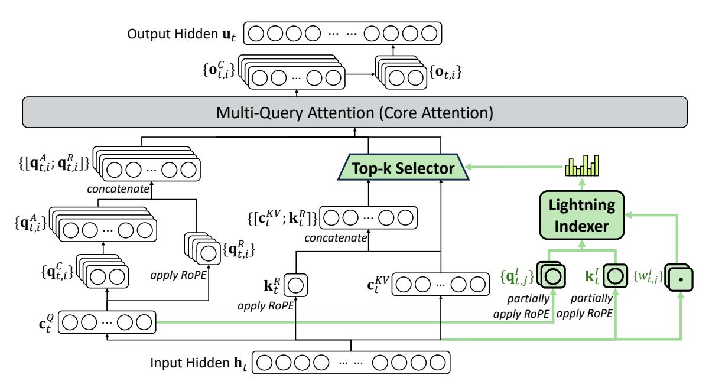

# DeepSeek Sparse Attention (DSA)

**DeepSeek Sparse Attention (DSA)** is an efficient attention mechanism introduced in DeepSeek-V3.2 to substantially reduce the computational complexity of the attention operation, particularly in long-context scenarios. It resolves the $O(N^2)$ bottleneck of standard vanilla attention while preserving model performance.

## Architecture and Token Selection

*Figure 1: Attention architecture of DeepSeek-V3.2, where DSA is instantiated under MLA. The green part illustrates how DSA selects the top-k key-value entries according to the indexer.*

DSA achieves sparsity through a two-stage mechanism:

1. **Lightning Indexer:** A highly efficient indexer with a small number of heads (typically implemented in FP8) computes an index score $I_{t,s}$ between the current query token $t$ and all preceding tokens $s$. It uses a ReLU activation function for high throughput.
   $$I_{t,s} = \sum_{j=1}^{H^I} w_{t,j}^I \cdot \text{ReLU}\left(\mathbf{q}_{t,j}^I \cdot \mathbf{k}_s^I\right)$$
   
2. **Fine-Grained Token Selection:** Using the scores from the indexer, the mechanism selects only the top-$k$ most relevant key-value entries. The actual, computationally heavy attention calculation is then performed *only* on this sparse, selected subset rather than the entire sequence history.
   $$\mathbf{u}_{t} = \operatorname{Attn}(\mathbf{h}_{t}, \left\{ \mathbf{c}_{s} \mid I_{t,s} \in \operatorname{Top-k}(I_{t,:}) \right\})$$

## Integration with Multi-Head Latent Attention (MLA)

To maximize efficiency, DSA is instantiated on top of DeepSeek's [[Multi-Head Latent Attention]] (MLA) architecture. 

In MLA, the Key and Value matrices are compressed into a single shared latent vector $c^{KV}$ per token. DSA is implemented specifically using the **MQA (Multi-Query Attention) mode** of MLA. In this mode, once the lightning indexer selects the top-$k$ latent vectors, those exact same compressed vectors are shared across *all* query heads of the current token. 

This combination ensures that both the cache size (via MLA) and the compute complexity (via DSA) are drastically minimized, allowing DeepSeek-V3.2 to efficiently handle sequences up to 128K tokens with massive end-to-end speedups over dense attention models.

## Training Pipeline

Training a model to utilize DSA involves a specialized two-stage continued pre-training process:

1. **Dense Warm-up Stage:** The main model parameters are frozen, and dense attention is still used. The lightning indexer is trained (via a KL-divergence loss) to mimic the attention distribution of the dense model.
2. **Sparse Training Stage:** The fine-grained token selection is activated, and all model parameters (both the main model and the indexer) are optimized simultaneously. The indexer continues to be trained to match the sparse subset's distribution, but it is detached from the main computational graph so its training signal doesn't interfere with the standard language modeling loss.