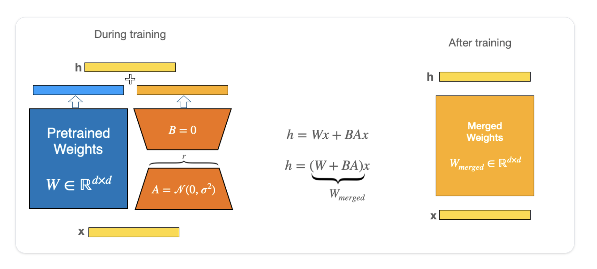

# LoRA (Low-Rank Adaptation)

**LoRA (Low-Rank Adaptation)** 是大语言模型与多模态模型微调中最主流的**参数高效微调（PEFT, Parameter-Efficient Fine-Tuning）**技术，由微软团队（Edward Hu 等人，2021）提出。

它的核心思想是：**冻结预训练基座模型的稠密权重矩阵，在旁边引入可训练的低秩分解矩阵（$A$ 与 $B$）来近似参数改变量 $\Delta W$**。在下游微调任务中，LoRA 能大幅减少可训练参数（通常减少 90%~99% 以上）与显存开销，并在推理阶段将低秩适配权重无损合并回原模型中，实现“零额外推理延迟”。

---

## 架构图解



---

## 1. 核心动机与本征秩假设

### 1.1 全参数微调的痛点
* **显存与存储爆炸**：训练一个 70B 模型时，若采用 AdamW 优化器，除了静态模型权重（140GB FP16），还需要梯度（140GB）以及优化器一阶/二阶动量状态（280GB FP32），仅训练状态就需 560GB+ 显存。
* **部署与多任务管理昂贵**：每个下游微调任务都需要保存并分发一份完整的数十 GB 权重。

### 1.2 本征秩假设 (Intrinsic Rank Hypothesis)
Aghajanyan 等人 (2020) 提出：过参数化的深层预训练模型在微调迁移到下游特定任务时，其**参数更新矩阵 $\Delta W$ 实际处在一个低维子空间中**，具有极低的“本征维度”（Intrinsic Dimension）。

因此，无需更新整个高维矩阵 $W \in \mathbb{R}^{d \times k}$，只需用两个极低秩的矩阵乘积即可充分刻画任务适配。

---

## 2. 数学原理与前向计算

对于任意给定的预训练线性投影层 $W_0 \in \mathbb{R}^{d \times k}$，LoRA 冻结 $W_0$，并构造一个低秩旁路：

$$h = W_0 x + \Delta W x = W_0 x + \frac{\alpha}{r} (B \cdot A) x$$

其中：
* $x \in \mathbb{R}^{d}$ 为输入向量。
* $W_0 \in \mathbb{R}^{d \times k}$ 为预训练权重矩阵（**被冻结，不计算梯度**）。
* $A \in \mathbb{R}^{r \times k}$：降维矩阵。
* $B \in \mathbb{R}^{d \times r}$：升维矩阵。
* $r \ll \min(d, k)$：低秩维度（Rank），工业实践中常用 $r \in [8, 64]$。
* $\alpha$（Alpha）：缩放常数（Scaling factor）。
* $\frac{\alpha}{r}$：归一化缩放系数。当调节不同 rank $r$ 时，该缩放比例可保持梯度的尺度稳定，减少超参数重调成本。

### 2.1 初始化策略（恒等变换）
为了确保在训练开始的第一步模型行为与原始预训练模型完全等价（即 $\Delta W = 0$）：
* **矩阵 $A$**：采用高斯分布（Gaussian/Normal Distribution）或 Kaiming 均匀分布（Kaiming-uniform）初始化。
* **矩阵 $B$**：完全初始化为 **$0$**。
* 结果：$B \cdot A = 0 \implies \Delta W = 0$。模型初始前向输出严格等于 $W_0 x$。

### 2.2 扩展变体初始化：LoftQ
在 QLoRA 等量化微调场景下，预训练权重 $W_0$ 量化到 4-bit 会引入固有量化误差。**LoftQ** 提出在微调前对原权重与量化误差进行交替迭代优化，直接用 LoRA 权重 $A$ 和 $B$ 来主动补偿量化损失，为量化微调提供更好的初始化起点。

---

## 3. 推理阶段零延迟：结构重参数化

在微调完成后，LoRA 具备**结构重参数化（Structural Re-parameterization）**的显著优势：

$$W_{\text{serving}} = W_0 + \frac{\alpha}{r} (B \cdot A)$$

* **权重静态合并（Merge）**：在部署上线前，直接将矩阵乘积 $B \cdot A$ 乘以缩放系数加回到基座权重 $W_0$ 中，合并成单一的稠密权重矩阵。
* **零延迟（Zero Latency）**：线上推理结构与未微调前完全一致，不增加任何额外的网络层分支或 FLOPs 开销。
* **热插拔与多任务共享**：在线上多租户服务中，底座 $W_0$ 只需在显存中常驻一份只读副本，各下游任务仅分发轻量级适配权重（几十 MB）。

---

## 4. Hugging Face PEFT 中的核心 API 与工作流

在 Hugging Face `peft` 库中，训练与管理 LoRA 遵循标准规范：

### 4.1 训练流程与关键参数 (`LoraConfig`)
```python
from peft import LoraConfig, get_peft_model

lora_config = LoraConfig(
    r=16,
    lora_alpha=32,
    target_modules="all-linear",     # 针对主流 Decoder 模型的所有线性层
    bias="none",                     # 'none', 'all', 或 'lora_only'
    use_rslora=True,                 # 启用 Rank-Stabilized LoRA
    modules_to_save=["lm_head"],     # 额外微调并保存的非 LoRA 模块
)
peft_model = get_peft_model(base_model, lora_config)
```

| 参数 | 说明 |
| :--- | :--- |
| **`r`** | 低秩维度，控制可训练参数量和更新容量。 |
| **`lora_alpha`** | 缩放系数，通常设为 $2 \times r$。 |
| **`target_modules`** | 挂载目标。现代最佳实践推荐 `"all-linear"`（覆盖 Attention 的 $q, k, v, o$ 及 MLP 的 gate, up, down 投影层），其效果大幅优于传统的仅微调 $q, v$。 |
| **`use_rslora`** | 开启 Rank-Stabilized LoRA，将缩放因子由 $\frac{\alpha}{r}$ 改为 $\frac{\alpha}{\sqrt{r}}$，在大 rank 时训练更加稳定。 |
| **`modules_to_save`** | 除 LoRA 外需要更新并保存的完整模块（如新增的任务头、分类头）。 |
| **`rank_pattern` / `alpha_pattern`** | 支持为不同网络层定制非均匀的异构秩与缩放系数。 |

### 4.2 适配器管理与模型合并 API
* **`merge_and_unload()`**：将 LoRA 权重与基座物理合并并解绑 PEFT 壳，返回纯净的单体模型，用于生产部署推理。
* **`merge_adapter()` / `unmerge_adapter()`**：在保留 `PeftModel` 包装的同时将 LoRA 临时合并或拆分，方便后续继续追加、切换或删除 adapter。
* **`unload()`**：丢弃激活的 LoRA 模块，快速恢复原始未修改的基座模型。
* **`delete_adapter()`**：从显存中卸载指定名称的 adapter。
* **`add_weighted_adapter()`**：按用户权重将多个已训练好的 LoRA 融合（Model Merging）为一个新 adapter。

---

## 5. 衍生变体与技术演进

* **[[Fine-tuning|QLoRA]]**：结合 NF4 (NormalFloat 4-bit) 冻结量化、双量化（Double Quantization）与分页优化器（Paged Optimizers），使单张消费级显卡（24GB）即可微调 65B/70B 模型。
* **DoRA (Weight-Decomposed Low-Rank Adaptation)**：将权重分解为幅度（Magnitude）和方向（Direction），幅度全量微调，方向用 LoRA 近似，使其学习轨迹更贴近全参数微调。
* **rsLoRA (Rank-Stabilized LoRA)**：修正传统 LoRA 在增大 $r$ 时缩放因子过度衰减的问题，改为 $\frac{\alpha}{\sqrt{r}}$ 缩放。
* **LoftQ**：在量化基座时联合求解量化与 LoRA 权重，主动弥补量化误差。

---

## 关联页面
* [[Fine-tuning]]
* [[CoLLM Summary]]
* [[LLaRA Summary]]
* [[GCRS Summary]]
* [[Conversational Recommender Systems]]
* [[Multi-Head Latent Attention]]
