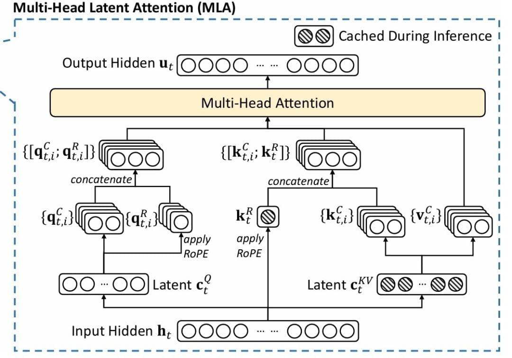

# Multi-Head Latent Attention (MLA)

**Multi-Head Latent Attention (MLA)** is an architectural innovation introduced by DeepSeek to aggressively reduce the memory footprint of the [[KV Cache]] during Transformer inference, while aiming to maintain the accuracy of standard [[Multi-Head Attention]] (MHA). 

It accomplishes this via a compress-decompress strategy inspired by Low-Rank Adaptation (LoRA), storing only a single compressed latent vector in the cache rather than the full Key and Value matrices for every head.

## The Core Concept: KV Cache Compression

*Figure 1: Multi-Head Latent Attention architecture (source: DeepSeek-AI, 2025).*

In standard MHA, autoregressive generation requires caching both the Key ($K$) and Value ($V$) matrices for all previous tokens. For a model with $L$ layers, this creates a massive VRAM bottleneck known as the memory wall. 

To understand the savings, let's define the dimensions:
*   $H$: The number of attention heads.
*   $d_h$: The dimension of each individual attention head.
*   $d$: The total model hidden dimension ($d = H \times d_h$).
*   $d_c$: The dimension of the compressed latent space.

MLA bypasses the memory wall by introducing a low-rank bottleneck:
1. **Compression (Down-projection):** Instead of calculating and storing separate Keys and Values for every head, the input $x$ is projected into a single, lower-dimensional latent vector $c^{KV}$ using a weight matrix $W^{DKV} \in \mathbb{R}^{d_c \times d}$. 
2. **Caching the Latent Vector:** **Only $c^{KV}$ is cached.** Standard MHA requires caching vectors of size $2 \times d_h \times H$ per token per layer (Keys and Values for all heads). In MLA, the cache size drops to just $d_c$ per token. 
    *   **Scope of sharing:** Critically, this single $c^{KV}$ latent vector is **shared across all $H$ attention heads** within that specific layer.
3. **Decompression (Up-projection):** When Keys and Values are needed for the attention computation, the shared cached $c^{KV}$ is up-projected back to full multi-head sizes using two separate matrices: $W^{UK}$ (for Keys) and $W^{UV}$ (for Values).

This provides a massive memory reduction. In DeepSeek-V3, $d_h=128$, $H=128$ (so standard cache is $2 \times 128 \times 128 = 32,768$ elements), but $d_c=512$. This results in a massive compression ratio of 64x, drastically increasing the number of concurrent users a GPU can serve.

## Query Compression

To reduce activation memory during training (and FLOPs), MLA applies a similar low-rank compression to the Queries ($Q$):
$$c^Q = W^{DQ} x$$
$$Q = W^{UQ} c^Q$$

Queries are not cached, so the latent dimension for queries ($d_q$) is typically larger than $d_c$ to preserve more representational capacity.

## Weight Absorption (Inference Optimization)

DeepSeek proposes a mathematical trick to accelerate inference. Because matrix multiplication is associative, the up-projection matrices can be "absorbed" into the query and output projection matrices.

The attention score $S = K^T Q$ can be expanded to:
$$S = (W^{UK} c^{KV})^T (W^{UQ} c^Q)$$
$$S = (c^{KV})^T (W^{UK})^T W^{UQ} c^Q$$
Let $W^{KQ} = (W^{UK})^T W^{UQ}$. This new weight matrix $W^{KQ}$ can be pre-computed offline.

During inference, $c^{KV}$ and $c^Q$ can be multiplied directly using $W^{KQ}$, skipping the decompression step entirely. A similar absorption trick applies to the Value decompression matrix $W^{UV}$ and the Output projection matrix $W^O$. 

*Note: While theoretically elegant, implementing this requires complex broadcasted batched multiplications that may require specialized GPU kernels (like FlashMLA) to realize actual hardware speedups over naive decompression.*

## Decoupled Rotary Position Embeddings (RoPE)

A major challenge with MLA is integrating [[RoPE]]. The mathematical motivation for decoupling RoPE is that **standard RoPE breaks the Weight Absorption optimization described above.**

If we applied RoPE to the decompressed Keys and Queries (where $R_i$ and $R_j$ are the rotation matrices for positions $i$ and $j$):
$$S_{ij} = (R_i W^{UK} c_i^{KV})^T (R_j W^{UQ} c_j^{Q})$$
$$S_{ij} = (c_i^{KV})^T (W^{UK})^T R_i^T R_j W^{UQ} c_j^{Q}$$
Because the relative rotation matrix $R_i^T R_j$ is sandwiched strictly between the weight matrices, we **cannot** pre-compute $W^{KQ} = (W^{UK})^T W^{UQ}$. 

*(Note: Applying RoPE before compression is also impossible, as $c^{KV}$ is used to generate Values, and Values must not be positionally rotated).*

**The Solution:** DeepSeek decouples content and position by concatenating them separately:
$$K_{i,h} = \begin{bmatrix} W_h^{UK} c_i^{KV} \\ R_i K_i^{rope} \end{bmatrix}$$
$$Q_{j,h} = \begin{bmatrix} W_h^{UQ} c_j^{Q} \\ R_j Q_{j,h}^{rope} \end{bmatrix}$$

Notice the asymmetry: $Q_{j,h}^{rope}$ is calculated **per head** (it has the $h$ subscript), while $K_i^{rope}$ is **shared across all heads**. 
*   Because Keys must be cached, calculating a separate $K^{rope}$ per head would add $H \times d_R$ elements to the cache. Instead, they project a single $K_i^{rope} = W^{KR} x_i$ and broadcast it across all heads (adding only $1 \times d_R$ to the cache).
*   Queries are never cached, so they project a unique $Q_{j,h}^{rope} = W_h^{QR} c_j^Q$ for each head, preserving maximum expressive power without any memory penalty.

Because the dot product of concatenated vectors is the sum of their individual dot products, the attention score for head $h$ becomes:
$$S_{ij,h} = (c_i^{KV})^T \mathbf{\underbrace{(W_h^{UK})^T W_h^{UQ}}_{\text{Absorbed } W_h^{KQ}}} c_j^{Q} + (K_i^{rope})^T (R_i^T R_j) Q_{j,h}^{rope}$$

The content portion can now safely use the pre-computed absorbed weight matrix, skipping decompression. The positional portion correctly handles relative distance because $(R_i^T R_j)$ resolves to a relative rotation matrix.

The final, true cache size per token per layer becomes $d_c + d_R$.

## Comparison to other KV Cache Optimizations

*   **[[Multi-Query Attention]] (MQA) / [[Grouped Query Attention]] (GQA):** Reduce memory by forcing heads to share exact Key and Value vectors. MLA reduces memory by compressing the representations into a shared latent vector, arguably preserving more expressivity than strict vector sharing because the up-projections can still generate distinct K/V pairs for each head.
*   **Quantization (INT8/INT4):** Reduces precision format.
*   **Eviction:** Drops older context.
MLA can theoretically be combined with quantization and eviction for compounding memory savings.