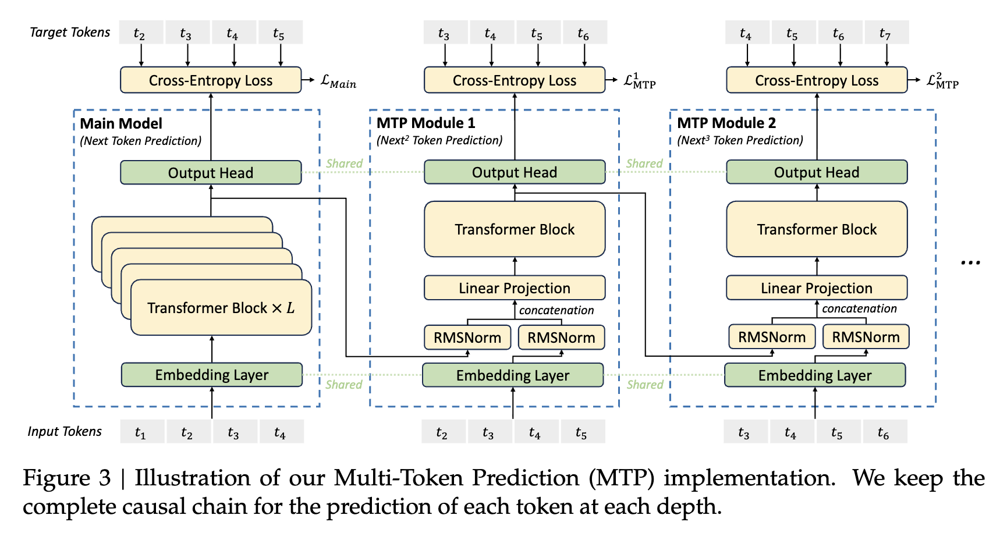

# Multi-Token Prediction (MTP)

**Multi-Token Prediction (MTP)** is a core architectural and training innovation introduced in [[DeepSeek-V3]] (and continued in later versions). Rather than predicting only the single next token (the classic autoregressive objective), MTP reframes training to predict multiple future tokens sequentially at each sequence position.

In training, MTP densifies the optimization signal, enhances data efficiency, and encourages the model to pre-plan representations for future tokens. In inference, the MTP modules can be repurposed for **draft-free (self-speculative) decoding**, delivering a **1.8x speedup** in throughput with an exceptional **85% to 90% draft acceptance rate**.

---

## 1. Mathematical and Structural Design

A major limitation of early multi-token prediction works (e.g., Gloeckle et al., 2024) is that they predict $D$ future tokens in parallel using independent output heads branching off the main model's final representation. Because these heads do not communicate, the prediction of token $t_{i+2}$ cannot be conditioned on the prediction of token $t_{i+1}$, violating the natural causal dependencies of language.

DeepSeek-V3 solves this by introducing $D$ sequential MTP modules, keeping the **complete causal chain** intact at each prediction depth. In production, DeepSeek uses a depth of $D=1$ (predicting 2 tokens at each step).



### The $k$-th MTP Module Architecture
To predict $D$ additional tokens, the architecture appends $D$ lightweight sequential modules. The $k$-th module consists of:
1.  A **linear projection matrix** $M_k \in \mathbb{R}^{d \times 2d}$
2.  A **dedicated Transformer block** $\text{TRM}_k(\cdot)$ (matching the hidden dimension $d$ of the main model)
3.  An **embedding layer** $\text{Emb}(\cdot)$ and **output head** $\text{OutHead}(\cdot)$ **shared directly with the main model**.

### Mathematical Formulation
For the $i$-th input token $t_i$, at the $k$-th prediction depth:

1.  **Concatenation and Dimensional Projection ($M_k$):**
    We normalize and concatenate the hidden representation of the $i$-th token at the previous depth $h^{k-1}_i \in \mathbb{R}^d$ with the normalized embedding of the ground-truth future token $t_{i+k}$. We project this concatenated $2d$-dimensional vector back to $d$ dimensions:
    $$h'_{i,k} = M_k \left[ \text{RMSNorm}(h^{k-1}_i) \ ; \ \text{RMSNorm}\left(\text{Emb}(t_{i+k})\right) \right]$$
    *   **The Normalization Step:** Applying `RMSNorm` to both inputs before projection is critical. It matches the scaling distribution of the deeply computed hidden state $h^{k-1}_i$ with the shallow, newly looked-up embedding vector $\text{Emb}(t_{i+k})$, preventing gradient instability.
    *   For $k=1$, $h^0_i$ represents the final hidden state of the main model (Depth 0).

2.  **Transformer Pass:**
    The projected representation $h'_{i,k}$ is processed by the $k$-th MTP Transformer layer to generate the current depth's hidden state $h^k_i$:
    $$h^k_{1:T-k} = \text{TRM}_k(h'_{1:T-k})$$
    *   Where $T$ represents the input sequence length, and $1:T-k$ represents the causal slice.

3.  **Token Probability Distribution:**
    The shared output head maps $h^k_i$ to the vocabulary space:
    $$P^k_{i+k+1} = \text{Softmax}\left(\text{OutHead}(h^k_i)\right)$$
    *   This distribution represents the prediction of the token at position $i+k+1$.
    *   **Head/Embedding Sharing Benefit:** Reusing the main model's embedding and projection heads ensures that the MTP representations are mapped directly onto the exact same semantic and vocabulary space, dramatically reducing parameter bloat and forcing alignment.

---

## 2. Training Objective

During training, each prediction depth $k$ calculates a standard cross-entropy loss against the ground-truth future tokens:

$$\mathcal{L}^k_{\text{MTP}} = \text{CrossEntropy}(P^k_{2+k:T+1}, \ t_{2+k:T+1}) = -\frac{1}{T} \sum_{i=2+k}^{T} \log P^k_i[t_i]$$

The final training objective is a weighted combination of the main next-token prediction loss ($\mathcal{L}_{\text{Main}}$) and the average MTP losses across all $D$ depths, scaled by a hyperparameter $\lambda$:

$$\mathcal{L}_{\text{Total}} = \mathcal{L}_{\text{Main}} + \frac{\lambda}{D} \sum_{k=1}^{D} \mathcal{L}^k_{\text{MTP}}$$

During training, the MTP blocks consume only a small fraction of compute because they consist of only a single Transformer layer, but they densify training gradients by providing $D$ times more supervisory signal per token.

---

## 3. Inference: Draft-Free Speculative Decoding Trace

During standard auto-regressive generation, the model can completely discard the MTP modules and function as a normal next-token generator. However, we can keep the MTP modules active to run **Self-Speculative Decoding**.

Rather than running a separate, low-accuracy draft model (which introduces massive VRAM and KV cache synchronization overhead), MTP uses the lightweight single-layer MTP block as its draft mechanism.

The following detailed step-by-step trace illustrates how the decoder's **Causal Attention Mask** and parallel forward passes execute this speculative decoding flow.

---

### Step 0: Just After Prefill (Generating $t_1$ and Draft $t'_2$)

The context prompt is processed, and the main model generates the first real token $t_1$. Then the single-layer MTP module is executed to speculatively draft $t'_2$.

```text
                  [ MAIN MODEL PASS ]                 [ MTP LAYER ]
                    (Heavy 37B FFN)                  (Lightweight 1L)
                                                            
Prompt [t0]  ───►  Outputs hidden h0_0  ───┬────────►  M_1[h0_0; Emb(t1)]
                         │                 │                 │
                         ▼                 ▼                 ▼
                   Predicts P0_1     KV Cached [t0]    Predicts P1_2
                         │                                   │
                         ▼                                   ▼
                   Sample verified t1                  Sample draft t'_2
```
*   **Verified sequence:** `[t0, t1]`
*   **Drafted token:** `t'_2`
*   **KV Cache stores:** `t0` (we will append `t1` and `t'_2` in the next parallel pass).

---

### Step 1: The Parallel Decode Pass (Input `[t1, t'_2]`)

We pass both `t1` and `t'_2` to the model at once. Thanks to the decoder's causal mask, position 1 behaves exactly as if position 2 does not exist, while position 2 gets to look at position 1.

```text
                           CAUSAL MASK & FORWARD PASS
                           
                     t1 (Pos 1)                  t'_2 (Pos 2)
                         │                            │
  Causal Mask:   [Can only look at            [Can look at
                  t0 and t1]                   t0, t1, and t'_2]
                         │                            │
  Main Model Pass:       ▼                            ▼
  Hidden States:        h0_1                         h0_2
                         │                            │
  Output Head:           ▼                            ▼
  Predictions:     P0_2 (Authoritative)         P0_3 (Authoritative)
                         │                            │
                         ▼                            ▼
                  Sample verified t2           Sample verified t3
```

Now we evaluate the divergence check: **Does our draft $t'_2$ match the model's authoritative prediction $t_2$?**

---

### Scenario A: ACCEPTED ($t'_2 == t_2$)

The model confirms our draft was correct! Because the input at position 2 was valid, the prediction $P^0_3$ generated from it is also perfectly valid. We get a "2-for-1" token generation step.

```text
1. Promote draft t'_2 to fully verified target token t2.
2. Sample verified target token t3 from P0_3.
3. Run the lightweight MTP Layer to draft the next token (t'_4):

    h0_2 (from pos 2) ──┬────────────────────────┐
                        ├──► [ MTP Layer ] ──► Predicts P1_4 ──► Sample draft t'_4
    Emb(t3)           ──┘

─────────────────────────────────────────────────────────────────────────────
KV Cache Update :  KEEP both KV(t1) and KV(t'_2).
Next Input      :  [t3, t'_4]  (The sequence advanced by 2 tokens!)
```

---

### Scenario B: REJECTED ($t'_2 \neq t_2$)

The model catches a mistake in our draft. We discard the draft and the speculative prediction $P^0_3$ because it was computed using the wrong draft token. We roll back the cache and proceed with the correct token.

```text
1. Discard draft t'_2 and speculative prediction P0_3.
2. Sample the corrected, verified target token t2 from P0_2 (which is 100% correct).
3. Run the lightweight MTP Layer to draft the replacement token (t'_3):

    h0_1 (from pos 1) ──┬────────────────────────┐
                        ├──► [ MTP Layer ] ──► Predicts P1_3 ──► Sample draft t'_3
    Emb(t2)           ──┘

─────────────────────────────────────────────────────────────────────────────
KV Cache Update :  KEEP KV(t1), but ROLLBACK (delete) KV(t'_2).
Next Input      :  [t2, t'_3]  (The sequence advanced by 1 token!)
```

---

## 4. Architectural Comparison

To highlight the elegance of MTP, we compare it to other prominent speculative decoding and multi-token prediction paradigms:

| Metric / Feature | Traditional Speculative (e.g., LLaMA-70B + 1B) | Medusa (MLP Heads) | EAGLE (Lightweight Speculative) | **DeepSeek MTP (Self-Speculative)** |
| :--- | :--- | :--- | :--- | :--- |
| **Draft Mechanism** | Separate, smaller auto-regressive model. | Parallel, non-recurrent MLP heads branching off main model. | A separate lightweight recurrent framework on top. | **Integrated sequential single-layer Transformer blocks.** |
| **Causal Dependencies** | Fully intact. | None (heads predict $t_{i+k}$ independently of $t_{i+k-1}$). | Fully intact (EAGLE feeds draft token back into next step). | **Fully intact (complete causal chain at each depth $D$).** |
| **Pre-Training Integration** | None (draft model is trained entirely separately). | None (Medusa heads are fine-tuned post-hoc on a frozen base). | None (EAGLE is trained separately post-hoc). | **Jointly optimized.** MTP is trained directly alongside the main model on the full pre-training corpus. |
| **VRAM Overhead** | High (storing two separate model state weights). | Near-Zero (only lightweight linear projection heads). | Low (lightweight separate layer weights). | **Near-Zero.** Adds exactly 1 Transformer layer ($\approx 1\%$) and reuses main heads. |
| **KV Cache Sync Complexity** | Extremely High (maintaining and coordinating two independent caches). | Medium (requires specialized attention masks to manage heads). | Medium (requires independent draft KV cache management). | **Extremely Low.** Single unified KV Cache with a simple 1-step rollback on draft reject. |
| **Draft Acceptance Rate** | Moderate ($50\% - 70\%$). | Low to Moderate ($40\% - 65\%$). | High ($70\% - 85\%$). | **Exceptional ($85\% - 90\%$).** |
| **Real-World Speedup** | $1.2\text{x} - 1.5\text{x}$ | $1.3\text{x} - 1.6\text{x}$ | $1.5\text{x} - 1.8\text{x}$ | **$1.8\text{x} - 2.0\text{x}$** |
