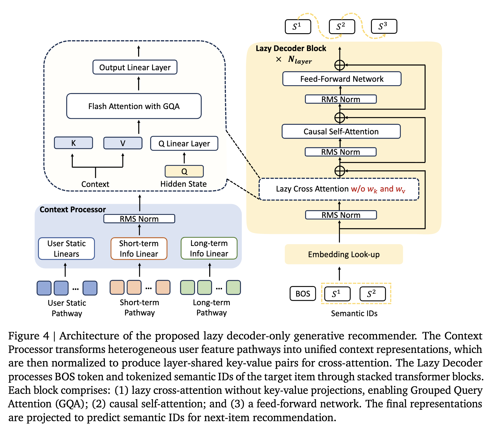
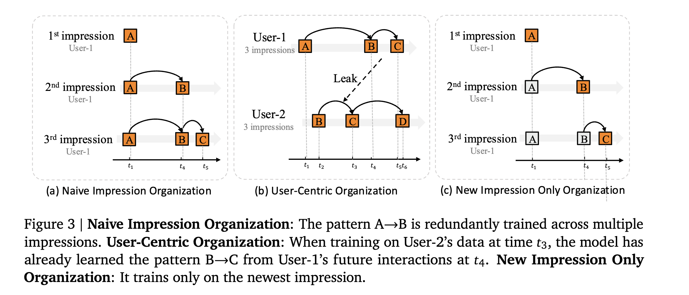

---
tags:
  - recommendation
  - generative-retrieval
  - architectures
aliases:
  - OneRec-V2 Model
  - Lazy Decoder-Only
date: 2026-06-08
sources: ["[[wiki/research/OneRec-V2 Summary.md]]"]
---

# OneRec-V2

**OneRec-V2** is the second-generation unified generative recommendation model developed by **Kuaishou Inc.** (published in late 2025). It introduces a revolutionary **Lazy Decoder-Only Architecture** to eliminate the computational bottlenecks of OneRec-V1, and integrates real-world user feedback into post-training preference alignment.

---

## Architectural Visualization

### 1. Overall Framework

### 2. Sample and Training Data Organization

---

## Key Technological Shifts (V1 vs. V2)

| Dimension | OneRec-V1 (Feb 2025) | OneRec-V2 (Oct 2025) |
| :--- | :--- | :--- |
| **Macro Architecture** | Encoder-Decoder (T5-style) | **Lazy Decoder-Only** (Customized Hybrid) |
| **Context Length ($N$)**| 512 tokens (Max) | **3000 tokens** (Max online) |
| **FLOPs (at 1B scale)** | 296.4 GFLOPs | **18.9 GFLOPs** (94% Reduction) |
| **Activations (at 1B)**| 17.63 Billion | **1.24 Billion** (93% Reduction) |
| **User Pathway Input**  | History Behavior (Semantic IDs only) | **User Static Profile, Short-term, Long-term Pathways** |
| **Cross-Attention KV** | Projected via dense matrices $W_k, W_v$ | **Projection-Free (RMSNorm Partitioning)** |
| **KV Cache Sharing**   | Layer-specific | **Layer-Shared ($L_{\text{kv}} = 1$) & Tied Key-Values ($k = v$)** |
| **Model Size Limits**   | 1 Billion parameters | **8 Billion parameters** (Fitted Scaling Law) |
| **Post-Training RL**    | Proxy Reward Model DPO (IPA) | **User Feedback-driven RL (Reward Shaping & Gradient-Bounded Policy Optimization)** |

---

## Architectural Principles

### 1. New Impression Only (NIO) Loss Masking
Designed to enforce physical global time causality and eliminate look-ahead biases:
* **Temporal Leakage Elimination:** Individual impressions at physical time $T$ are sliced into standalone training samples. This limits input context strictly to times $< T$. During chronologically sorted training, this guarantees weights are never updated by future events, preserving the offline-to-online evaluation translation.
* **Redundancy Mitigation:** Instead of running Next-Token Prediction (NTP) on every item in the sequence (which causes redundant training of older transitions), NIO **masks out all former context items from the loss calculation**. Gradient backpropagation is performed **exclusively** on the newest target item's 3 semantic IDs.

### 2. Projection-Free KV Generation (Context Processor)
* **Eliminating $W_k, W_v$:** To process extremely long contexts (up to 3000 tokens) efficiently, OneRec-V2 completely removes the learnable $W_k$ and $W_v$ projection layers of cross-attention. It partitions the unified `Context` tensor along its feature dimension into $L_{\text{kv}}$ chunks and applies element-wise **RMSNorm** directly to generate keys ($k_l$) and values ($v_l$).
* **Target Query Projection ($W_q$):** Retained on the target side because target sequences are extremely short (length $\le 3$), making the $W_q$ projection computationally negligible. This preserves the representation capacity of Grouped Query Attention (GQA) and Multi-Query Attention (MQA).

### 3. Gradient-Bounded Policy Optimization (GBPO)
* **The Gradient-Explosion Problem:** Due to logging constraints, legacy cascade logs must simplify `pi_old` to `sg(pi_theta)`. Under this simplification, taking derivatives via the Quotient Rule:
  $$\frac{\partial J_{\text{ECPO}}}{\partial \theta} = - A_i \cdot \frac{1}{\pi_\theta} \cdot \frac{\partial \pi_\theta}{\partial \theta}$$
  For negative samples ($A_i = -1$), as the model successfully suppresses the negative video ($\pi_\theta \to 0$), the term $\frac{1}{\pi_\theta} \to \infty$ explodes to infinity, collapsing the model.
* **The GBPO Patch:** GBPO replaces the static denominator with a dynamic, bounded variable `pi'_old`. For negative samples, the denominator is bounded by $(1 - \text{sg}(\pi_\theta))$. As $\pi_\theta \to 0$, the denominator approaches 1, keeping the gradient bounded:
  $$\lim_{\pi_\theta \to 0} \frac{\partial J_{\text{GBPO}}}{\partial \theta} = \frac{\partial \pi_\theta}{\partial \theta}$$
  The gradient safely vanishes to zero as the negative sample is suppressed, ensuring perfect optimization stability.

### 4. Scaling Laws
The Lazy Decoder architecture follows a stable Chinchilla-like scaling law for parameters $N$ under a fixed data size:
$$\hat{L}(N) = 3.13 + \frac{3660}{N^{0.489}}$$

---

## Related Wiki Pages
* [[OneRec-V2 Summary]]: Deep-dive research summary covering Section 1 & 2 of the technical report.
* [[OneRec]]: Concept and high-level architectural page for V1.
* [[RMSNorm]]: The normalization mechanism used to generate projection-free Key-Values.
* [[Grouped Query Attention]]: The head-sharing optimization used to shrink online serving memory.
* [[OneRec Summary]]: Complete, section-by-section research summary of the V1 paper.
* [[KV Cache]]: The inference optimization used to make OneRec deployment feasible under tight online SLAs.
