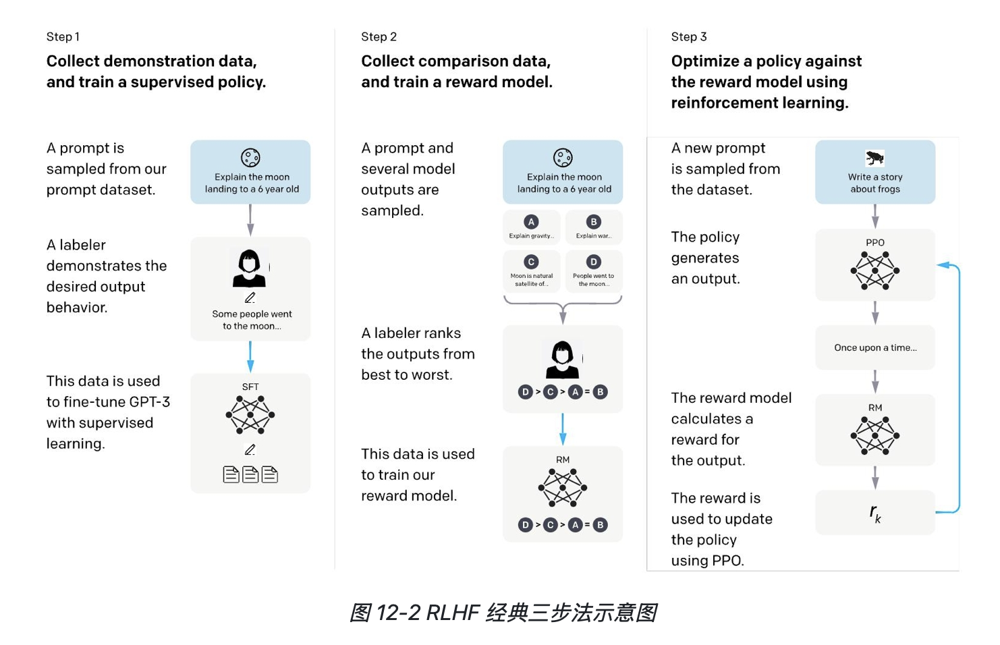

# RLHF (Reinforcement Learning from Human Feedback)

**RLHF（基于人类反馈的强化学习）** 是一种将大语言模型（LLM）的输出行为与人类价值观、期望偏好进行对齐的核心训练范式。它的核心目标是促使模型超越监督微调（SFT）阶段对特定样本的机械模仿，全面满足 **3H 原则（Helpful 有用、Honest 诚实、Harmless 无害）**。

在 InstructGPT 实践中，仅经 1.3B 参数量级的模型通过 RLHF 对齐后，在综合人类偏好评估中即可超越未对齐的 175B 原始基座模型。

---

## 经典三步法架构

RLHF 的经典实施流程由三个前后衔接的核心阶段构成：

*图：RLHF 经典三步法流程示意图*

1. **第一阶段：监督微调冷启动（SFT）**
   在精心挑选的高质量指令-问答数据上微调预训练基座模型，使其具备基本的指令遵循与对话交互能力，作为后续强化学算法的**初始策略（Actor）**与**参考基线（Reference Model）**。
2. **第二阶段：偏好建模与奖励模型训练（Reward Modeling）**
   利用标注员对同一提示词生成的 $K$ 个候选回答进行相对优劣**排序（Ranking）**，拆解为二元对比对 $(x, y_w \succ y_l)$，训练标量打分模型模拟人类偏好裁决。
3. **第三阶段：强化学习策略迭代（RL Fine-tuning）**
   以奖励模型给出的分数作为强化学习环境的反馈奖励，利用策略优化算法（如 [[Proximal Policy Optimization|PPO]]）在广阔的输出空间进行探索采样，并辅以 KL 散度约束，更新策略模型参数。

---

## 核心形式化定义：片段 MDP 建模

大语言模型的自回归文本生成在数学上被建模为一个**片段马尔可夫决策过程（Episodic MDP）**：

* **状态（State, $s_t$）**：用户 Prompt $x$ 与已生成的历史 Token 序列组成的上下文 $(x, y_1, \dots, y_{t-1})$。
* **动作（Action, $a_t$）**：模型在词表中采样的当前步 Token $y_t \in \mathcal{V}$。
* **策略（Policy, $\pi_\theta$）**：大模型参数化的下一个 Token 条件概率分布 $\pi_\theta(a_t \mid s_t)$。
* **奖励（Reward, $R$）**：序列终结时的延迟标量奖励 $R(x, y)$，由 [[Reward Model|奖励模型]] 给出。
* **优化目标**：寻找使全序列期望奖励最大化的最优策略参数 $\theta$：
  $$\max_\theta \mathbb{E}_{x \sim \mathcal{D}, y \sim \pi_\theta(\cdot \mid x)} \left[ R(x, y) \right]$$

---

## 核心算法机制与演进

### 1. 奖励模型损失（Bradley-Terry 模型）
依据 Bradley-Terry 概率假设，两候选回答被偏好的相对概率由标量分差经 Sigmoid 建模：
$$P(y_w \succ y_l \mid x) = \sigma\left(r_\psi(x, y_w) - r_\psi(x, y_l)\right)$$
采用成对交叉熵损失驱动奖励模型收敛：
$$\mathcal{L}_{RM}(\psi) = - \mathbb{E}_{(x, y_w, y_l) \sim \mathcal{D}} \left[ \log \sigma\left( r_\psi(x, y_w) - r_\psi(x, y_l) \right) \right]$$

### 2. PPO 优化与“对齐税”
在第三阶段，经典做法采用 [[Proximal Policy Optimization|PPO]] 算法进行在线探索，通过裁剪代理目标函数控制更新幅度。为缓解因单纯追求奖励而导致的传统语言基准能力退化（**对齐税，Alignment Tax**），工业界常采用 **PPO-ptx** 目标，将 RL 目标、KL 惩罚与预训练无监督损失（ptx 项）联合优化：
$$\text{Obj}(\theta) = \mathbb{E}_{(x, y) \sim \mathcal{D}_{\pi}} \left[ r_\psi(x, y) - \beta D_{KL}(\pi_\theta \parallel \pi_{SFT}) \right] + \gamma \mathbb{E}_{x \sim \mathcal{D}_{pre}} \left[ \log \pi_\theta(x) \right]$$

### 3. DPO（直接偏好优化）与 GRPO（群体相对策略优化）
- **[[Direct Preference Optimization|DPO]]**：推导出闭式解证明语言模型本身即隐式奖励模型，彻底绕过显式 RM 与在线采样，直接利用静态偏好语料进行分类微调，资源消耗极低（详见 [[DPO Summary]]）。
- **GRPO**：面向数学/代码等可验证任务（RLVR），去除 [[Critic Model|Critic 价值模型]]，使用组内均值作为基线计算相对优势，成为 DeepSeek-R1 等深度推理模型的支柱。

---

## 关键技术挑战

1. **奖励黑客（Reward Hacking）**：模型利用奖励模型在长尾分布上的漏洞，通过虚假繁荣（如过长文本、过度客套修辞）谋取高分。
2. **评估困境**：人工评测成本高昂，而 LLM-as-a-Judge 存在固有的长度偏置、位置偏置和自私偏置。
3. **多模态与多元价值观**：多模态幻觉抑制以及跨文化群体价值观的包容性对齐。

---

## 关联页面与参考

- 详尽技术研究报告：[[RLHF Summary]]、[[DPO Summary]]
- 偏好优化算法实体：[[Direct Preference Optimization]]、[[Proximal Policy Optimization]]
- 评判机制：[[Reward Model]]
- 价值基线网络：[[Critic Model]]
- 全流程微调体系：[[Fine-tuning]]
