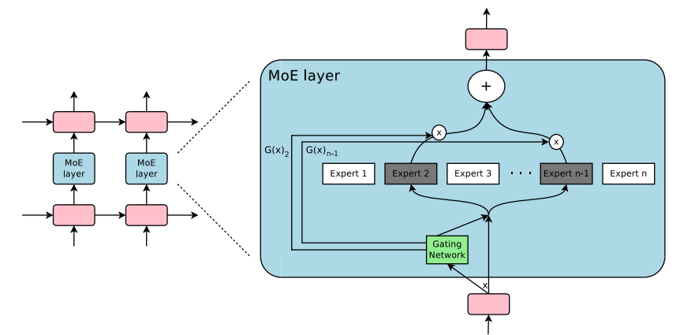

# The Sparsely-Gated MoE Layer (2017)

The Sparsely-Gated Mixture-of-Experts (MoE) layer was introduced in the seminal 2017 paper *"Outrageously Large Neural Networks"* by Noam Shazeer, Geoffrey Hinton, Jeff Dean, et al. It is the foundational architectural component that brought **Conditional Computation** to scale, serving as the direct ancestor to modern MoE [[Transformers]] like Mixtral and DeepSeek.

Before this paper, MoEs were typically constructed as top-level ensembles (entire independent models voting on an output). This paper proposed using MoEs as a **general-purpose sub-component (a layer)** that could be stacked within deep networks. Originally, the authors applied this convolutionally between stacked LSTM layers for machine translation, creating a 137 Billion parameter model that operated at a fraction of the compute cost of an equivalent dense model.

*Figure 1: A Mixture of Experts (MoE) layer embedded within a recurrent language model. A sparse gating function selects two experts to perform computations.*

## 1. The Mathematical Mechanism: Noisy Top-K Gating

The layer consists of a set of $n$ "expert networks" (simple feed-forward networks) and a "gating network" ($G$). To achieve sparse, conditional computation—where only a few experts process a token and the rest are entirely skipped—the authors designed **Noisy Top-K Gating**.

For a given input token $x$:

**Step 1: Calculate Noisy Logits ($H$)**
$$H(x)_i = (x \cdot W_g)_i + \text{StandardNormal}() \cdot \text{Softplus}((x \cdot W_{noise})_i)$$
*   **$(x \cdot W_g)_i$:** The standard linear projection. It represents the router's baseline mathematical "belief" of how good expert $i$ is for this token.
*   **$\text{StandardNormal}()$:** Injects randomness by drawing from a Gaussian distribution.
*   **$\text{Softplus}((x \cdot W_{noise})_i)$:** The Learned Noise Volume. Instead of static noise (e.g., `+ 0.1`), the network uses a second, completely separate set of trainable weights ($W_{noise}$) wrapped in a strictly positive `Softplus` function. 
    *   *Why learned noise?* It acts as the "Exploration" in an exploration vs. exploitation trade-off. Early in training, the network generates high variance to randomly explore all experts. Later, when an expert has perfectly specialized in a topic, the network can learn to push $(x \cdot W_{noise})_i$ toward negative infinity, making the `Softplus` output `0`. When the noise volume drops to `0`, the routing becomes purely deterministic.

**Step 2: Truncate to Top-K**
$$\text{KeepTopK}(v, k)_i = \begin{cases} v_i & \text{if } v_i \text{ is in the top } k \text{ elements of } v, \\ -\infty & \text{otherwise}. \end{cases}$$
*   Setting all non-selected experts to $-\infty$ ensures they receive exactly $0$ probability after the softmax operation.

**Step 3: Final Sparse Gate**
$$G(x) = \text{Softmax}(\text{KeepTopK}(H(x), k))$$
The output of the MoE layer $y$ is the linearly weighted sum of the active experts' outputs: $y = \sum_{i = 1}^{n} G(x)_i E_i(x)$. Where $G(x)_i = 0$, the computation for $E_i(x)$ is completely bypassed.

## 2. The Core Challenge: Routing Collapse and Load Balancing

The paper identified a massive engineering challenge that remains the hardest part of training MoEs today: **Routing Collapse** (the "Rich Get Richer" problem). 

By chance, a randomly initialized gating network will slightly favor certain experts early on. Those favored experts receive gradients, train faster, and produce better representations. Because they are now "smarter," the router selects them *even more* in the next step. This self-reinforcing loop starves the remaining experts, effectively wasting billions of parameters. To force the gating network to distribute tokens across the entire fleet of experts, the authors introduced two auxiliary loss functions.

### The Importance Loss (Balancing the Weights)
They define the "Importance" of an expert $i$ across a batch of tokens $X$ as the sum of all gate probabilities assigned to it:
$$Importance_i(X) = \sum_{x \in X} G(x)_i$$
*Mechanism:* Because $G(x)$ is an $n$-dimensional vector (e.g., `[0.7, 0.3, 0.0, 0.0]`), summing these vectors across all 1,000 tokens in a batch results in a final $n$-dimensional vector that represents the total importance score for each individual expert.

To ensure equal importance across all $n$ experts, they add an auxiliary loss ($L_{importance}$):
$$L_{importance}(X) = w_{importance} \cdot CV(Importance(X))^2$$
*Mechanism:* They calculate the **Coefficient of Variation** ($CV$, which is standard deviation divided by the mean) of that final list of importance scores. 
*   If the router distributes tokens evenly, the variance across the list is near zero, and the penalty is zero. 
*   If the router hogs a few experts, the variance spikes, heavily penalizing the model during backpropagation.

### The Load Loss (The Shrinking Batch Problem)
Balancing the mathematical Importance score is not enough. Because the gate values are continuous probabilities, we can encounter a physical hardware bottleneck:
*   **Expert A** receives 2 tokens with high confidence ($0.5$ gate weight each). Importance = $1.0$.
*   **Expert B** receives 10 tokens with low confidence ($0.1$ gate weight each). Importance = $1.0$.

Even though their "Importance" is perfectly balanced mathematically, Expert B physically has to process 5 times the workload. Modern GPUs rely on fixed, large batch sizes to amortize parameter loads. If Expert A finishes instantly while Expert B churns through a massive queue, the GPU cluster is severely underutilized (what the authors call the *Shrinking Batch Problem*).

To solve this, the authors introduced a second auxiliary loss ($L_{load}$) calculated using a probabilistic formula (detailed in the paper's Appendix A). This secondary loss ensures that the physical, discrete number of tokens routed to each expert is also strictly balanced across the hardware.