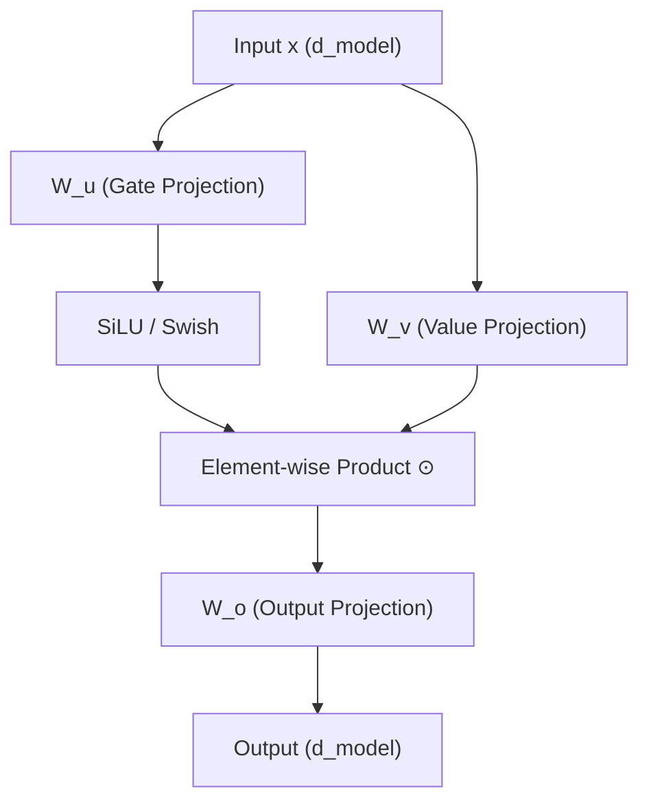

---
tags:
  - "llm"
  - "architecture"
  - "activation-functions"
  - "feed-forward-networks"
aliases:
  - "SwiGLU"
  - "Swish-Gated Linear Unit"
  - "SwiGLU FFN"
date: 2026-07-29
sources: ["[[raw/LLM/大模型原理与架构/03_components/3.4_feedforward.md]]", "[[raw/LLM/大模型原理与架构/13_decoder_models/13.2_llama.md]]"]
---

# SwiGLU FFN (Swish-Gated Linear Unit Feed-Forward Network)

**SwiGLU FFN** is a high-performance gated activation variant of the Feed-Forward Network (FFN). Introduced by Noam Shazeer in 2020 ("GLU Variants Improve Transformer"), it has replaced standard ReLU/GELU feed-forward networks to become the standard architectural blueprint for modern Large Language Models (including Llama, Mistral, Gemma, and DeepSeek).

---

## 1. Core Motivation: FFN as the "Memory Layer"

In a [[Transformers]] block, the Self-Attention layer and the FFN play complementary roles:
*   **Self-Attention (Information Routing):** Responsible for global communication across tokens (calculating "how tokens relate" to one another).
*   **FFN (Deep Processing & Memorization):** Applied independently to each token position (no inter-token communication). It performs deep non-linear transformations on the aggregated contextual representation.

Research by Geva et al. (2021) shows that the FFN operates as a **Key-Value memory store**:
1.  **First Projection Layer ($W_1$ / Gate):** Acts as a set of "Keys", selectively firing when specific semantic patterns are present.
2.  **Second Projection Layer ($W_2$ / $W_o$):** Acts as "Values", retrieving the specific factual knowledge associated with the activated keys.

Without the FFN's non-linear activation, consecutive attention layers would collapse mathematically into a single linear projection, locking the model's expressiveness at a baseline level.

---

## 2. Evolution of FFN Activations

Modern FFN structures have evolved significantly to avoid gradient saturation and improve representational capacity:

### A. ReLU FFN (Vanilla Transformer)
The classic Transformer uses a standard two-layer MLP with a ReLU activation function:
$$\text{FFN}_{\text{ReLU}}(\mathbf{x}) = \max(0, \mathbf{x} \mathbf{W}_1 + \mathbf{b}_1) \mathbf{W}_2 + \mathbf{b}_2$$
*   **Limitation:** ReLU hard-truncates all negative values to zero. In practice, about **47%** of neurons in a feed-forward layer can become "dead" (outputting zero) during a forward pass, leading to underutilized parameter capacity.

### B. GELU FFN (GPT-2, BERT)
$$\text{FFN}_{\text{GELU}}(\mathbf{x}) = \text{GELU}(\mathbf{x} \mathbf{W}_1 + \mathbf{b}_1) \mathbf{W}_2 + \mathbf{b}_2$$
*   **Improvement:** GELU offers a smooth, differentiable curve with a non-zero gradient for small negative inputs, helping to maintain gradient flow.

### C. SwiGLU FFN (Llama, DeepSeek)
SwiGLU replaces standard activation functions with a gated linear unit (GLU) using the Swish ($\text{Swish}_\beta(x) = x \cdot \sigma(\beta x)$) or SiLU ($\text{SiLU}(x) = x \cdot \sigma(x)$) activation, where $\sigma(x)$ is the standard sigmoid function ($\sigma(x) = \frac{1}{1 + e^{-x}}$):
$$\text{SwiGLU}(\mathbf{x}) = \left( \text{SiLU}(\mathbf{x} \mathbf{W}_u) \odot (\mathbf{x} \mathbf{W}_v) \right) \mathbf{W}_o$$
*   **Gating Mechanism:** Instead of a single projection before activation, SwiGLU uses two distinct parallel projection matrices ($\mathbf{W}_u$ and $\mathbf{W}_v$). One acts as a non-linear gate ($\text{SiLU}(\mathbf{x} \mathbf{W}_u)$) while the other acts as a linear value flow ($\mathbf{x} \mathbf{W}_v$). Their element-wise product ($\odot$) is then projected back to the hidden size via $\mathbf{W}_o$.



---

## 3. Parameter Alignment & Dimension Scaling

Because SwiGLU introduces **three** weight matrices instead of **two**, it would naturally increase parameter counts and training FLOPs if intermediate dimensions remained identical:
*   **Standard FFN:** $\mathbf{W}_1 \in \mathbb{R}^{d \times d_{\text{ff}}}$ and $\mathbf{W}_2 \in \mathbb{R}^{d_{\text{ff}} \times d}$ where $d_{\text{ff}} \approx 4d$.
*   **SwiGLU FFN:** $\mathbf{W}_u, \mathbf{W}_v \in \mathbb{R}^{d \times d_{\text{ff}}}$ and $\mathbf{W}_o \in \mathbb{R}^{d_{\text{ff}} \times d}$.

To keep the overall parameters and computation budget identical to a standard FFN, modern architectures reduce the hidden expansion size $d_{\text{ff}}$ from $4d$ to approximately **$\frac{8}{3}d$ (or $\approx 2.67d$)**:
$$d_{\text{ff}} = \left\lfloor \frac{2}{3} \times 4d \right\rfloor = \left\lfloor \frac{8}{3}d \right\rfloor$$

This keeps the number of parameters and FLOPs roughly equal while significantly improving representation capacity.

---

## 4. PyTorch Implementation Comparison

Below is a comparison showcasing how ReLU, GELU, and SwiGLU FFNs are computed:

```python
import torch
import torch.nn as nn
import torch.nn.functional as F

d_model, d_ff = 8, 32
torch.manual_seed(42)
x = torch.randn(1, d_model)  # Input at a single token position

# ---- 1. ReLU FFN (Vanilla Transformer) ----
W1 = torch.randn(d_model, d_ff)
W2 = torch.randn(d_ff, d_model)
relu_out = F.relu(x @ W1) @ W2
print("ReLU FFN Output:", relu_out.round(decimals=3))
print("ReLU Zero Ratio:", (F.relu(x @ W1) == 0).float().mean().item()) # ~47% hard zero

# ---- 2. GELU FFN (GPT-2, BERT) ----
gelu_out = F.gelu(x @ W1) @ W2
print("GELU FFN Output:", gelu_out.round(decimals=3))

# ---- 3. SwiGLU FFN (Llama-style) ----
# Uses three projections: W_gate (W_u), W1 (W_v), and W2 (W_o)
W_gate = torch.randn(d_model, d_ff)
swiglu_hidden = F.silu(x @ W_gate) * (x @ W1)  # Gating mechanism
swiglu_out = swiglu_hidden @ W2
print("SwiGLU FFN Output:", swiglu_out.round(decimals=3))
```

---

## 5. Empirical Performance & Real-world Impact

*   **Llama & DeepSeek Standard:** SwiGLU has demonstrated robust training stability and faster loss convergence over standard GELU, particularly in model configurations with hundreds of billions of parameters.
*   **STCA Adaptation:** In ByteDance's [[STCA]] (Stacked Target-to-History Cross Attention), upgrading standard FFN layers to SwiGLUFFN yielded a massive **$+0.11\%$ AUC improvement** in offline ranking, proving its utility extends to high-capacity recommendation models.
