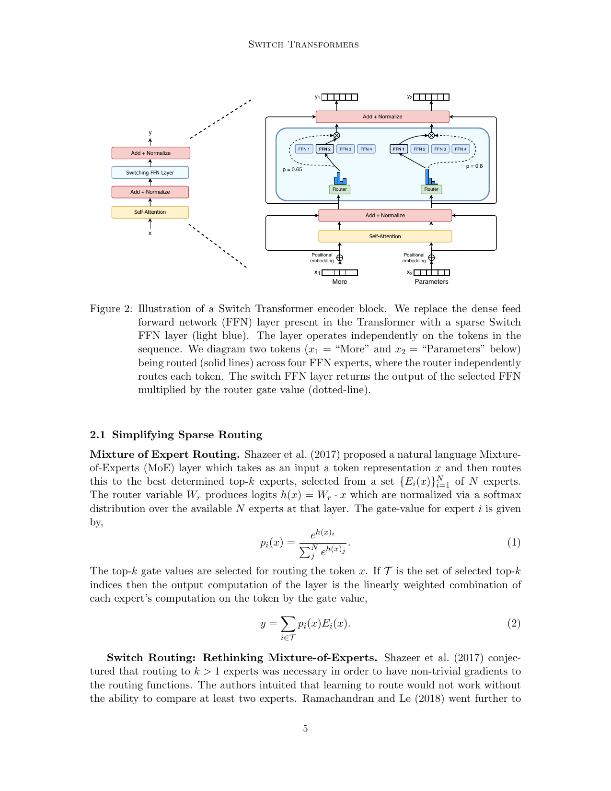

# Switch Transformer (2021)

Introduced by Google (Fedus, Zoph, and Shazeer), the **Switch Transformer** represents a massive simplification and stabilization of the Mixture-of-Experts (MoE) architecture. By refining the complex routing mechanics of its predecessors (like [[GShard]] and the original [[Sparsely-Gated MoE Layer]]), the researchers successfully scaled NLP models to **1.6 Trillion parameters** while achieving up to 7x pre-training speedups over dense baselines (like T5) with the exact same FLOPs per token.

*(Figure 2: Illustration of a Switch Transformer encoder block. The dense Feed-Forward Network is replaced with a sparse Switch FFN layer. The router independently routes each token to exactly one expert.)*

## 1. The Breakthrough: Top-1 Routing (Switch Routing)

Historically, researchers believed that an MoE router *must* select at least 2 experts ($k \geq 2$). The intuition was that without comparing at least two options, the router wouldn't generate "non-trivial gradients" and couldn't learn how to route effectively. 

The Switch Transformer threw away this assumption and proposed **Top-1 Routing** ($k = 1$), completely simplifying the architecture. 

### Why Top-1 is still Differentiable
The formal computation of the MoE layer is defined in **Equation 2**:
$$y = \sum_{i \in \mathcal{T}} p_i(x) E_i(x)$$
Where $\mathcal{T}$ is the set of selected top-$k$ experts, $p_i(x)$ is the Softmax probability, and $E_i(x)$ is the expert's computation. 

The authors realized that as long as the expert's output $E_i(x)$ is linearly multiplied by the continuous Softmax probability $p_i(x)$, the equation remains **fully differentiable**, even if $\mathcal{T}$ only contains 1 expert! Backpropagation gradients still flow backward through $p_i(x)$, allowing the router to learn.

### The Engineering Benefits
Proving that $k=1$ works unlocked massive hardware benefits:
1. **Reduced Router Compute:** The router only evaluates and picks one expert.
2. **Halved Expert Capacity:** Because tokens aren't duplicated to a 2nd choice expert, the physical load on the GPU cluster is cut by 50%. The model easily survives on a **Capacity Factor of 1.0 or 1.25** (unlike GShard, which required 2.0). This prevents massive VRAM waste.
3. **Simplified Communication:** Network bandwidth—the biggest bottleneck in distributed MoEs—is drastically reduced because fewer tokens are shuffled across the hardware.

## 2. Simplified Differentiable Load Balancing Loss

MoE models require an auxiliary loss to prevent **Routing Collapse** (where the router sends all tokens to a single "smart" expert). GShard used a complex variance-based algorithm. The Switch Transformer introduced a much simpler, highly elegant dot-product loss (Equations 4, 5, and 6).

Given $T$ tokens in a batch and $N$ experts:

**Equation 5: The Physical Fraction ($f_i$)**
$$f_i = \frac{1}{T} \sum_{x \in \mathcal{B}} \mathbb{1}\{\text{argmax } p(x) == i\}$$
This calculates the exact, physical percentage of tokens sent to expert $i$. Because of the `argmax`, this is a step-function and is **non-differentiable**.

**Equation 6: The Probability Fraction ($P_i$)**
$$P_i = \frac{1}{T} \sum_{x \in \mathcal{B}} p_i(x)$$
This calculates the average Softmax probability assigned to expert $i$ across all tokens. Because it uses raw Softmax outputs, it is **fully differentiable**.

**Equation 4: The Auxiliary Loss**
$$\text{loss} = \alpha \cdot N \cdot \sum_{i=1}^{N} f_i \cdot P_i$$

### The Mathematics of the Loss
*   **The Dot Product Trick:** By multiplying the hard, non-differentiable physics ($f_i$) by the smooth probability ($P_i$), gradients can flow back through $P_i$. If an expert physically receives too many tokens ($f_i$ is huge), the loss spikes, forcing the network to push down its Softmax probabilities ($P_i$) in future steps.
*   **The $N$ Scaling Multiplier:** Under a perfectly uniform, ideal routing scenario, both $f_i$ and $P_i$ equal exactly $1/N$. Therefore, the sum resolves to: $\sum (\frac{1}{N} \cdot \frac{1}{N}) = \frac{1}{N}$.
    *   By explicitly multiplying the entire loss by $N$, the denominator cancels out ($N \times \frac{1}{N} = 1$). 
    *   **The Genius:** When the network is perfectly balanced, the base loss is **always exactly 1**, regardless of whether the model has 4 experts or 2,048 experts! This scale-invariant design allows the hyperparameter $\alpha$ (set to $10^{-2}$) to remain constant without needing retuning as the architecture scales.

## 3. Improved Training & Fine-Tuning Techniques

Because sparse MoEs rely on "hard-switching" (abruptly bouncing tokens between entirely different experts), they are inherently unstable. The authors engineered three techniques to stabilize training at the trillion-parameter scale:

### A. Selective Precision (Mixed Precision for the Router)
Modern models train in `bfloat16` to save VRAM and speed up math. However, the router's Softmax computation is highly sensitive to rounding errors; forcing the MoE into `bfloat16` caused the loss to explode and diverge.
*   **The Fix:** The authors cast *strictly the local body of the router function* into `float32`. Once the Softmax math completed, the tensor was cast back down to `bfloat16` before being sent across the network to the expert.
*   **Result:** They achieved the training stability of `float32` while maintaining the high speed and low memory footprint of `bfloat16`.

### B. Smaller Parameter Initialization
Transformers typically initialize weights by drawing from a normal distribution with a variance scale of $1.0$. In an MoE, large random weights combined with hard-switching create catastrophic variance in the gradients early in training.
*   **The Fix:** They reduced the default Transformer initialization scale by a factor of 10 (scaling from $1.0$ down to $0.1$).
*   **Result:** This dramatically reduced gradient variance early in training, allowing them to stably initialize models spanning several orders of magnitude.

### C. Regularizing Large Sparse Models (Expert Dropout)
MoE models possess exponentially more parameters than FLOP-matched dense models. When "fine-tuning" these massive models on small downstream datasets (e.g., specific summarization tasks), they are highly prone to severe **overfitting** (memorizing the dataset).
*   **The Fix:** Standard Dropout across the whole model hurt performance. Instead, they proposed **Expert Dropout**: keeping standard dropout very low ($0.1$) on all dense layers, but applying a massive dropout rate ($0.4$) *strictly inside the Expert FFN layers*.
*   **Result:** This aggressively regularized the experts, preventing the massive parameter count from memorizing the few-shot data and resulting in superior downstream performance.