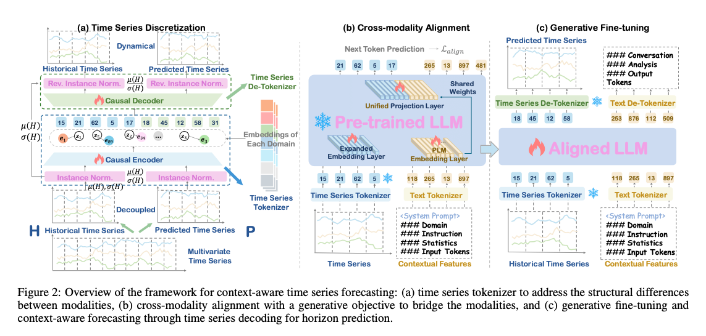

---
tags:
  - time-series
  - tokenization
  - signal-processing
  - vector-quantization
date: 2026-07-22
sources: ["[[wiki/research/From Values to Tokens Summary.md]]"]
---

# Symbolic Discretization in Time Series Forecasting

**Symbolic Discretization** is the process of mapping continuous time-series numerical sequences into a sequence of discrete symbolic tokens. In the context of modern machine learning and large language models (LLMs), symbolic discretization serves as a critical bridge to resolve the structural mismatch between continuous time-series data and discrete natural language tokens.

Below is the complete architectural overview of how continuous series are discretized and aligned with textual tokens in the TokenCast framework:

---

## 1. Evolution of Symbolic Discretization

The integration of time series with textual or symbolic models has evolved through three primary paradigms:

| Paradigm | Description | Representative Method | Limitations |
| :--- | :--- | :--- | :--- |
| **Statistical / Dimensionality Reduction** | Maps raw subsequences to symbolic intervals based on statistical assumptions (e.g., Gaussian distribution). | **SAX** (Symbolic Aggregate Approximation) | Suffers from significant information loss; unable to reconstruct fine-grained patterns. |
| **Shallow Adaption / Projection** | Maps time-series continuous patches to the language model's latent embedding space using linear/MLP layers. | **Time-LLM**, **TEMPO** | Bypasses the LLM's native vocabulary modeling mechanics; lacks explicit symbolization. |
| **Reconstruction-Based Vector Quantization** | Maps continuous subsequences to codebook vectors optimized via auto-encoding reconstruction objectives. | **TokenCast**, **VQ-VAE** | Captures precise representations; enables seamless vocabulary-level alignment with textual contexts. |

---

## 2. Mathematical Foundations of Discretization

### 2.1. Symbolic Aggregate Approximation (SAX)
Historically, SAX discretizes a time series of length $n$ into a string of arbitrary length $w$ ($w \le n$) using two steps:
1. **Piecewise Aggregate Approximation (PAA):** Reduces the dimensionality by dividing the series into $w$ equal-sized segments and computing the mean for each segment.
2. **Symbolic Mapping:** Determines breakpoints such that the area under a standard Gaussian curve is divided into equal-probability regions. Each PAA coefficient is mapped to the corresponding symbol based on the region it falls into.
*Deficit:* SAX assumes a Gaussian distribution and discards sub-segment variance, making it lossy and ill-suited for accurate reconstruction or generative forecasting.

### 2.2. Vector Quantization (VQ) Discretization
Modern frameworks like [[TokenCast]] leverage learnable vector quantization. Rather than static breakpoints, VQ employs an end-to-end trained encoder-decoder network to discretize continuous latent features $Z = f_{\text{enc}}(X)$:

$$\text{Quantize}(z_t) = e_{k^*}, \quad \text{where } k^* = \arg\min_{k} \|z_t - e_k\|_2^2$$

- **Codebook $C = \{e_1, \dots, e_K\}$:** Represents the discrete vocabulary of temporal symbols.
- **Codebook Indices $\{k^*\}$:** Act as "vocabulary words" or temporal tokens representing specific local shapes (e.g., rising trends, sudden drops, seasonal cycles) within the time series.

---

## 3. Critical Challenges & Solutions

### 3.1. Codebook Collapse (Sparsity)
A key challenge in learnable discretization is **codebook collapse**, where the encoder repeatedly maps all latent vectors to a small subset of codebook embeddings, leaving other embeddings untrained and unused.
- *Solution:* Modern tokenizers introduce a **diversity loss** that maximizes the nearest-neighbor distance between codebook vectors:
  $$\mathcal{L}_{\text{diversity}} = \frac{1}{K} \sum_{k=1}^K \frac{1}{\min_{j 
eq k} \|e_k - e_j\|_2 + \epsilon}$$
  This keeps codebook vectors distributed evenly across the latent manifold.

### 3.2. Statistical Non-Stationarity
Time series often exhibit severe covariate shift and non-stationarity, causing absolute numerical values to fall outside the range of a trained codebook. To resolve this, models use instance-based normalization:
- **Dimensionality ($L$):** Unlike Batch Normalization, Reversible Instance Normalization (RevIN) operates strictly across the **temporal sequence dimension ($L$)**, independently for each batch item $b$ and variable channel $c$. There is no channel or batch mixing.
- **On-the-Fly Calculation:** Because it operates along the sequence length $L$, the model requires no permanent dataset-wide statistics in its checkpoint. During inference on a single sequence ($B=1$), the full temporal context $L$ is present to calculate $\mu$ and $\sigma$ dynamically.
- **Preventing Lookahead Leakage:** In predictive models, computing statistics across both history ($H$) and future ($P$) horizons causes future characteristics to leak into the encoder. Models like [[TokenCast]] apply **Decoupled RIN**, calculating mean $\mu(H)$ and standard deviation $\sigma(H)$ **solely** on historical lookbacks and applying them to normalize the entire concatenated target series.

---

## 4. Significance for LLM-Based Forecasting
Discretizing numerical sequences into symbolic tokens offers profound advantages when working with Large Language Models:
- **Unified Modality:** Continuous signals are converted into structural equivalents of text tokens, enabling direct concatenation (`[Z_q; Y]`) and processing inside the LLM attention layers without architectural modification.
- **Generative Autoregressive Alignment:** Allows utilizing next-token prediction pre-training directly on time series data, enabling the LLM to learn context-aware dependencies using its pre-trained vocabulary mechanisms.
- **Explainable TSF:** Enables the LLM to output inter-token textual reasoning alongside predicted future temporal tokens in a single, unified generation stream.
