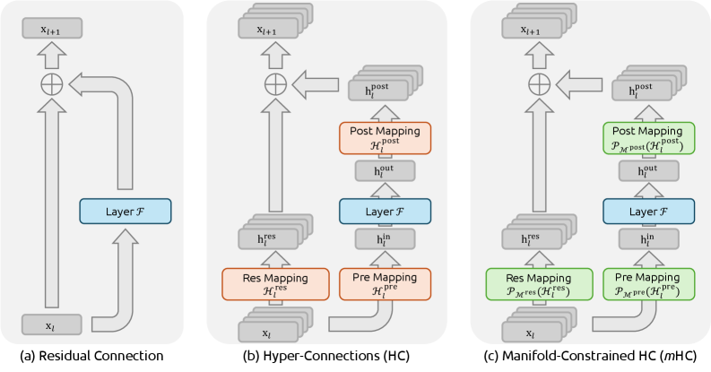

# Manifold-Constrained Hyper-Connections (mHC)

## Overview
Hyper-Connections (HC) recently expanded the standard residual connection paradigm by increasing the width of the residual stream. While this increases topological complexity without adding FLOPs, it destroys the "identity mapping" property of standard residual connections, leading to severe training instability (vanishing/exploding gradients) and memory access overhead. 

**mHC (Manifold-Constrained Hyper-Connections)** projects the residual connection space of HC onto a specific manifold (the Birkhoff polytope) to restore the identity mapping property. It also introduces infrastructure optimizations to ensure large-scale training efficiency.

## 1. The Original Residual Connection

In standard deep neural networks, a single-layer residual connection is formulated as (Equation 1):
$$
\mathbf{x}_{l+1}=\mathbf{x}_{l}+\mathcal{F}(\mathbf{x}_{l},\mathcal{W}_{l})
$$
where $\mathbf{x}_{l}$ is the input feature of dimension $C$, and $\mathcal{F}$ is the residual function (like Attention or FFN). 

**The Magic:** The most crucial part of this equation is that the coefficient of $\mathbf{x}_{l}$ is exactly **1**. Because of this, when you recursively expand this across multiple layers from $l$ to $L$ (Equation 2):
$$
\mathbf{x}_{L}=\mathbf{x}_{l}+\sum_{i=l}^{L-1}\mathcal{F}(\mathbf{x}_{i},\mathcal{W}_{i})
$$
The signal $\mathbf{x}_{l}$ maps directly to deeper layers without any modification or scaling. This is known as the **identity mapping property**, and it ensures that signals (in the forward pass) and gradients (in the backward pass) can flow through many layers unimpeded, preventing them from vanishing or exploding.

## 2. Hyper-Connections (HC)

**Purpose:** HC aims to increase the topological complexity of the network without altering the computational FLOPs overhead. It does this by expanding the width of the residual stream from a dimension of $C$ to $n \times C$ (where $n$ is the expansion rate, e.g., 4).

To manage this wider stream, HC introduces three learnable linear matrices, defining single-layer propagation as:
$$
\mathbf{x}_{l+1}=\mathcal{H}_{l}^{\mathrm{res}}\mathbf{x}_{l}+\mathcal{H}_{l}^{\mathrm{post}\,\top}\mathcal{F}(\mathcal{H}_{l}^{\mathrm{pre}}\mathbf{x}_{l},\mathcal{W}_{l})
$$
*   $\mathcal{H}_{l}^{\mathrm{pre}} \in \mathbb{R}^{1 \times n}$: Aggregates the wide $nC$-dim stream into a standard $C$-dim input for the layer function $\mathcal{F}$.
*   $\mathcal{H}_{l}^{\mathrm{post}} \in \mathbb{R}^{1 \times n}$: Maps the layer's $C$-dim output back onto the $nC$-dim residual stream.
*   $\mathcal{H}_{l}^{\mathrm{res}} \in \mathbb{R}^{n \times n}$: Mixes features within the $n$-streams.

**The Instability Problem:** The authors point out the recursive equation for HC across multiple layers to highlight a fatal flaw:
$$
\mathbf{x}_{L}=\left(\prod_{i=1}^{L-l}\mathcal{H}_{L-i}^{\mathrm{res}}\right)\mathbf{x}_{l}+\sum_{i=l}^{L-1}\left(\prod_{j=1}^{L-1-i}\mathcal{H}_{L-j}^{\mathrm{res}}\right)\mathcal{H}_{i}^{\mathrm{post}\,\top}\mathcal{F}(\mathcal{H}_{i}^{\mathrm{pre}}\mathbf{x}_{i},\mathcal{W}_{i})
$$
Because the matrix $\mathcal{H}_{l}^{\mathrm{res}}$ is completely unconstrained, the composite mapping product $\prod_{i=1}^{L-l}\mathcal{H}_{L-i}^{\mathrm{res}}$ diverges from the identity mapping (i.e., its effective coefficient is no longer 1). This discrepancy leads to unbounded signal amplification or attenuation across deep layers, causing massive training instability.

### Worked Example: How the Expansion Rate $n$ Widens the Stream

Take hidden dim $C = 3$ and expansion rate $n = 2$ (mHC actually uses $n=4$). A token that in a standard residual stream is $\mathbf{x} = [1, 2, 3]$ becomes $n=2$ parallel 3-dim streams, stacked into an $nC = 6$-dim vector:

$$
\vec{\mathbf{x}} = \begin{bmatrix} \mathbf{x}^{(1)} \\ \mathbf{x}^{(2)} \end{bmatrix} = [\,1, 2, 3 \;\mid\; 4, 5, 6\,]^{\top}
$$

The three learnable matrices then operate on these $n$ streams:

1.  **$\mathcal{H}^{\mathrm{pre}} \in \mathbb{R}^{1 \times n}$** collapses the $n$ streams back to $C$ dims for the layer function. With $\mathcal{H}^{\mathrm{pre}} = [0.5, 0.5]$:
    $$
    \mathcal{H}^{\mathrm{pre}}\vec{\mathbf{x}} = 0.5\cdot[1,2,3] + 0.5\cdot[4,5,6] = [2.5,\ 3.5,\ 4.5] \quad (C=3\text{-dim})
    $$
    This 3-dim vector is fed into $\mathcal{F}$ (e.g. Attention/FFN). Suppose $\mathcal{F}$ outputs $[0.1, 0.2, 0.3]$.

2.  **$\mathcal{H}^{\mathrm{post}} \in \mathbb{R}^{1 \times n}$** spreads the $C$-dim output back onto the $n$ streams. With $\mathcal{H}^{\mathrm{post}} = [0.6, 0.4]$, stream 1 gets $0.6 \times [0.1,0.2,0.3]$ and stream 2 gets $0.4 \times [0.1,0.2,0.3]$.

3.  **$\mathcal{H}^{\mathrm{res}} \in \mathbb{R}^{n \times n}$** mixes information *across* the $n$ streams:
    $$
    \begin{bmatrix} 0.9 & 0.1 \\ 0.2 & 0.8 \end{bmatrix}\begin{bmatrix} \mathbf{x}^{(1)} \\ \mathbf{x}^{(2)} \end{bmatrix} = \begin{bmatrix} 0.9\,\mathbf{x}^{(1)} + 0.1\,\mathbf{x}^{(2)} \\ 0.2\,\mathbf{x}^{(1)} + 0.8\,\mathbf{x}^{(2)} \end{bmatrix}
    $$
    New stream 1 = 90% old stream 1 + 10% old stream 2 — the streams now exchange information, which is the "topological complexity" HC adds.

**The key point about $n$:** it widens the *residual stream* ($C \to nC$) but **not** the compute of $\mathcal{F}$, which always operates on $C$ dims (compressed by $\mathcal{H}^{\mathrm{pre}}$, expanded back by $\mathcal{H}^{\mathrm{post}}$). Hence HC raises topological complexity at ~zero extra FLOPs; the cost is wider memory access ($nC$ reads/writes), which mHC later addresses with kernel fusion. Note the $\mathcal{H}^{\mathrm{res}}$ above ($\begin{bmatrix} 0.9 & 0.1 \\ 0.2 & 0.8 \end{bmatrix}$) is *not* doubly stochastic (column sums are 1.1 and 0.9) — this unconstrained mixing is exactly what mHC will fix.

## 3. Manifold-Constrained Hyper-Connections (mHC)

**Purpose:** To fix HC's instability, the authors developed mHC, which constrains the unconstrained $\mathcal{H}_{l}^{\mathrm{res}}$ matrix onto a specific geometric manifold so that it regains the identity mapping property (preventing gradient explosion) while still allowing streams to exchange information.

### Why the Constraint Lands on $\mathcal{H}^{\mathrm{res}}$

**Because it is the only matrix multiplied across layers — and repeated multiplication is what breaks training.**

Look at the HC recursion, where the compounding is visible directly:
$$
\mathbf{x}_{L}=\underbrace{\left(\prod_{i=1}^{L-l}\mathcal{H}_{L-i}^{\mathrm{res}}\right)}_{\text{only }\mathcal{H}^{\mathrm{res}}}\mathbf{x}_{l}+\sum_{i=l}^{L-1}\underbrace{\left(\prod_{j=1}^{L-1-i}\mathcal{H}_{L-j}^{\mathrm{res}}\right)}_{\text{again a product}}\mathcal{H}_{i}^{\mathrm{post}\,\top}\mathcal{F}(\mathcal{H}_{i}^{\mathrm{pre}}\mathbf{x}_{i},\mathcal{W}_{i})
$$
The coefficient of $\mathbf{x}_l$ is $\prod \mathcal{H}^{\mathrm{res}}$, one factor per layer — and only $\mathcal{H}^{\mathrm{res}}$ appears in these products. That compounding is the whole problem.

*   A spectral norm of 1.1, applied 100 times, becomes $1.1^{100} \approx 13780$ → signals explode.
*   A norm of 0.9 becomes $0.9^{100} \approx 2.7\times10^{-5}$ → signals vanish.
*   HC's measured composite gain is ~**3000**. This is that mechanism, exactly.

$\mathcal{H}^{\mathrm{pre}}$ and $\mathcal{H}^{\mathrm{post}}$ are different: each is used **once per layer, locally**, never in a cross-layer product. So they cannot compound with depth — sigmoid gating into $(0,1)$ / $(0,2)$ is enough. Only the compounding matrix needs the constraint.

**Why doubly stochastic fixes it:** the fix attacks the compounding directly. Doubly stochastic matrices have norm $\le 1$ and are **closed under multiplication** — so $\prod \mathcal{H}^{\mathrm{res}}$ stays doubly stochastic, hence norm-bounded, at *any* depth. That one property turns "explodes with depth" into "bounded forever": mHC's composite gain is ~**1.6**, three orders of magnitude below HC.

**Why not pin $\mathcal{H}^{\mathrm{res}} = I$:** stable, but it kills cross-stream mixing — the entire point of HC. The Birkhoff polytope allows mixing (off-diagonal entries) while its convex-combination form forbids amplification. Minimal constraint, kept expressiveness.

**Why Sinkhorn-Knopp:** the projection must be differentiable so gradients reach $\tilde{\mathcal{H}}^{\mathrm{res}}$, and it acts on a tiny $n \times n$ matrix ($4\times4$ at $n=4$) — cheap and fusable into one kernel.

### The Birkhoff Polytope (Doubly Stochastic Matrices)
*   **Plain Words:** mHC forces the residual connection matrix to become a "doubly stochastic matrix." This means all numbers in the matrix are non-negative, and every single row and every single column adds up to exactly 1. Geometrically, the set of all these matrices forms a shape called the Birkhoff polytope.
*   **Mathematical Properties:** Because rows and columns sum to 1, applying this matrix acts as a convex combination (a weighted average) of the input features, which conserves the mean of the features. Furthermore, its spectral norm is bounded by 1 ($\|\mathcal{H}^{\mathrm{res}}_{l}\|_{2}\leq 1$), and multiplying two doubly stochastic matrices together always produces another doubly stochastic matrix. This guarantees stability across infinite depth.
$$
\mathcal{P}_{\mathcal{M}^{\mathrm{res}}}(\mathcal{H}^{\mathrm{res}}_{l})\coloneq\left\{\mathcal{H}^{\mathrm{res}}_{l}\in\mathbb{R}^{n\times n}\mid\mathcal{H}^{\mathrm{res}}_{l}\mathbf{1}_{n}=\mathbf{1}_{n},\ \mathbf{1}^{\top}_{n}\mathcal{H}^{\mathrm{res}}_{l}=\mathbf{1}^{\top}_{n},\ \mathcal{H}^{\mathrm{res}}_{l}\geqslant 0\right\}
$$

### The [[Sinkhorn-Knopp Algorithm]]
*   **Plain Words:** To actively force the raw, unconstrained matrix to become doubly stochastic, the network uses the Sinkhorn-Knopp algorithm. First, it makes all negative numbers positive by applying an exponential function. Then, it repeatedly normalizes the matrix—first making all rows sum to 1, then making all columns sum to 1, bouncing back and forth until the matrix stabilizes (converges).
*   **Algorithm Words:** Given a raw output $\tilde{\mathcal{H}}^{\mathrm{res}}_{l}$, the algorithm starts with a positive matrix:
$$
\mathbf{M}^{(0)}=\exp(\tilde{\mathcal{H}}^{\mathrm{res}}_{l})
$$
Then, it iterates row normalization ($\mathcal{T}_{r}$) and column normalization ($\mathcal{T}_{c}$):
$$
\mathbf{M}^{(t)}=\mathcal{T}_{r}\left(\mathcal{T}_{c}(\mathbf{M}^{(t-1)})\right)
$$
After a fixed number of iterations (e.g., $t_{\text{max}}=20$), it converges to the final doubly stochastic matrix $\mathcal{H}^{\mathrm{res}}_{l}=\mathbf{M}^{(t_{\text{max}})}$.