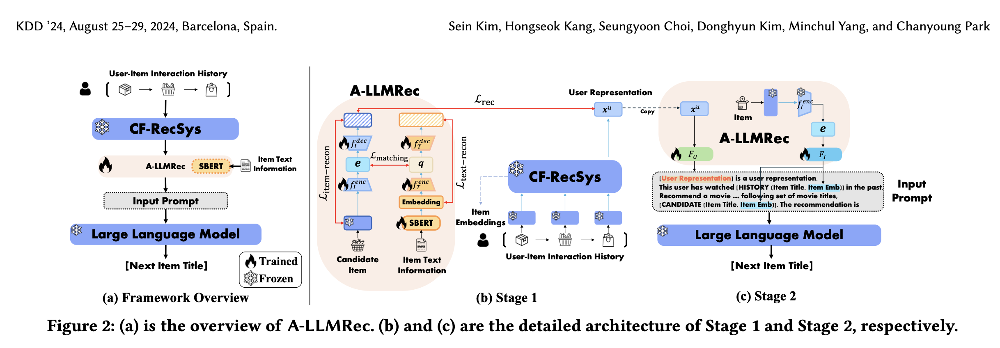

# All-round LLM-based Recommender System (A-LLMRec)

Published in April 2024 by researchers from KAIST and NAVER Corporation, South Korea, **A-LLMRec** introduces an efficient, training-free approach to integrate Collaborative Filtering (CF) and Large Language Models (LLMs). It aligns a pre-trained traditional recommender system directly with a frozen LLM to excel in both warm-start and cold-start scenarios.

## Core Motivation

Existing LLM-based recommender systems (LLMRec) struggle with a key trade-off between warm-start and cold-start accuracy:
1. **The Collaborative Gap in Warm Scenarios:** Standard LLMRec models rely predominantly on textual item semantics (e.g., titles, genres) or fine-tune LLM adapters (like LoRA) on natural language templates. Due to the lack of explicit collaborative filtering patterns, they underperform simple traditional collaborative models (like SASRec or LightGCN) in warm scenarios where rich interaction data is available.
2. **The Sparsity Problem in Cold Scenarios:** Conversely, traditional collaborative models fail in cold scenarios due to the extreme sparsity of user-item interactions, where text-based semantic recommenders excel.
3. **The Resource Bottleneck:** Fine-tuning LLM adapters is computationally expensive and memory-intensive, limiting their scalability to large-scale industrial datasets.

**A-LLMRec** solves these challenges by **locking the LLM and base collaborative models completely frozen**. It aligns their latent manifolds using low-resource Multi-Layer Perceptrons (MLPs), enabling the LLM to directly ingest pre-trained collaborative user/item embeddings.

---

## Architectural Framework

The A-LLMRec framework operates in a decoupled, dual-stage alignment paradigm.

### 1. Stage 1: Alignment of Collaborative and Textual Knowledge (Section 4.1)
This stage bridges the gap between co-consumption behavior and text semantic manifolds, training a **joint collaborative-text embedding** generator:
*   **Dual MLP Encoders:** 
    *   **Item Encoder ($f_I^{enc}$):** Projects raw collaborative embeddings $\mathbf{E}_i$ (from a frozen pre-trained SASRec) to a latent space: $\mathbf{e}_i = f_I^{enc}(\mathbf{E}_i)$.
    *   **Text Encoder ($f_T^{enc}$):** Projects raw dense text embeddings $\mathbf{Q}_i$ (from a fine-tuned Sentence-BERT/SBERT) into the same latent space: $\mathbf{q}_i = f_T^{enc}(\mathbf{Q}_i)$.
*   **Preventing Over-smoothing (Section 4.1.1):** Simply minimizing distance between the projected manifolds ($\mathbf{e}_i \approx \mathbf{q}_i$) leads to representation collapse, where the encoders map all inputs to a trivial zero vector. To prevent this, A-LLMRec introduces decoders ($f_I^{dec}$ and $f_T^{dec}$) to reconstruct the original inputs, optimizing reconstruction MSE losses ($\mathcal{L}_{\text{item-recon}}$ and $\mathcal{L}_{\text{text-recon}}$).
*   **Supervised Recommendation Supervision:** A downstream dot-product recommendation prediction loss ($\mathcal{L}_{rec}$) is added to explicitly retain user-item matching performance.
*   **Cold-Start generalizability:** For warm items, the joint embedding is $\mathbf{e}_i = f_I^{enc}(\mathbf{E}_i)$. For cold items, it is generated via the text encoder: $\mathbf{q}_i = f_T^{enc}(\mathbf{Q}_i)$. Because the encoders were aligned, $\mathbf{q}_i$ successfully **hallucinates collaborative patterns using only text!**

### 2. Stage 2: Embedding Projection & Frozen LLM Prompting (Section 4.2)
*   **Token Projection:** Two 2-layer MLPs ($F_U$ and $F_I$) project the user representation $\mathbf{x}^u$ and the item's joint embedding $\mathbf{e}_i$ into the LLM's high-dimensional token space:
    $$\mathbf{O}_u = F_U(\mathbf{x}^u) \quad \text{and} \quad \mathbf{O}_i = F_I(\mathbf{e}_i)$$
*   **Prompt Wrapping:** These projected embeddings are treated directly as **ordinary LLM tokens** (soft prompts) and inserted alongside natural language tokens:
    `[User token: O_u] This user has watched Movie A [Item token: O_a]... Recommend a movie to watch next...`
*   **Target-Masked Optimization:** The LLM parameters $\Theta$ are kept **100% frozen**. Only the projection matrices ($F_U$ and $F_I$) are optimized. During cross-entropy training, the input prompt tokens are **masked out**, and the model is trained strictly to predict the textual title string of the next recommended item (e.g., `"Waterloo Bridge"`).

---

## Key Empirical Findings

1. **All-Round Performance:** A-LLMRec consistently outperforms both state-of-the-art collaborative models (SASRec) and LLMRec baselines (TALLRec) across warm-start, cold-start, few-shot, and cross-domain recommendation benchmarks.
2. **Uniqueness Preservation:** Ablation studies confirm that omitting the reconstruction losses ($\mathcal{L}_{\text{item-recon}}$ and $\mathcal{L}_{\text{text-recon}}$) leads to severe performance degradation due to over-smoothed representations.
3. **Extreme Resource Efficiency:** Because neither the LLM nor the CF-RecSys is fine-tuned, A-LLMRec's trainable footprint is extremely small. It trains **significantly faster** (takes minutes instead of hours) and achieves much lower online serving latency than LoRA-tuned recommenders.

---

## Related Concept Links
*   [[A-LLMRec]]: Detailed architectural and entity specification of the A-LLMRec model.
*   [[SASRec]]: The self-attention sequential recommendation model commonly used as the pre-trained behavior embedding source.
*   [[SASRec]]: The self-attention sequential recommendation model commonly used as the pre-trained collaborative base encoder.
*   [[Conversational Recommender Systems]]: Synthesis of the architectural evolution of LLMRec and recommendation paradigms.
