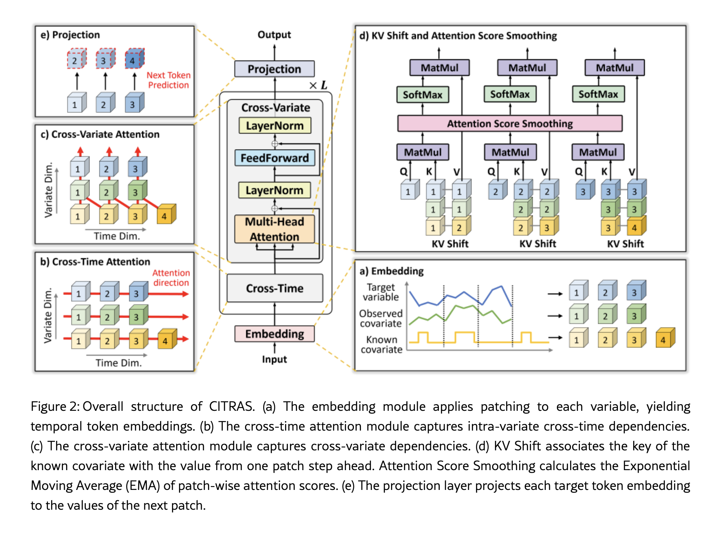

# CITRAS: Covariate-Informed Transformer for Time Series Forecasting

**CITRAS** (Covariate-Informed Transformer for Time Series Forecasting) is a patch-based, **decoder-only transformer** designed to flexibly integrate multiple target variables, observed covariates, and known covariates. Published in IEEE Access 2026 by Hitachi Ltd., it addresses the challenges of length discrepancies in known covariates and noise-resilience in inter-variable modeling without sacrificing the strong autoregressive modeling capabilities of decoder-only architectures.

---

## Architectural Layout

CITRAS decomposes spatial and temporal dependency capturing into alternating 2D attention blocks:

1. **Embedding**: Segments target variables ($\mathbf{X}^{tgt}$), observed covariates ($\mathbf{X}^{obs}$), and known covariates ($\mathbf{X}^{knw}$) into non-overlapping patches of length $P$. They are projected into $D$-dimensional representations using a **shared linear projector**.
2. **Cross-Time Attention Module**: Captures intra-variate trends by running causal multi-head self-attention with **Rotary Position Embeddings (RoPE)** independently for each variable along the temporal axis.
3. **Cross-Variate Attention Module**: Models spatial correlations across channels at each temporal step using **[[KV Shift]]** and **[[Attention Score Smoothing]]**.
4. **Projection (Output Head)**: Maps the target embeddings back to raw patch space to predict the values of the next patch.

---

## Technical Specifications & Formulation

### 1. Unified Patch Embedding
Each variable $c$ is split into patches of length $P$. The total number of tokens for target and observed covariates is $N_{tgt} = N_{obs} = \frac{T}{P}$, while known covariates span the future horizon resulting in $N_{knw} = \frac{T+S}{P}$ tokens.
The embeddings are mapped via a shared linear projector:

$$\mathbf{H}_i^{tgt,c} = \operatorname{Embed}\left(\mathbf{s}_i^{tgt,c}\right), \quad i=1,\dots,N_{tgt}$$

$$\mathbf{H}_i^{obs,c} = \operatorname{Embed}\left(\mathbf{s}_i^{obs,c}\right), \quad i=1,\dots,N_{obs}$$

$$\mathbf{H}_i^{knw,c} = \operatorname{Embed}\left(\mathbf{s}_i^{knw,c}\right), \quad i=1,\dots,N_{knw}$$

where $\operatorname{Embed}: \mathbb{R}^{P} \to \mathbb{R}^{D}$ represents the linear projection weights shared globally across all step positions and variable channels.

#### **Handling Observed Covariates during Recursive Forecasting ($S > P$):**
When the forecasting horizon $S$ exceeds the patch size $P$, CITRAS enters a **recursive (rolling) forecasting loop** where predicted target patches are appended to the context for subsequent forward passes. 

*Note: While the paper does not explicitly discuss how observed covariates $\mathbf{X}^{obs}$ (e.g., historical weather) are modeled at future temporal steps during recursive rolls, in practical engineering and code-level implementation, they are typically handled via two standard approaches:*
1. **Mask Padding (Default)**: Future steps of observed covariates are padded with zeros, and their corresponding input binary mask $\mathbf{m}_d$ is set to $0$ (unobserved/missing). Because the shared input embedding network and attention layers are trained to handle random missing values via masking, the model naturally ignores these channels at future steps.
2. **Naive Copy-Forward**: For stable environmental parameters, the last known historical observation $\mathbf{X}_T^{obs}$ is copied forward as a constant baseline for the future horizon (i.e., $\mathbf{X}_{T+t}^{obs} = \mathbf{X}_T^{obs}$).

---

### 2. Cross-Time Attention Module
In the **Cross-Time Attention Module**, the model processes each variable channel completely independently. To capture intra-variate temporal dependencies (trends and seasonality) while preventing future target leakage, CITRAS applies **causal multi-head self-attention** paired with **Rotary Position Embeddings (RoPE)**.

For each target variable channel $c$ (and similarly for observed covariates $\mathbf{H}_{:}^{obs,c}$ and known covariates $\mathbf{H}_{:}^{knw,c}$), dropping the layer index for simplicity, the causal temporal representation learning is formulated as:

$$\widetilde{\mathbf{H}}_{:}^{tgt,c} = \operatorname{LN}\left(\mathbf{H}_{:}^{tgt,c} + \operatorname{MHA}\left(\mathbf{H}_{:}^{tgt,c}, ~ \mathbf{H}_{:}^{tgt,c}, ~ \mathbf{H}_{:}^{tgt,c}\right)\right)$$

$$\mathbf{H}_{:}^{tgt,c} = \operatorname{LN}\left(\widetilde{\mathbf{H}}_{:}^{tgt,c} + \operatorname{FFN}\left(\widetilde{\mathbf{H}}_{:}^{tgt,c}\right)\right)$$

where:
- $\operatorname{LN}$ is Layer Normalization.
- $\operatorname{FFN}$ is a Feed-Forward Network.
- $\operatorname{MHA}(\mathbf{Q},\mathbf{K},\mathbf{V})$ is the Multi-Head Attention layer. Here, Queries, Keys, and Values all derive from the temporal sequence $\mathbf{H}_{:}^{tgt,c}$ of length $N_{tgt}$.

#### **Batching and Scaling Characteristics:**
- **No Variable Interaction**: During this phase, variables do not cross-contaminate. The model merges the Batch ($B$) and Variable Channel ($C$) dimensions into a single execution dimension of size $B \times C$.
- **Temporal Attention Complexity**: The self-attention matrix is computed independently for each of the $B \times C$ sequences, resulting in an attention shape of $N \times N$ (where $N = N_{tgt}$ or $N_{knw}$).
- **Causal Masking**: Causal attention masks are strictly enforced for target variables and observed covariates to guarantee they do not observe their own futures during training.

---

### 3. Cross-Variate Attention via [[KV Shift]]
Standard step-wise cross-variate attention cannot leverage future known covariates at step $i+1$ when generating predictions from step $i$. CITRAS solves this by **shifting the known covariate Value step forward by one step** while keeping the Query and Key aligned at step $i$:

$$\text{Query at step } i: ~~~ \mathbf{Q}_i = \mathbf{H}_i^{tgt,:} \in \mathbb{R}^{C_{tgt} \times D}$$

$$\text{Key at step } i: ~~~ \mathbf{H}_i^{k,:} = \left[\mathbf{H}_i^{tgt,:}, ~ \mathbf{H}_i^{obs,:}, ~ \mathbf{H}_i^{knw,:}\right] \in \mathbb{R}^{(C_{tgt} + C_{obs} + C_{knw}) \times D}$$

$$\text{Value at step } i: ~~~ \mathbf{H}_i^{v,:} = \left[\mathbf{H}_i^{tgt,:}, ~ \mathbf{H}_i^{obs,:}, ~ \mathbf{H}_{i+1}^{knw,:}\right] \in \mathbb{R}^{(C_{tgt} + C_{obs} + C_{knw}) \times D}$$

To perform cross-attention, the Query, Key, and Value are projected using weight matrices $\mathbf{W}_q, \mathbf{W}_k, \mathbf{W}_v \in \mathbb{R}^{D \to d_k}$:

$$\text{Projected Q, K, V:} ~~~ \mathbf{Q}_i \mathbf{W}_q \in \mathbb{R}^{C_{tgt} \times d_k}, \quad \mathbf{H}_i^{k,:} \mathbf{W}_k \in \mathbb{R}^{C \times d_k}, \quad \mathbf{H}_i^{v,:} \mathbf{W}_v \in \mathbb{R}^{C \times d_k}$$

The projected target query is dot-producted with the concurrent key matrix to compute perfectly aligned concurrent correlations, which then query the shifted Value matrix to fetch future covariate information. This mathematically prevents target temporal leakage because targets and observed covariates in the Value matrix are **never shifted**.

- **Batching and Scaling**: No temporal interactions occur in this block. The Batch ($B$) and Patch-Step ($N$) dimensions are merged, running variable-cross attention of shape $C_{tgt} \times C$ independently for each of the $B \times N$ spatial slices.

---

### 4. [[Attention Score Smoothing]] (EMA)
Calculating cross-variate attention independently at each individual patch step $i$ provides fine-grained local precision but introduces two critical structural vulnerabilities:

1. **Vulnerability 1: Local Disturbances & Random Noise**: High-frequency fluctuations, anomalies, or sensor glitches at step $i$ distort the local token embedding $\mathbf{H}_i$, leading to a noisy raw attention score matrix $\widetilde{\mathbf{A}}_i$. Under independent step-wise calculation, this causes the model to suddenly "hallucinate" strong relationships or lose actual correlations.
2. **Vulnerability 2: Sparse Variables & Constant Patches**: Many critical known covariates are binary event indicators (e.g., holiday or discount flags). Within many temporal patches, these indicators are completely flat (filled with zeros). Without temporal variation inside the patch, the dot-product query-key matching fails to establish a meaningful correlation, causing the model to "forget" the global covariate importance during quiet periods.

To bridge fine-grained localized accuracy with global robustness, CITRAS smooths the raw attention scores $\widetilde{\mathbf{A}}_i$ across sequential steps using an **Exponential Moving Average (EMA)**:

$$\mathbf{A}_i = \alpha \widetilde{\mathbf{A}}_i + (1 - \alpha) \mathbf{A}_{i-1}, \quad i=2,\dots,N_{tgt}$$

where $\mathbf{A}_1 = \widetilde{\mathbf{A}}_1$ and $\alpha \in [0, 1]$ is a shared smoothing factor (hyperparameter) across all heads and layers.

#### **Why this works:**
- **Establishes Temporal Memory**: The EMA formulation carries the "memory" of variable dependencies established in previous active segments forward, ensuring the importance of sparse indicators is remembered even when they are flat.
- **Low-Pass Noise Filtering**: High-frequency spikes in $\widetilde{\mathbf{A}}_i$ are heavily dampened by the historical term $(1-\alpha)\mathbf{A}_{i-1}$, preventing erratic predictions due to local outliers.
- **Smooth Adaptability**: Unlike global averaging, the exponential decay enables the model to adapt smoothly to gradual, long-term shifts in cross-variate correlations (e.g., seasonal electricity-demand dependency shifts) while remaining robust to high-frequency noise.

---

### 5. Next-Token Projection
Following the standard decoder-only autoregressive paradigm, the target token at step $i$ is projected to predict targets at step $i+1$:

$$\widehat{\mathbf{X}}_{iP+1:(i+1)P}^{tgt,c} = \operatorname{Project}\left(\mathbf{H}_i^{tgt,c}\right)$$

For forecasting horizons exceeding one patch length ($S > P$), the outputs from the last patch are integrated recursively into the next forward pass.

---

## See Also
- [[KV Shift]]
- [[Attention Score Smoothing]]
- [[Group Attention]]
- [[TimesFM XReg Modes]]
