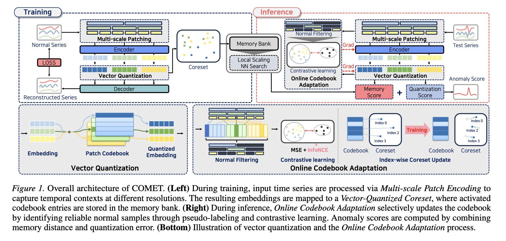

# COMET Summary

## 1. Core Problem: Limitations in Modern Time-Series Anomaly Detection
Time-series anomaly detection is a critical task across various industrial domains. However, standard unsupervised anomaly detection models suffer from several key limitations:
1. **Single-Scale Representations**: Existing models often partition time series into fixed-length patches at a single scale and assume channel independence. Since normal and anomalous patterns manifest across different temporal scales, single-scale approaches fail to capture multi-granularity patterns comprehensively.
2. **Timestep-Level Scoring Bottlenecks**: Many models compute anomaly scores at individual timesteps, which lacks temporal context. This makes it difficult to detect contextual anomalies (which appear normal in isolation but abnormal in context) and collective anomalies (sequences of individually normal observations that form abnormal patterns together).
3. **Distribution Shifts (Non-Stationarity)**: Real-world time-series data exhibit evolving statistical properties over time. Unsupervised models trained solely on normal historical data are highly vulnerable to these distribution shifts at inference time, leading to gradual performance degradation.

To overcome these challenges, the authors propose **COMET** (**C**odebook-based **O**nline-adaptive **M**ulti-scale **E**mbedding for **T**ime-series anomaly detection), which integrates multi-scale patch representation, a vector-quantized normal prototype coreset, density-adaptive local scaling anomaly scoring, and dynamic threshold-free test-time adaptation.

---

## 2. Overall Architecture
COMET processes multivariate time series using a multi-scale, dual-path encoding pipeline, quantizes continuous embeddings into learned normal pattern prototypes, and adaptively updates the codebook online during inference.

The overall processing pipeline follows:
$$\mathbf{X} \in \mathbb{R}^{L \times D} \xrightarrow{\text{Multi-scale Patching}} \{\mathbf{P}_k\}_{k=1}^K \xrightarrow{\text{Dual-Path Encoding}} \{\mathbf{Z}_{e,k}\}_{k=1}^K \xrightarrow{\text{Vector Quantization}} \{\mathbf{Z}_{q,k}\}_{k=1}^K \xrightarrow{\text{Anomaly Scoring}} S^{(t)}$$

---

## 3. Deep Dive into Key Components

### 3.1 Multi-scale Patch Encoding
COMET captures local multi-granularity temporal dynamics alongside inter-variable correlations using a multi-scale dual-path encoder structure:

* **Multi-Scale Patching**: Given input $\mathbf{X}$, we extract patches at $K$ different scales using patch sizes $\mathcal{P} = \{p_1, \dots, p_K\}$ and strides $\mathcal{S} = \{s_1, \dots, s_K\}$. The $j$-th patch of variable $i$ at scale $k$ is:
  $$\mathbf{P}_{k}^{(i,j)} = \mathbf{X}_{j \cdot s_k : j \cdot s_k + p_k, \, i} \in \mathbb{R}^{p_k}$$
  where $N_k = \lfloor (L - p_k) / s_k \rfloor + 1$.
* **SeriesPatch-Specific Encoder**: Captures distinct variable-wise statistics by passing each patch through independent linear projections:
  $$\mathbf{h}_{k}^{(s,i,j)} = f_{k}^{(s,i)}(\mathbf{P}_{k}^{(i,j)}) = \mathbf{W}_{k}^{(s,i)}\mathbf{P}_{k}^{(i,j)} + \mathbf{b}_{k}^{(s,i)}$$
* **Core Encoder**: To capture cross-variable interactions, patches from all variables are concatenated and mapped via a shared projection:
  $$\tilde{\mathbf{P}}_{k}^{(j)} = \left[\mathbf{P}_{k}^{(1,j)}; \dots; \mathbf{P}_{k}^{(D,j)}\right] \in \mathbb{R}^{D \cdot p_k}$$
  $$\mathbf{h}_{k}^{(c,j)} = f_{k}^{(c)}(\tilde{\mathbf{P}}_{k}^{(j)}) = \mathbf{W}_{k}^{(c)}\tilde{\mathbf{P}}_{k}^{(j)} + \mathbf{b}_{k}^{(c)}$$
* **Feature Fusion**: Combines variable-specific local temporal dynamics and global cross-variable context:
  $$\mathbf{z}_{e,k}^{(i,j)} = \mathbf{W}_{k}^{(g)}\left[\mathbf{h}_{k}^{(s,i,j)}; \mathbf{h}_{k}^{(c,j)}\right] + \mathbf{b}_{k}^{(g)}$$
  This outputs a continuous embedding tensor $\mathbf{Z}_{e,k} \in \mathbb{R}^{D \times N_k \times d}$ for each scale $k$.

### 3.2 Vector-Quantized Coreset
COMET uses Vector Quantization (VQ) to map continuous embeddings to discrete normal patterns:
* **Vector Quantization**: Each scale $k$ has a shared learnable codebook $\mathbf{C}_k = \{\mathbf{c}_1, \dots, \mathbf{c}_M\} \in \mathbb{R}^{M \times d}$. The embedding $\mathbf{z}_{e,k}^{(i,j)}$ is mapped to the nearest entry:
  $$q_{k}^{(i,j)} = \underset{m}{\arg\min} \left\| \mathbf{z}_{e,k}^{(i,j)} - \mathbf{c}_m \right\|_2^2,\qquad \mathbf{z}_{q,k}^{(i,j)} = \mathbf{c}_{q_{k}^{(i,j)}}$$
* **Training Objective**: The VQ modules are trained using codebook, commitment, and reconstruction losses with stop-gradient ($\text{sg}[\cdot]$):
  $$\mathcal{L}_{\text{total}} = \mathcal{L}_{\text{rec}} + \alpha \mathcal{L}_{\text{cb}} + \beta \mathcal{L}_{\text{cm}}$$
  $$\mathcal{L}_{\text{cb}} = \left\| \mathbf{z}_{q,k}^{(i,j)} - \text{sg}[\mathbf{z}_{e,k}^{(i,j)}] \right\|_2^2, \quad \mathcal{L}_{\text{cm}} = \left\| \text{sg}[\mathbf{z}_{q,k}^{(i,j)}] - \mathbf{z}_{e,k}^{(i,j)} \right\|_2^2, \quad \mathcal{L}_{\text{rec}} = \left\| \mathbf{P}_{k}^{(i,j)} - h_k(\mathbf{z}_{q,k}^{(i,j)}) \right\|_2^2$$
* **Coreset Memory Bank**: After training, a high-efficiency coreset memory bank $\mathcal{M}$ collects all codebook entries activated by the normal training data:
  $$\mathcal{M} = \bigcup_{k=1}^K \left\{ \mathbf{c}_m \mid m \in \mathcal{A}_k \right\}$$

### 3.3 Anomaly Scoring
At test time, anomalies are detected using a dual-score scoring mechanism:
* **Memory Score with Local Scaling Distance**: To handle non-uniform sample density in the memory bank (which causes global distance false positives), COMET normalizes distances using a local neighborhood scale $\sigma_i$ (computed as the median squared distance of a memory sample $\mathbf{m}_i$ or query embedding $\mathbf{z}_q$ to its $n$-nearest neighbors):
  $$d_{\text{local}}(\mathbf{z}_q, \mathbf{m}_j) = \frac{\|\mathbf{z}_q - \mathbf{m}_j\|_2^2}{(\sigma_q + \sigma_j)/2 + \epsilon}$$
  $$S_{\text{mem}}^{(t)} = \frac{1}{K}\sum_{k=1}^K \frac{1}{n}\sum_{r=1}^n d_{\text{local}}\!\left(\mathbf{z}_{q,k}^{(t)}, \mathbf{m}_r^{(k,t)}\right)$$
* **Quantization Score**: Measures the compressibility of encoder outputs into the normal prototype space:
  $$S_{\text{quant}}^{(t)} = \frac{1}{K}\sum_{k=1}^K \left\| \mathbf{z}_{e,k}^{(t)} - \mathbf{z}_{q,k}^{(t)} \right\|_2$$
* **Deviation-based Variable Selection**: Resolves noise in high-dimensional systems by dynamically selecting the most stable variables based on standardized deviations $\delta_t^{(i)} = (S_t^{(i)} - \mu^{(i)}) / (\sigma^{(i)} + \epsilon)$. Only variables with small absolute deviations are aggregated:
  $$\mathcal{V}_t = \left\{ i \in \{1,\dots,D\} \mid |\delta_t^{(i)}| \leq \tau_t \right\} \cup \{1\},\qquad \tilde{S}_t = \frac{1}{|\mathcal{V}_t|}\sum_{i \in \mathcal{V}_t}S_t^{(i)}$$
* **EMA-based Normalization & Aggregation**: Scores are normalized using Exponential Moving Average based min-max bounds to prevent global scaling distortions, then aggregated:
  $$S^{(t)} = (1 - \lambda) \tilde{S}_{\text{mem}}^{(t)} + \lambda \tilde{S}_{\text{quant}}^{(t)}$$

### 3.4 Online Codebook Adaptation (Test-Time Adaptation)
To handle non-stationary shifts during online inference, COMET employs an **inference-then-train** adaptation strategy:
* **Threshold-Free Pseudo-labeling**: Leveraging the fact that the codebook represents exclusively normal prototypes, COMET labels test patches that map to training-activated codebook entries ($\mathcal{A}_{\text{train}}$) as **Normal** ($\tilde{y} = 0$), and all others as **Abnormal** ($\tilde{y} = 1$).
* **Contrastive Adaptation**: To maximize the separation of normal and anomalous representations, a supervised contrastive loss organizes the embedding space based on these pseudo-labels:
  $$\mathcal{L}_{\text{con}} = -\sum_{n}\frac{1}{|P(n)|}\sum_{p \in P(n)}\log\frac{e^{s_{np}/\tau}}{\sum_{a \neq n}e^{s_{na}/\tau}}$$
  The overall TTA objective is:
  $$\mathcal{L}_{\text{TTA}} = \frac{1}{|\mathcal{I}_{\text{norm}}|}\sum_{n \in \mathcal{I}_{\text{norm}}}\mathcal{L}_{\text{total}}^{(n)} + \gamma \mathcal{L}_{\text{con}}$$
  Note that the model is updated on the current test batch **only after** predicting its anomaly scores, preventing test data leakage.

---

## 4. Experimental Setup & Performance
* **Datasets**: Evaluated on 5 industrial benchmarks: PSM, SWaT, SMAP, MSL, and WADI.
* **Results**: COMET outperforms 7 major baselines (such as Anomaly Transformer, CATCH, D3R, VTT) in **36 out of 45** evaluation metrics.
* **Parameter & Speed Efficiency**: 
  * Only **567K parameters** (1.2% of CATCH's 48.6M parameters).
  * Fast training: **117.8 seconds** on the PSM dataset.
* **UMAP Space Separation**: Visualizations show that normal test data cluster tightly with codebook prototypes, while anomalies are widely scattered in distinct regions.

---
*See the detailed entity page: [[COMET]].*
