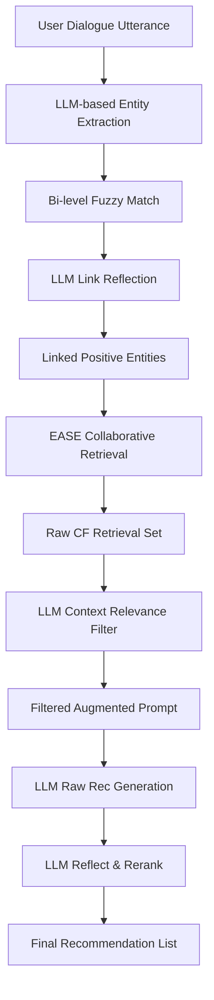

# Collaborative Retrieval Augmented Generation (CRAG)

Published in February 2025 by researchers from the University of Virginia, Cornell University, and Netflix, **CRAG** represents a major advancement in Conversational Recommender Systems (CRS). It is the first framework that successfully integrates state-of-the-art Large Language Models (LLMs) with classical Collaborative Filtering (CF) to leverage both semantic understanding and user behavioral patterns.

## Core Motivation

While LLMs possess exceptional zero-shot reasoning capabilities and extensive general knowledge of items (e.g., movie plots, actors, directors), they suffer from two major flaws in recommendation tasks:
1. **Lack of Behavioral/Collaborative Reasoning:** LLMs cannot natively query or exploit historical user-item interaction data (collaborative filtering), which contains critical signal for personalized user matching.
2. **Poor Performance on Newly Released/Tail Items:** LLMs tend to rely on static pre-training data, struggling with items that have high behavioral relevance but low web-corpora coverage.

Traditional CRS approaches use Graph Neural Networks (GNNs) or Knowledge Graphs (KGs) but fail to match the fluid semantic capabilities of modern LLMs. **CRAG** bridges this gap using a **Collaborative Retrieval-Augmented Generation** paradigm.

---

## Architectural Breakdown

The CRAG framework consists of three sequential modules designed to link textual dialogue to behavioral data, perform collaborative retrieval with contextual verification, and generate high-fidelity reranked recommendations.

### 1. LLM-based Entity Link
*   **Extraction:** The LLM processes the user's utterance to extract raw movie strings and assigns integer attitudes in the range `{-2, -1, 0, 1, 2}` representing levels from *very negative* to *very positive*.
*   **Bi-level Match:** To resolve typos and abbreviations, the raw names undergo simultaneous character-level and word-level fuzzy matching against the database.
*   **Reflection:** Disagreements between matched lists are evaluated by the LLM in context and resolved using a formatted instruction `[matched_item]####[method]`.

### 2. Context-Aware Collaborative Retrieval
*   **Query Rewrite:** Positive entities (attitude score $> 0$) are collected into a multi-hot session vector $\mathbf{r}_k \in \{0, 1\}^{|\mathcal{I}|}$.
*   **Similarity Match (Adapted EASE):** EASE (Embarrassingly Shallow Autoencoder) is trained on historical interaction data $\mathbf{R}$ to compute asymmetric item similarity: $\text{Sim}(\mathcal{I}^q_k, \mathcal{Q}; \mathbf{R}) = \mathbf{r}_k^T \mathbf{W}$.
*   **Context Verification:** Standard CF retrieval is context-blind. The top-$K$ EASE-retrieved candidates $\mathcal{I}^{CR}_k$ are passed back to the LLM with the dialogue history to flag binary contextual relevance (`0` or `1`). Only contextually validated items are appended to the generation prompt as $\mathcal{I}^{aug}_k$.

### 3. Recommendation with Reflect-and-Rerank
*   **Augmentation:** The context-verified collaborative items are translated into a similarity-ranked string and appended to the generation prompt.
*   **Generation & Positional Bias Mitigation:** To prevent the LLM's attention mechanism from lazily duplicating prompt-retrieved items at the top of the recommendation list, a final **Reflect-and-Rerank** step assigns ordinal quality scores (`{-2, -1, 0, 1, 2}`) to the LLM's raw recommendations, yielding the final ranked output list.

---

## Key Empirical Findings

1. **Superior Recommendation Quality:** CRAG outperforms previous state-of-the-art baselines (including traditional KG-based methods like UniCRS and zero-shot LLMs) across both the Redial and the newly proposed **Reddit-v2** datasets.
2. **Naive RAG Degradation:** Standard RAG methods that retrieve text-based metadata or plot summaries (e.g., Naive-RAG) actually *degrade* LLM recommendation performance. This is because textual similarity introduces high lexical noise (e.g., retrieving movies with "Brazil" in the title when the user wants "Brazilian cinema style" like *City of God*), whereas collaborative retrieval directly captures user behavioral preferences.
3. **Solving the Cold-Start/Recency Problem:** The major margin of improvement for CRAG over Zero-Shot LLMs is on **recently released movies** (cold-start items in the LLM's static weights but highly active in the collaborative database).

---

## Related Concept Links
*   [[CRAG]]: Comprehensive architectural specification of the CRAG pipeline.
*   [[EASE]]: The mathematical framework, objective function, and closed-form optimization of Steck's autoencoder adapted for collaborative retrieval.
