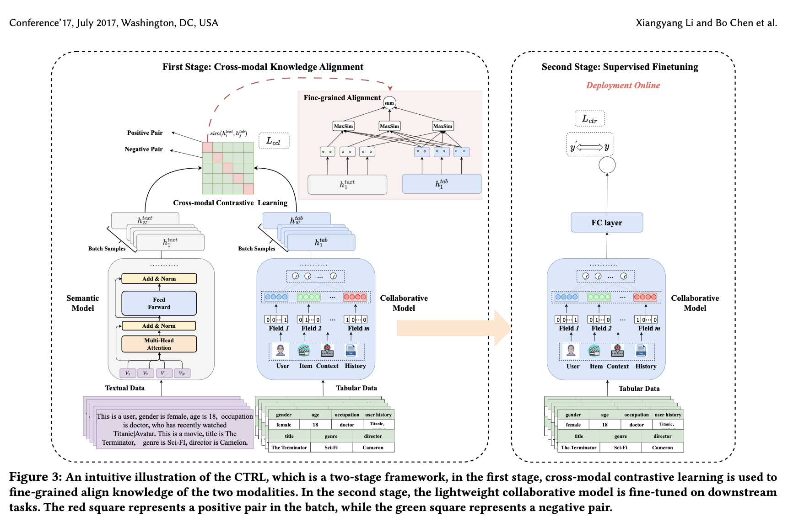

# Connect Collaborative and Language Model (CTRL)

Published in June 2023 by researchers from Huawei Noah’s Ark Lab, China, **CTRL** introduces a model-agnostic, two-stage training paradigm designed to bridge the gap between traditional lightweight collaborative click-through rate (CTR) prediction models and computationally heavy Pre-trained Language Models (PLMs).

---

## Core Motivation

In CTR prediction, recommendation systems are faced with a challenging trade-off between **prediction accuracy** and **inference efficiency**:
1. **The Semantic Information Loss of Tabular Models:** Traditional, lightweight models (e.g., DeepFM, AutoInt, DCN) represent tabular rows using one-hot encodings. This discards essential linguistic and semantic contexts, making them perform poorly in cold-start scenarios or on low-frequency, long-tailed features.
2. **The High Serving Latency of Language Models:** Large semantic models (e.g., P5, CTR-BERT) are excellent at capturing text semantics and leveraging pre-trained world knowledge. However, their complex multi-layer Transformer architectures are computationally expensive, making them impossible to deploy online under strict industrial serving constraints (e.g., 10 to 20ms SLAs).

**CTRL** solves this by establishing a **Cross-modal Knowledge Alignment** paradigm. It uses contrastive pre-training to distill semantic intelligence directly into a lightweight collaborative model, allowing the language model to be **completely discarded** during online serving.

---

## Architectural Framework

CTRL decouples training and inference into a two-stage, dual-encoder framework.

### 1. Prompt Construction (Section 4.1)
Tabular data fields are converted into natural language paragraphs using a structured punctuation convention:
*   **Template Format:**
    `This is a user, gender is female, age is 18, occupation is doctor, who has recently watched Titanic|Avatar. This is a movie, title is The Terminator, genre is Sci-FI, director is Camelon.`
*   The period `.` acts as a hard boundary separating user-side profiles and behaviors (left) from target candidate item features (right). Commas `,` separate individual fields, and vertical bars `|` separate past item interaction lists.

### 2. Stage 1: Cross-Modal Knowledge Alignment (Section 4.2)
Both tabular data and constructed textual prompts are treated as separate modalities of the same instance:
*   **Collaborative Encoder ($\mathcal{M}_{col}$):** A traditional, randomly initialized lightweight CTR model (such as AutoInt, DCN, or DeepFM) encodes the tabular features into a global collaborative embedding $\mathbf{h}^{tab}$.
*   **Semantic Encoder ($\mathcal{M}_{sem}$):** A pre-trained language model (**RoBERTa-base**) tokenizes and encodes the textual prompt. The global semantic embedding $\mathbf{h}^{text}$ is extracted from the final layer's `[CLS]` token.
*   **Symmetric Global Contrastive Loss:** For a batch of $N$ instances, a symmetric InfoNCE loss aligns both global representations by pulling positive pairs (the same row represented as tabular and text) together while pushing negative pairs apart:
    $$\mathcal{L}_{ccl} = \frac{1}{2} (\mathcal{L}^{textual2tabular} + \mathcal{L}^{tabular2textual})$$
*   Both the language model and collaborative model parameters are updated simultaneously during this stage.

### 3. Stage 2: Supervised Fine-Tuning (Section 4.3)
Once alignment is complete, the computationally heavy semantic encoder ($\mathcal{M}_{sem}$) is **completely discarded**. 
*   **Fine-Tuning:** The lightweight collaborative model ($\mathcal{M}_{col}$), whose embedding tables have absorbed aligned semantic representations from Stage 1, is fine-tuned strictly on downstream click labels ($y \in \{0, 1\}$) using standard **Binary Cross Entropy (BCE)** loss:
    $$\mathcal{L}_{ctr} = -\frac{1}{N} \sum_{k=1}^{N} \left( y_k \log(\hat{y}_k) + (1-y_k) \log(1-\hat{y}_k) \right)$$
*   **Online Serving:** At runtime, only the collaborative model is loaded. This allows the system to serve predictions containing semantic and world knowledge signals instantly within standard 10ms SLAs.

---

## Key Technical Innovations

### Fine-Grained Sub-Space Alignment (Section 4.2.2)
Standard global contrastive similarity measures only global relationships, missing local feature mappings. To resolve this, CTRL projects global embeddings $\mathbf{h}^{tab}$ and $\mathbf{h}^{text}$ into $M$ distinct sub-spaces using linear transformation matrices:
$$\mathbf{h}_m^{tab} = \mathbf{W}_m^{tab} \mathbf{h}^{tab} + \mathbf{b}_m^{tab} \quad \text{for } m = 1, \dots, M$$

By utilizing projection matrices instead of raw vector slicing, each sub-space retains global contextual access, allowing the network to dynamically synthesize different feature dimensions. Similarity is then calculated as the sum of maximum correlations across all sub-spaces:
$$\text{sim}(\mathbf{h}_i, \mathbf{h}_j) = \sum_{m_i = 1}^{M} \max_{m_j \in 1, \dots, M} \left\{ (\mathbf{h}_{i, m_i})^T \mathbf{h}_{j, m_j} \right\}$$

This multi-aspect alignment enables the model to resolve fine-grained relationships (such as matching a user's occupation and age in one sub-space, and genre preferences in another).

---

## Related Concept Links
*   [[CTRL]]: Detailed architectural and entity specification of the CTRL model.
*   [[Conversational Recommender Systems]]: Synthesis of the architectural evolution of LLMRec and recommendation paradigms.
