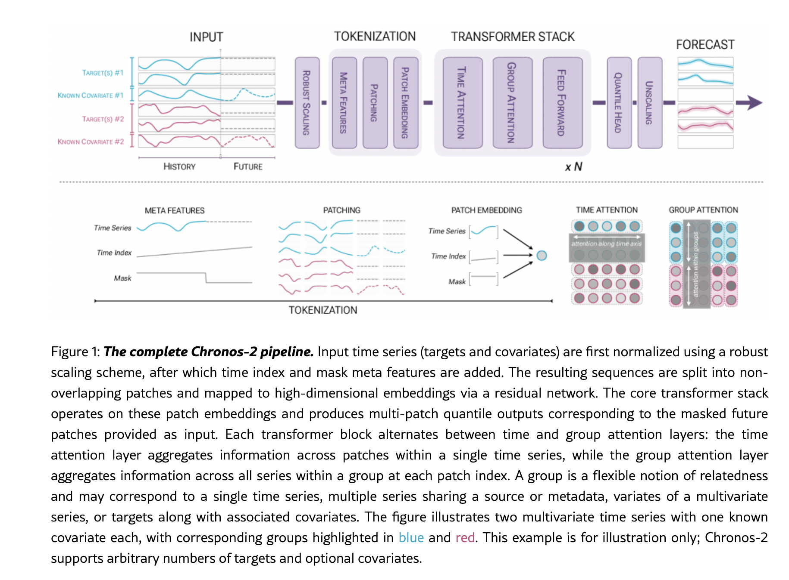

# Chronos-2: From Univariate to Universal Forecasting

**Chronos-2** is a pretrained zero-shot time-series forecasting model developed by Amazon Web Services. While its predecessor (Chronos-1) was a univariate encoder-decoder model framing forecasting as autoregressive classification over quantized bins, Chronos-2 shifts to an **encoder-only transformer architecture** with **continuous quantile regression** and **Group Attention**. This architectural leap allows Chronos-2 to natively handle univariate, multivariate, and covariate-informed forecasting in a zero-shot, parameter-free manner.

---

## Core Pipeline Architecture

The overall Chronos-2 pipeline handles targets and covariates uniformly across a unified tokenization and attention flow:

1. **Input Alignment**: Concatenates historical values and covariates into a single $2\text{D}$ matrix of shape $(T+H) \times (D+M)$.
2. **Robust Scaling**: Normalizes each column independently using a standardized inverse hyperbolic sine ($\sinh^{-1}$) transform.
3. **Channel-wise Tokenization**: Appends relative time index and mask meta-features to each channel before splitting into non-overlapping patches.
4. **Time & Group Attention Stack**: Alternates between temporal attention (within each variable) and Group Attention (across variables/covariates in the same group).
5. **Direct Multi-step Quantile Head**: Generates 21 quantiles over the forecast horizon in a single parallel forward pass.

---

## Technical Specifications & Formulation

### 1. Robust Scaling
To stabilize variance and reduce the influence of extreme values (outliers) without compressing structural peaks, Chronos-2 applies standard normalization followed by an inverse hyperbolic sine ($\sinh^{-1}$) transformation:

$$\tilde{v}_{t,d} = \sinh^{-1}\!\left(\frac{v_{t,d}-\mu_{d}}{\sigma_{d}}\right) \quad \text{for } t \in \{1,\dots,T\}$$

$$\tilde{w}_{t,d} = \sinh^{-1}\!\left(\frac{w_{t,d}-\mu_{d}}{\sigma_{d}}\right) \quad \text{for } t \in \{T+1,\dots,T+H\}$$

where $\mu_d$ and $\sigma_d$ are computed strictly over the historical segment of variable $d$. Forecasts are mapped back to their original scale during inference by inverting this formulation:

$$\hat{y}_{t,d}^{q} = \mu_d + \sigma_d \cdot \sinh\left(\hat{z}_{t,d}^{q}\right)$$

### 2. Meta Features and Patching
Each scaled dimension $d$ is augmented with two meta-features:
- **Time Index ($j$)**: Encodes relative temporal positions: $\left[-\frac{T}{C}, \dots, 0, \dots, \frac{H-1}{C}\right]$.
- **Observed Mask ($m_d$)**: Set to $1$ for observed historical points and future known covariates; set to $0$ for missing context points and future targets to be predicted.

These are split into non-overlapping patches of length $P$. A special `REG` token (serving as a separator and attention sink) is placed between historical context and future patches. The patch segments are projected into $D_{\text{model}}$ hidden space via a residual network $f^{\mathrm{in}}_{\phi}$:

$$\mathbf{h}_p = f^{\mathrm{in}}_{\phi}\left(\left[\overline{\mathbf{u}}_p, \overline{\mathbf{j}}_p, \overline{\mathbf{m}}_p\right]\right)$$

### 3. Alternating Attention Layers
- **Time Attention**: standard self-attention along the temporal axis with **Rotary Position Embeddings (RoPE)** to model intra-variate trends.
- **[[Group Attention]]**: Crucial for in-context learning (ICL). It maps the task-specific group IDs $\mathbf{g}$ to a 2D attention mask, allowing token-level aggregation *strictly* within a defined group (no positional embeddings are used in group attention as channels have no native ordering).

### 4. Direct Quantile Head
Unlike the classification head of Chronos-1, Chronos-2 uses a residual block regression head predicting **21 quantiles** directly:

$$\mathcal{Q} = \{0.01, 0.05, 0.1, \dots, 0.9, 0.95, 0.99\}$$

This continuous regression is trained with the quantile regression loss:

$$\mathcal{L} = \sum_{q \in \mathcal{Q}} \Big( q \cdot \max(z - \hat{z}^q, 0) + (1-q) \cdot \max(\hat{z}^q - z, 0) \Big)$$

---

## Inference Modes & Configurations

By customizing the Group IDs $\mathbf{g}$ and future covariate matrices $\mathbf{W}$, Chronos-2 supports diverse forecasting tasks without any task-specific fine-tuning:

| Task Type | Group IDs $\mathbf{g}$ | Future Inputs $\mathbf{W}$ |
| :--- | :--- | :--- |
| **Univariate Forecasting** | Independent group IDs per series: $\mathbf{g} = (1, 2, 3)$ | All future targets are masked as missing (`*`) |
| **Multivariate Forecasting** | Shared group IDs across targets: $\mathbf{g} = (1, 1, 1)$ | All future targets are masked as missing (`*`) |
| **Forecasting with Covariates** | Shared group IDs: $\mathbf{g} = (1, 1, 1, 1)$ | Future targets and past covariates masked (`*`); future known covariates populated |
| **Full Cross Learning (ICL)** | All items in the batch share $\mathbf{g} = (1, 1, \dots, 1)$ | Enables joint representation learning across related independent series |

---

## See Also
- [[Group Attention]]
- [[KV Shift]]
- [[TimesFM XReg Modes]]
