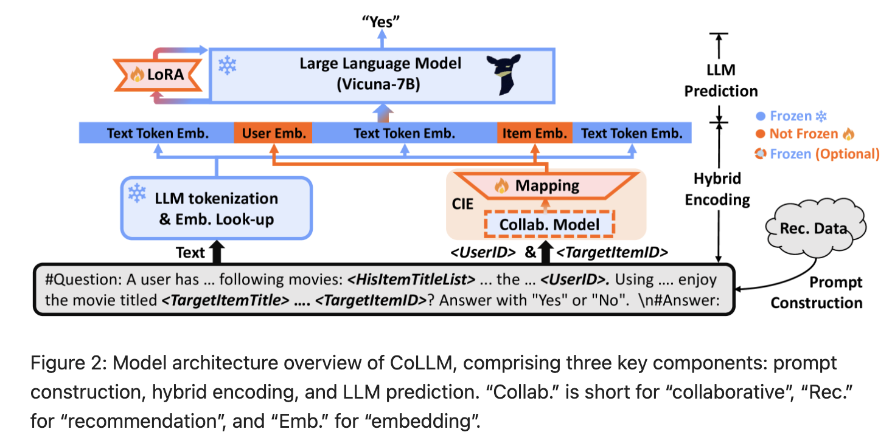

# CoLLM (Collaborative Large Language Model)

Published in October 2023 by researchers from the University of Science and Technology of China (USTC) and Meta AI, **CoLLM** addresses a major bottleneck in Large Language Model-based Recommender Systems (LLMRec): **poor performance in warm-start scenarios due to the neglect of local collaborative signals.**

## Core Motivation

Existing LLMRec approaches represent users and items solely using text tokens (e.g., movie titles, genre tags) and formulate recommendation as a semantic-matching or prompt-completion task. While highly effective for **cold-start users** (who have no interaction history, relying purely on semantic matching), this paradigm suffers from major limitations in **warm-start scenarios** (where user behavioral history is dense):
1. **Neglect of Collaborative Context:** Text descriptions cannot capture implicit, behavioral co-occurrence patterns. Two movies with highly similar textual descriptions (e.g., both sci-fi action movies) might have completely different consumption profiles across different user groups.
2. **The Scalability/Redundancy Bottleneck of Direct ID Mapping:** Attempting to assign unique atomic tokens (e.g., `<item_42340>`) to every user and item and learning their embeddings inside the LLM from scratch bloats the tokenizer vocabulary. This vocabulary explosion drops the model's compression efficiency, degrading performance on sparse datasets.

CoLLM solves this by treating collaborative behavioral data as a **separate, independent input modality**, encoding it using a traditional low-rank collaborative model, and projecting those embeddings directly into the high-dimensional LLM token space.

---

## Architectural Framework

CoLLM connects conventional collaborative recommenders to a large language model through a modular, three-part architecture.

### 1. Prompt Construction with Placeholders
CoLLM defines a template that integrates both semantic text and ID-related placeholders that act as "docking slots" for continuous behavioral embeddings:
*   **Template:**
    `#Question: A user has given high ratings to the following items: <HisItemTitleList>. Additionally, we have information about the user’s preferences encoded in the feature <UserID>. Using all available information, make a prediction about whether the user would enjoy the item titled <TargetItemTitle> with the feature <TargetItemID>? Answer with “Yes” or “No”. #Answer:`
*   The `<UserID>` and `<TargetItemID>` fields carry no linguistic semantics but serve as placeholders for the collaborative features.

### 2. Hybrid Encoding & CIE Module
During tokenization, standard words are mapped using the standard LLM embedding lookup. However, when the tokenizer encounters the ID placeholder fields, lookup is bypassed and intercepted by the **Collaborative Information Encoding (CIE)** module:
*   **Conventional Encoder:** A standard collaborative recommender (like Matrix Factorization or LightGCN) processes the user $u$ and item $i$ to output low-rank collaborative factors ($\mathbf{u}$ and $\mathbf{i}$ of dimension $d_1$).
*   **MLP Alignment Layer ($g_\phi$):** A Multilayer Perceptron maps these low-rank representations from the collaborative latent space into the LLM token embedding space (dimension $d_2$, typically `4096`):
    $$\mathbf{e}_u = g_\phi(\mathbf{u}) \quad \text{and} \quad \mathbf{e}_i = g_\phi(\mathbf{i})$$
*   The continuous mapped vectors $\mathbf{e}_u$ and $\mathbf{e}_i$ are inserted directly into the input embedding sequence $E$ fed to the LLM.

---

## The Two-Step Tuning Method

To protect the LLM's semantic reasoning capability and ensure high accuracy in both cold-start (unseen/rare items) and warm-start (dense interactions) scenarios, CoLLM uses a **Two-Step Tuning** paradigm:

*   **Step 1: Semantic Task Learning (Tuning LoRA)**
    *   **Process:** The ID placeholders are completely stripped from the prompts. The LLM (with its original embedding layer frozen) is trained on **text-only inputs** using LoRA adapters.
    *   **Goal:** Train the LLM to understand and execute the "Yes/No" recommendation task based solely on matching item semantics.
*   **Step 2: Behavioral Alignment (Tuning CIE)**
    *   **Process:** The LLM and the trained LoRA parameters are **frozen**. The ID placeholders are restored to the prompt template.
    *   **Goal:** Train *only* the MLP mapping layer ($g_\phi$) (and/or the collaborative encoder parameters) to project low-rank CF vectors into the LLM's aligned embedding space. The collaborative model learns to "speak the LLM's language," feeding behavioral patterns as continuous soft-prompt tokens.

---

## Key Empirical Findings

1. **Best of Both Worlds:** CoLLM matches TALLRec's strong cold-start performance while significantly outperforming it in warm-start scenarios (achieving substantial AUC gains on ML-1M and Amazon-Book).
2. **The "w/ UI-token" Ablation Insight:** The authors tested a variant that directly assigned standard LLM vocabulary tokens to IDs. This naive baseline performed *worse* than having no IDs at all. This demonstrates that learning ID embeddings from scratch inside a frozen LLM degrades its general compression efficiency, confirming the necessity of a low-rank, pre-trained collaborative prior (like LightGCN) aligned via an MLP.

---

## Related Concept Links
*   [[CoLLM]]: Technical and architectural specification of the CoLLM model.
