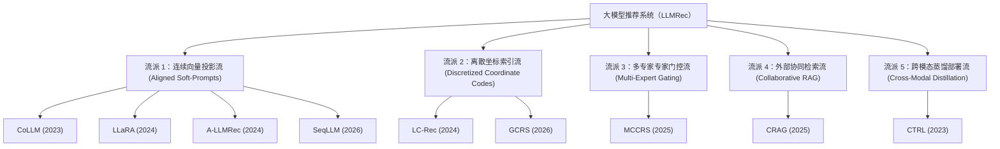

# 大语言模型对话推荐系统（LLMRec）技术演进与架构合集

本篇系统性地重写并梳理了本知识库中深入研究的 9 篇 CRS/LLMRec 领域里程碑论文：**CoLLM (2023)**、**CTRL (2023)**、**LLaRA (2024)**、**LC-Rec (2024)**、**A-LLMRec (2024)**、**CRAG (2025)**、**MCCRS (2025)**、**GCRS (2026)**、**SeqLLM (2026)**。

通过剥离冗余信息，聚焦于**物品表示表征、词表修改、多模态向量投影、LoRA/全参数微调模式**以及 **CF 协同过滤信号的融合处理机制**，呈现大模型推荐系统的架构演进全景。

---

## 1. 核心架构分类（五大核心流派）

大模型与协同过滤/行为序列对齐的技术演进可以划分为五大清晰的学术与工业流派：

1.  **连续向量投影流（CoLLM, LLaRA, A-LLMRec, SeqLLM）：**
    *   **核心逻辑：** 视用户行为和物品协同表征为一种“非文本模态”（如图像/音频）。采用 1 层或 2 层的 MLP 投影器（Projector）作为对齐接口，将传统协同模型（MF、LightGCN、SASRec）输出的低维行为向量映射到大模型的 Token Embedding 隐藏空间（通常为 4096 维），作为 Continuous Soft-Prompt 输入。
2.  **离散坐标索引流（LC-Rec, GCRS）：**
    *   **核心逻辑：** 拒绝引入任何 Projector 或连续行为向量。利用 **RQ-VAE**（残差量化自动编码器）将物品的文本语义向量压缩为 4 位离散坐标。通过在 LLM 词表中添加这些坐标作为 **Special Tokens**，大模型直接自回归输出这些代码，并配合 **Constrained Beam Search（受约束的束搜索）** 实现 100% 忠实、无幻觉的生成。
3.  **多专家专家门控流（MCCRS）：**
    *   **核心逻辑：** 将结构化知识图谱、非结构化文本、非结构化评论解耦，分配给专属的专家网络（如 R-GCN、Transformer），由中央门控协调器（ChairBot）根据上下文隐藏状态动态分配注意力权重并进行最终推荐。
4.  **外部协同检索流（CRAG）：**
    *   **核心逻辑：** 大模型完全保持零样本（Zero-shot）冻结。利用外部 Asymmetric EASE 协同过滤矩阵在大规模用户行为库中计算相似度进行检索，过滤掉上下文不相关的物品后，将文本 Item Titles 拼接灌入 Prompt。
5.  **跨模态蒸馏部署流（CTRL）：**
    *   **核心逻辑：** 训练阶段通过双塔 InfoNCE 损失和多子空间最大相关对齐，将 RoBERTa 的语义常识直接蒸馏沉淀到轻量化 Tabular 协同模型的 Embedding 中。在线 Serving 阶段完全弃用预训练语言模型（PLM），实现毫秒级 SLA 工业级部署。

---

## 2. 9大论文核心技术对标矩阵

| 论文 | 基座 LLM | 微调方法 | 是否修改词表 (特殊 Token) | 输出 Item Token 范式 | 是否使用 Projection 投影层? (类型) | 协同过滤 (CF) 信号的处理机制 |
| :--- | :--- | :--- | :--- | :--- | :--- | :--- |
| **CoLLM** *(2023)* | Vicuna-7B | LoRA SFT | **否**。Prompt 中直接填充文本占位符 ID。 | 纯文本二分类：生成 `"Yes"` 或 `"No"`。 | **是**。1层 MLP (CIE 映射层)，输入 `64/128` 维向量。 | **外部表征注入：** 将传统 LightGCN 训练好的协同用户/物品向量通过 MLP 投射进 LLM 空间充当 Continuous Soft-Prompt。 |
| **CTRL** *(2023)* | RoBERTa-base | 全参数对齐微调 (无 LoRA) | **否**。Prompt 采用标准因子化文本拼接。 | 轻量协同模型输出连续的 CTR 概率值（不通过语言模型输出）。 | **是**。多路线性变换投影矩阵 ($\mathbf{W}_m$)。 | **跨模态蒸馏对齐：** 阶段一双塔 InfoNCE 损失强迫 Tabular 与 Text 对齐；阶段二完全扔掉 PLM，协同模型继承对齐参数在线部署。 |
| **LLaRA** *(2024)* | LLaMA-7B | LoRA SFT | **是**。引入占位符 Token `<PH>`。 | 纯文本 String：目标推荐物品的 **Title 字符串**。 | **是**。2层 MLP (SR2LLM 投影模块)。 | **特征拼接对齐：** 将 LLaMA 文本 Embedding 与预训练 SASRec 的行为 Embedding（通过 SR2LLM MLP 投影）物理拼接为 Hybrid Token。 |
| **LC-Rec** *(2024)* | LLaMA-7B | 全参数 SFT | **是**。词表加入 $256 \times 4 = 1024$ 个坐标 Token（如 `<a_5>`）。 | 4位 **离散 Item 索引 Token**。 | **否**。完全使用离散代码 Token 及其嵌入，无向量投影。 | **LLM Attention 内部自学习：** RQ-VAE 纯靠文本语义不看行为；大模型在 **Symmetric 序列预测微调（Task A）** 中利用 NTP 自主学习坐标间的转移概率。 |
| **A-LLMRec** *(2024)* | LLaMA-7B / Vicuna-7B | **None** (LLM 完全冻结，仅微调投影 MLP) | **否**。Prompt 以文本包装投影向量。 | 纯文本 String：目标推荐物品的 **Title 字符串**。 | **是**。两个 2层 MLP 投影器 ($F_U$ 和 $F_I$)。 | **双冻结 Soft-Prompt 投影：** 对齐 SBERT 语义和 SASRec 行为（利用 Stage-1 重构 MSE 和推荐 Loss），在 Stage-2 将其投影为 Soft-Prompt 输入。 |
| **CRAG** *(2025)* | GPT-4o / Claude 3.5 | **None** (零样本 RAG) | **否**。直接将检索到的电影名作为 string 拼接。 | 最终排序的 **Title 文本列表**。 | **否**。没有任何向量层级投影，纯文本语义交互。 | **协同检索注入（RAG）：** 提取历史正向物品，用 Asymmetric EASE 矩阵从外部用户行为数据库检索候选，经 LLM context 过滤后灌入 Prompt。 |
| **MCCRS** *(2025)* | Transformer Decoder | 全参数联合微调 (无 LoRA) | **否**。输入为标准文本和知识图谱实体。 | 联合推荐概率分布 $P_{rec}(i)$ 与偏置文本回复。 | **是**。多层 MLP 与自注意力（Self-Attention）映射网络。 | **多专家门控融合：** 引入 R-GCN 抽取 DBpedia 知识图谱结构协同信号；引入 Transformer 建模 IMDb 评论，由 ChairBot MLP 门控计算专家权重。 |
| **GCRS** *(2026)* | Qwen2.5-7B-Instruct | QLoRA (NF4 4-bit 冻结) | **是**。词表加入 256 个坐标 Token 和控制 Token。 | 4位 **离散 Item 索引 Token**。 | **否**。完全使用离散代码 Token 及其嵌入，无向量投影。 | **端到端全自回归学习：** 通过 QLoRA 端到端微调 Qwen 骨干和新加入的 Token Embeddings，大模型自回归地直接在对话、意图和坐标代码间建立条件概率。 |
| **SeqLLM** *(2026)* | Qwen3-8B | 全参数 SFT (SFT + PGCI 注入) | **是**。词表加入因子化的交易属性 Token。 | 预测的 **未来属性 Token 序列** 或风控解释文本。 | **是**。共享 2层 MLP Projector ($g_\psi$)，zero-initialized。 | **无传统 CF 信号。** SeqLLM 抛弃协同图，直接将交易字段视为“离散行为单词”，通过 70% 掩码的 **前缀引导 SFT 任务**，使大模型自回归地学会行为序列演进规律。 |

---

## 3. 深度架构讨论与关键技术争鸣

### **3.1. RQ-VAE 的纯语义本质与大模型自回归内化**
*   **深度剖析：** 
    使用 RQ-VAE 进行物品编码（如 `LC-Rec` 和 `GCRS`）时，**RQ-VAE 本身是 100% 纯语义的，完全不包含协同（Collaborative）和行为信息**。
    *   *数学证据：* RQ-VAE 的训练损失函数由两部分组成：
        $$\mathcal{L}_{\text{RQ-VAE}} = \|\mathbf{e} - \hat{\mathbf{e}}\|_2^2 + \sum_{i=1}^{H} \left( \|\text{sg}[\mathbf{r}_i] - \mathbf{v}_{c_i}^i\|_2^2 + \beta \|\mathbf{r}_i - \text{sg}[\mathbf{v}_c^i]\|_2^2 \right)$$
        其输入 $\mathbf{e}$ 仅仅是 LLaMA 对物品 title 和 description 的 mean-pooled 文本向量。它没有浏览过任何用户 interaction logs。因此，生成的 discrete index（例如 `<a_5><b_2><c_6><d_7>`）仅代表**树状层次下的文本语义相似度**（把同类型游戏聚在相邻叶子节点上）。
    *   *协同信号的建立：* 真正的协同过滤信号（CF Signals），是靠 LLaMA / Qwen 在 **Stage 2 对齐微调（Task A：Symmetric 序列预测）** 中自回归地学出来的：
        $$\mathcal{S}^u = [\langle a\_5 \rangle \langle b\_4 \rangle \langle c\_2 \rangle \langle d\_1 \rangle \quad \mathbf{\to} \quad \langle a\_5 \rangle \langle b\_3 \rangle \langle c\_5 \rangle \langle d\_7 \rangle]$$
        大模型的 32 层 self-attention 矩阵通过海量真实的消费序列梯度回传，在这些纯语义的坐标代码之间，学到了它们隐含的**用户行为转移概率与共同消费概率（Co-occurrence）**，在 attention 内部完成了语义与行为的完美内化。

### **3.2. 碰撞消除的数学之美：全局最优传输 vs. 局部启发式回溯**
*   **深度剖析：** 
    由于向量量化（VQ）是 Many-to-One 映射，极度相似的物品（例如同一游戏的不同地区版本）会坍塌到同一个 RQ-VAE 叶子节点，产生 ID 冲突/碰撞。如何解决决定了离散编码质量：
    *   **GCRS（局部启发式回溯）：** 
        大模型先贪级地寻找最近的 VQ 节点。当检测到两个物品冲突时，在 VQ 结束后运行一个 **Post-hoc（事后）递归回溯贪级搜索算法**。它根据物品在最后一层的 residual distance 信心度降序排列，给低信心物品强制指派次优、可用的叶子节点。这是一种离散、局部、无法直接参与反向传播微调的 Patch 方案。
    *   **LC-Rec（全局最优传输）：** 
        LC-Rec 将最后一层 $H$ 的 codebook 分配建模为**连续的全局组合优化问题（Optimal Transport / 最优传输）**。它在训练阶段直接对最后一层残差向量引入了 **Uniform Distribution Constraint（均匀分布约束）**：
        $$\sum_{r_H \in B} q(c_H = k \mid r_H) = \frac{|B|}{K}$$
        利用 **Sinkhorn-Knopp 算法**（行和列双向缩放归一化）在 batch 内全局最优、微分地求解出无碰撞的最优传输矩阵。
    *   *对比优势：* `LC-Rec` 完美避免了 GCRS 离散回溯引入的非语义随机噪声（Random Noise），让无冲突索引编码（Conflict-free Item Indexing）在 RQ-VAE 预训练阶段便达到了全局数学最优。

### **3.3. 灾难性遗忘的突破：前缀引导 SFT (PGCI) 机制**
*   **深度剖析：** 
    当在 LLMRec 中注入大规模行为序列时，直接进行 Continual Pre-training（CPT，自回归对每个位置计算 next-token loss）会导致 backbone 权重发生毁灭性改变，摧毁大模型固有的语言常识（MMLU, C-Eval 骤降）。
    *   **SeqLLM 破局方案：**
        SeqLLM 把“未来事件预测（CPT 核心信号）”转化为 **“指令条件下的 SFT 补全能力”**。
        *   *CPT 盲目学习：* 
            $$\mathcal{L}_{\mathrm{CPT}} = -\sum_{t=1}^{N}\log p_{\Theta}(b_t \mid b_{<t})$$
            （对 100% 行为流的每个位置更新，全局覆盖）。
        *   *前缀引导学习：* 
            将序列以 70% 截断，前 70% 作为输入 prompt（前缀 $c$）予以 **Mask 屏蔽（ignore_index = -100）**。仅对后 30%（后缀预测 $y$）计算 next-token 交叉熵损失：
            $$\mathcal{L}_{\mathrm{Prefix}} = -\sum_{t=m+1}^{N}\log p_{\Theta,\psi}(b_t \mid \mathcal{I}, b_{<t})$$
    *   *原理探秘：* 
        预测后 30% 仍强迫大模型去计算 `Tx1, Tx2` 传导至 `Tx3, Tx4` 的时间间隔、金额跃迁、渠道转移概率（保留了完整的序列演进建模能力）。但是由于前缀被 Mask，大模型的更新被高度约束在“指令条件 task”下。搭配在同一 epoch 中混合 **General Instruction SFT (语言回放 replay)**：
        $$\mathcal{L}_{\text{inject}} = -\sum_{(\mathcal{I},c,y) \in \mathcal{D}_{\text{inj}}} \log p_{\Theta,\psi}(y \mid \mathcal{I}, c)$$
        SeqLLM 将 C-Eval 保持在接近零样本的 `0.789`（相比 CPT 崩溃后的 `0.293`），首次打通了 LLM 序列行为建模的全参数无损训练。

### **3.4. 解耦两阶段训练 vs. 端到端多目标联合训练**
*   **深度剖析：**
    在处理高阶推荐、CTR 预测（如 `CTRL`）和冻结 LLM 投影（如 `A-LLMRec`）时，一个经典的架构陷阱是：*为了省事，同时让模型去训练对比损失 InfoNCE/对齐，并拟合下游的 recommendation/CTR supervised log*。
    *   **两阶段解耦的绝对优势：**
        CTRL（阶段一 InfoNCE 跨模态对齐 $\to$ 阶段二 协同模型全参数 CTR Fine-tuning）以及 A-LLMRec（阶段一 SASRec/SBERT 重构对齐 $\to$ 阶段二 投影层 MLP 注入 LLM 预测）均表明：**端到端的多目标联合训练，其效果显著差于 decoupled（解耦两阶段）调优。**
    *   *梯度冲突（Gradient Conflict）：* 
        在第一阶段，模型唯一的职责是 **“在对齐空间中尽可能丰富、无偏地映射多模态知识（Alignment）”**。如果同时加入下游分类 label 的反向梯度，模型会投机取巧地抹平那些语义细节，仅为了贴合 label，导致表征崩塌（Over-smoothing/Representation Collapse）。
    *   *A-LLMRec 的 Decoder 证明：* 
        A-LLMRec 通过显式加入 **Autoencoder 还原解码器**（Equation 3 & 4）和 MSE 重构损失：
        $$\mathcal{L}_{\text{item-recon}} = MSE\left(\mathbf{E}_{i}, \, f_{I}^{dec}(f_{I}^{enc}(\mathbf{E}_{i}))\right)$$
        强迫 Encoder MLP 必须保留原始 SASRec 和 SBERT 的全部维度的语义与协同 prior，从而完美打破了端到端对齐时的 over-smoothing 灾难。

---

## 4. 相关概念与实体索引
*   [[wiki/research/CoLLM Summary.md|CoLLM (2023)]]：连续向量 Soft-Prompt 映射。
*   [[wiki/research/CTRL Summary.md|CTRL (2023)]]：双塔模态 InfoNCE 蒸馏部署方案。
*   [[wiki/research/LLaRA Summary.md|LLaRA (2024)]]：SR2LLM 拼接式混合表示课微调。
*   [[wiki/research/LC-Rec Summary.md|LC-Rec (2024)]]：基于 Sinkhorn-Knopp 最优传输的离散坐标推荐。
*   [[wiki/research/A-LLMRec Summary.md|A-LLMRec (2024)]]：双冻结 Soft-Prompt 重构映射框架。
*   [[wiki/research/CRAG Summary.md|CRAG (2025)]]：零样本 EASE 矩阵 RAG 外部召回。
*   [[wiki/research/MCCRS Summary.md|MCCRS (2025)]]：多专家模态 MoE-ChairBot。
*   [[wiki/research/GCRS Summary.md|GCRS (2026)]]：因式分解 MODE 机制全自回归离散编码流。
*   [[wiki/research/SeqLLM Summary.md|SeqLLM (2026)]]：微信支付风控级前缀引导无损注入模型。
*   [[wiki/entities/EASE.md|EASE]]： adapted EASE 非对称协同检索相似度矩阵（CRAG 核心）。
*   [[wiki/entities/R-GCN.md|R-GCN]]： 关系图卷积网络训练 DBpedia 实体表征（MCCRS 核心）。
*   [[wiki/entities/RQ-VAE.md|RQ-VAE]]： 残差量化 VAE 层次化树状坐标离散生成器。
*   [[wiki/entities/SASRec.md|SASRec]]： 自注意力序列推荐模型（LLaRA、A-LLMRec 等的协同 Embedding 来源）。

