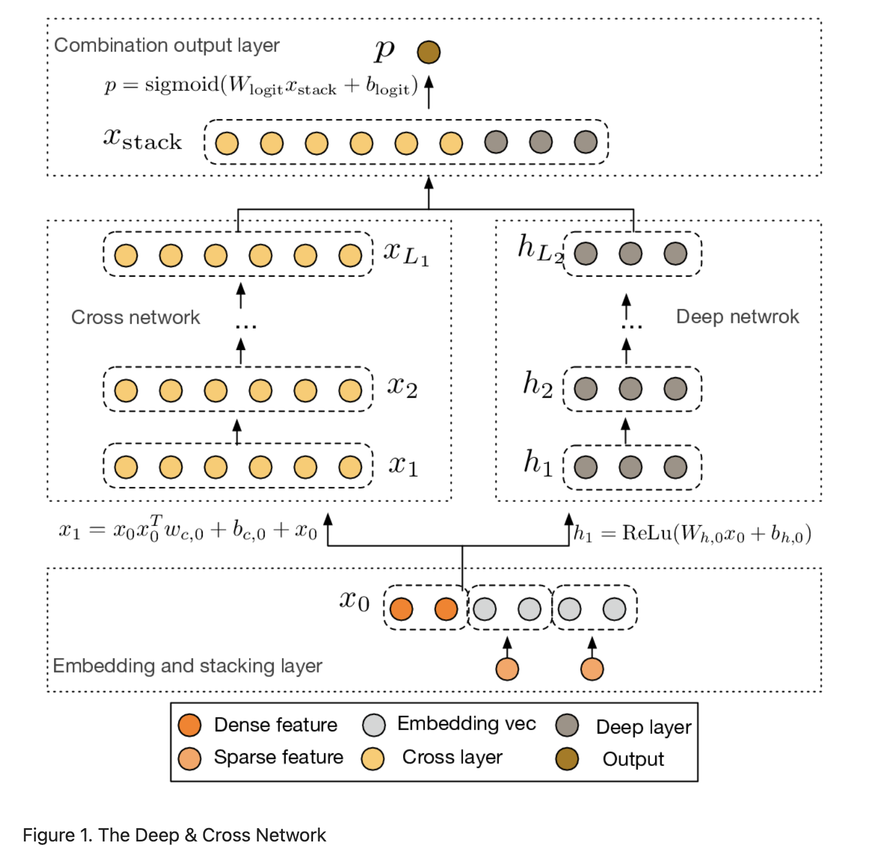
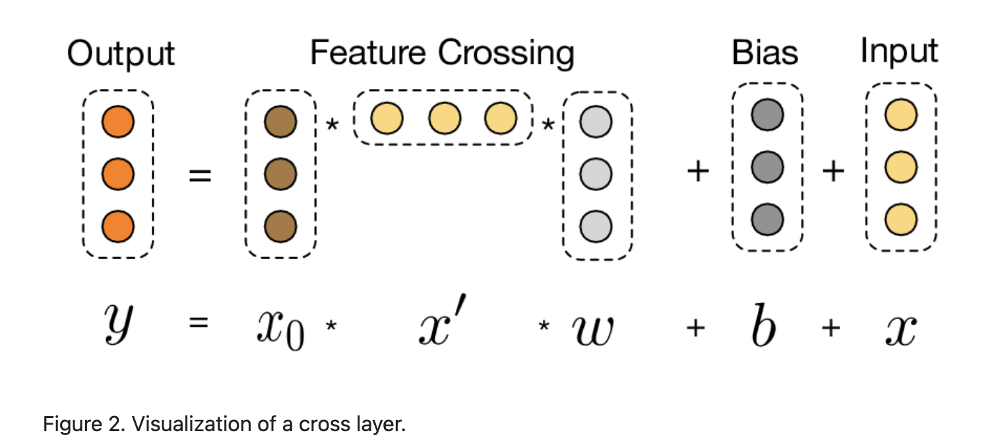

# Deep & Cross Network (DCN)

Published in 2017 by researchers from Stanford University and Google Inc., the **Deep & Cross Network (DCN)** is a foundational architecture for Click-Through Rate (CTR) prediction. It keeps the benefits of a standard Deep Neural Network (DNN) while introducing a novel **cross network** that explicitly learns bounded-degree feature interactions — with **no manual feature engineering** and **negligible extra parameters**.

> [!info] Core Thesis
> DNNs learn feature interactions *implicitly* and *inefficiently* — they require nearly an order of magnitude more parameters than necessary to form cross features. DCN's cross network learns these interactions *explicitly*, at a cost linear in input dimension $d$.

---

## 1. Motivation: The Cost of Implicit Feature Crossing

In Web-scale CTR prediction, identifying predictive **cross features** (e.g., `language=en × device=mobile`) is the key to accuracy. Three approaches dominate:

| Approach | Mechanism | Limitation |
| :--- | :--- | :--- |
| **Manual Engineering** | Domain experts hand-craft cross features for a linear model (e.g., [[Wide & Deep]]) | Exhaustive search; doesn't generalize to unseen interactions |
| **Factorization Machines (FM)** | Learn degree-2 interactions via inner products of per-feature embedding vectors | Shallow; limited to 2nd-order; higher-order FMs blow up in parameters |
| **Deep Neural Networks (DNN)** | Stack fully-connected layers with ReLU; interactions emerge implicitly | Requires ~$10\times$ more parameters than necessary; can't form cross features *explicitly* |

DCN's insight: **a DNN is a universal function approximator, but most functions of practical interest are low-degree polynomials.** We don't need a universal approximator — we need an efficient one for bounded-degree feature interactions.

---

## 2. Architecture

A DCN model starts with an **embedding and stacking layer**, followed by a **cross network** and a **deep network** in parallel, and ends with a **combination layer**.

### 2.1 Embedding and Stacking Layer

For categorical features (e.g., `country=usa`), one-hot encoding creates excessively high-dimensional vectors. DCN reduces these to dense **embedding vectors**:

$$\mathbf{x}_{\text{embed},i} = W_{\text{embed},i} \, \mathbf{x}_i$$

where $W_{\text{embed},i} \in \mathbb{R}^{n_e \times n_v}$ maps the $i$-th category's binary input to an $n_e$-dimensional embedding. These embeddings, along with the normalized dense features $\mathbf{x}_{\text{dense}}$, are stacked into a single vector:

$$\mathbf{x}_0 = \left[\mathbf{x}_{\text{embed},1}^T, \ldots, \mathbf{x}_{\text{embed},k}^T, \mathbf{x}_{\text{dense}}^T\right]^T$$

This $\mathbf{x}_0 \in \mathbb{R}^d$ is fed to both the cross and deep networks.

### 2.2 Cross Network

The cross network is the core innovation. It applies **explicit feature crossing** at each layer, with the highest polynomial degree determined by layer depth.

**Layer formula:**

$$\mathbf{x}_{l+1} = \mathbf{x}_0 \mathbf{x}_l^T \mathbf{w}_l + \mathbf{b}_l + \mathbf{x}_l = f(\mathbf{x}_l, \mathbf{w}_l, \mathbf{b}_l) + \mathbf{x}_l$$

where $\mathbf{x}_l, \mathbf{x}_{l+1} \in \mathbb{R}^d$ are layer outputs, and $\mathbf{w}_l, \mathbf{b}_l \in \mathbb{R}^d$ are the weight and bias.

**Three key design choices:**

1. **Residual connection** ($+\mathbf{x}_l$). The cross layer $f$ fits the *residual* of $\mathbf{x}_{l+1} - \mathbf{x}_l$. This preserves lower-degree terms from previous layers while adding new higher-degree ones — the identity path keeps information flowing in deep cross networks.
2. **Every layer reads the original input $\mathbf{x}_0$**, not the previous layer's output. This is the key design choice that drives polynomial degree accumulation: each layer multiplies the current state (which contains degree-$k$ terms) by the original input (degree 1), producing degree-$k{+}1$ terms.
3. **The weight is a vector, not a matrix** — $\mathbf{w}_l \in \mathbb{R}^d$. The outer product $\mathbf{x}_0 \mathbf{x}_l^T$ is rank-one, so we never materialize the $d \times d$ matrix. We compute $\mathbf{x}_0 \cdot (\mathbf{x}_l^T \mathbf{w}_l)$ — the inner product is a scalar, so the whole operation is just a scalar-times-vector. This is O($d$) time and memory, not O($d^2$).

**Parameter count:**

$$\text{Cross params} = d \times L_c \times 2 \quad \text{(one } \mathbf{w}_l \text{ and one } \mathbf{b}_l \text{ per layer)}$$

where $L_c$ is the number of cross layers. This is **linear in $d$** — essentially free relative to the deep component.

### 2.3 Deep Network

The deep network is a standard fully-connected feed-forward network:

$$\mathbf{h}_{l+1} = f(W_l \mathbf{h}_l + \mathbf{b}_l)$$

where $f(\cdot)$ is ReLU. For $L_d$ layers of equal size $m$:

$$\text{Deep params} = d \times m + m + (m^2 + m) \times (L_d - 1)$$

The deep network supplies the highly nonlinear, implicit representations that the parameter-light cross network cannot. The two are trained jointly so each is aware of the other during optimization.

### 2.4 Combination Layer

The combination layer concatenates the outputs from both networks and applies a standard logits layer:

$$p = \sigma\left([\mathbf{x}_{L_1}^T, \mathbf{h}_{L_2}^T] \, \mathbf{w}_{\text{logits}}\right)$$

The loss function is log loss with $L_2$ regularization:

$$\text{loss} = -\frac{1}{N}\sum_{i=1}^{N} y_i \log(p_i) + (1-y_i)\log(1-p_i) + \lambda \sum_l \|\mathbf{w}_l\|^2$$

---

## 3. Cross Network Analysis

The paper analyzes the cross network from three perspectives: polynomial approximation, generalization of FMs, and efficient projection.

### 3.1 Polynomial Approximation (Theorem 3.1)

> [!theorem] Theorem 3.1
> Consider an $l$-layer cross network with the $i{+}1$-th layer defined as $\mathbf{x}_{i+1} = \mathbf{x}_0 \mathbf{x}_i^T \mathbf{w}_i + \mathbf{x}_i$. The multivariate polynomial $g_l(\mathbf{x}_0) = \mathbf{x}_l^T \mathbf{w}_l$ reproduces polynomials in the class:
> $$\left\{\sum_{\boldsymbol{\alpha}} c_{\boldsymbol{\alpha}} x_1^{\alpha_1} x_2^{\alpha_2} \ldots x_d^{\alpha_d} \;\middle|\; 0 \leq |\boldsymbol{\alpha}| \leq l+1,\; \boldsymbol{\alpha} \in \mathbb{N}^d\right\}$$
> where $c_{\boldsymbol{\alpha}}$ is a function of the layer weights $\mathbf{w}_0, \ldots, \mathbf{w}_l$.

**What this means:** An $l$-layer cross network contains **all** cross terms (monomials) of degree from 1 to $l{+}1$. Each term's coefficient is distinct — a product of per-feature scalars from different layers. A generic polynomial of degree $n$ has $O(d^n)$ coefficients; the cross network packs all of those terms into just $O(d)$ parameters.

**Degree growth mechanism (worked example):**

Take $\mathbf{x}_0 = [x_1, x_2, x_3]^T$ and a 2-layer cross network (ignore biases).

**Layer 0 → 1:** Multiply current state by $\mathbf{x}_0$:
$$\mathbf{x}_1 = \mathbf{x}_0 (\mathbf{x}_0^T \mathbf{w}_0) + \mathbf{x}_0$$
First component:
$$\mathbf{x}_1[1] = w_0^{(1)} x_1^2 + w_0^{(2)} x_1 x_2 + w_0^{(3)} x_1 x_3 + x_1$$
→ **Degree ≤ 2** (1st from residual, 2nd from $\mathbf{x}_0 \cdot \mathbf{x}_0^T$)

**Layer 1 → 2:** Multiply again by $\mathbf{x}_0$:
$$\mathbf{x}_2 = \mathbf{x}_0 (\mathbf{x}_1^T \mathbf{w}_1) + \mathbf{x}_1$$
The scalar $\mathbf{x}_1^T \mathbf{w}_1$ contains degree-1 and degree-2 terms. Multiplying by $\mathbf{x}_0$ (degree 1) bumps each term's degree by 1. First component:
$$\mathbf{x}_2[1] = \underbrace{w_1^{(1)} w_0^{(1)} x_1^3}_{\text{degree 3}} + \underbrace{w_1^{(1)} w_0^{(2)} x_1^2 x_2}_{\text{degree 3}} + \ldots + \underbrace{w_1^{(2)} w_0^{(3)} x_1 x_2 x_3}_{\text{degree 3}} + \ldots$$
→ **Degree ≤ 3**

The pattern: **each cross layer multiplies the current state (degree $k$) by the original input $\mathbf{x}_0$ (degree 1), producing degree $k{+}1$ terms. The residual $+\mathbf{x}_l$ preserves all lower-degree terms.**

$$\boxed{\text{Layer } l \text{ output} \to \text{degree} \leq l+1}$$

### 3.2 Generalization of Factorization Machines

The cross network shares the **parameter-sharing** spirit of FM and extends it to a deeper structure.

| Model | Cross-term weight | Max degree | Params |
| :--- | :--- | :--- | :--- |
| **FM** | $\langle \mathbf{v}_i, \mathbf{v}_j \rangle$ | 2 | $O(kd)$ |
| **DCN** | products of per-feature scalars $\{w_k^{(i)}\}$ across layers | $l{+}1$ | $O(d \cdot L_c)$ |

In FM, feature $x_i$ is associated with a weight vector $\mathbf{v}_i$, and the weight of cross term $x_i x_j$ is $\langle \mathbf{v}_i, \mathbf{v}_j \rangle$. In DCN, $x_i$ is associated with scalars $\{w_k^{(i)}\}_{k=1}^l$, and the weight of $x_i x_j$ is the multiplications of parameters from the sets $\{w_k^{(i)}\}_{k=0}^l$ and $\{w_k^{(j)}\}_{k=0}^l$.

**Why parameter sharing generalizes:** If two binary features $x_i$ and $x_j$ rarely or never co-occur in training data, a model with independent per-pair weights would learn a meaningless weight for $x_i x_j$. With parameter sharing, the cross weight is derived from shared per-feature parameters — so even unseen interactions get a meaningful weight. This is the same principle that lets FM generalize to unseen feature interactions.

### 3.3 Efficient Projection

Each cross layer implicitly constructs all $d^2$ pairwise interactions between $\mathbf{x}_0$ and $\mathbf{x}_l$, then projects them back to dimension $d$.

The cross layer $\mathbf{x}_p = \mathbf{x}_0 \tilde{\mathbf{x}}^T \mathbf{w}$ is equivalent to:

$$\mathbf{x}_p^T = \begin{bmatrix} x_1\tilde{x}_1 \ldots x_1\tilde{x}_d & \ldots & x_d\tilde{x}_1 \ldots x_d\tilde{x}_d \end{bmatrix} \begin{bmatrix} \mathbf{w} & \mathbf{0} & \ldots & \mathbf{0} \\ \mathbf{0} & \mathbf{w} & \ldots & \mathbf{0} \\ \vdots & \vdots & \ddots & \vdots \\ \mathbf{0} & \mathbf{0} & \ldots & \mathbf{w} \end{bmatrix}$$

The row vector contains all $d^2$ pairwise interactions $x_i \tilde{x}_j$'s, and the projection matrix has a **block diagonal structure** with $\mathbf{w} \in \mathbb{R}^d$ as the repeated column vector.

**Why this is efficient:** A direct approach to computing all $d^2$ pairwise interactions and projecting them back would cost $O(d^2)$ time and memory. The rank-one structure of $\mathbf{x}_0 \mathbf{x}_l^T$ enables us to generate all cross terms without computing or storing the entire $d \times d$ matrix — reducing cost to **linear in $d$**.

---

## 4. Experimental Results

### 4.1 Criteo Display Ads Data

The Criteo dataset is for predicting ads CTR. It has 13 integer features and 26 categorical features with high cardinality. An improvement of 0.001 in logloss is considered practically significant. The data contains 11 GB of user logs from 7 days (~41 million records); the first 6 days were used for training, and day 7 was split into validation and test sets.

### 4.2 Implementation Details

- **Data processing and embedding:** Real-valued features normalized via log transform. Categorical features embedded in dense vectors of dimension $6 \times (\text{category cardinality})^{1/4}$. Concatenating all embeddings results in a vector of dimension 1026.
- **Optimization:** Mini-batch stochastic optimization with **Adam** optimizer. Batch size 512. **Batch normalization** applied to the deep network. Gradient clip norm set at 100.
- **Regularization:** Early stopping, as $L_2$ regularization and dropout were not found effective.
- **Hyperparameters:** Grid search over hidden layers (2–5), hidden layer sizes (32–1024), cross layers (1–6), and initial learning rate (0.0001–0.001). Early stopping at training step 150,000.

### 4.3 Model Performance

**Table 1. Best test logloss.** DCN: 2 deep layers of size 1024 + 6 cross layers.

| Model | DCN | DC | DNN | FM | LR |
| :--- | :--- | :--- | :--- | :--- | :--- |
| **Logloss** | **0.4419** | 0.4425 | 0.4428 | 0.4464 | 0.4474 |

Mean ± std of test logloss over 10 independent runs: DCN: $0.4422 \pm 9 \times 10^{-5}$, DNN: $0.4430 \pm 3.7 \times 10^{-4}$, DC: $0.4430 \pm 4.3 \times 10^{-4}$. DCN consistently outperforms other models.

**Table 2. #parameters needed to achieve a desired logloss.** DCN is nearly an order of magnitude more memory efficient than a single DNN.

| Logloss | 0.4430 | 0.4460 | 0.4470 | 0.4480 |
| :--- | :--- | :--- | :--- | :--- |
| DNN | $3.2 \times 10^6$ | $1.5 \times 10^5$ | $1.5 \times 10^5$ | $7.8 \times 10^4$ |
| DCN | $\mathbf{7.9 \times 10^5}$ | $\mathbf{7.3 \times 10^4}$ | $\mathbf{3.7 \times 10^4}$ | $\mathbf{3.7 \times 10^4}$ |

**Table 3. Best logloss achieved with various memory budgets.** DCN consistently outperforms DNN at every budget.

| #Params | $5 \times 10^4$ | $1 \times 10^5$ | $4 \times 10^5$ | $1.1 \times 10^6$ | $2.5 \times 10^6$ |
| :--- | :--- | :--- | :--- | :--- | :--- |
| DNN | 0.4480 | 0.4471 | 0.4439 | 0.4433 | 0.4431 |
| DCN | **0.4465** | **0.4453** | **0.4432** | **0.4426** | **0.4423** |

### 4.4 Non-CTR Datasets

DCN also performs well on non-CTR prediction problems (forest covertype and Higgs from UCI):

- **Forest covertype:** DCN achieved best test accuracy 0.9740 with least memory consumption. DNN and DC both achieved 0.9737.
- **Higgs:** DCN achieved best test logloss 0.4494, whereas DNN achieved 0.4506. DCN outperforms DNN with half the memory.

---

## 5. Key Takeaways

1. **Explicit > Implicit for bounded-degree interactions.** The cross network learns explicit cross features of bounded degree, more efficiently than a DNN that learns them implicitly.
2. **Depth = degree.** The highest polynomial degree increases by one at each cross layer: an $l$-layer cross network produces all cross terms of degree 1 to $l{+}1$.
3. **Rank-one trick = linear cost.** The cross layer never materializes the $d \times d$ outer product. It computes $\mathbf{x}_0 \cdot (\mathbf{x}_l^T \mathbf{w}_l)$ — a scalar-times-vector — in $O(d)$ time and memory.
4. **Parameter sharing generalizes to unseen interactions.** The cross weight is derived from shared per-feature parameters, so even unseen interactions get a meaningful weight (same principle as FM).
5. **Nearly an order of magnitude more memory efficient than DNN** for the same logloss, thanks to the cross network's ability to learn bounded-degree feature interactions more efficiently.

---

## Related Wiki Pages
* [[DCN]]: Detailed architectural entity specification of the DCN model.
* [[CTRL Summary]]: CTRL uses DCN as one of its lightweight collaborative encoder backbones.
* [[RankMixer Summary]]: ByteDance's GPU-friendly ranking architecture that addresses the memory-bound bottleneck of traditional DLRMs like DCN.
* [[Residual Connections]]: The cross layer's $+\mathbf{x}_l$ is a residual connection that preserves lower-degree terms.
