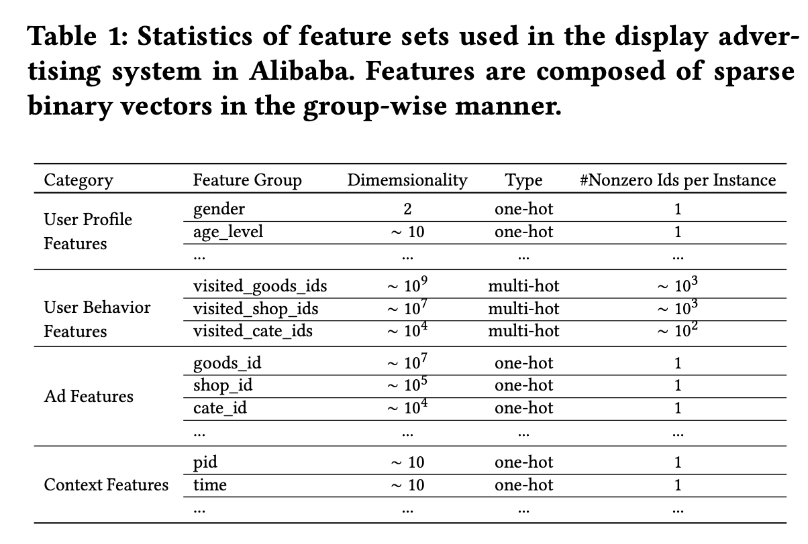
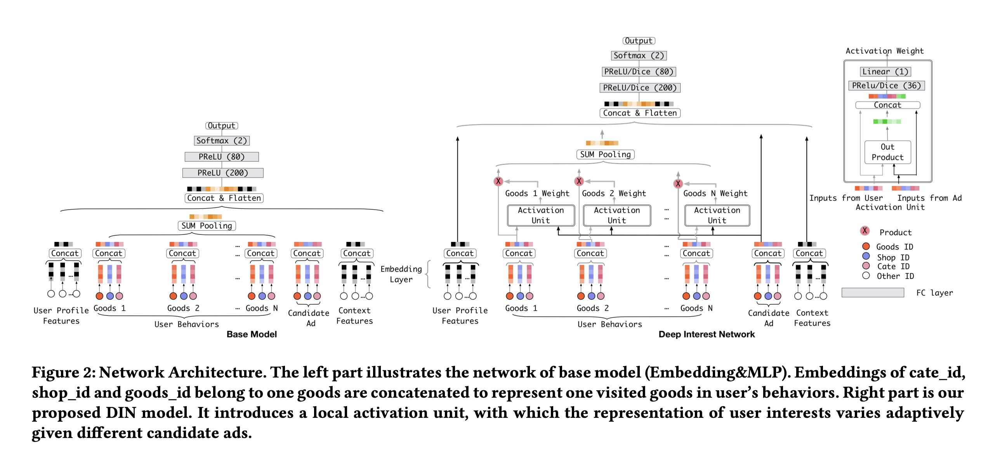
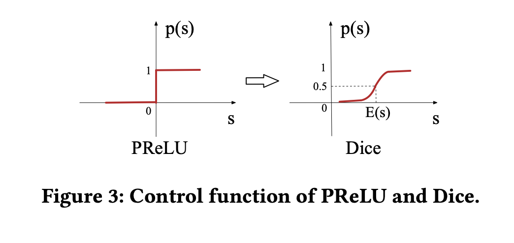

# Deep Interest Network (DIN)

Published at KDD 2018 by researchers from Alibaba Group, the **Deep Interest Network (DIN)** is a landmark architecture for Click-Through Rate (CTR) prediction in display advertising. It identifies the **fixed-length vector bottleneck** in the standard Embedding&MLP paradigm and solves it by introducing a **local activation unit** that adaptively computes user interest representations **with respect to each candidate ad**. DIN also contributes two industrial training techniques: **mini-batch aware regularization** and the **Dice activation function**.

> [!info] Core Thesis
> Compressing all of a user's diverse interests into a single fixed-length vector — regardless of the candidate ad — is a fundamental representational bottleneck. Only part of a user's interests are relevant to any given click. DIN adaptively activates the relevant parts of user behavior history for each candidate ad, producing a user representation that **varies across ads**.

---

## 1. Motivation: The Fixed-Length Vector Bottleneck

The standard Embedding&MLP paradigm for CTR prediction works as follows:

1. Map sparse categorical features to dense embeddings
2. Pool multi-hot behavior features (e.g., visited goods IDs) into a **fixed-length** vector via sum/average pooling
3. Concatenate all feature vectors and feed into an MLP

**The problem:** Step 2 compresses *all* of a user's diverse interests into the **same vector**, regardless of what ad is being scored. A young mother who browsed woolen coats, earrings, tote bags, and children's coats gets one fixed representation — whether the candidate is a handbag or a phone.

**Why not just make the vector bigger?** Expanding the embedding dimension dramatically increases parameters, aggravates overfitting under limited data, and adds computation/storage burden that industrial systems cannot tolerate.

**The key insight:** Only part of a user's interests influence any given click action. A swimmer clicks goggles because of the bathing suit purchase, not the shoes. User interests are **diverse** and **locally activated** by the candidate ad.

---

## 2. Feature Representation

Industrial CTR data is **multi-group categorical**. Each instance is a concatenation of feature groups, where each group is a sparse binary vector $\mathbf{t}_i \in \mathbb{R}^{K_i}$ ($K_i$ = number of unique IDs in that group):

$$\mathbf{x} = [\mathbf{t}_1^T, \mathbf{t}_2^T, \ldots, \mathbf{t}_M^T]^T$$

Two encoding types within each group:
- **One-hot** ($k=1$): exactly one element is 1 — e.g., `gender=Female`
- **Multi-hot** ($k>1$): multiple elements are 1 — e.g., `visited_cate_ids={Bag, Book}`

### Concrete Encoding Example

A single training instance with 4 feature groups:

```
[weekday=Friday, gender=Female, visited_cate_ids={Bag, Book}, ad_cate_id=Book]
```

Encoded as concatenated binary vectors:

```
[0,0,0,0,1,0,0]   [0,1]   [0,..,1,..,1,..,0]   [0,..,1,..,0]
 weekday=Friday     Female   visited={Bag,Book}    ad_cate=Book
 (K₁=7, k=1)       (K₂=2)   (K₃≈10⁴, k=2)        (K₄≈10⁴, k=1)
 one-hot            one-hot  multi-hot             one-hot
```

Each group $i$ has its own dictionary size $K_i$, and $\sum_j \mathbf{t}_i[j] = k$ where $k=1$ for one-hot, $k>1$ for multi-hot.



### Four Feature Categories (Alibaba's system)

| Category | Examples | Type | Scale |
| :--- | :--- | :--- | :--- |
| **User Profile** | gender, age_level | one-hot | small |
| **User Behavior** | visited_goods_ids, visited_shop_ids, visited_cate_ids | **multi-hot** | up to $\sim 10^9$ unique IDs, $\sim 10^3$ nonzero per instance |
| **Ad** | goods_id, shop_id, cate_id | one-hot | $\sim 10^7$ unique goods |
| **Context** | pid (placement), time | one-hot | small |

**Key points:**
- User behavior features are the critically important ones — multi-hot, variable-length lists carrying rich interest signal
- **No handcrafted combination features** — all feature interaction is learned by the deep network

---

## 3. Base Model (Embedding&MLP)

The base model follows the paradigm shared by most deep CTR models (Deep Crossing, Wide&Deep, YouTube DNN).

### 3.1 Embedding Layer

Each sparse binary feature group $\mathbf{t}_i$ has its own embedding dictionary $\mathrm{W}^i \in \mathbb{R}^{D \times K_i}$:
- **One-hot:** lookup returns a **single vector** $\mathbf{e}_i = w_j^i$
- **Multi-hot:** lookup returns a **list of vectors** $\{\mathbf{e}_{i_1}, \mathbf{e}_{i_2}, \ldots, \mathbf{e}_{i_k}\}$ — one per nonzero element

**One-hot vs. multi-hot lookup contrast:**

| Feature group | Encoding | Lookup result | Pooling needed? |
| :--- | :--- | :--- | :--- |
| `gender=Female` | one-hot ($k=1$) | single vector $\mathbf{e}_i = w_j^i$ | No |
| `visited_goods_ids={A,B,C}` | multi-hot ($k=3$) | list $\{\mathbf{e}_A, \mathbf{e}_B, \mathbf{e}_C\}$ | **Yes** |

One-hot groups produce exactly one embedding vector — no pooling needed. Multi-hot behavior groups produce a variable-length list — pooling (or DIN's weighted pooling) is required.

### 3.2 Pooling Layer — The Bottleneck

Different users have different numbers of behaviors, so the embedding list is variable-length. MLPs require fixed-length input, so pooling compresses the list:

$$\mathbf{e}_i = \text{pooling}(\mathbf{e}_{i_1}, \mathbf{e}_{i_2}, \ldots, \mathbf{e}_{i_k})$$

Standard choices are **sum pooling** and **average pooling**. The result is the **same vector for every candidate ad** — all behaviors contribute equally, and diverse interests are flattened into a single point.

**Why this is problematic:**

- **All behaviors contribute equally** — `tote_bag` and `childrens_coat` have the same weight regardless of whether the candidate ad is a handbag or a phone
- **Information is destroyed** — averaging "bags" with "kids clothing" produces a blurry vector that represents neither well
- **The result is identical for every candidate ad** — the model has no way to say "for this particular ad, focus on the bag-related behaviors"

**Concrete example — two users, same ad:**

**User A** (young mother, diverse interests): `visited_goods_ids={woolen_coat, T-shirt, earrings, tote_bag, leather_handbag, childrens_coat}` — 6 nonzero entries covering Clothing, Accessories, Bags, and Kids categories.

**User B** (electronics enthusiast): `visited_goods_ids={mechanical_keyboard, USB_hub, laptop_stand}` — 3 nonzero entries, all Electronics.

Both see the same candidate ad: `new_handbag` (cate_id=Bags). In the base model, User A's diverse interests get averaged into a blurry mix — the handbag signal is diluted by kids' coats. DIN instead weights `tote_bag` and `leather_handbag` highly and suppresses `childrens_coat`.

**Concrete example — same user, different ads:**

Take User A again with two different candidate ads:

| Candidate Ad | Relevant behaviors | Irrelevant behaviors |
| :--- | :--- | :--- |
| `new_handbag` | tote_bag, leather_handbag | woolen_coat, childrens_coat |
| `running_shoes` | T-shirt | earrings, tote_bag, leather_handbag |

- **Base model:** Same pooled user vector for both ads. The handbag signal is diluted by kids' coats; the shoe signal is diluted by handbags.
- **DIN:** For the handbag ad, `tote_bag` and `leather_handbag` get high activation weights → user vector is dominated by "bag interest." For the shoe ad, `T-shirt` gets the high weight → user vector shifts to "sportswear interest."

The user representation $\mathbf{v}_U(A)$ **varies with the ad** — that is the entire point of DIN.

### 3.3 MLP and Loss

All pooled vectors are concatenated and fed into fully connected layers. Training uses negative log-likelihood:

$$L = -\frac{1}{N}\sum_{(\mathbf{x},y) \in \mathcal{S}} \left[ y \log p(\mathbf{x}) + (1-y)\log(1-p(\mathbf{x})) \right]$$

---

## 4. Deep Interest Network Architecture

DIN keeps the base model's structure identical — embedding, concat, MLP, loss — and changes **only one thing**: it replaces ad-agnostic pooling on user behavior features with a **local activation unit**.



### 4.1 Local Activation Unit

Given a candidate ad $A$ with embedding $\mathbf{v}_A$ and the user's behavior embeddings $\{\mathbf{e}_1, \mathbf{e}_2, \ldots, \mathbf{e}_H\}$:

$$\mathbf{v}_U(A) = \sum_{j=1}^{H} a(\mathbf{e}_j, \mathbf{v}_A) \cdot \mathbf{e}_j = \sum_{j=1}^{H} w_j \cdot \mathbf{e}_j$$

The activation function $a(\cdot)$ is a small feed-forward network taking:
- The behavior embedding $\mathbf{e}_j$
- The ad embedding $\mathbf{v}_A$
- Their **outer product** $\mathbf{e}_j \otimes \mathbf{v}_A$ (explicit relevance signal)

It outputs a scalar weight $w_j$ — how relevant is this behavior to this ad.

### 4.2 Key Difference from Standard Attention

**Softmax normalization is deliberately removed.** In standard attention, $\sum w_i = 1$. DIN drops this:

- With softmax, a user whose history is 90% clothes and 10% electronics would get normalized weight distributions for both a T-shirt ad and a phone ad — the model loses the signal that overall interest in clothes is much stronger.
- Without softmax, $\sum w_i$ approximates **interest intensity**. The T-shirt ad activates many behaviors → large $\|\mathbf{v}_U\|$. The phone ad activates few → small $\|\mathbf{v}_U\|$. This magnitude difference is meaningful and preserved.

### 4.3 Negative Result: LSTM Doesn't Help

The authors tried modeling behavior sequences with LSTM. **It didn't work.** Their explanation: unlike text (which has grammatical structure), user behavior sequences contain **multiple concurrent interests** with rapid jumping and sudden endings. The sequence is noisy. (This was later addressed by DIEN, the follow-up paper.)

---

## 5. Training Techniques

### 5.1 Mini-batch Aware Regularization

**The problem:** With `goods_id` features at 0.6 billion unique IDs, the embedding dictionary $\mathrm{W} \in \mathbb{R}^{D \times K}$ dominates the parameter count. Standard L2 regularization requires computing $\|\mathrm{W}\|_2^2$ over **all $K$ parameters** for **every mini-batch** — infeasible at industrial scale.

**Without regularization:** models with fine-grained features overfit catastrophically after the first epoch.

**The derivation (3 steps):**

**Step 1:** Expand L2 over samples instead of parameters:

$$L_2(\mathrm{W}) = \sum_{(\mathbf{x},y) \in \mathcal{S}} \sum_{j=1}^{K} \frac{I(\mathbf{x}_j \neq 0)}{n_j} \|\mathbf{w}_j\|_2^2$$

where $I(\mathbf{x}_j \neq 0)$ indicates if instance $\mathbf{x}$ contains feature $j$, and $n_j$ is the total occurrence count of feature $j$ in all samples. The $\frac{1}{n_j}$ corrects for frequent features being counted many times.

**Step 2:** Split into mini-batches:

$$L_2(\mathrm{W}) = \sum_{j=1}^{K} \sum_{m=1}^{B} \sum_{(\mathbf{x},y) \in \mathcal{B}_m} \frac{I(\mathbf{x}_j \neq 0)}{n_j} \|\mathbf{w}_j\|_2^2$$

**Step 3:** Approximate with a per-batch indicator:

$$\alpha_{mj} = \max_{(\mathbf{x},y) \in \mathcal{B}_m} I(\mathbf{x}_j \neq 0)$$

$$L_2(\mathrm{W}) \approx \sum_{j=1}^{K} \sum_{m=1}^{B} \frac{\alpha_{mj}}{n_j} \|\mathbf{w}_j\|_2^2$$

**Resulting gradient update** for mini-batch $\mathcal{B}_m$:

$$\mathbf{w}_j \leftarrow \mathbf{w}_j - \eta \left[ \frac{1}{|\mathcal{B}_m|} \sum_{(\mathbf{x},y) \in \mathcal{B}_m} \frac{\partial L}{\partial \mathbf{w}_j} + \lambda \frac{\alpha_{mj}}{n_j} \mathbf{w}_j \right]$$

**Only features appearing in the current mini-batch get regularized.** If feature $j$ doesn't appear, $\alpha_{mj} = 0$ and there is no regularization gradient — matching the fact that there's no task gradient either.

**Concrete scale example:** In a mini-batch of 32 samples, perhaps 5,000 unique feature IDs appear (out of billions). Standard L2 would need to compute $\|\mathbf{w}_j\|^2$ for all billions of rows. MBA only touches those same 5,000 rows — no gradient, no regularization for anything else. Every feature gets regularized eventually (since it will appear in *some* batch), and the $\frac{1}{n_j}$ weighting corrects for frequency differences.

**Why $\frac{1}{n_j}$ weighting matters:** Frequent features (large $n_j$) get a smaller per-batch penalty — they already receive frequent gradient updates. Rare features (small $n_j$) get a larger relative penalty — they are most prone to overfitting.

### 5.2 Dice Activation Function

**Starting point: PReLU.**

$$f(s) = \begin{cases} s & \text{if } s > 0 \\ \alpha s & \text{if } s \leq 0 \end{cases}$$

Rewritten using a **control function** $p(s) = I(s > 0)$:

$$f(s) = p(s) \cdot s + (1 - p(s)) \cdot \alpha s$$

Think of it as a **switch between two channels**: the identity channel $f(s) = s$ and the leaky channel $f(s) = \alpha s$. The control function $p(s)$ decides which channel is active. The rectification point is fixed at 0 regardless of the input distribution.

**The problem:** In industrial networks, different layers have inputs with very different distributions. A fixed rectification point at 0 may be inappropriate.

**Dice: Data-Adaptive Control.** Dice replaces the hard indicator with a smooth sigmoid whose rectification point adapts to the input distribution:

$$p(s) = \frac{1}{1 + e^{-\frac{s - E[s]}{\sqrt{Var[s] + \epsilon}}}}$$

$$f(s) = p(s) \cdot s + (1 - p(s)) \cdot \alpha s$$



**Visual intuition:**

```
PReLU control function:          Dice control function:
                                 
p(s) │                           p(s) │
  1  │───────                      1  │    ╭───────
     │                               │   ╱
  0  │       ───────               0  │──╯
     └───────┬─────── s              └──────┼────── s
             0                            E[s]
     (hard step at 0)              (smooth sigmoid at mean)
```

**Key changes:**
1. **Rectification point moves to the mean** $E[s]$ instead of being fixed at 0
2. **Smooth transition** instead of a hard switch — the sigmoid creates a gradual blend, with steepness controlled by $Var[s]$
3. **Batch statistics:** During training, $E[s]$ and $Var[s]$ are computed per mini-batch (like batch normalization). During testing, they use **moving averages**.

**Relationship to PReLU:** Dice is a **generalization** of PReLU. When $E[s] = 0$ and $Var[s] = 0$, the sigmoid collapses to a step function at 0, and Dice degenerates exactly into PReLU.

---

## 6. Experimental Results

### 6.1 Datasets

| Dataset | Users | Goods | Categories | Samples |
| :--- | :--- | :--- | :--- | :--- |
| Amazon (Electronics) | 192,403 | 63,001 | 801 | 1,689,188 |
| MovieLens | 138,493 | 27,278 | 21 | 20,000,263 |
| Alibaba | 60 million | 0.6 billion | 100,000 | 2.14 billion |

### 6.2 Metrics

**User-weighted AUC** (more relevant to online performance in display advertising):

$$\text{AUC} = \frac{\sum_{i=1}^{n} \#\text{impression}_i \times \text{AUC}_i}{\sum_{i=1}^{n} \#\text{impression}_i}$$

**RelaImpr** (relative improvement over base model, where random guesser = 0.5):

$$\text{RelaImpr} = \left( \frac{\text{AUC}(\text{model}) - 0.5}{\text{AUC}(\text{base}) - 0.5} - 1 \right) \times 100\%$$

### 6.3 Public Dataset Results

| Model | MovieLens AUC | RelaImpr | Amazon AUC | RelaImpr |
| :--- | :--- | :--- | :--- | :--- |
| LR | 0.7263 | -1.61% | 0.7742 | -24.34% |
| BaseModel | 0.7300 | 0.00% | 0.8624 | 0.00% |
| Wide&Deep | 0.7304 | 0.17% | 0.8637 | 0.36% |
| PNN | 0.7321 | 0.91% | 0.8679 | 1.52% |
| DeepFM | 0.7324 | 1.04% | 0.8683 | 1.63% |
| **DIN** | **0.7337** | **1.61%** | **0.8818** | **5.35%** |
| **DIN + Dice** | **0.7348** | **2.09%** | **0.8871** | **6.82%** |

DIN's advantage is especially pronounced on Amazon, which has richer user behaviors — validating the local activation unit design.

### 6.4 Regularization Comparison (Alibaba Dataset)

| Regularization | AUC | RelaImpr |
| :--- | :--- | :--- |
| Without `goods_ids` feature | 0.5940 | baseline |
| With `goods_ids`, no regularization | 0.5959 | +2.02% |
| With `goods_ids` + Dropout | 0.5970 | +3.19% |
| With `goods_ids` + Frequency Filter | 0.5983 | +4.57% |
| With `goods_ids` + DiFacto | 0.5954 | +1.49% |
| With `goods_ids` + **MBA** | **0.6031** | **+9.68%** |

MBA regularization roughly doubles the improvement of the next-best method, enabling the model to benefit from fine-grained `goods_id` features (0.6 billion unique IDs) without overfitting.

### 6.5 Alibaba Dataset Results (Full Features)

| Model | AUC | RelaImpr |
| :--- | :--- | :--- |
| LR | 0.5738 | -23.92% |
| BaseModel | 0.5970 | 0.00% |
| Wide&Deep | 0.5977 | 0.72% |
| PNN | 0.5983 | 1.34% |
| DeepFM | 0.5993 | 2.37% |
| DIN | 0.6029 | 6.08% |
| DIN + MBA Reg. | 0.6060 | 9.28% |
| DIN + Dice | 0.6044 | 7.63% |
| **DIN + MBA + Dice** | **0.6083** | **11.65%** |

At Alibaba scale, **0.001 absolute AUC gain is considered significant** and worthy of deployment. DIN's total +0.0113 AUC gain over BaseModel is a major improvement.

### 6.6 Online A/B Testing

From May–June 2017, DIN (with MBA regularization and Dice) achieved:
- **+10.0% CTR** improvement
- **+3.8% RPM** (Revenue Per Mille) improvement

DIN was deployed to serve main traffic in Alibaba's display advertising system.

---

## 7. Key Takeaways

1. **Fixed-length vectors are a bottleneck for diverse interests.** Compressing all behaviors into one vector, regardless of the candidate ad, loses critical information.
2. **Local activation > global pooling.** DIN's activation unit soft-searches behavior history and weights by relevance to the specific candidate ad — the user representation varies per ad.
3. **Drop softmax normalization to preserve interest intensity.** The unnormalized $\sum w_i$ approximates how strongly the user's interests are activated.
4. **Mini-batch aware regularization makes L2 feasible at industrial scale.** Only regularize features that appear in the current mini-batch, weighted by inverse frequency.
5. **Dice adapts the activation function to the data distribution.** The rectification point moves to the input mean, smoothly blending between PReLU's two channels.
6. **LSTM doesn't help for behavior sequences.** User interests jump concurrently, unlike grammatical text. (Later addressed by DIEN.)

---

## Related Wiki Pages
* [[DIN]]: Detailed architectural entity specification of the DIN model.
* [[DCN Summary]]: Another foundational CTR architecture using explicit feature crossing instead of attention.
* [[NCF Summary]]: Neural Collaborative Filtering, learning user-item interaction functions with neural networks.
* [[DSSM Summary]]: Deep Structured Semantic Model, projecting queries and documents into shared semantic space.
* [[Douyin STCA Summary]]: ByteDance's long-sequence recommendation system, a successor direction to DIN's attention mechanism.
* [[HSTU]]: Meta's Generative Recommenders, another successor addressing sequential user behavior modeling.
