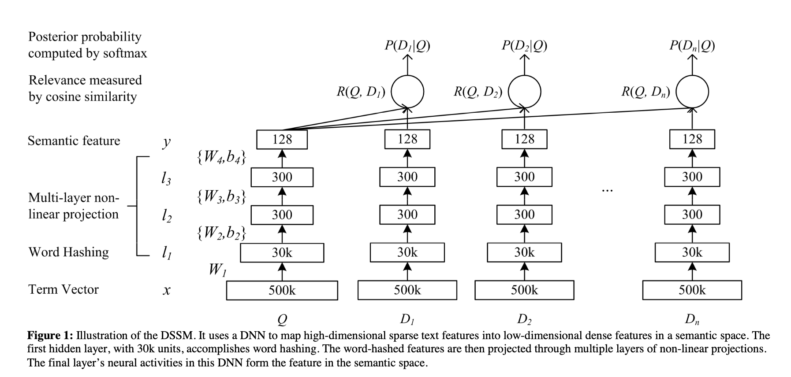

# Deep Structured Semantic Models (DSSM)

Published in 2013 (CIKM) by Po-Sen Huang (UIUC) and Xiaodong He, Jianfeng Gao, Li Deng, Alex Acero, and Larry Heck (Microsoft Research), the **Deep Structured Semantic Model (DSSM)** is a foundational architecture for **learning semantic representations for web search**. It uses a deep neural network to project queries and documents into a common low-dimensional semantic space, where relevance is computed as cosine similarity — so a query and document can match even when they share **zero terms**.

> [!info] Core Thesis
> Lexical (keyword) matching fails when a concept is expressed with different vocabularies in queries and documents. DSSM bridges this "language discrepancy" by learning a **discriminative, deep, non-linear projection** into a shared semantic space, trained on **clickthrough data** to directly optimize for document ranking.

---

## 1. Motivation: Why Lexical and Prior Semantic Models Fall Short

Modern search engines retrieve documents mainly by **keyword matching**, which is inaccurate because a concept is often expressed using different vocabularies and language styles in documents and queries. Prior approaches to bridge this gap each have a key limitation:

| Approach | Mechanism | Limitation |
| :--- | :--- | :--- |
| **Lexical matching** (TF-IDF, BM25) | Match keywords in documents and queries | Cannot match semantically related but lexically different terms |
| **Latent Semantic Models** (LSA, PLSA, LDA) | Map query/doc to a low-dim semantic space via linear projection or topic modeling | Trained **unsupervised**; objective only loosely coupled with the ranking metric |
| **Clickthrough-trained models** (BLTM, DPM) | Exploit clicked query-doc pairs for supervised semantic modeling | BLTM maximizes log-likelihood (sub-optimal for ranking); DPM involves large matrix multiplications that **force aggressive vocabulary pruning** |
| **Deep auto-encoders** (Semantic Hashing) | Extract hierarchical semantic structure via deep learning | Trained **unsupervised** for reconstruction, not for differentiating relevant docs; also face the **scalability challenge** of large vocabularies |

DSSM extends both research lines: it uses **deep learning** for semantic modeling (like the auto-encoder) but trains **discriminatively on clickthrough data** (like DPM), and it introduces **word hashing** to handle the large vocabularies that prior deep methods could not.

---

## 2. Architecture

The DSSM uses a DNN to map high-dimensional sparse text features into low-dimensional dense semantic features. The relevance of a document given a query is the cosine similarity between their semantic vectors.



*Figure 1: The DSSM uses a DNN to map high-dimensional sparse text features into low-dimensional dense features in a semantic space. The first hidden layer (30k units) accomplishes word hashing. The word-hashed features are projected through multiple non-linear layers; the final layer's activations form the semantic feature.*

### 2.1 DNN for Computing Semantic Features

The input is a high-dimensional **term vector** — raw counts of terms in a query or document (no normalization). The output is a **concept vector** in a low-dimensional semantic space.

**Formal definition.** Denote $x$ as the input term vector, $y$ as the output vector, $l_i$ ($i = 1, \dots, N-1$) the intermediate hidden layers, $W_i$ the $i$-th weight matrix, and $b_i$ the $i$-th bias:

$$l_1 = W_1 x$$
$$l_i = f(W_i l_{i-1} + b_i), \quad i = 2, \dots, N-1$$
$$y = f(W_N l_{N-1} + b_N)$$

**Activation function.** Uses **tanh** at both the output and hidden layers:

$$f(x) = \frac{1 - e^{-2x}}{1 + e^{-2x}}$$

**Relevance scoring.** The semantic relevance between a query $Q$ and a document $D$ is the **cosine similarity** of their concept vectors $y_Q$ and $y_D$:

$$R(Q, D) = \text{cosine}(y_Q, y_D) = \frac{y_Q^T y_D}{\|y_Q\| \|y_D\|}$$

In web search, given a query, documents are sorted by their semantic relevance scores.

**The vocabulary problem.** The term vector size equals the vocabulary size used to index the document collection — usually **very large** in real web search. Using such a vector directly as input makes the input layer **unmanageable for inference and training**. This motivates **word hashing** (Section 2.2), which occupies the first hidden layer and consists of **linear hidden units whose weight matrix is fixed (not learned)**.

### 2.2 Word Hashing

Word hashing reduces the dimensionality of the bag-of-words term vectors using **letter n-grams**. It is a fixed, non-adaptive linear transformation.

**Procedure (3 steps),** given a word (e.g., `good`):

1. **Add word boundary markers:** `good` → `#good#`
2. **Break into letter n-grams** (letter trigrams): `#good#` → `#go, goo, ood, od#`
3. **Represent the word as a vector of letter n-grams** (a sparse bag-of-trigrams).

**How the vector is composed (worked example).** Each dimension of the word-hashed vector indexes **one distinct letter trigram** in the corpus-wide trigram vocabulary; the value at that dimension is the **count** of that trigram. Suppose the trigram vocabulary (a tiny subset) is:

```
index 0: #go    index 3: od#    index 6: at#
index 1: goo    index 4: #ca    index 7: #do
index 2: ood    index 5: cat    index 8: dog
```

The word `good` → `#good#` → trigrams `#go, goo, ood, od#` lights up indices 0–3:

```
       #go  goo  ood  od#  #ca  cat  at#  #do  dog
good    1    1    1    1    0    0    0    0    0
cat     0    0    0    0    1    1    1    0    0   (#cat# → #ca, cat, at#)
```

A full query/document vector is the **sum of the trigram vectors of all its words** — i.e., a bag-of-trigrams over the whole text. Because the input is a raw term-count vector and word hashing is a fixed linear transform, a word appearing **twice** contributes a count of 2 to each of its trigram positions. Morphological variants (e.g., `good`/`goods`) share most trigrams (`#go, goo, ood`), so they land at **nearby points** in trigram space.

**Dimensionality reduction.** The number of distinct letter n-grams in English is bounded, unlike the (unlimited) number of words. From Table 1:

| Vocabulary size | Letter-bigram size (collisions) | Letter-trigram size (collisions) |
| :--- | :--- | :--- |
| 40K words | 1,107 (18) | 10,306 (2) |
| 500K words | 1,607 (1,192) | 30,621 (22) |

A **500K-word vocabulary** becomes a **30,621-dim** letter-trigram vector — a **16-fold reduction** — with a negligible collision rate of **0.0044%** (22/500,000).

**Key benefits:**
- **Morphological robustness:** variants of the same word (e.g., `good`/`goods`) map to nearby points in letter n-gram space because they share most trigrams.
- **Out-of-vocabulary (OOV) robustness:** a word unseen in training is still representable as letter n-grams — the only risk is a minor collision.
- **Scalability:** enables discriminative DNN training on web-scale vocabularies.

**The catch — collisions.** Two different words can map to the same letter n-gram vector, but the rate is negligible (0.0044% at 500K vocab with trigrams).

> [!note] Word Hashing is still Bag-of-Words
> Word hashing is a **variant of bag-of-words** — just at the character n-gram level. Each dimension of the vector indexes one distinct letter trigram (e.g., `#goo`), and the value is the count of that trigram. It carries **no sequential/order signal**: word order and cross-word collocation structure are entirely discarded. The "semantic" gains of DSSM come from the **learned deep projection + click supervision**, not from any sequence modeling.

### 2.3 Learning the DSSM (Discriminative Training on Clickthrough Data)

The clickthrough logs consist of queries and their clicked documents. The key assumption: **a query is relevant (at least partially) to the documents clicked for it.**

**Softmax posterior over candidates.** The posterior probability of a document given a query is computed from the semantic relevance score via a softmax:

$$P(D|Q) = \frac{\exp(\gamma R(Q, D))}{\sum_{D' \in \mathbb{D}} \exp(\gamma R(Q, D'))}$$

where $\gamma$ is a smoothing factor (set empirically on held-out data) and $\mathbb{D}$ is the set of candidate documents to be ranked.

**Negative sampling.** Ideally $\mathbb{D}$ contains all possible documents. In practice, for each (query, clicked-document) pair $(Q, D^+)$, $\mathbb{D}$ is approximated by $D^+$ plus **four randomly selected unclicked documents** $\{D_j^-; j = 1, \dots, 4\}$. (Different sampling strategies for unclicked documents made no significant difference in pilot studies.)

**Loss function.** Model parameters (weight matrices $W_i$ and biases $b_i$) are trained to **maximize the likelihood of clicked documents given queries** — equivalently, minimize:

$$L(\Lambda) = -\log \prod_{(Q, D^+)} P(D^+|Q)$$

where $\Lambda = \{W_i, b_i\}$. Since $L(\Lambda)$ is differentiable w.r.t. $\Lambda$, the model is trained with gradient-based optimization.

### 2.4 Implementation Details

- **Architecture:** three hidden layers. First hidden layer = word hashing (~30K nodes, matching the letter-trigram size). Next two hidden layers = 300 nodes each. Output layer = 128 nodes.
- **Word hashing** uses a fixed projection matrix (non-learned linear transform).
- **Similarity** is computed on the 128-dim output layer.
- **Weight initialization:** uniform in $\left[-\sqrt{6/(fan_{in} + fan_{out})}, +\sqrt{6/(fan_{in} + fan_{out})}\right]$. Layer-wise pre-training gave no observed benefit.
- **Optimization:** mini-batch SGD, batch size 1024; converges within ~20 epochs over the training data.
- **Training/validation split:** clickthrough data divided into non-overlapping training and validation sets; hyperparameters tuned on validation.

---

## 3. Experiments

### 3.1 Data Sets and Evaluation Methodology

- **Evaluation set:** 16,510 English queries sampled from one year of a commercial search engine's query logs. Each query has ~15 documents (URLs) on average. Each query-title pair has a **human-generated relevance label on a 5-level scale (0–4)**, used only for evaluation.
- **Preprocessing:** white-space tokenized, lowercased; numbers retained; **no stemming/inflection**.
- **Training set:** ~100 million query-title pairs extracted from query logs, using **popular URLs with rich click information**. The query-title pairs are preprocessed identically to the evaluation data.
- **Research goal:** learn latent semantic models from popular URLs (rich clicks) and apply them to rank **tail/new URLs with no click information**. Only the **title fields** of documents are used for ranking (click fields are invalid for tail/new URLs).
- **Metric:** mean **NDCG** at truncation levels 1, 3, 10; paired t-test with $p < 0.05$ for significance. 2-fold cross-validation for hyperparameter tuning.

### 3.2 Results

Comparison of the best DSSM (Row 12) against three sets of baselines: lexical matching (TF-IDF, BM25), a word translation model (WTM), and latent semantic models trained unsupervised (LSA, PLSA, DAE) or on clickthrough data (BLTM-PR, DPM).

| # | Model | NDCG@1 | NDCG@3 | NDCG@10 |
| :--- | :--- | :--- | :--- | :--- |
| 1 | TF-IDF | 0.319 | 0.382 | 0.462 |
| 2 | BM25 | 0.308 | 0.373 | 0.455 |
| 3 | WTM | 0.332 | 0.400 | 0.478 |
| 4 | LSA | 0.298 | 0.372 | 0.455 |
| 5 | PLSA | 0.295 | 0.371 | 0.456 |
| 6 | DAE | 0.310 | 0.377 | 0.459 |
| 7 | BLTM-PR | 0.337 | 0.403 | 0.480 |
| 8 | DPM | 0.329 | 0.401 | 0.479 |
| 9 | DNN (40K vocab) | 0.342 | 0.410 | 0.486 |
| 10 | L-WH linear | 0.357 | 0.422 | 0.495 |
| 11 | L-WH non-linear | 0.357 | 0.421 | 0.494 |
| 12 | **L-WH DNN (DSSM)** | **0.362** | **0.425** | **0.498** |

*Table 2: Comparative results with previous state-of-the-art approaches and various DSSM settings.*

### 3.3 Ablation Findings

- **Supervised clickthrough training is essential.** DNN (Row 9) and DAE (Row 6) use the same 40K-word vocabulary and deep architecture, but the supervised DNN beats the unsupervised DAE by **3.2 points NDCG@1**.
- **Word hashing enables large vocabularies.** The 500K-vocab word-hashed model (Row 12) significantly outperforms the 40K-vocab DNN (Row 9), despite having slightly *fewer* free parameters (the word-hashing layer has only ~30K nodes).
- **Deeper is better.** Increasing nonlinear layers from one to three (Row 11 → 12) raises NDCG by **0.4–0.5 points** (statistically significant). There is no significant difference between linear and non-linear models if both are one-layer shallow (Row 10 vs. 11). DAE (deep, unsupervised) beats LSA (shallow, unsupervised).

---

## 4. Key Takeaways

1. **Clickthrough supervision + ranking-oriented objective matters most.** A ranking-centric discriminative objective on click data (not unsupervised reconstruction) is the single biggest driver of performance.
2. **Word hashing unlocks large vocabularies.** Letter n-gram hashing collapses a 500K-word vocabulary into a ~30K-dim space with negligible collisions, enabling DNN training at web scale — robust to OOV words and morphological variants.
3. **Deep beats shallow.** Stacking nonlinear layers (3 vs. 1) yields significant NDCG gains, in both supervised and unsupervised settings.
4. **Word hashing is still BOW.** The input representation is a bag of character n-grams with **no sequential signal**; the semantic power comes from the learned projection and click supervision, not sequence modeling. This gap is what later CNN/RNN/Transformer-based semantic models addressed.

---

## Related Wiki Pages
* [[DSSM]]: Detailed architectural entity specification of the DSSM model.
* [[DCN Summary]]: Google/Stanford's Deep & Cross Network for CTR prediction — another foundational deep architecture for recommendation/search.
* [[RankMixer Summary]]: ByteDance's GPU-friendly ranking architecture addressing the memory-bound bottleneck of traditional DLRMs.
