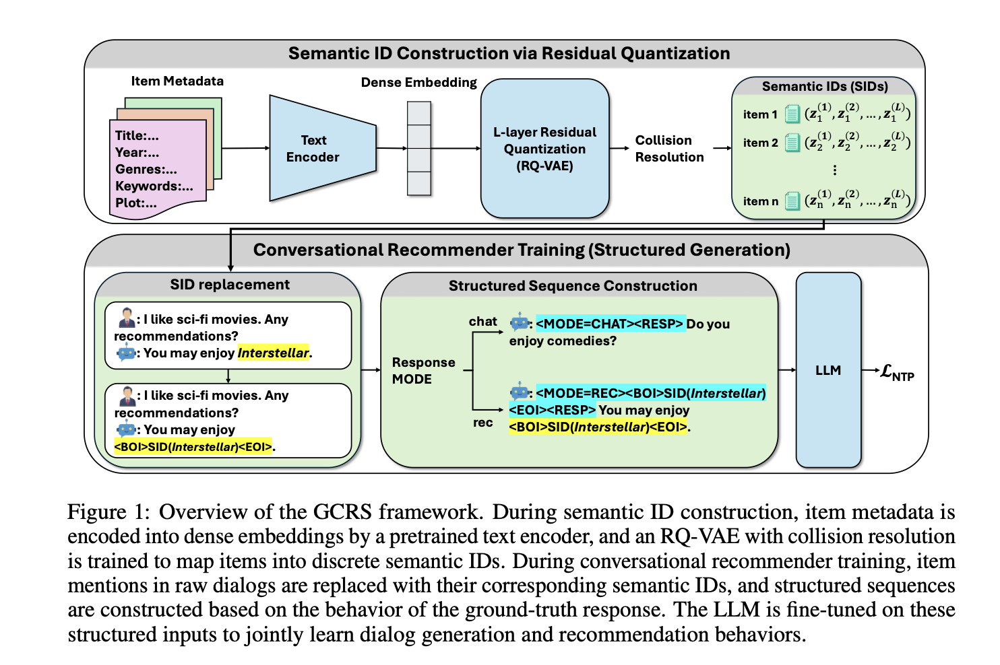

# Generative Conversational Recommender System (GCRS)

Published in May 2026 by researchers from Nanyang Technological University (NTU), Singapore, **GCRS** introduces a fully generative paradigm for Conversational Recommender Systems (CRS). It unifies recommendation and natural language dialogue generation within a single autoregressive framework, representing items as discrete semantic IDs and generating recommendations and responses via next-token prediction.

---

## Core Motivation

Traditional Conversational Recommender Systems (CRSs) face three primary bottlenecks:
1. **Decoupled Optimization:** Most existing systems decouple the dialogue manager (which generates text) from the recommendation engine (which retrieves candidates from a database). This leads to suboptimal performance, complex multi-stage pipelines, and heavy resource consumption.
2. **Implicit/Entangled Sequence Generation:** Previous attempts at using LLMs for generative recommendation entangle recommendations (movie titles or unique item IDs) directly inside natural language responses. Under standard next-token prediction, item generation becomes conditioned on previously generated conversational surface text. This introduces high semantic noise and degrades recommendation accuracy.
3. **Hallucination, Scalability, & Generalization:** Representing items with raw titles leads to spelling hallucinations and ambiguous references (e.g., matching identical names like *Aladdin 1992* vs *Aladdin 2019*). Conversely, assigning unique "atomic" tokens (e.g., `<item_42340>`) leads to vocabulary explosion and prevents generalization to new (cold-start) items.

GCRS resolves these issues using **Semantic ID Construction via RQ-VAE** and a **Structured Generation Paradigm**.

---

## Architectural Framework

The GCRS framework operates as a unified, structured sequence model.

### 1. Semantic ID Construction (Section 3.2)
To provide a scalable, unique, and semantically rich item representation, GCRS maps items to hierarchical discrete coordinate sequences:
*   **Metadata Encoding:** Item metadata (title, year, genres, keywords, plot) is serialized into a textual description and projected into a dense context vector using a pretrained text encoder (e.g., *Sentence-T5* or *BGE*).
*   **Residual Quantization (RQ-VAE):** The continuous dense vector is quantized using a 4-layer RQ-VAE into 4 discrete code indices (e.g., `[17, 63, 0, 25]`), each mapped to a codebook of size 64. This yields a theoretical capacity of $64^4$ unique IDs.
*   **Collision Resolution (Appendix A):** Because vector quantization is many-to-one, highly similar items can map to identical IDs. To prevent collisions, GCRS uses a recursive backtracking greedy matching algorithm. It ranks colliding items by distance confidence at the last level and dynamically reallocates them to the next-nearest available codewords, guaranteeing 100% unique semantic IDs.

### 2. Structured Generation Paradigm (Section 3.3)
Instead of forcing the LLM to make recommendation decisions mid-sentence, GCRS explicitly factorizes the joint conditional generation probability to follow a prescribed decision-making flow:
$$P(u_t \mid C) = P(m \mid C) \cdot P(i \mid m, C) \cdot P(r \mid i, m, C)$$

Where:
1.  **Response Intent ($m$):** The model first outputs a **MODE token** representing its high-level conversational intent:
    *   `<MODE=CHAT>`: Free-form dialogue without recommendations.
    *   `<MODE=REC>`: Entering recommendation mode.
2.  **Target Item ($i$):** If in recommendation mode, the model immediately outputs the target movie's 4-digit semantic ID wrapped in boundaries: `<BOI><a_17><b_63><c_0><d_25><EOI>`.
3.  **Natural Language Response ($r$):** The model generates the `<RESP>` token, followed by a free-form natural language response conditioned on the chosen item.

---

## Model Training & Fine-Tuning (Appendix D)

GCRS is trained using a highly efficient parameter-efficient scheme:
*   **Backbone:** Qwen2.5-7B-Instruct.
*   **Method (QLoRA):** QLoRA (Quantized Low-Rank Adaptation) is applied to all linear layers (Rank $R=16$, Alpha $\alpha=32$). This NF4 4-bit base model quantization reduces the VRAM footprint from ~14GB to ~5GB, enabling training on a single GPU (NVIDIA RTX 6000 Ada with 48GB VRAM) without any drop in recommendation accuracy.
*   **Token Embeddings:** The original vocabulary embeddings of the LLM are frozen. Only the embeddings of newly introduced special tokens are trained: the control tokens (`<BOI>`, `<EOI>`, `<RESP>`, `<MODE=REC>`, `<MODE=CHAT>`) and the 256 semantic codebook tokens (`<a_0>` to `<d_63>`). This aligns the semantic coordinate space directly with the LLM's frozen representations.

---

## Crucial Implementation Details (Appendix D)

*   **Controlled Evaluation Protocol:** During evaluation, to ensure a fair comparison on ranking metrics (like Recall@k), the system overrides the LLM's natural intent and prepends `<MODE=REC>` to all samples that contain ground-truth recommendations. This forces the model to generate a candidate list.
*   **Constrained Beam Search Decoding:** During recommendation generation, a constrained beam search (width 50) is enforced. At each digit of the 4-digit semantic ID, the decoding vocabulary is restricted strictly to the valid paths defined in the item catalog, preventing spelling hallucinations or invalid IDs.
*   **Dialogue Quality evaluation:** Prior to running Perplexity or BLEU metrics, all generated semantic ID structures are mapped to a single `<movie>` token to ensure formatting differences do not skew dialogue quality results.

---

## Related Concept Links
*   [[GCRS]]: Architectural specification of the GCRS model.
*   [[RQ-VAE]]: The mathematics and codebook quantization mechanics of Residual Quantized Variational Autoencoders.
