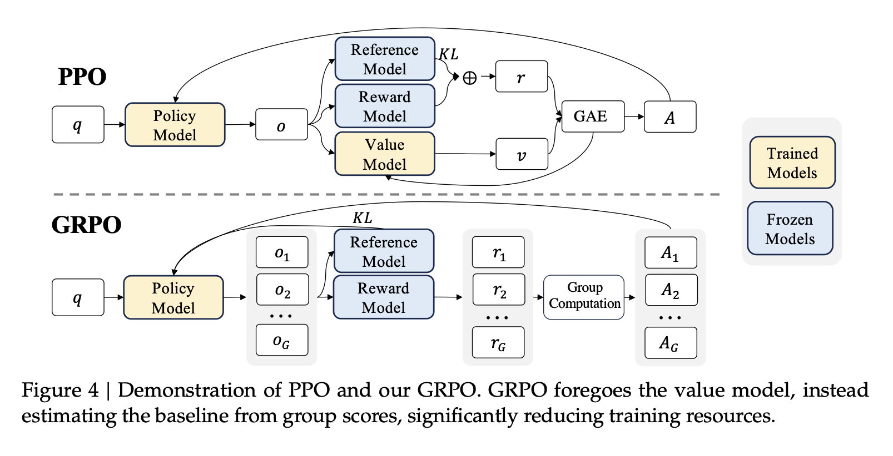

# Group Relative Policy Optimization (GRPO) 算法全景指南

> **“Critic-Free Reinforcement Learning for LLM Reasoning.”** —— GRPO 由 DeepSeek 团队在 DeepSeekMath（arXiv:2402.03300）论文中首次提出，并在 DeepSeek-R1 系列中发扬光大。其核心思想是**废除显存开销巨大的价值模型（Critic Model）**，改由**组内相对奖励归一化（Group Relative Reward）**估计基线（Baseline）与优势函数（Advantage），在显著削减训练算力与显存的同时，消除了 Critic 回归误差导致的策略坍塌风险，成为大模型长思维链推理与自我演化（Self-Evolution）的核心驱动引擎。

---

## 知识认知学习导航

本文档围绕 GRPO 对传统 PPO 的革新路径展开，解构以下核心逻辑链：
1. **起源与动机（Why GRPO?）**：传统 PPO 的“四模型架构”痛点何在？Critic 模型为什么成为大模型 RL 训练的显存与稳定性死穴？
2. **架构对比（PPO vs. GRPO）**：从双网络交互到单一 Policy 采样打分，网络拓扑与计算流的根本性简化；
3. **优势函数（Advantage）的计算机理**：
   - 组内采样（Group Sampling）与标量奖励评定；
   - 组内均值（Mean）与标准差（Std）的 Z-score 归一化；
   - 为什么样本均值可以无偏替代复杂的价值网络 $V(s)$？
   - 标量优势广播到 Token 级别的理论与局限；
4. **解构 GRPO 目标函数**：
   - PPO-Clip 代理截断项与长度归一化因子（$\frac{1}{|o_i|}$）；
   - KL 散度约束机制的独立解耦与非负无偏形式推导；
5. **完整算法流程与伪代码**：采样、打分、组内归一化、Clipped 策略更新全闭环；
6. **核心挑战与工业级权衡（Trade-offs）**：
   - 细粒度信用分配缺失（Credit Assignment Problem）；
   - 组大小 $G$ 的极端效应与方差塌缩（Variance Collapse）；
   - 与客观可验证奖励（RLVR）的高度共生性；
   - 针对奖励黑客（Reward Hacking）的多层防御。

---

## 一、算法背景与核心动机（Why GRPO?）

在传统的 [[Proximal Policy Optimization Summary|PPO（Proximal Policy Optimization）]] 算法落地大模型偏好对齐（[[RLHF Summary|RLHF]]）时，标准拓扑需要同时在集群中编排调度 4 个深度模型：
1. **Actor Model（策略模型 $\pi_\theta$）**：当前正在梯度优化的自回归生成模型；
2. **Reference Model（参考模型 $\pi_{ref}$）**：通常保持冻结（Frozen）的 SFT 基座，用于提供基准概率分布以施加 KL 散度惩罚，防止策略灾难性漂移；
3. **Reward Model（奖励模型 $R_\phi$）**：经过人类偏好对齐训练的打分模型，负责对生成的完整回复提供标量奖励；
4. **Critic Model（价值模型 $V_\psi$）**：参数规模通常与 Actor 相当或相近的标量回归网络，负责估计任意输入前缀下的状态价值期望 $V(s_t)$，以支持 [[Generalized Advantage Estimation|广义优势估计（GAE）]]。

### 传统 PPO 在 LLM 推理场景的三大致命瓶颈
* **显存与计算资源剧烈膨胀**：
  Critic 模型不仅自身包含数十亿甚至数百亿参数，而且在训练反向传播中还需要维护专属的梯度、激活值显存以及 AdamW 优化器状态（一阶动量和二阶方差，占参数量 8 字节/参数）。训练一个 67B 规模的 Actor，往往需要同时加载并更新一个同等量级的 Critic，导致单卡显存不堪重负，极大压缩了训练能容纳的 Batch Size 与上下文序列长度（Context Length）。
* **Critic 回归滞后与多米诺骨牌式崩塌**：
  Critic 价值网络本质是一个强非平稳分布下的回归任务。在自回归长文本生成中，Token 状态空间极其庞大，Critic 的拟合误差在早期极高。一旦 Critic 给出错误的价值基线，GAE 估算出的优势信号 $\hat{A}_t$ 就会出现剧烈震荡和方向性误导，直接将 Actor 策略带入崩溃深渊。
* **分布式调度复杂度极高**：
  在多机多卡异构集群中，4 个模型相互依赖的前向与反向流水线交织在一起，通信同步屏障（Barrier）极多，GPU 计算利用率（[[Model Flops Utilization|MFU]]）往往极低。

**GRPO 的破局哲学**：
强化学习引入 Baseline $b(s)$ 的唯一数学目的就是在**不改变策略梯度期望值**的前提下减小方差。既然如此，何必费时费力去训练一个不稳定的神经网络来估计这个基线？**对同一个输入 Prompt 采样一组回答，利用这组候选输出的经验均值，就是条件期望最自然、最无偏的蒙特卡洛估计！**

---

## 二、架构拓扑与计算流程对比（PPO vs. GRPO）

下图清晰展示了传统 PPO 与 DeepSeek 提出的 GRPO 框架之间的关键结构性差异：



### 关键区别详析

| 比较维度 | 传统 PPO (Proximal Policy Optimization) | GRPO (Group Relative Policy Optimization) |
| :--- | :--- | :--- |
| **价值模型 (Critic)** | **必需**（独立网络，估计状态基线 $V(s_t)$） | **彻底废除 (Critic-Free)** |
| **采样机制** | 1 个 Query $\to$ 1 个 Response | 1 个 Query $\to$ 采样一组（$G$ 个）Responses |
| **优势函数估计** | 基于 Critic 的时序差分与 GAE 折现累加 | **组内统计标准化（Z-Score 归一化）**：$\hat{A}_i = \frac{r_i - \mu_G}{\sigma_G}$ |
| **优势粒度** | **Token 级别细粒度**（每个时间步 $t$ 有独立 $\hat{A}_t$） | **序列级广播**（整句的所有 Token 共享标量 $\hat{A}_i$） |
| **KL 惩罚位置** | 内嵌在每个 Token 的即时奖励中：$R_t = r_t - \beta \mathbb{D}_{KL}$ | **完全独立外置**，直接作为策略目标函数的显式正则项 |
| **显存开销** | 极高（需额外承担 Critic 参数、梯度与优化器状态） | **极低（节省约 30%~50% 显存）** |
| **适用任务倾向** | 通用对话、风格对齐（依赖神经 RM） | **数学、代码、逻辑推理（强依赖可验证规则 RLVR）** |

---

## 三、数学原理与目标函数解构

### 1. 优势函数（Advantage）的计算推演

对于从训练集采样的一个查询问题 $q \sim P(Q)$，GRPO 的优势估计包含以下四个严格步骤：

#### Step 1: 组内并发采样（Group Sampling）
由旧策略模型 $\pi_{\theta_{old}}$ 自回归并发采样生成一组大小为 $G$ 的候选回答集合：
$$\{o_1, o_2, \dots, o_G\} \sim \pi_{\theta_{old}}(O \mid q)$$
在工业实践（如 DeepSeek-R1）中，为保证采样的探索广度和统计稳定性，组大小 $G$ 通常设置为 $16$ 至 $64$。

#### Step 2: 序列级标量奖励评定（Reward Scoring）
由奖励机制为每一个完整的输出序列 $o_i$ 计算综合标量奖励值 $r_i$：
$$r_i = \text{Reward}(q, o_i), \quad i \in \{1, 2, \dots, G\}$$
在推理任务中，该奖励通常由多个基于规则的验证器（Rule-based Verifiers）复合组成：
$$r_i = w_{acc} \cdot r_{acc} + w_{format} \cdot r_{format} + w_{lang} \cdot r_{lang}$$

#### Step 3: 组内统计量计算与 Z-Score 标准化
计算该问题下 $G$ 个候选采样的经验均值 $\mu_G$ 与经验标准差 $\sigma_G$：
$$\mu_G = \frac{1}{G} \sum_{i=1}^G r_i$$
$$\sigma_G = \sqrt{\frac{1}{G} \sum_{i=1}^G (r_i - \mu_G)^2 + \epsilon}$$
*(其中 $\epsilon$ 为防止除零溢出的极小值，如 $10^{-8}$)*

第 $i$ 个回答相对于同组其他回答的归一化相对优势为：
$$\tilde{r}_i = \frac{r_i - \mu_G}{\sigma_G}$$

#### Step 4: Token 级广播（Broadcasting）
由于缺乏 Token 级别的价值网络，GRPO 将整句计算出的标量优势值 $\tilde{r}_i$ 沿时间轴直接广播给该回答的所有生成 Token：
$$\hat{A}_{i,t} = \tilde{r}_i, \quad \forall t \in \{1, 2, \dots, |o_i|\}$$

* **自适应难度缩放机理**：
  - **难题场景**：题目极难，8 个回答中有 7 个拿了 0 分，仅有 1 个侥幸获得了 0.5 分（$\mu_G = 0.0625$）。此时得分 0.5 的回答优势值为显著的正数，模型依然能获得强烈的正向梯度激励，从而保留关键探索火种；
  - **简单题场景**：题目很简单，8 个回答全部拿了满分 1.0 分。此时分子 $r_i - \mu_G = 0$，相对优势全部归零，模型自动停止在该类已完全掌握的简单样本上无效过拟合。

---

### 2. GRPO 完整策略目标函数

GRPO 在参数更新阶段最大化如下复合代理目标函数：

$$\mathcal{J}_{GRPO}(\theta) = \mathbb{E}_{\substack{q \sim P(Q), \\ \{o_i\}_{i=1}^G \sim \pi_{\theta_{old}}}} \left[ \frac{1}{G} \sum_{i=1}^G \frac{1}{|o_i|} \sum_{t=1}^{|o_i|} \left( \min \left( r_{i,t}(\theta) \hat{A}_{i}, \; \text{clip}\big(r_{i,t}(\theta), 1-\epsilon, 1+\epsilon\big) \hat{A}_{i} \right) - \beta \, \mathbb{D}_{KL}\big(\pi_\theta \parallel \pi_{ref}\big) \right) \right]$$

#### 项点 1：重要性采样与 PPO-Clip 悲观截断
$$r_{i,t}(\theta) = \frac{\pi_\theta(o_{i,t} \mid q, o_{i,<t})}{\pi_{\theta_{old}}(o_{i,t} \mid q, o_{i,<t})} = \exp\left( \log \pi_\theta(o_{i,t}) - \log \pi_{\theta_{old}}(o_{i,t}) \right)$$
在利用这批 Rollout 数据进行多步小批量（Mini-batch）梯度下降时，当前参数 $\theta$ 会与采样时的 $\theta_{old}$ 发生偏离。PPO-Clip 机制将比例限制在 $[1-\epsilon, 1+\epsilon]$（通常 $\epsilon=0.2$）区间内，配合 $\min$ 形成悲观下界，防止单步更新幅度过大破坏策略的语言基准分布。

#### 项点 2：长度倒数归一化因子（$\frac{1}{|o_i|}$）
在目标函数内部对回答长度求倒数平均，使得每个回答对总梯度的贡献与其 Token 长度解耦。这彻底消除了模型通过“疯狂输出冗长废话堆砌 Token 绝对梯度”的作弊捷径（即 Verbosity Bias 驱动的 Reward Hacking）。

---

### 3. 外置无偏非负 KL 散度估计公式推导

传统 PPO 将 Token 级 KL 项放入即时奖励中：$R_t = r_t - \beta \log \frac{\pi_\theta}{\pi_{ref}}$。这种方式存在两大缺陷：
1. 奖励与策略正则项耦合，污染了环境真实回报的时序折现；
2. 朴素对数比率 $\log \frac{\pi_\theta}{\pi_{ref}}$ 在采样点概率不平衡时极易出现**负值**，导致惩罚项反转为“偏离基座模型的正向奖励”。

GRPO 将 KL 散度抽离至目标函数最外层，并采用 Schulman 形式的非负无偏估计：
$$\mathbb{D}_{KL}\big(\pi_\theta \parallel \pi_{ref}\big) = \frac{\pi_{ref}(o_{i,t} \mid q, o_{i,<t})}{\pi_\theta(o_{i,t} \mid q, o_{i,<t})} - \log \frac{\pi_{ref}(o_{i,t} \mid q, o_{i,<t})}{\pi_\theta(o_{i,t} \mid q, o_{i,<t})} - 1$$

#### 数学非负性与无偏性证明
令比率标量 $x = \frac{\pi_{ref}}{\pi_\theta} > 0$，定义实数函数：
$$f(x) = x - \log x - 1$$
- **求导**：$f'(x) = 1 - \frac{1}{x} = \frac{x - 1}{x}$
  - 当 $x \in (0, 1)$ 时，$f'(x) < 0$（严格单调递减）；
  - 当 $x \in (1, +\infty)$ 时，$f'(x) > 0$（严格单调递增）；
  - 当 $x = 1$ 时，$f'(1) = 0$，取得全局唯一下确界 $f(1) = 1 - 0 - 1 = 0$。
- **二阶导**：$f''(x) = \frac{1}{x^2} > 0$，函数全域严格下凸。
- **结论**：对于任意采样点，**恒有 $f(x) \ge 0$**。同时，当在真实分布 $\pi_\theta$ 下取数学期望时：
  $$\mathbb{E}_{\pi_\theta}[f(x)] = \mathbb{E}_{\pi_\theta}\left[ \frac{\pi_{ref}}{\pi_\theta} - \log \frac{\pi_{ref}}{\pi_\theta} - 1 \right] = \int \pi_{ref} da - \mathbb{E}_{\pi_\theta}\left[ \log \frac{\pi_{ref}}{\pi_\theta} \right] - 1 = 1 + \mathbb{D}_{KL}(\pi_\theta \parallel \pi_{ref}) - 1 = \mathbb{D}_{KL}(\pi_\theta \parallel \pi_{ref})$$
该估计形式不仅在期望上是真实 KL 散度的无偏估计，而且**逐 Token 点估计值处处非负**，彻底消除了负散度引起的梯度震荡。

---

## 四、计算流程与伪代码实现

```
Algorithm: Group Relative Policy Optimization (GRPO)
Input: 初始策略模型 π_θ, 冻结参考模型 π_ref, 奖励机制 Reward(·), 组大小 G, 裁剪阈值 ϵ, KL权重 β
Output: 优化后的策略模型 π_θ

1: while 训练未收敛 do
2:    从数据集中采样一个批次的 Prompts: {q_1, q_2, ..., q_B} ~ P(Q)
3:    for 每个 prompt q in 批次 do
4:        使用当前旧策略 π_θold 并发自回归采样 G 个回答:
5:            {o_1, o_2, ..., o_G} ~ π_θold(· | q)
6:        调用验证器/打分器计算序列奖励:
7:            r_i = Reward(q, o_i),  ∀ i ∈ {1, ..., G}
8:        计算组内统计指标:
9:            μ_G = (1/G) * Σ r_i
10:           σ_G = sqrt( (1/G) * Σ (r_i - μ_G)^2 + ε_small )
11:       标准化得到组相对优势:
12:           A_i = (r_i - μ_G) / σ_G,  ∀ i ∈ {1, ..., G}
13:   end for
14:
15:   for epoch = 1 to K_epochs do
16:       for 每个 mini-batch (q, o_i, A_i) do
17:           计算新策略概率: π_θ(o_{i,t} | q, o_{i,<t})
18:           计算参考概率: π_ref(o_{i,t} | q, o_{i,<t})
19:           重要性采样比率: r_{i,t}(θ) = π_θ(o_{i,t}) / π_θold(o_{i,t})
20:           Surrogate 1: L1 = r_{i,t}(θ) * A_i
21:           Surrogate 2: L2 = clip(r_{i,t}(θ), 1 - ϵ, 1 + ϵ) * A_i
22:           策略损失项: L_clip = min(L1, L2)
23:           KL惩罚项: D_kl = (π_ref / π_θ) - log(π_ref / π_θ) - 1
24:           Token 总目标: J_{i,t} = L_clip - β * D_kl
25:           批次损失反向传播并梯度裁剪更新参数 θ
26:       end for
27:   end for
28:   同步旧策略参数: θ_old ← θ
29: end while
```

---

## 五、深入探讨：工业收益、核心局限与演进前沿

### 1. 核心工程收益
1. **显存利用率质的飞跃**：
   抛弃 Critic 模型释放了超 30%~50% 的显存与优化器状态。这使得原本受限的计算节点能够轻松支撑 **16k~64k 的极长上下文训练**，这正是支持大模型进行长链条深度思考（Long Chain-of-Thought）的前提条件。
2. **训练动力学极致简化**：
   无需调优 Critic 学习率、无需处理 Critic 与 Actor 之间的训练步频不匹配、无需防范 Critic 的冷启动塌陷。
3. **激活纯强化学习的“顿悟时刻（Aha-Moment）”**：
   DeepSeek-R1-Zero 在不依赖任何前置人类 SFT 标注冷启动的情况下，纯靠 GRPO 与规则奖励演化出了“重读题目”、“自我反思、否定前文错误”、“另辟蹊径验证解法”等复杂推理行为。

---

### 2. 现实局限与批判性审视

#### 局限 1：全对或全错导致的“方差塌缩（Variance Collapse）”
当组大小 $G$ 不足或题目难度极端时：
- 极难题目：组内 $G$ 个候选采样的答案全错（例如全为 0 分）；
- 极易题目：组内 $G$ 个候选采样的答案全对（例如全为 1 分）。
此时组内方差 $\sigma_G \to 0$，分子 $r_i - \mu_G$ 全部严格为 0。**这意味着整个 Prompt 采样的这批数据在当前更新轮次中产生的有效策略梯度为零**。
> **对策**：必须大幅增大采样组大小（如 $G=64$），并通过动态难度数据调度（Curriculum Learning），确保每组样本中均存在具有区分度的解法。

#### 局限 2：序列级信用分配的粗糙性（Credit Assignment Problem）
GRPO 将整句计算出的标量优势 $\hat{A}_i$ 均匀广播到数千个 Token 上。
- 如果一个数学解答中，第 1 到 2000 个 Token 都是繁琐的废话，唯独第 2001 个 Token 的几何辅助线思路是突破核心，GRPO 会将同等强度的正向奖励灌注到前面的所有冗余表达上；
- 这种粗粒度归因容易导致模型在学习正确逻辑的同时，伴随产生思维冗余（Over-thinking）与啰嗦模式。

---

### 3. 与客观验证机制（RLVR）的高度共生性

GRPO **最排斥**主观模糊、容易被对抗样本攻破的神经网络 Reward Model；**最契合**的是答案非黑即白的**可验证奖励强化学习（RLVR，Reinforcement Learning with Verifiable Rewards）**：

```text
               +--------------------------------------------------+
               |           Prompt q (Math / Code Task)            |
               +--------------------------------------------------+
                                        |
                   Parallel Rollout (Group Size G = 64)
                                        v
               +--------------------------------------------------+
               |     Candidate Outputs: {o_1, o_2, ..., o_G}      |
               +--------------------------------------------------+
                                        |
                                        v
                 +---------------------------------------------+
                 |       Deterministic Rule-based Sandbox      |
                 |---------------------------------------------|
                 | • SymPy: Symbolic equality verification     |
                 | • Code Exec: Hidden unit tests (Pass@1)     |
                 | • Regex: Complete <think>...</think> syntax |
                 +---------------------------------------------+
                                        |
                       Unbiased Binary Rewards {0, 1}
                                        v
                 +---------------------------------------------+
                 |      Group Relative Z-Score Advantage       |
                 +---------------------------------------------+
```

只有依靠沙箱与符号系统提供 100% 确定、无对抗漏洞的客观奖励，组相对优势才能精确指引策略模型自我迭代，而免遭奖励黑客侵蚀。

---

### 4. 针对奖励黑客（Reward Hacking）的系统级防御

在强化学习对齐中，针对 Reward Hacking（如过长废话、阿谀奉承、对抗盲区），业界与 GRPO 的主流应对措施构筑了三道防线：

1. **第一道防线：目标与损失层约束（Policy-Level Barrier）**
   - **严格长度倒数归一化（$\frac{1}{|o_i|}$）**：消除长序列梯度累积，打击 Verbosity Bias；
   - **非负无偏 KL 正则项**：通过外置惩罚锁死策略分布偏离安全基准 $\pi_{ref}$ 的范围；
   - **PPO-Clip 边界限制**：限制重要性采样概率比上限，避免单次更新过度榨取优势。
2. **第二道防线：奖励来源客观化（Source Verification）**
   - 优先转向沙箱代码执行与形式化数学证明（RLVR），切断主观打分漏洞；
   - 在必须使用神经 RM 的场景，采用 **Ensemble RM（多模型集成）** 并取保守下界（$\min$ 或 $\text{mean} - \lambda \cdot \text{std}$），利用独立模型间的盲区差异封堵对抗漏洞。
3. **第三道防线：过程监督下沉（PRM - Process Reward Model）**
   - 引入步骤级过程奖励（Step-level GRPO），对每一步推演做细粒度有效性检验，杜绝“中间胡扯、最终碰巧蒙对”的侥幸路径。

---

## 关联维基链接
- [[Proximal Policy Optimization Summary]]: 经典 PPO 算法与 GAE 的完整数学推导与价值网络分析；
- [[Critic Model]]: 状态价值估计网络及其在 PPO 中的基线作用与显存开销；
- [[Generalized Advantage Estimation]]: 传统的时序差分优势估计与偏差-方差权衡；
- [[RLHF Summary]]: 大模型强化学习人类偏好对齐全景范式；
- [[Direct Preference Optimization]]: 同样废除显式奖励模型与在线 RL 的无模型离线对齐算法；
- [[DeepSeek-V3.2 Training Pipeline]]: DeepSeek 体系下大规模稳定应用 GRPO 的工程演进与基础设施实践。
