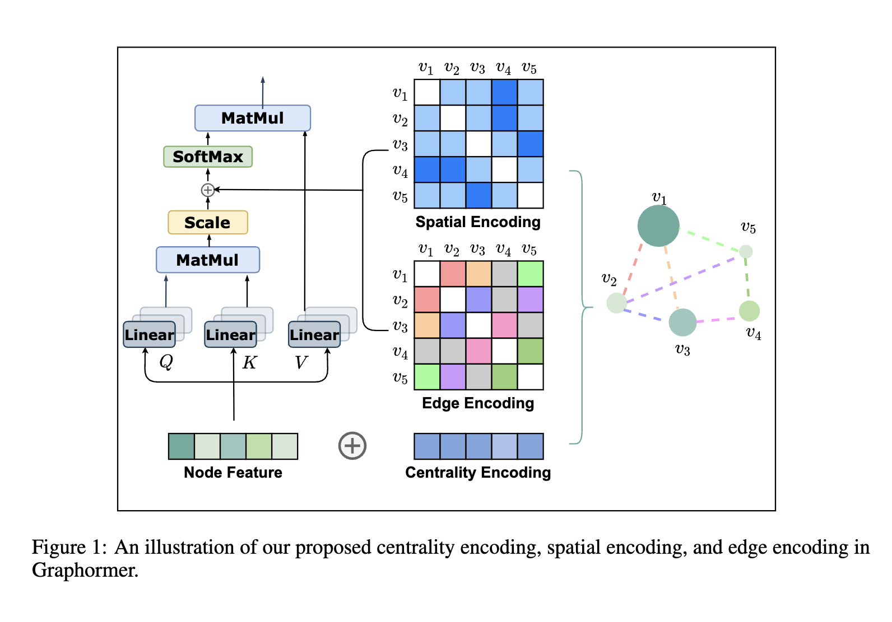

# Do Transformers Really Perform Bad for Graph Representation? (Graphormer)

**Graphormer** is a landmark paper published at NeurIPS 2021 by Microsoft Research Asia. It resolves a long-standing mystery in graph machine learning: *why standard Transformer architectures, despite dominating NLP and CV, consistently underperformed compared to classical Graph Neural Networks (GNNs) on popular leaderboards.* 

The paper demonstrates that vanilla Transformers fail on graphs because standard self-attention is a set operation—meaning it lacks structural priors (like local connectivity and edge relations) inherent to graph-structured data. By introducing three simple yet mathematically elegant **Structural Encodings** directly into the input and attention layers, Graphormer not only matches but significantly outperforms mainstream GNNs, achieving state-of-the-art results on the Open Graph Benchmark (OGB) and the OGB Large-Scale Challenge (OGB-LSC).

---

## Architectural Layout

Graphormer adapts the standard Transformer encoder. It places **Layer Normalization (LN)** before the Multi-Head Self-Attention (MHA) and Feed-Forward Network (FFN) blocks (Pre-LN) to ensure optimization stability when scaling to deep networks.

The central innovation of Graphormer is how it injects structural topology into this standard layout, as illustrated above:
1. **Centrality Encoding**: Added to the initial node features $x_i$ to represent node importance.
2. **Spatial Encoding**: Injected as a learnable bias term in the self-attention matrix to represent physical distance.
3. **Edge Encoding**: Injected as a path-based bias in the self-attention matrix to incorporate rich edge-level properties.

---

## Technical Specifications & Formulation

### 1. Centrality Encoding (Degree Prior)
In many real-world graphs (e.g., social networks, molecular bonds), some nodes are structurally more important or influential than others. Standard self-attention cannot capture this since it measures similarity based primarily on node semantic features. 

Graphormer uses **Degree Centrality** to represent node importance. It maps the in-degree and out-degree of each node to learnable embedding vectors and adds them directly to the initial node representation:

$$h_i^{(0)} = x_i + z^-_{\operatorname{deg}^-(v_i)} + z^+_{\operatorname{deg}^+(v_i)}$$

where:
- $x_i \in \mathbb{R}^d$ is the raw feature vector of node $v_i$.
- $z^-, z^+ \in \mathbb{R}^d$ are learnable embedding vectors determined by the node's in-degree $\operatorname{deg}^-(v_i)$ and out-degree $\operatorname{deg}^+(v_i)$ respectively.
- For undirected graphs, these are unified into a single degree term: $h_i^{(0)} = x_i + z_{\operatorname{deg}(v_i)}$.

By adding centrality embeddings to the queries and keys, the self-attention mechanism can naturally learn to favor or suppress interactions with highly central hub nodes.

### 2. Spatial Encoding (Structural Distance Bias)
Unlike sequence data where relative position is a simple 1D offset, graph nodes lie in a non-Euclidean space and are linked by topological paths. To capture this spatial relation, Graphormer introduces a spatial encoding based on the **Shortest Path Distance (SPD)**.

For any pair of nodes $v_i$ and $v_j$, let $\phi(v_i, v_j)$ be the SPD between them. If they are connected, $\phi(v_i, v_j)$ is a positive integer; if they are disconnected, it is set to a special index $-1$. Graphormer assigns a learnable scalar bias $b_{\phi(v_i, v_j)}$ to each distance, which modifies the self-attention Query-Key dot product:

$$A_{ij} = \frac{(h_i W_Q)(h_j W_K)^T}{\sqrt{d}} + b_{\phi(v_i, v_j)}$$

where:
- $W_Q, W_K \in \mathbb{R}^{d \times d_k}$ are the Query and Key projection weights.
- $b_{\phi(v_i, v_j)}$ is a learnable scalar bias shared across all layers but independent for each attention head.

#### **Advantages of Discrete Bias over Continuous Weighting:**
- **Arbitrary Functions**: The lookup table allows the model to learn any non-linear, non-monotonic attention-distance relationship (e.g., step-functions, periodic cycles, or localized filters).
- **Graceful Disconnectedness**: Disconnected nodes are cleanly handled via a dedicated $b_{-1}$ bias index, avoiding the infinity issues that arise in continuous formulas.

### 3. Edge Encoding in Attention
Many graphs contain crucial attributes on their edges (e.g., chemical bond types or physical road properties). Graphormer integrates these features along the shortest path between node pairs to modulate their global attention score.

For an ordered node pair $(v_i, v_j)$, let $SP_{ij} = (e_1, e_2, \dots, e_N)$ represent the sequence of edges along the shortest path from $v_i$ to $v_j$, where $N = \phi(v_i, v_j)$. The edge encoding bias $c_{ij}$ is computed as:

$$c_{ij} = \frac{1}{N} \sum_{n=1}^N x_{e_n} (w^E_n)^T$$

where:
- $x_{e_n} \in \mathbb{R}^{d_E}$ is the feature vector of the $n$-th edge $e_n$ in the path.
- $w^E_n \in \mathbb{R}^{d_E}$ is the learnable weight vector for the $n$-th step of the path.

The final attention score combining all structural encodings is:

$$A_{ij} = \frac{(h_i W_Q)(h_j W_K)^T}{\sqrt{d}} + b_{\phi(v_i, v_j)} + c_{ij}$$

---

## Special Node: Graph Readout (`[VNode]`)

To represent the entire graph for graph-level classification or regression tasks, Graphormer introduces a special virtual node called `[VNode]`.
*   `[VNode]` is appended to the node set and is connected to every physical node in the graph.
*   Unlike physical edges, these virtual connections are assigned a distinct, dedicated spatial encoding scalar to prevent over-smoothing of information.
*   The final-layer representation of `[VNode]` serves as the unified graph representation ($h_G$), bypassing the need for traditional pooling/readout functions (like Mean or Sum pooling).

---

## Theoretical Properties & Expressiveness

### **Fact 1: Coverage of Popular GNNs**
The authors mathematically prove that a single Graphormer layer can represent the standard AGGREGATE and COMBINE steps of popular GNNs (including **GIN, GCN, and GraphSAGE**). By setting spatial bias to favor direct neighbors and utilizing multi-head attention and feed-forward networks, Graphormer can isolate neighbor representations and combine them seamlessly.

### **Fact 2: Beating the 1-WL Limit**
Standard message-passing GNNs are bounded in expressive power by the 1-Weisfeiler-Lehman (1-WL) graph isomorphism test. For example, they cannot distinguish circular skip-link graphs of different sizes. Graphormer's spatial encoding (based on Shortest Path Distance) provides global coordinate-free referencing, enabling it to distinguish non-isomorphic graphs that fail the 1-WL test.

---

## Experimental Results

On the major graph learning benchmarks, Graphormer achieved unprecedented performance:
*   **PCQM4M-LSC (OGB Large-Scale Challenge)**: Graphormer surpassed deep message-passing baselines by more than **10% relative error**, securing #1 on the leaderboard.
*   **ogbg-molhiv & ogbg-molpcba**: Graphormer achieved state-of-the-art results, demonstrating exceptional capacity in molecular graph property prediction.
*   **ZINC**: On the benchmarking-GNN dataset, Graphormer achieved a test MAE of **0.122**, significantly outperforming prior GNN architectures.

---

## See Also
- [[Graphormer]] (Entity)
- [[Positional Encoding]]
- [[CITRAS Summary]]
