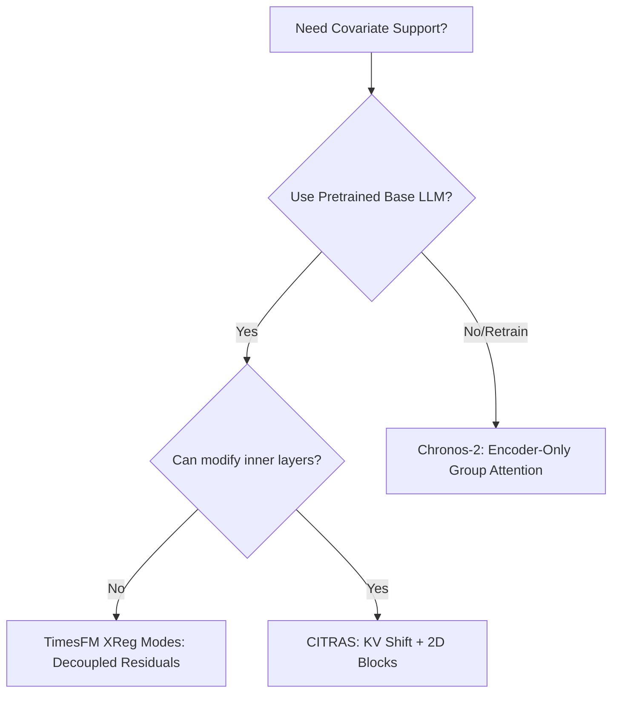

# In-Context Learning and Future Covariates in Decoder-Only Forecasting

In-context learning (ICL) and zero-shot transfer have emerged as powerful paradigms in time-series forecasting. While original foundation models (e.g., Chronos-1, original TimesFM) were strictly univariate and treated forecasting as a 1D next-token prediction task, real-world scenarios require incorporating **covariates** (external indicators like weather forecasts, discounts, and calendar holidays).

Integrating future known covariates is mathematically difficult in **Decoder-Only (autoregressive) architectures** because the causal attention mask prevents the model from looking ahead. 

This synthesis page compares the **three dominant strategies** used to solve the Decoder-Only covariate modeling problem: **Encoder-Only Reformulations ([[Chronos-2 Summary|Chronos-2]])**, **Decoupled Residual Modeling (TimesFM 2.5 XReg)**, and **Step-shifted Cross-variate Attention ([[CITRAS Summary|CITRAS]])**.

---

## 1. Comparing the Three Archetypes

| Strategy | Representative Model | Input/Tokenization Handling | Causal Mask Treatment | Core Advantage |
| :--- | :--- | :--- | :--- | :--- |
| **Encoder-Only Group Masking** | [[Chronos-2 Summary\|Chronos-2]] | Target and covariates are aligned into $(T+H) \times (D+M)$ matrices, patched, and matched via **Group IDs**. | Replaced causal masks with bi-directional **Group Attention**. | Seamless zero-shot support for arbitrary multivariate inputs; parallel non-autoregressive forecasting. |
| **Decoupled Residual Modeling** | **TimesFM 2.5 (XReg)** | Decouples target time-series from covariates. Fits traditional regressors on covariates outside the deep model. | Preserves pure univariate causal autoregression inside the LLM block. | Safe from extreme outliers; extremely fast to deploy; does not require training/modifying the base LLM. |
| **Step-shifted Cross-variate Attention** | [[CITRAS Summary\|CITRAS]] | Patchified targets, observed, and known covariates are processed by alternating temporal and spatial attention blocks. | Modifies multi-head attention internally with **[[KV Shift]]** and **[[Attention Score Smoothing]]**. | Maintains perfect concurrent query-key alignment at step $i$ while fetching tomorrow's known covariates at step $i+1$. |

---

## 2. Structural Deep-Dive

### A. [[Chronos-2 Summary|Chronos-2]]: Group Masking and Channel Independence
[[Chronos-2 Summary|Chronos-2]] bypasses the decoder causal mask entirely by changing its model type to **Encoder-Only**. It maps the inputs into multiple channel-independent temporal streams. To model relationships, it introduces **[[Group Attention]]**. By assigning the same group ID to a target and its covariates, the model's self-attention mechanism is dynamically masked so that token aggregation occurs only within that specific forecasting task.

### B. TimesFM 2.5: The `XReg` Dual-塔 Framework
TimesFM 2.5 maintains a pure univariate decoder architecture. To handle covariates without altering the deep transformer layers, it introduces two distinct modes in `xreg_lib.py`:
- **`xreg + timesfm` (Residual Mode)**: Fits an external Ridge regression of targets on covariates, subtracts the prediction to compute clean temporal residuals, and uses TimesFM to forecast the residuals.
- **`timesfm + xreg` (Error Correction Mode)**: Directly runs TimesFM on target series, and uses covariates in an external linear model to predict and correct TimesFM's historical forecast errors.

For full architectural details, see the [[TimesFM XReg Modes]] page.

### C. [[CITRAS Summary|CITRAS]]: KV Shift and 2D Attention
[[CITRAS Summary|CITRAS]] preserves the decoder-only architecture but structures the network into alternating **Cross-Time** and **Cross-Variate** 2D attention blocks. 
- To incorporate future covariates, it introduces **[[KV Shift]]**, which pairs the target query and known covariate key at the current step $i$ (capturing concurrent correlations), but pairs them with the known covariate value at step $i+1$ ( tomorrow's plan ).
- To handle noise and sparse covariates, it introduces **[[Attention Score Smoothing]]**, applying an Exponential Moving Average (EMA) to attention scores across temporal steps.

---

## 3. Design Selection Guideline

When architecting a production-grade forecasting system with covariates, the choice of strategy depends on training flexibility and dataset volatility:

- **Use [[Chronos-2 Summary|Chronos-2]]** when training a large-scale unified zero-shot model from scratch on heterogeneous datasets where variables fluctuate wildly in count and semantic meaning.
- **Use TimesFM 2.5 (XReg)** when deploying zero-shot forecasting in production quickly using pre-trained single-variable models, particularly when robustness to extreme event anomalies (like Black Friday spikes) is required.
- **Use [[CITRAS Summary|CITRAS]]** when building specialized, end-to-end autoregressive models that need to learn fine-grained temporal-spatial interactions directly in hidden space.

---

## See Also
- [[Chronos-2 Summary]]
- [[CITRAS Summary]]
- [[Group Attention]]
- [[KV Shift]]
- [[TimesFM XReg Modes]]
- [[Attention Score Smoothing]]
