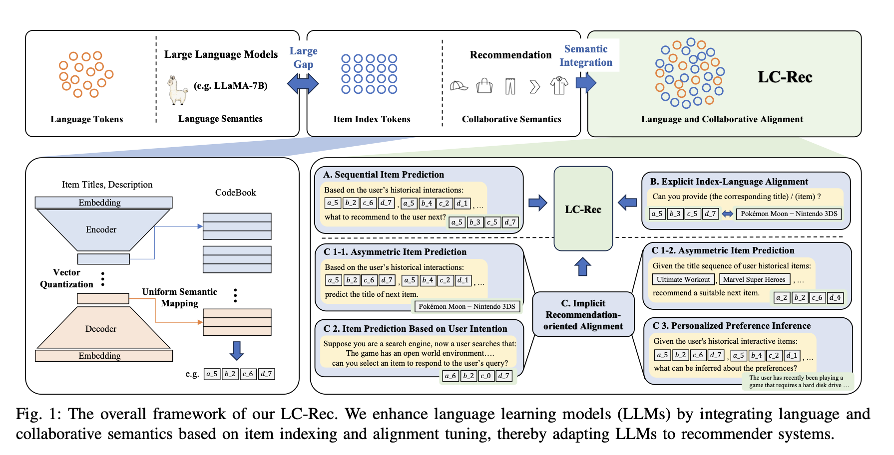

# Integrating Collaborative Semantics for Recommendation (LC-Rec)

Published in ICDE 2024 by researchers from Renmin University of China, UC San Diego, and WeChat (Tencent), **LC-Rec** is a seminal generative recommendation framework. Built on a decoder-only LLM (LLaMA-7B), it casts sequential recommendation into a token generation task by representing items as discrete, semantic coordinate index codes and aligning them with language models through structured alignment-tuning tasks.

---

## Core Motivation

While LLMs possess exceptional linguistic reasoning, adapting them to recommender systems faces a major **semantic gap**: items in a catalog are traditionally indexed by discrete, context-blind database IDs that are completely out of the LLM's vocabulary. 
1. **The Fallacy of Text-Only Recommendation:** Describing items purely by text titles (e.g., `"Inception"`) relies heavily on semantic priors, causing spelling hallucinations, ambiguous references, and high context-window overhead that prevents full-ranking evaluations.
2. **The Mismatch of Word vs. Collaborative Semantics:** Standard textual representations capture *language semantics*, whereas recommender systems imply *collaborative semantics* (user-item interaction co-occurrences). Naive generative models train on item ID sequences, establishing collaborative relations between IDs without aligning them to the LLM's language space.

**LC-Rec** bridges this gap through a unified approach consisting of **Item Indexing via Optimal Transport** and **Multi-Task Semantic Alignment Tuning**.

---

## Architectural Framework

The LC-Rec framework comprises two main steps: learning semantic item indices, and aligning language and collaborative semantics through specific instruction tuning tasks.

### 1. Item Indexing via Optimal Transport (Section III-B)
To represent items uniquely, compactly, and semantically:
*   **Contextual LLaMA Encoding:** Item metadata (title, genre, description) is serialized and processed through the frozen 32-layer LLaMA-7B backbone. The final-layer hidden state vectors are aggregated via **mean pooling** to generate a contextualized dense embedding $\mathbf{e} \in \mathbb{R}^{4096}$, capturing rich linguistic semantics and reasoning.
*   **Multi-level Vector Quantization (RQ-VAE):** A multi-level quantizer (with encoder/decoder implemented as standard MLPs with ReLU) compresses $\mathbf{e}$ into a 4-layer discrete coordinate sequence, e.g., $\langle c_1, c_2, c_3, c_4 \rangle$ with codebook size $K = 256$ per layer.
*   **Sinkhorn-Knopp Collision Resolution:** Standard VQ methods greedily cluster similar items under the same leaf node, causing ID conflicts. Instead of patching this post-hoc with local search heuristics (as in GCRS), LC-Rec treats codebook assignment as a **global combinatorial optimization problem (Optimal Transport)**. It enforces a uniform distribution constraint on the final level, solved differentiably during training via the **Sinkhorn-Knopp algorithm**, guaranteeing 100% unique, semantic codes.

### 2. Multi-Task Alignment Tuning (Section III-C)
To bridge the gap between language tokens and the newly introduced item index codes, LC-Rec rejects standard single-task sequential prediction. Instead, it fine-tunes LLaMA using a diverse, multi-task instruction alignment corpus:

*   **Symmetric Sequential Prediction (Task A):**
    *   *Input:* Historical item index sequence: `Based on...: <a_5><b_4><c_2><d_1>, <a_5><b_2><c_6><d_7>,...`
    *   *Output:* Target next item's index: `<a_5><b_3><c_5><d_7>`.
*   **Explicit Index-Language Alignment (Task B - Cross-Modal Mapping):**
    *   *Index-to-Text:* Given `<a_5><b_3><c_5><d_7>`, predict `"Pokémon Moon - Nintendo 3DS"` and its description.
    *   *Text-to-Index:* Given `"Pokémon Moon - Nintendo 3DS"`, predict its discrete code `<a_5><b_3><c_5><d_7>`.
*   **Implicit Recommendation-Oriented Alignment (Task C):**
    *   *Asymmetric Item Prediction (C1):* Predict text titles directly from index history, or predict index codes directly from text title history.
    *   *User Intention Prediction (C2):* Predict next item's index based on a natural-language search query or intent profile.
    *   *Personalized Preference Inference (C3):* Given index sequence history, generate a natural language summary of the user's preferences (e.g., *"The user has recently been playing games that require hard disk drives..."*).

---

## Deep Insight: How Collaborative Semantics are Formed

A key architectural realization is that **the RQ-VAE is purely semantic and contains zero collaborative context.** 
Because the RQ-VAE is optimized strictly to reconstruct continuous LLaMA-encoded text embeddings of individual item metadata (Equation 5) without ever seeing user ratings, sequential histories, or click streams, the resulting discrete index codes (e.g., `<a_5><b_2><c_6><d_7>`) represent **nothing but hierarchical textual similarity** (e.g., grouping Mario games together because of text keywords).

**The Collaborative Semantics are learned entirely by LLaMA's attention weights during the SFT stage.** 
By fine-tuning LLaMA on sequential interaction logs using these purely semantic index codes:
1.  **Traversing the Coordinate Tree:** LLaMA is forced to predict a sequence of purely semantic codes: `[<a_5><b_4><c_2><d_1> ──► <a_5><b_3><c_5><d_7>]`.
2.  **Learning Behavioral Transitions:** LLaMA's attention heads learn the **co-occurrence and transition probabilities** between these semantic coordinate nodes (e.g., learning that users who play RPG game $A$ often buy RPG game $B$ next).
3.  **Unified Integration:** This decouples the index tree (which remains purely semantic and easy to generalize to cold items) from the behavioral transitions (which are learned deeply inside LLaMA's 32 attention blocks), achieving a perfect integration of language and collaborative semantics.

---

## Key Empirical Findings

1.  **State-of-the-Art Recommendation:** LC-Rec significantly outperforms conventional sequential recommenders (SASRec) and strong LLMRec baselines (TALLRec, InstructRec) on Instruments, Arts, and Games benchmarks.
2.  **Full-Ranking Capability:** Because items are represented as short, 4-token semantic index codes, LC-Rec bypasses candidate-set bottlenecks and performs efficient, generative full-ranking evaluation across the entire catalog.
3.  **Cross-Modal Grounding:** Ablation studies show that cross-modal explicit translation (Task B) is critical: it grounds the OOV coordinate indices in the LLM's language manifold, allowing the model to naturally "translate" behavior co-occurrences into text reasoning.

---

## Related Concept Links
*   [[LC-Rec]]: Detailed architectural and entity specification of the LC-Rec model.
*   [[GCRS]]: The generative conversational recommender baseline compared in indexing and structured factorization.
*   [[Conversational Recommender Systems]]: Synthesis of the architectural evolution of LLMRec and recommendation paradigms.
