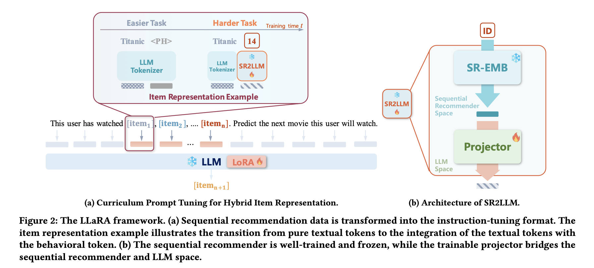
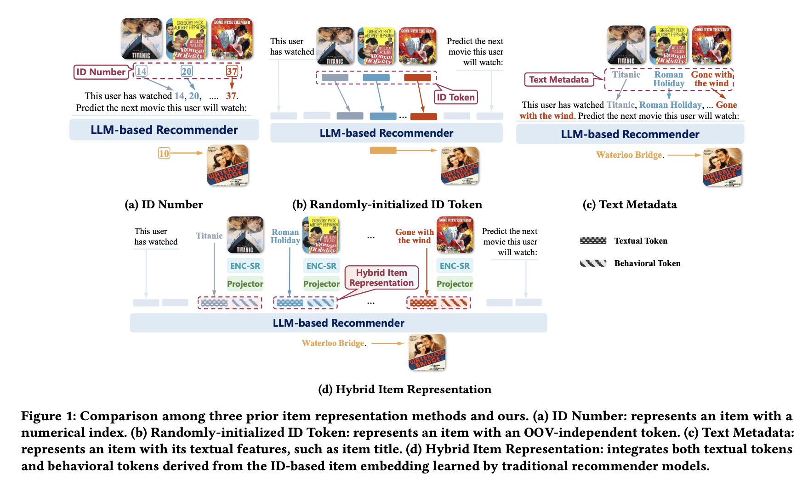

# Large Language-Recommendation Assistant (LLaRA)

Published in early 2024 by researchers from the University of Science and Technology of China (USTC) and Hong Kong Polytechnic University, **LLaRA** represents a major advancement in utilizing Large Language Models for **Sequential Recommendation (SR)**. It introduces a hybrid prompting method that aligns the behavioral representations derived from traditional recommenders with the high-dimensional language space of LLMs.

## Core Motivation

Sequential recommendation aims to predict a user's next item of interest based on their past sequence of interactions. Existing LLM-based recommenders (LLMRec) represent items in prompts using either ID indices or textual metadata, but both approaches have significant limitations:
1. **ID-Only Representation:** Using arbitrary number indices or labels (e.g., `"movie_1482"`) ignores the rich world knowledge and linguistic commonsense embedded in LLMs.
2. **Text-Only Representation:** Describing items purely by text titles (e.g., `"Inception"`) relies heavily on semantic priors and fails to capture user sequential/behavioral co-occurrence patterns (e.g., that users who watch movie A also tend to watch movie B, regardless of genre or title similarity).

**LLaRA** bridges this gap by viewing the **sequential behaviors of users** as a distinct, independent modality. It uses a projection module to align traditional recommender ID embeddings with the LLM input space and executes a **curriculum learning strategy** to smoothly ramp up training complexity.

---

## Architectural Framework

LLaRA combines a pre-trained sequential recommender with an instruction-tuned LLM using a progressive multi-modal alignment paradigm.

### 1. Hybrid Item Representation (Section 4.1)
For each item $i$, LLaRA constructs a multifaceted representation by fusing textual and behavioral data:

*   **Textual Tokens ($\langle\mathbf{emb}_{t}^i\rangle$):** Formed by passing the item's textual metadata $txt_i$ (e.g., titles, descriptions) through the LLM tokenizer and native embedding lookup table. The exact length of textual tokens is preserved to avoid any semantic resolution loss.
*   **Behavioral Token ($\langle\mathbf{emb}_{s}^i\rangle$):** A pre-trained sequential recommendation model (like SASRec, GRU4Rec, or Caser) generates a low-rank ID-based embedding $\mathbf{e}_s^i$ (typically of size `64` or `128`). To bridge the dimensionality gap, the **SR2LLM** projector (a 2-layer MLP) projects $\mathbf{e}_s^i$ directly into the LLM token space (dimension `4096`).
*   **Hybrid Representation ($\langle\mathbf{emb}_{c}^i\rangle$):** Concatenates the textual and behavioral tokens to construct a complete descriptor:
    $$\langle\mathbf{emb}_{c}^i\rangle = \mathbf{Concat}(\langle\mathbf{emb}_{t}^i\rangle, \langle\mathbf{emb}_{s}^i\rangle)$$

---

## Hybrid Prompt Design & List-Wise Ranking (Section 4.2)

Unlike binary classification recommenders (which classify inputs point-wise as "Yes" or "No"), LLaRA focuses on **list-wise ranking** over candidate sets:
*   **The Prompt Structure:** Input prompts contain a (1) Task Definition, (2) User Interaction Sequence, and (3) A Candidate Set.
*   **Text-Only Prompting:** Represents items using standard titles followed by a placeholder token (e.g., `Titanic <PH>`), where `<PH>` is mapped to a static, randomly initialized embedding vector.
*   **Hybrid Prompting:** Replaces the generic placeholder `<PH>` dynamically with the continuous projected behavioral token $\langle\mathbf{emb}_{s}^i\rangle$.

The target output $y$ the LLM is expected to generate remains standard textual tokens corresponding to the name of the next item (e.g., `"Waterloo Bridge"`). During inference, the output text is mapped back to the candidate list to calculate sequential recommendation metrics (like *HitRatio* and *NDCG*).

---

## Curriculum Prompt Tuning (Section 4.3)

Directly introducing continuous behavioral tokens into the LLM prompt represents a sharp distribution shift that can destabilize instruction tuning. LLaRA addresses this through **Curriculum Prompt Tuning**, gradually shifting the learning focus from easy tasks to hard tasks.

### 1. Easy Task: Text-Only Warm-up
*   **Setup:** Trained strictly on text-only prompts (using `<PH>` placeholders).
*   **Parameters:** Updates only the LoRA adapters $\Theta$ on the LLM's linear layers.
*   **Goal:** Teach the LLM how to parse instruction prompts, follow ranking formats, and recognize sequential patterns using language semantics.

### 2. Hard Task: Behavioral Alignment
*   **Setup:** Transitioned to hybrid prompts containing continuous behavioral tokens.
*   **Parameters:** Jointly optimizes the LoRA adapters $\Theta$, the SR2LLM projector parameters $\Theta_p$, and the base recommender's ID embedding table $\Theta_e$.
*   **Goal:** Align the collaborative behavioral representations with the LLM's high-dimensional latent space.

### 3. The Curriculum Scheduler $p(\tau)$
To smooth the transition, LLaRA defines a linear probability scheduler:
$$p(\tau) = \frac{\tau}{T} \quad (0 \le \tau \le T)$$

At each training step $\tau$, the model rolls a probability to choose which task to train on. At the start ($\tau=0$), the model trains strictly on text-only prompts. By the end ($\tau=T$), it trains strictly on hybrid behavioral inputs.

---

## Key Empirical Findings

1. **Superior Recommendation Performance:** LLaRA significantly outperforms standard LLMrec baselines (like TALLRec) and conventional sequential recommenders (like SASRec) across ML-1M, Steam, and Beauty datasets.
2. **Complementary Modalities:** Ablation studies show that representing items purely as *Textual Features* or purely as *Behavioral Tokens* yields suboptimal performance. Fusing both modalities allows the LLM to simultaneously leverage pre-trained world knowledge and historical interaction co-occurrence graph priors.

---

## Related Concept Links
*   [[LLaRA]]: Detailed architectural and entity specification of the LLaRA model.
*   [[SASRec]]: The self-attention sequential recommendation model commonly used as the pre-trained behavior embedding source.
