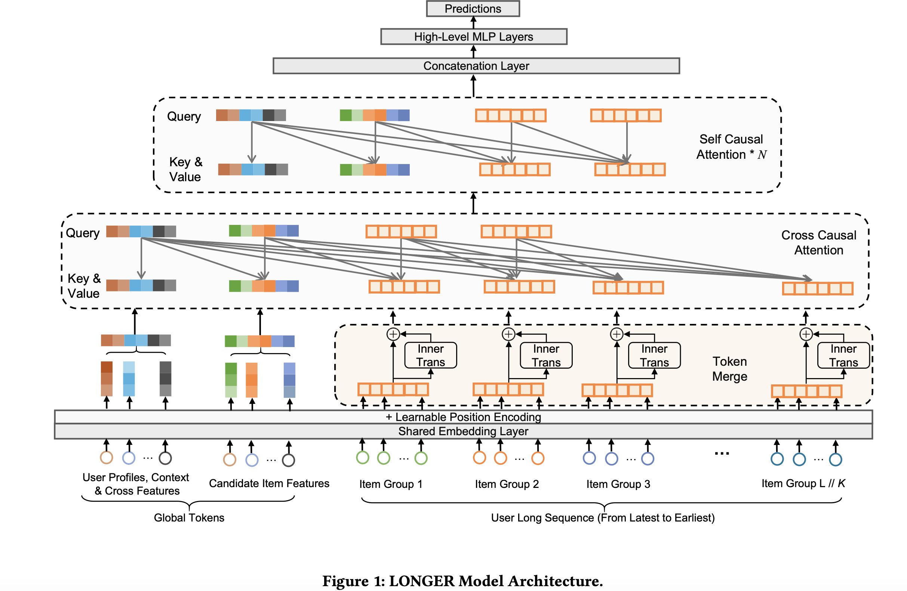

# LONGER: Scaling Up Long Sequence Modeling in Industrial Recommenders

Published at **RecSys 2025** by ByteDance (Douyin Ads / E-Commerce teams), **LONGER (Long-sequence Optimized traNsformer for GPU-Efficient Recommenders)** is an **end-to-end** ultra-long user behavior sequence modeling framework that scales sequence length to **10,000** in a single-stage transformer — deliberately abandoning the two-stage retrieval paradigm of [[SIM]] and [[TWIN]]. Its thesis: with modern GPU infrastructure, the field can finally stop retrieving subsequences and instead *attend over the whole sequence directly*, provided the architecture is aggressively compressed (token merge, query sampling) and the system is co-designed for it (synchronous GPU training, KV cache serving). Deployed across dozens of ByteDance scenarios serving billions of users.

> [!info] Core Thesis
> Two-stage retrieval (SIM/TWIN), pre-trained user embeddings, and memory-augmented models all sacrifice raw full-sequence information via upstream-downstream inconsistency or indirect perception — they are *intermediate stages* in the evolution toward end-to-end long-sequence modeling. LONGER shows that an end-to-end transformer over 10K-length sequences is not only feasible at industrial scale but exhibits **power-law scaling** in sequence length, parameters, and FLOPs — and wins on both offline AUC and online business metrics.

---

## 1. The Problem: Escaping the Two-Stage Paradigm

Industrial long-sequence modeling has three dominant strategies, all of which LONGER positions as compromises:

| Strategy | Representatives | Weakness |
| :--- | :--- | :--- |
| **Two-stage retrieval** | [[SIM]], [[TWIN]], TWIN V2 | Retrieve top-$k$ (~$10^2$) then model short sequence; upstream-downstream inconsistency (see [[TWIN]] for the GSU–ESU gap) |
| **Pre-trained user embeddings** | S3-Rec, UniSRec-style | Condense the whole sequence into one UE in a source model; downstream model only perceives the sequence *indirectly* |
| **Memory-augmented models** | MIMN, LMN, MARM | External memory slots need long training periods to accumulate hit rates |

The enabling context: LLM scaling laws (GPT, and in-recsys HSTU / Wukong) plus GPU advances make it possible to "pioneer an end-to-end ultra-long sequence modeling paradigm." LONGER is ByteDance's answer, alongside its sibling system [[STCA]] (which achieves linear-in-$L$ cost via stacked target cross-attention — a different architectural route to the same goal).

**Setup (§3.1):** standard CTR/CVR prediction — $P(y=1 \mid S_u, u_d, v)$ for user behavior sequence $S_u$ of length $L$, user features $u_d$, target item $v$ — trained with plain binary cross-entropy. No auxiliary losses.

---

## 2. Architecture Overview



*Figure 1 of the paper. The full pipeline: global tokens + raw sequence → token merge (InnerTrans) → hybrid attention (cross-causal compression then stacked self-causal layers), with the training/serving optimizations (mixed precision, recompute, KV cache) wrapping it.*

```
Raw behavior sequence S_u (L up to 10K)          Global tokens G (m tokens:
            │                                     target item, UID, CLS, ...)
            ▼                                                │
┌──────────────────────┐                                     │
│ Token Merge (K:1)    │  InnerTrans per group of K          │
│ L → L/K              │◄────────────────────────────────────┤
└──────────┬───────────┘                                     │
           ▼  H ∈ R^{(L/K)×d}                                ▼
┌─────────────────────────────────────────────────────────────┐
│ Input: R = [G; H]  (keys/values — FULL sequence)            │
│ Query: O = [G; H_S]  (global + k SAMPLED recent tokens)     │
└──────────┬──────────────────────────────────────────────────┘
           ▼
┌──────────────────────────────────────┐
│ Layer 1: Cross-Causal Attention      │  O attends over R
│ compress (m+L) → (m+k)               │  causal mask ⇒ seq can't see candidate
└──────────┬───────────────────────────┘  (enables KV Cache serving)
           ▼
┌──────────────────────────────────────┐
│ Layers 2..N: Self-Causal Attention   │  high-order interactions
│ over the (m+k) working set only      │  each followed by FFN
└──────────┬───────────────────────────┘
           ▼
   compressed output → downstream prediction (BCE)
```

The through-line: **compress the sequence (token merge, query sampling) → attend efficiently (hybrid causal attention anchored by global tokens) → make it trainable/servable at scale (sync GPU training, recompute, KV cache).**

---

## 3. Global Tokens (§3.3)

Auxiliary tokens appended to the input with a **full attention receptive field** — they aggregate from and broadcast to the entire sequence.

**Contents** (the paper's list, no further detail given):
1. Target item representation tokens
2. Learnable CLS tokens
3. UID embeddings
4. High-order compressed user–item interaction features *(no concrete examples given — best read as a general interface for any dense, globally-relevant representation)*

**Two functional roles:**
- **Centralized information anchors** — enable feature interaction among user history, context, and candidate item.
- **Attention stabilizers** — mitigate the [[Attention Sink]] effect (per StreamLLM), where deep layers disproportionately dump attention onto early tokens; global tokens act as anchor points preserving attention diversity and long-range dependency modeling.

---

## 4. Token Merge & InnerTrans (§3.4)

### 4.1 The Mechanism

Group every $K$ **adjacent** tokens into one merged token: $L \to L/K$ (spatial compression). Adjacency preserves local semantics — temporally close behaviors get merged together. Two merge options:

- **Concat**: concatenate the $K$ embeddings in a group (dim $d \to Kd$).
- **InnerTrans**: run a lightweight Transformer block *within* each group, $\mathbf{M}_i = \text{TransformerBlock}([\mathbf{e}_i^1, ..., \mathbf{e}_i^K])$, capturing intra-group interactions that plain concatenation misses. Cheap because each block sees only $K$ small-dim tokens.

### 4.2 Complexity Analysis

Vanilla transformer layer: $\text{FLOPs} = 24Ld^2 + 4L^2d$. After merging, the quadratic (attention) term shrinks by $K$ while the linear term grows by $K$ (merged dim is $Kd$):

$$\frac{\text{FLOPs}_{\text{merge}}}{\text{FLOPs}_{\text{vanilla}}} = \frac{24Ld^2K + 4L^2d/K}{24Ld^2 + 4L^2d} = \frac{6dK + L/K}{6d + L}$$

In the industrial regime $L \gg d$ (typically $L=2000$, $d=32$ — note how small $d$ is vs. LLMs), the $L/K$ term dominates, so merging is a big net win. At $L=2048$, $d=32$, $K=4$: **587M → 336M FLOPs (−42.8%)**.

**Parameter trade-off:** merging *increases* parameters, $\Theta_{\text{merge}} = 12K^2d^2 + 13Kd$ vs. vanilla $12d^2 + 13d$, because projections now operate on $Kd$-dim inputs. The paper frames this as a feature: saved compute is reinvested as capacity/expressiveness.

> [!tip] Merge as denoising
> The ablation shows TokenMerge doesn't just cut FLOPs — it *improves* AUC over no-merge (see §7.2). Ultra-long behavior sequences are noisy; local compression acts as a useful denoising prior.

---

## 5. Hybrid Attention: The LONGER Model Structure (§3.5)

### 5.1 Input Generation & Query Sampling

Sequence tokens get two positional signals (fusion methods differ — see [[Positional Encoding]]):
- **Absolute time-difference feature** (temporal distance from each interaction to the target item) — *concatenated* to each item embedding as side info.
- **Learnable absolute positional embedding** (position within the sequence) — *added* to the item embedding.

*(The paper specifies nothing further: no dimensionality, bucketing, or ablation for either.)*

After an input MLP: $\mathbf{R} = [\mathbf{G}; \mathbf{H}] \in \mathbb{R}^{(m+L)\times d}$ where $\mathbf{H}$ is the **full** (merged) sequence. The compression happens on the **query side only**:

$$\mathbf{O} = [\mathbf{G}; \mathbf{H}_{\mathbf{S}}]$$

where $\mathbf{H}_{\mathbf{S}} \in \mathbb{R}^{k \times d}$ is $k$ tokens **sampled** from $\mathbf{H}$. This query-compression idea echoes Perceiver and Q-Former (learnable tokens), but empirically **recent-$k$ sampling wins** (see §7.2). Motivating observation: performance has strong marginal effects in query count — 40% of tokens retain >95% of the gain at ~50% FLOPs.

> [!note] Two separate compression stages — don't conflate them
> **Token merge** (§3.4) is deterministic: every $K$ adjacent tokens merge, nothing dropped, producing $\mathbf{H}$ of length $L/K$. **Query sampling** (§3.5.1) then selects $k$ of those merged tokens as sequence-side queries. The full merged sequence is always visible as keys/values; only queries are sampled.

### 5.2 Layer 1: Cross-Causal Attention

Queries $\mathbf{O}$ ($m+k$) attend over the full input $\mathbf{R}$ ($m+L$):

$$\text{Attention}(\mathbf{Q},\mathbf{K},\mathbf{V}) = \text{Softmax}\left(\frac{\mathbf{Q}\mathbf{K}^T}{\sqrt{d}} + \mathbf{M}\right)\mathbf{V}, \quad \mathbf{M}_{i,j} = \begin{cases} 0 & j \geq i \\ -\infty & \text{otherwise} \end{cases}$$

The causal mask does double duty:
1. Maintains temporal relevance between sequence items.
2. **Ensures sequence→candidate invisibility** — sequence tokens never attend to the candidate global token, so the sequence's K/V is candidate-independent. This is precisely what makes [[KV Cache]] serving valid (§6.3). The mask is *engineered for cacheability*.

Followed by an FFN.

### 5.3 Layers 2..N: Self-Causal Attention

Stacked self-causal attention blocks (each + FFN) operate **only on the compressed $(m+k)$-token working set** — the full $L$-length sequence never appears again after layer 1. This is where the big savings come from: cost scales with $(m+k)^2$, not $L^2$. Global tokens keep anchoring every layer, fusing candidate signals into sequence representations (subject to the causal mask).

### 5.4 The Pattern

$$\underbrace{\text{CrossAttn}(\mathbf{O},\mathbf{R})}_{\text{compress long sequence}} \longrightarrow \underbrace{\text{SelfAttn}(\cdot) \times N}_{\text{high-order interactions}}$$

**"Attend widely once, then refine deeply."** The first layer compresses; the rest capture high-order dependencies cheaply because the sequence is already short.

### 5.5 After the Attention Stack (mostly unspecified)

Each attention layer is followed by an FFN (standard block). Beyond that, the paper only says the stack "produces a compressed output ... used for the downstream prediction task." **Not specified:** how the $(m+k)$ outputs are pooled/selected into a prediction vector, the prediction-head architecture, or how $u_d$ features combine before the final sigmoid. (Typical industrial-paper omission; the plausible design is target-item global token output → MLP → sigmoid, but that's inference, not stated.)

---

## 6. Training & Deployment Optimization (§3.6)

### 6.1 Fully Synchronous GPU Training Framework

- **Unified dense + sparse parameter storage on GPU machines — no external Parameter Server.** Both updated synchronously across runners (data ingested batch/stream, preprocessed by the "Fountain" module).
- **Hierarchical sparse embedding storage** matched to recommendation feature frequency: hot → GPU **HBM**, warm → CPU **MEM**, cold → local **SSD**.
- Co-locating compute and parameters cuts communication overhead and staleness → better throughput and convergence stability.

### 6.2 Mixed Precision + Activation Recompute

- **BF16/FP16 mixed precision**, configurable per-component (high precision where critical, low elsewhere).
- **Activation recomputation**: reverse-mode autodiff normally stores all forward activations (memory bottleneck); LONGER discards selected activations and recomputes them in the backward pass. Native TensorFlow lacks this, so it's implemented via `custom_gradient` with code-level annotations.
- Net effect in production: **+18% throughput, −16% training time, −18% memory** (up to −28% memory in dense layers).

### 6.3 KV Cache Serving

Motivated by **M-FALCON** (from the [[HSTU]] paper) — LONGER explicitly does *not* claim to invent KV caching, which is standard in LLMs (see [[KV Cache]]). The adaptation: when scoring many candidates for one user, the user sequence is shared, so its K/V can be computed once and reused.

Two-stage inference:
1. Precompute and cache the user sequence's key–value tensors.
2. Per candidate, compute only the attention between the candidate's global token and the cached sequence K/V.

Valid **because** of the §5.2 causal mask (sequence can't see candidate → sequence K/V is candidate-independent). Effect: online serving throughput degradation cut from **−40% to −6.8%**.

> [!note] Lineage of the technique
> KV cache: original Transformer era (2017), ubiquitous with GPT-style decoding → M-FALCON (Meta, HSTU 2024) adapted it to recommendation micro-batch inference → LONGER industrializes it, with masking designed for cacheability. A recurring LONGER pattern: borrow proven LLM techniques (attention sinks from StreamLLM, query compression from Perceiver/Q-Former, KV cache from M-FALCON) and industrialize them.

---

## 7. Experiments

### 7.1 Setup

- **Task:** CVR prediction, Douyin Ads. **5.2B samples over 130 days** (2024-10-16 → 2025-02-23); first 123 days train, last 7 eval (temporal split, no future leakage).
- Sequences include page views, clicks, conversions. Trained on 48×A100.
- Baselines: short-seq (TWIN, DIN-Recent50) and long-seq (SumPooling, DIN, HSTU, Transformer).

### 7.2 Offline Results & Ablations

**Main table (Table 1):** LONGER wins across the board. At this scale, 0.1% AUC is online-significant.

| Method | AUC ↑ | LogLoss ↓ | ΔAUC |
| :--- | :--- | :--- | :--- |
| Base | 0.83968 | 0.48758 | — |
| SumPooling | 0.84201 | 0.48538 | +0.28% |
| [[TWIN]] | 0.84472 | 0.48168 | +0.60% |
| [[DIN]] (Recent50) | 0.84698 | 0.47830 | +0.87% |
| DIN | 0.84982 | 0.47452 | +1.21% |
| [[HSTU]] | 0.84994 | 0.47490 | +1.22% |
| Transformer | 0.85111 | 0.47293 | +1.36% |
| **LONGER** | **0.85290** | **0.47103** | **+1.57%** |

**Token merge ablation (seq 2000):** merge improves accuracy *and* cuts FLOPs; InnerTrans adds a further gain.

| Config | FLOPs (×10⁹) | AUC | ΔAUC |
| :--- | :--- | :--- | :--- |
| w/o Merge (2000) | 3.73 | 0.85111 | +1.36% |
| +TokenMerge4 (Concat, 500) | 2.13 | 0.85232 | +1.51% |
| +TokenMerge8 (Concat, 250) | 3.03 | 0.85291 | +1.58% |
| + InnerTrans | 3.52 | **0.85332** | **+1.63%** |

**Query number $k$ (recent-$k$):** diminishing returns — $k=100$ hits AUC 0.85290 at 1.91G FLOPs, within a hair of $k=250$ (0.85332) at 54% of the FLOPs. $k=100$ is the deployment sweet spot.

**Query selection strategy** — recency is the strongest signal; learnable queries (the Perceiver/Q-Former fashionable choice) are *worst*:

| Strategy | AUC |
| :--- | :--- |
| Learnable 100 | 0.84946 |
| Uniform 100 | 0.85183 |
| Recent50 + Unif50 | 0.85255 |
| **Recent 100** | **0.85290** |

### 7.3 Scaling Analysis

Performance follows $y = \alpha x^{\beta} + \gamma$:
- **Sequence length:** power-law gains; deeper models benefit more from longer sequences, but with diminishing returns in depth.
- **Parameters** (scale hidden dim, 2 layers, seq 2000): strong power law, $R^2 = 0.987$, no saturation in range.
- **FLOPs** (vary layers & length, $d=32$): strong power law, $R^2 = 0.967$.

→ An industrial-level **scaling law** for recommendation, echoing HSTU/Wukong.

### 7.4 Online A/B Tests

**Douyin Ads** (ADSS = Advertiser Score, ADVV = Advertiser Value):

| Format | ADSS | ADVV |
| :--- | :--- | :--- |
| Live Streaming | +1.063% | +1.168% |
| Short Video | +2.097% | +2.151% |
| Mall | +1.816% | +1.407% |

**Douyin E-Commerce:**

| Format | Order/U | GMV/U |
| :--- | :--- | :--- |
| Live Streaming | +7.9222% | +6.5404% |
| Short Video | +4.6125% | +5.2771% |

---

## 8. LONGER in the Long-Sequence Landscape

| | Paradigm | Sequence handling | Consistency |
| :--- | :--- | :--- | :--- |
| [[SIM]] | Two-stage retrieval | GSU retrieves top-$k$, ESU models short seq | ✗ (inconsistent GSU) |
| [[TWIN]] | Two-stage retrieval | Both stages share one MHTA metric | ✓ (structure + params) |
| [[STCA]] | End-to-end | Stacked target cross-attention, $O(L)$ | ✓ (no retrieval) |
| **LONGER** | **End-to-end** | **Full-seq keys/values + compressed queries, hybrid causal attention** | ✓ (no retrieval) |

LONGER and [[STCA]] are ByteDance's two end-to-end answers to the same problem — STCA compresses via target-conditioned cross-attention (queries = targets), LONGER via token merge + recent-$k$ query sampling + global tokens. Both validate recsys scaling laws at 10K length.

---

## 9. Key Takeaways

1. **End-to-end beats retrieval at scale.** LONGER abandons two-stage retrieval entirely, arguing SIM/TWIN-style approaches are intermediate steps; with the right compression + system co-design, attending over the full 10K sequence directly is both feasible and better.
2. **Compression is two-stage and asymmetric.** Token merge (deterministic, $L \to L/K$) shortens everything; query sampling (recent-$k$) shrinks only the query side. The full sequence stays visible as keys/values — you compress *queries*, not *information access*.
3. **Recency beats learned queries.** Recent-$k$ sampling outperforms Perceiver/Q-Former-style learnable queries — a notable negative result for a fashionable technique, and strong evidence that recency dominates user intent.
4. **Token merge is a free lunch (even better than free).** It cuts ~43% FLOPs *and* improves AUC (denoising prior), while its parameter expansion converts saved compute into capacity.
5. **The causal mask is engineered for serving.** Sequence→candidate invisibility isn't just temporal hygiene — it's what makes the user-sequence KV cache candidate-independent, cutting serving throughput degradation from −40% to −6.8%.
6. **Industrial recsys has scaling laws too.** Power-law gains in sequence length, parameters, and FLOPs ($R^2 \approx 0.97$–$0.99$) — the LLM scaling playbook transfers.

---

## Related Wiki Pages
* [[LONGER]]: Entity page for the architecture.
* [[SIM Summary]] / [[SIM]]: Two-stage retrieval predecessor LONGER positions against.
* [[TWIN Summary]] / [[TWIN]]: The consistency-fixed two-stage model; LONGER's main baseline contrast.
* [[Douyin STCA Summary]] / [[STCA]]: ByteDance's sibling end-to-end long-sequence system (target cross-attention route).
* [[DIN Summary]] / [[DIN]]: Target-attention origin; baseline here.
* [[HSTU]]: Meta's generative-recommender transducer; source of the M-FALCON KV-cache idea.
* [[KV Cache]]: The serving optimization LONGER adapts from LLMs.
* [[Attention Sink]]: The StreamLLM effect global tokens mitigate.
* [[Positional Encoding]]: Context for LONGER's two PE signals (time-diff concat + learnable add).
* [[Why is Attention divided by Root d_k]]: The $\sqrt{d}$ scaling in the attention score.
* [[RankMixer]]: Another ByteDance ranking-efficiency architecture (MFU focus).
