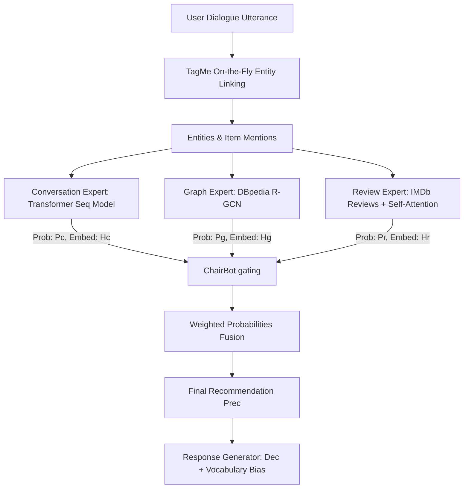

# Multi-Type Context-Aware Conversational Recommender Systems (MCCRS)

Published in April 2025 by researchers from the University of Electronic Science and Technology of China (UESTC), Tongji University, and Southwestern University of Finance and Economics, **MCCRS** introduces an elegant solution to the challenge of data heterogeneity in Conversational Recommender Systems. It leverages a **Mixture-of-Experts (MoE)** architecture coordinated by a **ChairBot** to fuse multi-type structured and unstructured external sources.

## Core Motivation

Conversational recommendation dialogues are typically short and contain limited contextual information. While incorporating external sources (such as knowledge graphs or item reviews) is standard practice, combining these highly heterogeneous data types presents major challenges:
1. **Semantic Gap & Heterogeneity:** Knowledge graphs are structured facts (triples), whereas conversations and item reviews are unstructured natural language. Fusing them into a unified semantic space is difficult.
2. **Limitations of Contrastive Learning:** While contrastive learning can align different data types, it strictly requires identical entity overlapping across all sources to calculate the contrastive loss, which is rarely fulfilled in practice.

**MCCRS** resolves this by modeling each data source using a dedicated, specialized domain expert and dynamically coordinating their predictions using a neural **ChairBot** gating network.

---

## Architectural Breakdown

MCCRS consists of a **ChairBot** and **three specialized experts**, each modeling a distinct type of contextual information.

### 1. Conversation Expert
*   **Sequential Modeling:** Extracts mentioned items and item-related entities to form a user interaction sequence.
*   **Cloze Task Pre-training:** Applies a Cloze-task training scheme (randomly masking a portion of the sequence) and puts them through a sequential Transformer to predict masked items.
*   **Outputs:** Predicts raw item distribution $P_C(i)$ and hidden embeddings $\mathbf{h}_k^N$ representing dialogue context.

### 2. Graph Expert
*   **Relational Modeling:** Incorporates DBpedia structural and relational knowledge. It pre-trains entity/item representations offline using a **Relational Graph Convolutional Network (R-GCN)** over entity-relation triples.
*   **On-the-Fly Linking:** Uses **TagMe** at runtime to map dialogue entities to the DBpedia subgraph.
*   **Self-Attention Pooling:** Aggregates active R-GCN entity embeddings using self-attention to construct user profile graph representations $\mathbf{n}_{e_u}$, outputting a recommendation distribution $P_G(i)$.

### 3. Review Expert
*   **Textual Augmentations:** Sourced external IMDb user reviews for movies to enrich subjective context.
*   **Hierarchical Encoding:** First encodes reviews sentence-by-sentence via a standard Transformer, then applies sentence-level self-attention to generate final item review embeddings $\mathbf{v}_{R_i}$.
*   **User Modeling:** Aggregates reviews of active dialogue entities using self-attention to compute user review representation $\mathbf{v}_{R_u}$, outputting a distribution $P_R(i)$.

### 4. Mixture-of-Experts Recommender (ChairBot)
*   **Concatenation:** Concatenates hidden embeddings and predictions for each expert: $\mathbf{h}_b = \mathbf{h}_i^b \oplus \mathbf{p}_i^b$ for $b \in \{C, G, R\}$.
*   **Dynamic Importance Scores:** A Multi-Layer Perceptron (MLP) computes normalized gating scores representing expert authority in the active context:
    $$\lambda_b = \frac{\beta_b}{\beta_C + \beta_G + \beta_R} \quad \text{where} \quad \beta_b = \text{MLP}(\mathbf{h}_b)$$
*   **Probability Fusion:** The final recommendation probabilities are a weighted combination of the experts' outputs:
    $$P_{rec}(i) = \lambda_C P_C(i) + \lambda_G P_G(i) + \lambda_R P_R(i)$$

### 5. Response Generator
*   A standard Transformer decoder enhanced with multiple cross-attention layers to merge the pre-trained entity representations from all three experts.
*   Uses the recommendation probabilities to inject **recommendation-aware vocabulary bias**, ensuring the generated replies are semantically consistent with the recommended items.

---

## Key Empirical Findings

1. **State-of-the-Art Performance:** MCCRS achieves significant improvements (Recall@1, 10, 50) over strong CRS baselines (like KBRD, KGSF, RevCore, and $\text{C}^2$-CRS) on both the **ReDial** and **INSPIRED** benchmarks.
2. **Mitigating Heterogeneity:** The ChairBot MoE structure elegantly bypasses the need for shared-entity contrastive loss, making it highly robust to data sparsity and missing reviews.
3. **Traceability and Interpretability:** Because each expert operates in a localized semantic domain, the gating weights $\lambda_b$ assigned by the ChairBot offer clear tracing of *which* information source (dialogue context, graph structure, or item review) was responsible for a specific recommendation.

---

## Related Concept Links
*   [[MCCRS]]: Detailed architectural and entity specification of the MCCRS model.
*   [[R-GCN]]: The mathematics, message-passing mechanics, and training objectives of Relational Graph Convolutional Networks.
