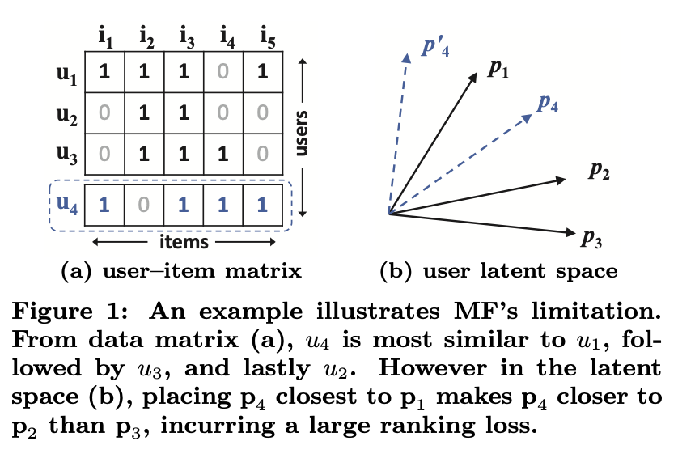
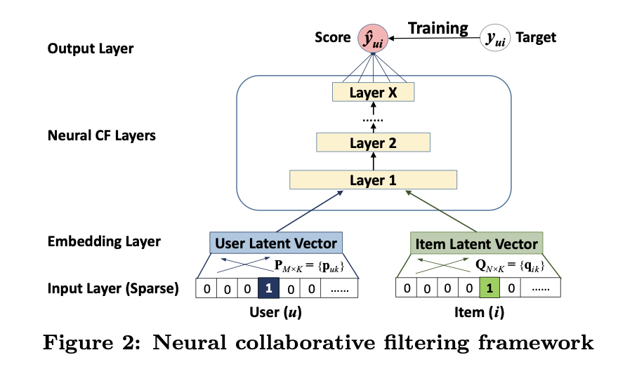
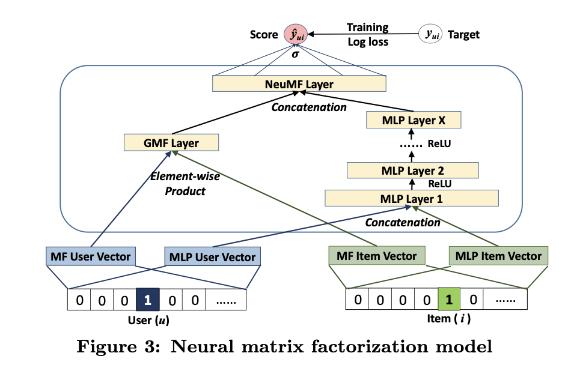

# Neural Collaborative Filtering (NCF)

Published in 2017 (WWW) by Xiangnan He, Lizi Liao, Hanwang Zhang, Liqiang Nie, Xia Hu, and Tat-Seng Chua, **Neural Collaborative Filtering (NCF)** is a general framework that replaces matrix factorization's **fixed inner product** with a **learned neural interaction function** for recommendation from **implicit feedback**. It is the canonical ancestor of the "embedding + MLP" two-tower paradigm in modern recommenders.

> [!info] Core Thesis
> MF models user–item interaction as an inner product of latent vectors — a fixed, linear function that assumes latent dimensions are independent and equally weighted. This rigidity can distort similarity structure in low-dimensional spaces. NCF instead **learns the interaction function from data** with a neural network, subsuming MF as a special case and adding non-linear capacity via an MLP.

---

## 1. Preliminaries & Motivation

### 1.1 Learning from Implicit Data

Define the user–item interaction matrix $\mathbf{Y} \in \mathbb{R}^{M \times N}$ from implicit feedback:

$$y_{ui} = \begin{cases} 1, & \text{if interaction } (u, i) \text{ is observed;} \\ 0, & \text{otherwise.} \end{cases}$$

**The noise problem:** $y_{ui} = 1$ does not mean user $u$ *likes* item $i$, and $y_{ui} = 0$ does not mean dislike — the user may simply be unaware of the item. Implicit feedback provides only noisy signals with a natural scarcity of negative feedback.

**Formalization.** Recommendation becomes estimating scores for unobserved entries to rank items. Any model-based approach learns:

$$\hat{y}_{ui} = f(u, i \mid \Theta)$$

where $f$ is the **interaction function** — the central object the paper sets out to learn rather than handcraft.

**Two loss families:**
- **Pointwise loss** — regression with squared loss; handle missing negatives by treating all unobserved entries as negative, or by sampling them.
- **Pairwise loss** — maximize the margin between observed and unobserved entries (e.g., BPR).

NCF parameterizes $f$ itself with a neural network, so it naturally supports both paradigms.

**MF variants for implicit feedback (three loss strategies).** The same MF model class can be trained three ways to cope with missing negatives — this is the landscape NCF's log loss competes in:

| Strategy | Idea | Representative methods |
| :--- | :--- | :--- |
| **Pointwise squared loss** | Regression on $y_{ui}$; treat all unobserved as negative (or sample), optionally weighted | WMF (uniform weighting), eALS (popularity-weighted, SOTA) |
| **Pairwise loss** | Maximize margin between observed and unobserved entries | BPR |
| **Pointwise log loss** | Treat $y_{ui}$ as a binary label, $\hat{y}_{ui}$ as P(relevant); minimize binary cross-entropy | **NCF** (GMF/MLP/NeuMF) |

NCF's GMF beating BPR (same MF model class, log loss vs. pairwise) is the direct evidence that the log-loss treatment is superior for implicit data (Section 4.2).

**Evaluation protocol.** Standard for implicit-feedback item recommendation: **leave-one-out** (hold out each user's latest interaction as test), rank the test item among ~100 randomly sampled negatives, and measure **HR@K** (is the test item in top-K) and **NDCG@K** (position-aware).

### 1.2 Why the Inner Product Fails

MF estimates interaction as the inner product $\hat{y}_{ui} = \mathbf{p}_u^T \mathbf{q}_i = \sum_{k=1}^{K} p_{uk} q_{ik}$ — a **linear** model assuming latent dimensions are independent and equally weighted.

*Figure 1: An example illustrating MF's limitation. From the data matrix (a), $u_4$ is most similar to $u_1$, then $u_3$, then $u_2$. But in the latent space (b), placing $\mathbf{p}_4$ closest to $\mathbf{p}_1$ forces $\mathbf{p}_4$ nearer to $\mathbf{p}_2$ than to $\mathbf{p}_3$, incurring a large ranking loss.*

**The counterexample (worked).** Reading Figure 1(a) as sparse binary vectors over items $\{i_1, \dots, i_5\}$:

| | $i_1$ | $i_2$ | $i_3$ | $i_4$ | $i_5$ |
|---|---|---|---|---|---|
| $u_1$ | 1 | 1 | 1 | 0 | 0 |
| $u_2$ | 1 | 1 | 0 | 0 | 0 |
| $u_3$ | 1 | 0 | 1 | 0 | 0 |
| $u_4$ | 1 | 1 | 1 | 1 | 0 |

Using **Jaccard similarity** on the interaction sets as ground truth (set-overlap is the natural, model-independent measure for binary implicit data; cosine on latent vectors would be circular since that is what MF *produces*):

- $s_{23}(0.66) > s_{12}(0.5) > s_{13}(0.4)$ — fixes the angular layout of $\mathbf{p}_1, \mathbf{p}_2, \mathbf{p}_3$.
- $s_{41}(0.6) > s_{43}(0.4) > s_{42}(0.2)$ — $u_4$ differs from $u_1$ by a single item, so they should be neighbors.

But in 2-D latent space, placing $\mathbf{p}_4$ closest to $\mathbf{p}_1$ geometrically forces $\mathbf{p}_4$ closer to $\mathbf{p}_2$ than to $\mathbf{p}_3$ — contradicting the true ordering. A fixed inner product in low dimensions imposes rigid metric constraints that arbitrary set-overlap orderings cannot satisfy.

**Why not just scale up $K$?** More latent factors can fix expressiveness but hurt generalization (overfitting), especially on sparse data. The paper's fix: **learn the interaction function** with DNNs.

---

## 2. The NCF Framework

*Figure 2: The neural collaborative filtering framework — sparse input → embedding layer → neural CF layers → predicted score.*

### 2.1 Architecture (bottom-up)

1. **Input layer.** Feature vectors $\mathbf{v}^U_u$ and $\mathbf{v}^I_i$ describe the user and item. In this paper they are **one-hot encodings of the ID only** (pure CF) — $\mathbf{v}^U_u \in \{0,1\}^M$ with a single 1 at position $u$, and $\mathbf{v}^I_i \in \{0,1\}^N$ likewise. The interaction history $\mathbf{Y}$ enters only through training targets, not inputs. The framework is generic: content/context/neighbor features can be swapped in to address cold-start.

2. **Embedding layer.** A fully connected projection of the one-hot vector — equivalently a **row lookup** into latent factor matrices $\mathbf{P} \in \mathbb{R}^{M \times K}$, $\mathbf{Q} \in \mathbb{R}^{N \times K}$:

$$\mathbf{p}_u = \mathbf{P}^T \mathbf{v}^U_u, \qquad \mathbf{q}_i = \mathbf{Q}^T \mathbf{v}^I_i$$

The embeddings *are* the classical MF latent vectors, learned end-to-end.

3. **Neural CF layers.** A multi-layer architecture mapping latent vectors to a prediction score. Each layer can be customized to discover particular interaction structures. The dimension of the **last hidden layer $X$** determines model capacity (called **predictive factors** in experiments).

4. **Output layer.** Produces $\hat{y}_{ui}$, trained by minimizing pointwise loss against the binary target $y_{ui}$.

**Formal model:**

$$\hat{y}_{ui} = f\big(\mathbf{P}^T \mathbf{v}^U_u, \mathbf{Q}^T \mathbf{v}^I_i \mid \mathbf{P}, \mathbf{Q}, \Theta_f\big) = \phi_{out}\big(\phi_X(\dots \phi_2(\phi_1(\mathbf{P}^T \mathbf{v}^U_u, \mathbf{Q}^T \mathbf{v}^I_i))\dots)\big)$$

### 2.2 Learning NCF: Probabilistic Treatment of Implicit Feedback

Squared loss assumes Gaussian targets — a poor fit for binary implicit data. Instead, NCF treats $y_{ui}$ as a **label** (1 = relevant, 0 = not) and $\hat{y}_{ui}$ as the **probability** of relevance, constrained to $[0,1]$ by a sigmoid output activation.

**Likelihood** (Bernoulli over observed + sampled-negative entries):

$$p(\mathcal{Y}, \mathcal{Y}^- \mid \mathbf{P}, \mathbf{Q}, \Theta_f) = \prod_{(u,i) \in \mathcal{Y}} \hat{y}_{ui} \prod_{(u,j) \in \mathcal{Y}^-} (1 - \hat{y}_{uj})$$

**Objective** — the negative log-likelihood is exactly **binary cross-entropy (log loss)**:

$$L = -\sum_{(u,i) \in \mathcal{Y} \cup \mathcal{Y}^-} y_{ui} \log \hat{y}_{ui} + (1 - y_{ui}) \log(1 - \hat{y}_{ui})$$

optimized with SGD. Recommendation with implicit feedback is recast as **binary classification**.

**Negative sampling.** Negatives $\mathcal{Y}^-$ are uniformly sampled from unobserved entries each iteration, with a tunable ratio per positive. Pointwise log loss allows flexible sampling ratios — unlike pairwise losses, which pair exactly one negative per positive. (Popularity-biased sampling is left as future work.)

---

## 3. Three Instantiations

The framework's generality is demonstrated by three models that share embeddings, log loss, and training loop — differing only in the neural CF layers.

### 3.1 GMF — Generalized Matrix Factorization

Shows MF is a **special case** of NCF. Let the first neural CF layer be the element-wise product:

$$\phi_1(\mathbf{p}_u, \mathbf{q}_i) = \mathbf{p}_u \odot \mathbf{q}_i$$

then project to output:

$$\hat{y}_{ui} = a_{out}\big(\mathbf{h}^T (\mathbf{p}_u \odot \mathbf{q}_i)\big)$$

With **identity** $a_{out}$ and **h = 1** (uniform), this *exactly recovers MF*. GMF generalizes it by learning $\mathbf{h}$ from data (allowing varying importance of latent dimensions) and using a **sigmoid** $a_{out}$ (non-linear MF). Result: a weighted, non-linearized inner product.

### 3.2 MLP — Multi-Layer Perceptron

Concatenation alone models no interaction, so hidden layers are stacked on the concatenated vector to learn the interaction function:

$$\mathbf{z}_1 = \begin{bmatrix} \mathbf{p}_u \\ \mathbf{q}_i \end{bmatrix}, \qquad \phi_x(\mathbf{z}_{x-1}) = a_x(\mathbf{W}_x^T \mathbf{z}_{x-1} + \mathbf{b}_x), \qquad \hat{y}_{ui} = \sigma\big(\mathbf{h}^T \phi_L(\mathbf{z}_{L-1})\big)$$

- **Activation:** ReLU — sigmoid saturates, tanh only partly alleviates it; ReLU is non-saturated and encourages sparse activations (well-suited to sparse data, less overfitting). Empirically ReLU > tanh > sigmoid.
- **Structure:** tower pattern, halving layer size each successive layer (e.g., $32 \rightarrow 16 \rightarrow 8$) so higher layers learn more abstractive features.
- **Critical finding:** MLP-0 (embedding directly projected to prediction, no hidden layers) performs no better than non-personalized ItemPop — proving hidden layers are essential to model interaction.

### 3.3 NeuMF — Fusion of GMF and MLP

*Figure 3: The neural matrix factorization model — GMF and MLP learn separate embeddings; their final representations are concatenated before the output layer.*

To combine the linearity of MF with the non-linearity of MLP, NeuMF lets the two branches **learn separate embeddings** (sharing would force equal embedding sizes, limiting the ensemble) and concatenates their last hidden layers:

$$\phi^{GMF} = \mathbf{p}_u^G \odot \mathbf{q}_i^G$$
$$\phi^{MLP} = a_L\big(\mathbf{W}_L^T(\dots a_2(\mathbf{W}_2^T \begin{bmatrix} \mathbf{p}_u^M \\ \mathbf{q}_i^M \end{bmatrix} + \mathbf{b}_2)\dots) + \mathbf{b}_L\big)$$
$$\hat{y}_{ui} = \sigma\Big(\mathbf{h}^T \begin{bmatrix} \phi^{GMF} \\ \phi^{MLP} \end{bmatrix}\Big)$$

**Pre-training.** Because NeuMF's objective is non-convex, initialization matters. Train GMF and MLP separately to convergence (with Adam), then use their parameters to initialize NeuMF. The only tweak is the output layer, which concatenates the two pre-trained weight vectors:

$$\mathbf{h} \leftarrow \begin{bmatrix} \alpha \, \mathbf{h}^{GMF} \\ (1-\alpha) \, \mathbf{h}^{MLP} \end{bmatrix}$$

with $\alpha = 0.5$ (equal contribution). After pre-training, NeuMF is fine-tuned with **vanilla SGD** (not Adam — Adam needs momentum state that isn't carried over from the pre-trained models).

---

## 4. Experiments

### 4.1 Setup

- **Datasets:** MovieLens (1M ratings → binarized to implicit; 6,040 users / 3,706 items / 95.53% sparsity) and Pinterest (1.5M pins; 55,187 users / 9,916 items / 99.73% sparsity; users filtered to ≥20 interactions).
- **Protocol:** leave-one-out (hold out each user's latest interaction as test); rank the test item among **100 randomly sampled negatives**; metrics **HR@10** and **NDCG@10**.
- **Baselines:** ItemPop, ItemKNN, BPR (pairwise MF), eALS (SOTA MF with squared loss + popularity-weighted all-missing-as-negative). Item–item models (SLIM, CDAE) excluded since NCF targets user–item modeling.
- **Hyperparameters:** log loss with **4 negatives per positive**; Gaussian init ($\mu{=}0, \sigma{=}0.01$); mini-batch Adam; predictive factors $\{8,16,32,64\}$; 3 hidden MLP layers (e.g., factors 8 → architecture $32{\rightarrow}16{\rightarrow}8$, embedding size 16).

### 4.2 Results (RQ1)

Consistent ordering **NeuMF > MLP > GMF** in both training loss and recommendation quality:

- **NeuMF** significantly beats eALS and BPR on both datasets — average relative improvement **4.5%** over eALS and **4.9%** over BPR. On Pinterest, NeuMF with 8 factors already beats eALS/BPR with 64.
- **GMF vs. BPR** is the clean ablation: identical MF model class, but GMF's log loss beats BPR's pairwise loss — direct evidence for the probabilistic binary-classification treatment. GMF also beats eALS at small factors (though it overfits at large ones).
- **MLP** slightly underperforms GMF at 3 layers but improves with more depth.
- All NeuMF improvements over baselines are statistically significant ($p < 0.01$, one-sample paired t-tests).

**Utility of pre-training (Table 2).** NeuMF with pre-training beats the randomly-initialized version in most cases (relative gains 2.2% MovieLens, 1.1% Pinterest) — e.g., MovieLens 64 factors: HR 0.730 vs. 0.705. Only at the smallest factor size (8) on MovieLens is pre-training roughly tied.

### 4.3 Log Loss with Negative Sampling (RQ2)

- Training loss steadily decreases and HR/NDCG improve over iterations; the most effective updates occur in the **first 10 iterations** (more can overfit — NeuMF's loss keeps dropping after 10 while recommendation degrades).
- **Negative sampling ratio:** one negative per positive is insufficient; more negatives help. The **optimal ratio is ~3–6** on both datasets. Beyond ~7 on Pinterest, performance *drops* — too aggressive sampling hurts.
- GMF with ratio 1 is on par with BPR (which pairs one negative per positive); GMF with larger ratios significantly beats BPR — showing the flexibility advantage of pointwise log loss over pairwise objectives.

### 4.4 Is Deep Learning Helpful? (RQ3)

Stacking more layers monotonically helps even at fixed capacity. MovieLens HR@10 with 8 factors:

| MLP-0 | MLP-1 | MLP-2 | MLP-3 | MLP-4 |
|---|---|---|---|---|
| 0.452 | 0.628 | 0.655 | 0.671 | 0.678 |

- The gain comes from **non-linearity**, not depth per se: stacking *linear* (identity-activation) layers performs much worse than ReLU.
- **MLP-0** (no hidden layers) is no better than ItemPop — bare concatenation of latent vectors is insufficient for interaction modeling.

---

## 5. Key Takeaways

1. **Learn the interaction function.** Replacing MF's fixed inner product with a learned neural function is the core contribution — NCF subsumes MF (GMF) and adds non-linear capacity (MLP), fusing both (NeuMF).
2. **Treat implicit feedback as binary classification.** The probabilistic log-loss treatment (sigmoid output + cross-entropy + negative sampling) beats squared-loss and pairwise objectives for the same model class.
3. **Negative sampling ratio matters.** ~3–6 negatives per positive is optimal; too few under-trains, too many hurts.
4. **Depth helps — via non-linearity.** Stacking ReLU layers monotonically improves; linear stacking does not. Hidden layers are what create interaction (MLP-0 ≈ ItemPop).
5. **Pre-training stabilizes the ensemble.** Initializing NeuMF from converged GMF + MLP (then plain SGD) outperforms random initialization.
6. **Framework, not a single model.** Same embeddings, same loss, same training loop — only the neural CF layers differ. NCF is a guideline for developing deep CF methods, and the direct ancestor of two-tower / embedding+MLP recommenders (cf. [[DSSM]], [[DCN]]).

---

## Related Wiki Pages
* [[NCF]]: Detailed architectural entity specification of the NCF framework and its three instantiations.
* [[DSSM Summary]]: Microsoft Research's two-tower semantic-matching model — same embedding+deep-projection shape, but feeding rich text features rather than bare IDs.
* [[DCN Summary]]: Google/Stanford's Deep & Cross Network — another 2017 foundational deep recommendation architecture modeling feature interactions explicitly.
* [[EASE]]: An embarrassingly shallow linear item–item CF alternative with a closed-form solution.
