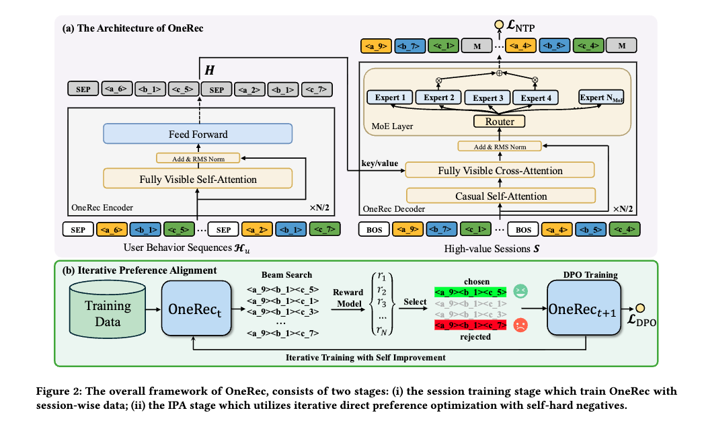

---
tags:
  - recommendation
  - generative-retrieval
  - dpo
  - reinforcement-learning
  - mixture-of-experts
aliases:
  - OneRec
  - Unifying Retrieve and Rank
date: 2026-06-05
sources: ["[[raw/Recommendation/OneRec-Unifying Retrieve and Rank with Generative Recommender and Preference Alignment.pdf]]"]
---

# OneRec: Unifying Retrieve and Rank with Generative Recommender and Preference Alignment



## Abstract
Traditional recommender systems rely on a cascaded multi-stage architecture (Recall $\to$ Pre-ranking $\to$ Ranking) to balance speed and accuracy. **OneRec** (published by **Kuaishou Inc.**, Feb 2025) presents a paradigm shift, replacing this complex, cascaded pipeline with a **single, unified end-to-end generative model**. 

OneRec addresses three key challenges of industrial-scale generative recommendation:
1. **Codebook Imbalance**: Replaces standard RQ-VAE with a customized **[[Balanced K-means]]** clustering algorithm to enforce a perfectly uniform distribution of semantic IDs, eliminating the "hourglass phenomenon" (codebook collapse).
2. **Coherence & Diversity**: Replaces point-wise (next-item) prediction with a **Session-wise List Generation** approach. The model learns to autoregressively decode complete lists of 5-10 videos, modeling item-to-item context directly.
3. **User Preference Alignment**: Adapts Direct Preference Optimization ([[Fine-tuning|DPO]]) to sequential recommendation using a **personalized Reward Model (RM)** and an **Iterative Preference Alignment (IPA)** loop with self-hard negatives.

When deployed in Kuaishou's main feed serving hundreds of millions of daily active users, OneRec achieved a **+1.68% increase in Total Watch Time** and a **+6.56% increase in Average View Duration**, demonstrating its ability to beat highly optimized multi-stage cascades.

---

## 1. Introduction
The traditional **cascade ranking paradigm** partitions recommendation into isolated blocks:
* **Retrieval (Recall)**: Selects top-$10^5$ candidates from a corpus of $10^{10}$ items.
* **Pre-ranking (Coarse-grained)**: Filters candidates down to top-$10^3$.
* **Ranking (Fine-grained)**: Selects top-$10^2$ items for final display.

### The Cascaded Bottleneck
Although practical, cascade models suffer from a fundamental limitation: **isolated optimization**. The upper bound of any downstream ranker is strictly constrained by the performance of preceding stages. Information loss occurs as candidate pools shrink.

### The Generative Alternative (Generative Retrieval - GR)
Generative Retrieval (like [[Transformers|TIGER]]) maps items to discrete semantic IDs and treats recommendation as a sequence-to-sequence generation task. However, prior GR methods only acted as selectors in the *retrieval stage* because their raw sorting accuracy could not match well-designed multi-stage ranking cascades. OneRec is the first unified generative model to successfully replace the entire cascade in production.

---

## 2. Methodology

OneRec utilizes a T5-style **Encoder-Decoder** architecture. The encoder consumes the user's historical behavior sequence, and the decoder autoregressively generates the semantic ID tokens of the recommended list (session).

### 2.1 Balanced K-means Quantization (Solving Hourglass Collapse)
To map a continuous behavior-aligned multimodal item embedding $\mathbf{e}_i \in \mathbb{R}^d$ (derived from QARM) into a discrete sequence of $L = 3$ semantic ID tokens, OneRec replaces standard RQ-VAE with **Balanced K-means Clustering** (Algorithm 1). This enforces a strict cardinality constraint, forcing each cluster to contain exactly the same number of items:
$$|\mathcal{V}_k| = w = \frac{|\mathcal{V}|}{K}$$
Where $K = 8192$ is the codebook size, $\mathcal{V}$ is the video corpus, and $w$ is the target capacity.

```text
================================================================================
Algorithm 1: Balanced K-means Clustering (OneRec Semantic Quantization)
================================================================================
Input: Item set V, number of clusters K
1. Compute w = |V| / K (ideal cluster capacity)
2. Initialize centroids C_l = {c_1, ..., c_K} with random selection
3. Repeat
4.     Initialize unassigned pool U = V
5.     For each cluster k from 1 to K:
6.         Sort U by ascending Euclidean distance from centroid c_k
7.         Assign V_k = U[0 : w - 1] (assign the closest w remaining items)
8.         Update centroid c_k = (1 / w) * Sum_{r in V_k} (r)
9.         Remove assigned items from pool: U = U \ V_k
10.    End
11. Until assignment convergence
Output: Optimized codebook C_l = {c_1, ..., c_K}
================================================================================
```

Using three hierarchical layers ($L=3$), a video's semantic ID is generated as:
$$\text{ID}(v_i) = \langle s^1_i \rangle \langle s^2_i \rangle \langle s^3_i \rangle$$
Where:
$$s^1_i = \arg\min_{k} \| \mathbf{r}^1_i - \mathbf{c}^1_k \|^2_2, \quad \mathbf{r}^2_i = \mathbf{r}^1_i - \mathbf{c}^1_{s^1_i}$$
$$s^l_i = \arg\min_{k} \| \mathbf{r}^l_i - \mathbf{c}^l_k \|^2_2, \quad \mathbf{r}^{l+1}_i = \mathbf{r}^l_i - \mathbf{c}^l_{s^l_i}$$

By structuring the codebook this way, OneRec achieves a colossal address space of $K^L = 8192^3 \approx 5.5 \times 10^{11}$ possible paths with a completely flat (uniform) token distribution, driving random semantic collisions close to zero.

---

### 2.2 Session-wise List Generation & Sparse MoE
Instead of point-wise next-item prediction, OneRec generates a coherent **session** $\mathcal{S} = \{v_1, \dots, v_m\}$ of $m=5$ to $10$ videos in response to a user request.

#### Decoder Formatting
To handle multi-item sequences, OneRec prepends a special boundary delimiter token $s_{\text{[BOS]}}$ before **every single video** in the decoder input:
$$\overline{\mathcal{S}} = \{s_{\text{[BOS]}}, s^1_1, s^2_1, s^3_1, \quad s_{\text{[BOS]}}, s^1_2, s^2_2, s^3_2, \quad \dots \}$$
The decoder is trained using cross-entropy **Next Token Prediction loss ($\mathcal{L}_{\text{NTP}}$)**:
$$\mathcal{L}_{\text{NTP}} = - \sum_{i=1}^m \sum_{j=1}^L \log P\left(s^{j}_{i} \;\middle|\; [s_{\text{[BOS]}}, s^1_1, \dots, s^L_1, \dots, s_{\text{[BOS]}}, \dots, s^{j-1}_i]; \Theta\right)$$

#### Decoder Parameter Scaling with Sparse MoE
To capture complex user preference dynamics without exceeding the computational latency budget during online serving, the feed-forward network (FFN) in the $l$-th decoder layer is replaced with a **Sparse Mixture-of-Experts ([[Sparsely-Gated MoE Layer|MoE]])** layer:
$$H^{l+1}_t = \sum_{i=1}^{N_{\text{MoE}}} g_{i,t} \text{FFN}_i(H^l_t) + H^l_t$$
Where:
* $N_{\text{MoE}} = 24$ total experts.
* Only $K_{\text{MoE}} = 2$ experts are activated per token, determined by the gating values $g_{i,t} = \text{Top2}(\text{Softmax}(H^l_t \mathbf{W}_g^T))$.
* This allows OneRec to scale to **1 Billion total parameters** while only activating **13% of its parameters** per token pass during inference.

---

### 2.3 Iterative Preference Alignment (IPA)

Because a recommender system only gets one chance to display results per user request, it is impossible to collect simultaneous natural positive and negative session pairs for standard DPO. OneRec resolves this by using a **Personalized Reward Model** and an **Iterative DPO Loop**.

```text
================================================================================
Algorithm 2: Iterative Preference Alignment (IPA)
================================================================================
Input: Number of responses N, pretrained RM R(u, S), seed model M_t,
       DPO ratio r_DPO, total epochs T, samples per epoch N_sample
1. For epoch from t to T Do
2.     For sample from 1 to N_sample Do
3.         If rand() < r_DPO Then:  // (r_DPO = 1%)
4.             Generate N responses via current model: S_1^u, ..., S_N^u ~ M_t(H_u)
5.             Score each response using Reward Model: r_i = R(u, S_i^u)
6.             Select best-performing response:  S_w = argmax_i r_i
7.             Select worst-performing response: S_l = argmin_i r_i
8.             Compute combined NTP and DPO loss:
9.                 L = L_NTP + lambda * L_DPO
10.        Else:
11.            Compute standard NTP loss:
12.                L = L_NTP
13.        End
14.        Update model parameters: Theta = Theta - alpha * Grad_Theta(L)
15.    End
16.    Update model snapshot: M_{t+1} = M_t
17. End
Output: Optimized parameters Theta
================================================================================
```

#### 2.3.1 Personalized Reward Model (RM)
The Reward Model $\mathcal{R}(\mathbf{u}, \mathcal{S})$ acts as a simulator of user preference. It processes user $\mathbf{u}$ and candidate session $\mathcal{S}$ as follows:
1. **Target Attention**: Dynamically filters user history with respect to each candidate video to create user-contextualized items: $\mathbf{e}_i = \mathbf{v}_i \odot \mathbf{u}$.
2. **List-Level Contextualization**: Items in the session interact via Self-Attention to capture contrast and redundancy effects: 
   $$\mathbf{h}_f = \text{SelfAttention}(\mathbf{h})$$
3. **Multi-Objective Towers**: Predictions are made on multi-target rewards: Session Watch Time ($\hat{r}_{\text{swt}}$), View-Through Rate ($\hat{r}_{\text{vtr}}$), Write-Comment/Share Rate ($\hat{r}_{\text{wtr}}$), and Like Rate ($\hat{r}_{\text{ltr}}$) via independent sigmoid towers:
   $$\hat{r}_c = \text{Sigmoid}\left(\text{MLP}_c\left(\text{Sum}(\mathbf{h}_f)\right)\right)$$
4. **RM Objective**: Trained offline on historical platform interaction logs using binary cross-entropy loss:
   $$\mathcal{L}_{\text{RM}} = - \sum_{x \in \{\text{swt}, \text{vtr}, \dots\}} \left[ y_x \log(\hat{r}_x) + (1 - y_x) \log(1 - \hat{r}_x) \right]$$

The final scalar reward score $r = \mathcal{R}(\mathbf{u}, \mathcal{S})$ is computed as a weighted sum of these predictions.

#### 2.3.2 Iterative DPO with Self-Hard Negatives
To train the generator $\mathcal{M}_{t+1}$, OneRec performs **beam search** on the current generator snapshot $\mathcal{M}_t$ to decode $N = 128$ candidate session responses. The RM scores each candidate. 

The **highest-scoring candidate** becomes the "chosen" sample ($\mathcal{S}^w_u$), and the **lowest-scoring candidate** becomes the "rejected" sample ($\mathcal{S}^l_u$). These form a self-hard negative pair $\mathcal{D}^{\text{pairs}}_t = (\mathcal{S}^w_u, \mathcal{S}^l_u, \mathcal{H}_u)$.

The model parameters are optimized using the DPO objective:
$$\mathcal{L}_{\text{DPO}} = - \log \sigma \left( \beta \log \frac{\mathcal{M}_{t+1}(\mathcal{S}^w_u \mid \mathcal{H}_u)}{\mathcal{M}_t(\mathcal{S}^w_u \mid \mathcal{H}_u)} - \beta \log \frac{\mathcal{M}_{t+1}(\mathcal{S}^l_u \mid \mathcal{H}_u)}{\mathcal{M}_t(\mathcal{S}^l_u \mid \mathcal{H}_u)} \right)$$

---

## 3. System Deployment
OneRec is deployed at scale in Kuaishou's main feed. The architecture is split into three main components:
1. **The Distributed Training System**: Handles multi-GPU offline training. Employs **XLA (Accelerated Linear Algebra)** and **bfloat16 mixed-precision** to minimize computational footprints.
2. **The Online Serving System**: Consumes live user queries and generates recommendations in real-time. To fit tight SLA latencies, it employs **[[KV Cache]]** decoding with **float16 quantization** and a beam size of 128. Only 13% of the 1B parameters are activated during forward pass due to MoE.
3. **The DPO Sample Server**: Asynchronously generates self-hard negative samples ($\mathcal{S}^w_u, \mathcal{S}^l_u$) using the current generator snapshot $\mathcal{M}_t$ and scores them with the pre-trained Reward Model, avoiding any latency overhead on live recommendation threads.

---

## 4. Experiments and Key Results

### 4.1 Offline Performance Comparison
OneRec was evaluated against strong pointwise and listwise models on a massive industrial short-video dataset:

| Model Class | Model | swt (Mean / Max) | vtr (Mean / Max) | ltr (Mean / Max) |
| :--- | :--- | :--- | :--- | :--- |
| **Pointwise Discriminative** | SASRec | 0.0375 / 0.0803 | 0.4313 / 0.5801 | 0.0314 / 0.0604 |
| **Pointwise Generative** | TIGER-1B | 0.0873 / 0.1368 | 0.5827 / 0.6776 | 0.0323 / 0.0579 |
| **Listwise Generative** | OneRec-1B | \underline{0.0991} / \underline{0.1529} | \underline{0.6039} / \underline{0.7013} | \underline{0.0360} / \underline{0.0660} |
| **Listwise Gen + Alignment** | OneRec-1B + DPO | 0.1014 / 0.1595 | 0.6127 / 0.7116 | 0.0351 / 0.0644 |
| **Listwise Gen + Alignment** | **OneRec-1B + IPA** | **0.1025** / **0.1933** | **0.6141** / **0.7646** | **0.0397** / **0.1203** |

### **Key Observations**
1. **Listwise vs. Pointwise**: OneRec-1B significantly outperforms point-wise generative methods (TIGER-1B) by **+13.5% in swt** and **+14.0% in ltr**. This shows the strength of session-wise list modeling in maintaining contextual coherence.
2. **The Power of IPA**: OneRec-1B+IPA achieves **+26.4% in Max swt** and **+82.2% in Max ltr** compared to the base OneRec-1B model. 
3. **IPA vs. Traditional DPO**: Standard DPO, IPO, and other variants perform significantly worse than IPA. Generating self-hard negatives iteratively from the current snapshot $\mathcal{M}_t$ is critical for robust sequential preference alignment.

---

## 5. Online A/B Tests (Kuaishou Production Feed)
OneRec was deployed against Kuaishou's highly optimized production multi-stage ranking cascade on 1% of live traffic:

| Model Parameter Size | Total Watch Time Improvement | Average View Duration Improvement |
| :--- | :--- | :--- |
| **OneRec-0.1B** | +0.57% | +4.26% |
| **OneRec-1B** | +1.21% | +5.01% |
| **OneRec-1B + IPA** | **+1.68%** | **+6.56%** |

These results are highly significant in a massive industrial feed, translating to millions of hours of additional user engagement and considerable ad revenue increments.

---

## Related Wiki Pages
* [[Balanced K-means]]: Detailed formulation of the uniform-distribution quantization algorithm.
* [[OneRec]]: Concept and high-level architectural page.
* [[Sparsely-Gated MoE Layer]]: The core gating and routing mechanism used to scale OneRec.
* [[KV Cache]]: The inference optimization used to make OneRec deployment feasible under tight online SLAs.
* [[Fine-tuning]]: General background on DPO, RLHF, and post-training alignment.
