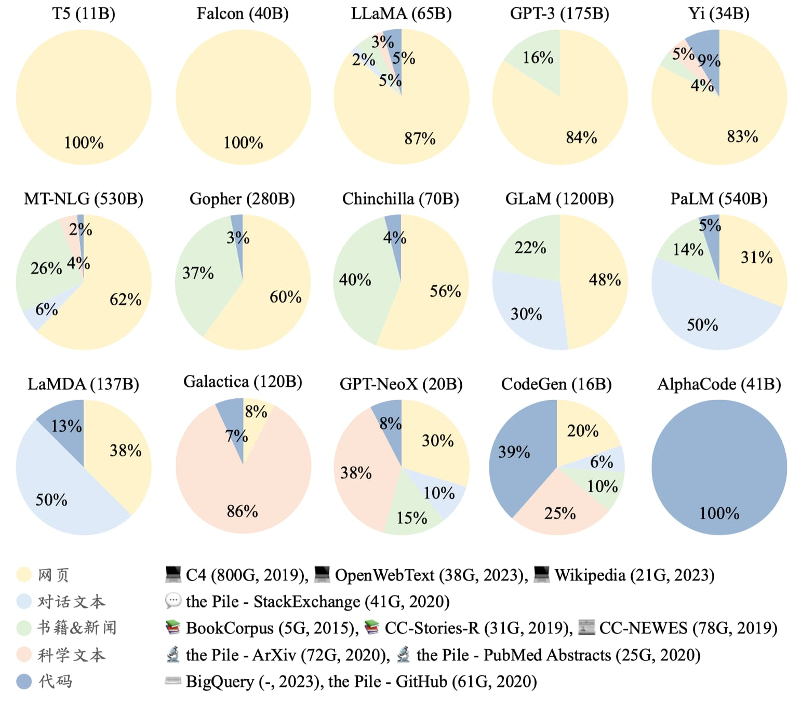
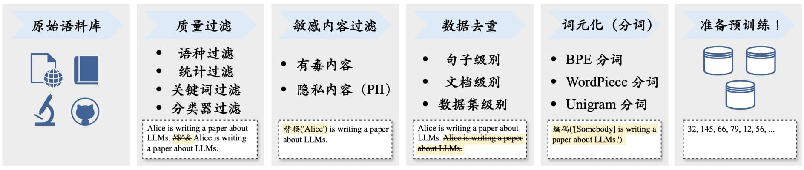
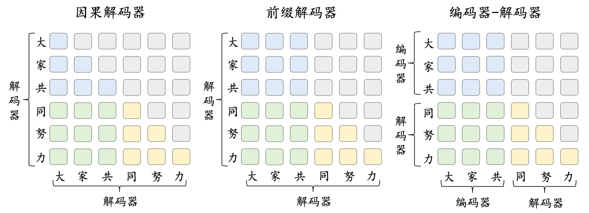
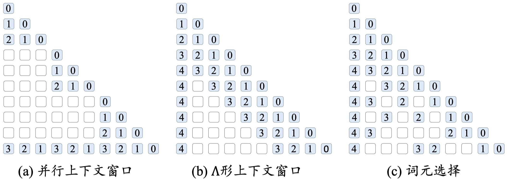
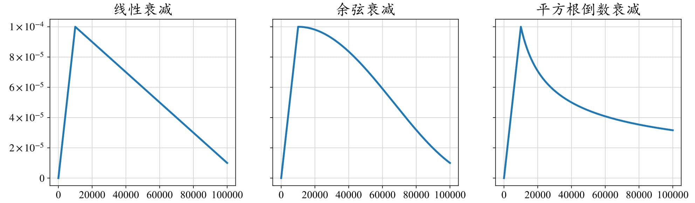
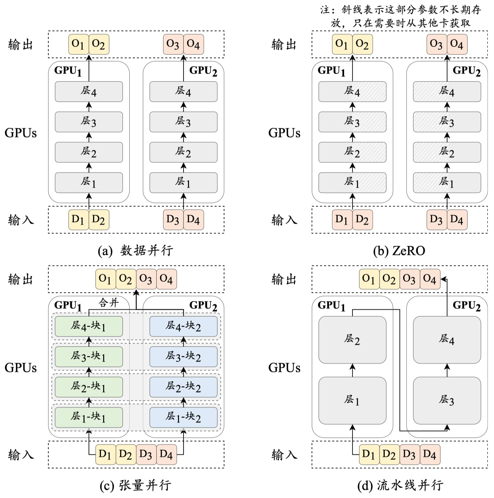

---
tags:
  - llm
  - pretraining
  - data
  - research
aliases:
  - Pre-training Data Sources and Distribution
date: 2026-08-31
sources: ["[[第十五章预训练大语言模型]]"]
---

# Pre-training Large Language Models

This is the summary page for **Chapter 15 (预训练大语言模型)** of the *Transformers 快速入门* tutorial (based on 赵鑫等《大语言模型》, 2024). The chapter walks through the full pre-training pipeline: data preparation (collection, preprocessing, scheduling), model architectures and long-context modeling, pre-training objectives, and optimization/scalable training techniques. All parts are now covered: Part 1 data sources & distribution, Part 2 data preprocessing, Part 3 mainstream architectures, Part 4 long-context modeling, Part 5 data scheduling, Part 6 model pre-training.

## Part 1: Data Preparation — Sources & Distribution

This part covers where LLM pre-training data comes from and how representative models distribute their training corpora across data categories.

### Data Source Taxonomy

Pre-training corpora are mixtures of public text split into two broad classes:

- **General text (通用文本):** large-scale webpages, books, and dialogue — the backbone that builds general language modeling ability.
- **Specialized text (专用文本):** targeted data that boosts specific capabilities:
  - **Multilingual text (多语文本):** builds cross-lingual semantic alignment and adds diversity.
  - **Scientific text (科学文本):** arXiv papers, textbooks, math webpages — improves scientific QA and reasoning; needs special tokenization for formulas and sequences.
  - **Code (代码):** GitHub repos and Stack Exchange-style programming Q&A — improves structured semantic understanding, logical reasoning, and tool use; formatting reasoning tasks as code often yields more accurate results.

### Figure 15-1: Pre-training Data Distribution of Representative LLMs

The figure compares the corpus composition of 15 models (T5, Falcon, LLaMA, GPT-3, Yi, MT-NLG, Gopher, Chinchilla, GLaM, PaLM, LaMDA, Galactica, GPT-NeoX, CodeGen, AlphaCode) and lists representative datasets per category:

| Category | Dataset | Size | Year |
|---|---|---|---|
| **Webpages (网页)** | C4 (Colossal Clean Crawled Corpus) | 800G | 2019 |
| | OpenWebText | 38G | 2023 |
| | Wikipedia | 21G | 2023 |
| **Dialogue (对话文本)** | the Pile – StackExchange | 41G | 2020 |
| **Books & News (书籍&新闻)** | BookCorpus | 5G | 2015 |
| | CC-Stories-R | 31G | 2019 |
| | CC-NEWES | 78G | 2019 |
| **Scientific (科学文本)** | the Pile – ArXiv | 72G | 2020 |
| | the Pile – PubMed Abstracts | 25G | 2020 |
| **Code (代码)** | BigQuery | – | 2023 |
| | the Pile – GitHub | 61G | 2020 |

### Key Observations

- **Webpages dominate general-purpose LLMs.** LLaMA uses ~87% webpages (with ~5% code, 5% books/news, 3% scientific); GPT-3 is 84% webpages + 16% books/news; T5 and Falcon are 100% webpages.
- **Specialized models still keep general data.** Even CodeGen (a code model) retains a majority of non-code data — even professional models mix in webpage data to preserve general semantic knowledge. AlphaCode (100% code) is the exception.
- **Dialogue-heavy mixes match product goals.** PaLM (50%), LaMDA (50%), and GLaM (30%) weight conversation data heavily, reflecting their chat-oriented design.

## Part 2: Data Preprocessing (数据预处理, §15.1.1)

After collection, raw text must be cleaned of low-quality, redundant, irrelevant, and harmful content. The chapter recommends a systematic framework (e.g., the open-source [Data-Juicer](https://dl.acm.org/doi/abs/10.1145/3626246.3653385)) running a standard pipeline:

*Figure 15-2: raw corpus → quality filtering → sensitive-content filtering → deduplication → tokenization → ready for pre-training.*

### The Four Steps at a Glance

| Step | Problem to be solved | Methodology | Handful tools |
|---|---|---|---|
| **1. Quality filtering (质量过滤)** | Low-quality text (unnatural sentences, boilerplate, spam) hurts performance and destabilizes training | **Heuristic rules:** language filtering; statistical features (word ratios, [[Perplexity]]); keyword sets. *Examples:* drop webpages with >100 repeated words or symbol/token ratio >0.1; drop forum comments with <3 likes; drop Wikipedia pages with <25 UTF-8 words; strip HTML tags; drop pages lacking common stopwords. **Classifier-based:** train quality classifiers on labeled data (Wikipedia as positive, bad content as negative), at document or sentence granularity; combine multiple classifiers per dimension | FastText (fast, less accurate), fine-tuned BERT (adaptable, less general), GPT-4 API (strong, inflexible, costly). *Best practice:* cascade — heuristics coarse-filter 10M–100M docs first, then classifiers fine-filter |
| **2. Sensitive-content filtering (敏感内容过滤)** | Toxic content → harmful outputs; private data (PII) → privacy leakage | **Toxicity:** classifier-based filtering. **PII:** heuristic keyword/rule recognition; Dolma's policy — fewer than 5 PII instances in a doc → replace with special tokens (e.g., `[EMAIL_ADDRESS]`); 6 or more → delete the whole document | [Jigsaw](https://www.kaggle.com/competitions/jigsaw-toxic-comment-classification-challenge) toxic-comment dataset (classifier training); Dolma's rule-based PII filters (emails, IPs, phone numbers) |
| **3. Deduplication (数据去重)** | LLMs memorize repeated patterns → frequent regurgitation, loss oscillation/collapse, "double descent", weakened in-context learning | **Granularity:** sentence (drop repeated words/phrases, over-long common substrings), document (word/n-gram overlap ratio), dataset (multi-stage: doc-level near-dup removal first, then fine sentence-level). **Matching:** exact (character-identical) vs. approximate (similarity-based); typically combined — approximate at doc level, exact at sentence level | Suffix arrays (exact substring matching); MinHash / [[Locality-Sensitive Hashing]] (approximate matching — compare compact min-hash signatures instead of all elements; multiple hash functions improve accuracy) |
| **4. Tokenization (分词)** | Raw text must become model-consumable token sequences | Subword tokenization (see [[Tokenizer]]); a corpus-tailored tokenizer beats a reused one for multi-domain/multilingual/multi-format mixtures (GPT-3 reused GPT-2's tokenizer for convenience) | BPE, WordPiece, Unigram algorithms; [SentencePiece](https://aclanthology.org/D18-2012/) library for training custom tokenizers |

### Why Data Quantity and Quality Matter

- **Quantity:** early work prioritized parameter scaling; recent research shows data scaling is equally critical — LM performance rises consistently with more training data.
- **Quality:** high-quality data lets smaller models match or beat larger ones; low-quality data causes non-convergence, and factually wrong/outdated data leads to **hallucination** (fabricated or inaccurate outputs on related topics).
- **Repetition:** duplicated data harms training (double-descent loss) and degrades in-context learning.
- **Bias/toxicity/privacy:** toxic content produces harmful outputs; private data in training risks leaking personal information in outputs.

## Part 3: Mainstream Architectures (主流架构, §15.2.1)

Language models fall into three macro-architectures: **Encoder-only** (BERT), **Decoder-only** (GPT), and **Encoder-decoder** (T5). With the GPT series' success, the decoder-only architecture has become the mainstream for LLMs; it further splits into the **causal decoder** and the **prefix decoder** (the causal decoder is the default meaning).

*Figure 15-4: attention-pattern comparison — blue = attention among prefix tokens, green = prefix↔target attention, yellow = attention among target tokens, gray = masked.*

| Architecture | Attention pattern | Representative LLMs | Note |
|---|---|---|---|
| **Encoder-decoder** | Encoder side: bidirectional self-attention over the input; decoder side: cross-attention + masked self-attention, generating autoregressively | Flan-T5 (one of the few remaining) | Classic seq2seq structure |
| **Causal decoder** | No explicit input/output split; unidirectional masked attention — each token attends only to itself and predecessors, predicting the next token autoregressively | GPT series; the vast majority of LLMs | The de facto mainstream |
| **Prefix decoder** | Borrows from encoder-decoder: **bidirectional** attention over the input (prefix) part, unidirectional masked attention for the output part | GLM-130B, U-PaLM | Hybrid of the two |

## Part 4: Long-Context Modeling (长上下文模型, §15.2.2)

Applications increasingly demand very long contexts — GPT-4 Turbo supports 128K, Claude-2.1 200K. Research on strengthening long-text modeling concentrates on two directions: **extending position encodings** and **restructuring the context window**.

### Direction 1: Extending Position Encodings (扩展位置编码)

A model's context capability is bounded by the length distribution of its training text: beyond that range, position encodings are under-trained and long-text performance degrades. Mainstream [[RoPE]] does **not** extrapolate well unmodified, so many works adapt it — e.g., **position interpolation** or **position truncation** — modifying position indices so that rotation angles in all subspaces stay within the original window's maximum. For the full deep dive (why relative RoPE still fails, PI/NTK/Dynamic-NTK/YaRN, base scaling, and the DeepSeek-V4 1M case study), see the dedicated entity [[Long-Context Positional Encoding]].

> **Extrapolation (外推):** some position encodings model out-of-window text reasonably well without modification — T5 bias, [[ALiBi]], and xPos show varying degrees of extrapolation. But fluent long-text *generation* ≠ equally good long-text *understanding*; truly strengthening long-context modeling still requires some training on longer text.

### Direction 2: Restructuring the Context Window (调整上下文窗口)

Instead of touching position encodings, use restricted attention patterns to handle longer text. The chapter presents three methods (white = masked out, blue = attended; numbers on blocks are relative positions):

*Figure 15-5: (a) parallel context windows, (b) Λ-shaped context window, (c) token selection.*

| Method | Mechanism | Drawback |
|---|---|---|
| **Parallel context windows (并行上下文窗口)** | Split input into segments; each segment is encoded independently **sharing the same position encodings** (each restarts position numbering). At generation, adjust the attention mask so new tokens attend to all preceding tokens | Cannot distinguish ordering between segments — may underperform on order-sensitive tasks |
| **Λ-shaped context window (Λ 形上下文窗口)** | Each query attends selectively to its **neighboring tokens plus the sequence's initial tokens**, ignoring everything outside that Λ-shaped region | Ignored tokens are unusable → cannot exploit full context information |
| **Token selection (词元选择)** | Pick the **top-k most important tokens** to approximate full attention. Two flavors: (1) *query–token similarity* — split tokens into near (in-window) and distant (out-of-window); keep distant tokens' KV pairs in external storage and run **kNN search** to fetch the most relevant ones for the current generation; (2) *query–chunk similarity* — split the sequence into fixed-length chunks and select the most relevant chunks | Selection quality bounds how much of the full context is effectively used |

## Part 5: Data Scheduling (数据调度, §15.1.2)

After preprocessing, multi-source data needs a scheduling strategy covering two questions: the **mixture ratio** of each source, and the **order** in which sources are trained on (the *data curriculum*).

### Data Mixing (数据混合)

Sources are tightly linked to specific capabilities, so the mixture matters. The ratio sets the overall pre-training distribution — data is sampled from sources accordingly, and the ratio can differ across training stages. The reference point is LLaMA: >80% webpages, 6.5% code (GitHub + StackExchange), 4.5% books, 2.5% scientific (arXiv).

> Even specialized models (e.g., the code model CodeGen) keep a share of webpage data to supply or retain general semantic knowledge.

Common strategies:

- **Increase source diversity** — varied data (web, books, code) improves overall downstream performance.
- **Optimize the mixture** — beyond manual tuning, learnable approaches exist: train several small LMs (e.g., 1.3B) from scratch under different mixtures and pick the best. Caveat: this assumes small models predict large-model behavior, which doesn't always hold.
- **Optimize specific capabilities** — raise the share of a source to boost its ability (more math/code data → stronger math reasoning and coding). Often done via multi-stage training: general data in one stage, task-specific data in the next — i.e., a data curriculum.

### Data Curriculum (数据课程)

Ordering matters too. A practical approach monitors key capabilities on dedicated benchmarks and dynamically adjusts the mixture during pre-training. Since pre-training is compute-heavy, most curriculum research targets **continual pre-training**: learning datasets in skill-dependency order (basic → target skill) beats learning directly on the target corpus. Three canonical examples:

| Capability | Model | Curriculum |
|---|---|---|
| Code | CodeLLaMA (on LLaMA-2); CodeLLaMA-Python | 2T general tokens → 500B code-dense tokens; Python variant adds → 100B Python tokens |
| Math | Llemma (on CodeLLaMA) | 2T general → 500B code → 50–200B math tokens; keeps **5% general data** in the continual stage as a "regularizer" preserving the base model's general ability |
| Long context | CodeLLaMA (4K→100K on LLaMA-2) | 2.5T tokens at 4K window → 20B tokens at 16K window (with RoPE position-embedding modifications — see [[Long-Context Positional Encoding]]) |

## Part 6: Model Pre-training (模型预训练, §15.3)

### 6.1 Pre-training Objectives (预训练任务, §15.3.1)

Three objective families (Figure 15-6 contrasts LM and DAE input/outputs):

| Objective | Formula | Mechanism | Used by |
|---|---|---|---|
| **Language Modeling (LM)** | $\mathcal{L}_{\text{LM}}(\mathbf{u}) = \sum_{t=1}^{T} \log P(u_t \mid \mathbf{u}_{<t})$ | Predict the next token autoregressively. Mirrors human language production; with rich enough data the model learns generation regularities. Can be read as implicit multi-task learning (predicting "好看" after a review prefix *is* sentiment analysis; predicting "一块糖" *is* arithmetic) | GPT-3, PaLM — the most widely adopted |
| **Prefix LM (variant)** | $\mathcal{L}_{\text{Prefix}} = \sum_{t=k+1}^{T} \log P(u_t \mid \mathbf{u}_{<t})$ | Split at a random position $k$; only suffix tokens count toward loss. For prefix-decoder models | Prefix-decoder models; slightly worse than full LM at equal data (not all tokens contribute loss) |
| **Fill-in-the-Middle (FIM, variant)** | $\mathcal{L}_{\text{FIM}} = \log P(\mathbf{u}_{\text{prefix}}) + \log P(\mathbf{u}_{\text{suffix}} \mid \mathbf{u}_{\text{prefix}}) + \log P(\mathbf{u}_{\text{middle}} \mid \mathbf{u}_{\text{prefix}}, \mathbf{u}_{\text{suffix}})$ | Move the middle span to the end; predict $\text{prefix} \oplus \text{suffix} \oplus \text{middle}$ autoregressively → learns to fill missing middle content | Code pre-training models (code completion) |
| **Denoising Autoencoding (DAE)** | $\mathcal{L}_{\text{DAE}} = \log P(\tilde{\mathbf{u}} \mid \mathbf{u}_{\setminus \tilde{\mathbf{u}}})$ | Corrupt input via random replacement/deletion; recover the masked spans. More complex than LM: needs token-replacement strategy, span length, corruption ratio choices | BERT, T5; among LLMs mainly Flan-T5 |
| **Mixture-of-Denoisers (MoD / UL2 loss)** | unifies LM & DAE as denoising tasks | Three denoisers: **S** (= prefix LM, generate suffix from prefix), **R** & **X** (DAE-like, differing in mask span length and corruption ratio) | UL2, PaLM-2 |

### 6.2 Optimization Settings (优化参数设置, §15.3.2)

LLMs are tuned with mini-batch gradient descent, stabilized via learning-rate schedules, optimizer gradient correction, and regularization.

- **Batch size:** set large (1M–4M tokens) for stability and throughput; **dynamic batch ramping** grows it during training — GPT-3: 32K → 3.2M tokens.
- **Learning rate:** warmup + decay. Warmup is 0.1%–0.5% of total steps (linear rise from ~0 / $10^{-8}$ to a peak of $5\times10^{-5}$–$1\times10^{-4}$; GPT-3 peak $6\times10^{-5}$, LLaMA $1.5\times10^{-4}$), then decay to ~10% of peak. Decay shapes: linear, cosine, inverse square-root:

*Figure 15-7: linear, cosine, and inverse-square-root decay.*

- **Optimizers:** Adam / AdamW with $\beta_1 = 0.9$, $\beta_2 = 0.95$, $\epsilon = 10^{-8}$. Google's **Adafactor** saves memory (used for PaLM, Flan-T5): $\beta_1 = 0.9$, $\beta_2 = 1.0 - k^{-0.8}$ ($k$ = step).
- **Stability techniques:**
  - **Gradient clipping** — loss spikes are common; clip gradient norm at a threshold, usually 1.0.
  - **Training recovery** — checkpoint at fixed intervals; restart from the last checkpoint after an anomaly.
  - **Weight decay** — AdamW's regularization, coefficient typically 0.1.

### 6.3 Scalable Training Techniques (可扩展的训练技术, §15.3.3)

Two problems: training efficiency, and fitting a huge model across processors. The toolkit: 3D parallelism, ZeRO, and mixed precision.

*Figure 15-8: (a) data parallelism, (b) ZeRO, (c) tensor parallelism, (d) pipeline parallelism.*

**3D parallelism** combines three techniques:

| Technique | What is split | How it works | Note |
|---|---|---|---|
| **Data parallelism** | The batch | Replicate model + optimizer on every GPU; each GPU runs forward/backward on its shard; gradients are averaged across GPUs for a uniform update (Fig. a: 4 samples over 2 GPUs ≈ batch-4 update) | Highly scalable (gradients computed independently); built into TensorFlow/PyTorch |
| **Pipeline parallelism** | The layers | Assign different layers to different GPUs (Fig. d: layers 1–2 on GPU1, 3–4 on GPU2). Naively serial ("GPU1 fwd → GPU2 fwd → GPU2 bwd → GPU1 bwd"), so pair with **gradient accumulation** — GPU1 starts the next micro-batch's forward without waiting | Gradient accumulation: accumulate gradients over several batches before updating, simulating a larger batch without extra memory |
| **Tensor parallelism** | The parameter matrices | Split a matrix, e.g. $\mathbf{W}$ by columns into $\mathbf{W}_1, \mathbf{W}_2$ on two GPUs, computing $[\mathbf{W}_1\mathbf{H}, \mathbf{W}_2\mathbf{H}]$ in parallel and combining via cross-GPU communication | Finer granularity than pipeline; Megatron-LM supports row/column-blocked tensor parallelism |

**ZeRO (Zero Redundancy Optimizer, DeepSpeed):** fixes data parallelism's redundancy — every GPU stores a full copy of parameters + optimizer states, yet only one layer computes at a time. ZeRO keeps only a **partition** of parameters/optimizer states per GPU and fetches the rest from peers when needed, releasing memory after use (Fig. b: model split across 2 GPUs; each pulls the other's shard for layer 1, then frees it). PyTorch's equivalent: **FSDP** (Fully Sharded Data Parallel).

**Mixed precision training:** early PLMs (BERT) used FP32. Mixed precision keeps a 32-bit master copy of parameters but casts to 16-bit for forward/backward (the bulk of compute), then updates the 32-bit master — halving memory and doubling throughput. **FP16**: 1 sign + 5 exponent + 10 mantissa bits, range ±65504. **BF16** (Google): 1 + 8 + 7 bits, range up to ~$10^{38}$ — much wider dynamic range, friendlier to large-gradient training. Mainstream GPUs (e.g., NVIDIA A100) have native 16-bit compute units.

*(All chapter parts are now covered.)*

## Related Pages

- [[Perplexity]]: The fluency metric used as a heuristic signal in quality filtering.
- [[Locality-Sensitive Hashing]]: The approximate-matching technique (MinHash) behind web-scale deduplication.
- [[Tokenizer]]: Subword tokenization algorithms (BPE / WordPiece / Unigram) and the SentencePiece framework.
- [[Long-Context Positional Encoding]]: Why RoPE fails to extrapolate and the PI / NTK / YaRN / base-scaling fixes, with the DeepSeek-V4 1M case study.
- [[Fine-tuning]]: The second stage of LLM construction after pre-training.
- [[Transformers]]: The underlying architecture family these corpora train.
