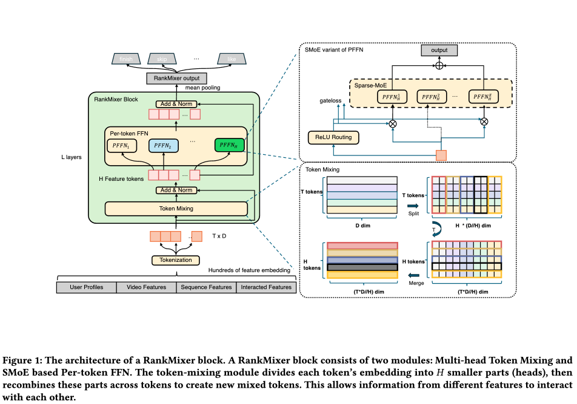

# RankMixer Summary

## 1. Core Problem: The low MFU Bottleneck
Traditional deep learning recommendation models (DLRMs) like *DeepFM*, *DCNv2*, or *RDCN* are built on CPU-era design principles. In modern GPU-centric clusters, these architectures are heavily **memory-bound** rather than **compute-bound**. They spend the vast majority of their hardware execution cycles fetching sparse user/item embeddings from massive high-bandwidth memory tables, leaving GPU tensor cores highly underutilized. 

This results in a critically low **Model FLOPs Utilization (MFU)** of only **~4.5%**, which severely limits the feasibility of scaling up ranking networks to larger parameter sizes. 

To bridge this efficiency gap, ByteDance proposed **RankMixer**—a hardware-aware ranking model designed to shift feature crossing from a memory-bound bottleneck to a highly parallelized, compute-bound task on GPUs, pushing MFU up to **45%** and scaling parameters up to **1B** under strict production latency constraints.

---

## 2. Overall Pipeline
RankMixer processes heterogeneous input feature spaces through $L$ successive blocks to extract unified representations for multi-task predictions:

```text
       Raw Heterogeneous Embeddings (User, Item, Sequence, Cross-Features)
                                     │
                                     ▼
                      ┌─────────────────────────────┐
                      │    Feature Tokenization     │ (Group & Split)
                      └──────────────┬──────────────┘
                                     │
                         X0 = [x1, x2, ..., xT]  (T Tokens x D Dim)
                                     │
                                     ▼
                       ┌───────────────────────────┐
                       │    RankMixer Block 1      │
                       └─────────────┬─────────────┘
                                     │  X1
                                     ▼
                                    ...
                                     │  XL-1
                       ┌───────────────────────────┐
                       │    RankMixer Block L      │
                       └─────────────┬─────────────┘
                                     │  XL
                                     ▼
                      ┌─────────────────────────────┐
                      │        Mean Pooling         │
                      └──────────────┬──────────────┘
                                     │  o_output
                                     ▼
                       ┌───────────────────────────┐
                       │     Multi-Task Heads      │ (Predictions: CTR, Dur)
                       └───────────────────────────┘
```

The mathematical formulation for the successive blocks is:
$$\mathbf{S}_{n-1} = \text{LN}(\text{TokenMixing}(\mathbf{X}_{n-1}) + \mathbf{X}_{n-1})$$
$$\mathbf{X}_{n} = \text{LN}(\text{PFFN}(\mathbf{S}_{n-1}) + \mathbf{S}_{n-1})$$
$$\mathbf{o}_{\text{output}} = \text{MeanPooling}(\mathbf{X}_L)$$

---

## 3. Input Layer & Feature Tokenization

To perform highly parallel tensor calculations on GPUs, RankMixer maps raw, heterogeneous embeddings of varying dimensions into uniform-dimensional vectors called **feature-tokens**.



### Group-and-Split Strategy
Assigning an individual token to every raw feature is highly inefficient because typical industrial systems have hundreds of features. Slicing them individually would create hundreds of tiny tokens, fragmenting computation and severely underutilizing GPU warp threads. 

To resolve this, RankMixer employs a semantic-based grouping technique using domain knowledge:
1. **Grouping:** Features are grouped into a few semantically coherent clusters (e.g., demographic profile, video statistics, sequence history, cross-features).
2. **Concatenation:** The raw embeddings belonging to group $i$ are concatenated sequentially into one long vector:
   $$e_{\text{input}} = [ e_1; e_2; \dots; e_N ]$$
3. **Partitioning & Projection:** This concatenated vector is partitioned into $T$ segments of a fixed size $d$. Each segment is then linearly projected into the uniform hidden dimension $D$ using a projection function (`Proj`):
   $$\mathbf{x}_i = \text{Proj}(e_{\text{input}}[d \cdot (i - 1) : d \cdot i]) \in \mathbb{R}^D$$
   This yields the unified sequence of input feature-tokens $\mathbf{X}_0 = [\mathbf{x}_1, \mathbf{x}_2, \dots, \mathbf{x}_T] \in \mathbb{R}^{T \times D}$.

### Handling Heterogeneous Features
* **Continuous / Numerical Features:** The paper states that *all* features, including numerical features (such as diverse statistical counters), are converted into embeddings of diverse dimensions. How raw numerical values are mapped to these initial embeddings is treated as a pre-existing infrastructure black box (with no explicit equations or bucketing strategies detailed in the paper). Once embedded, they are concatenated and projected linearly into the unified token space, preventing high-frequency categorical signals from completely dominating numerical ones.
* **Sequential Features:** Temporal user interest sequences are processed first via a dedicated sequence-processing module (citing architectures like *LONGER* `[4]` or *DIN* `[42]`) to compress the behavioral history into a sequence embedding vector $e_s$. This vector $e_s$ is then concatenated into the master input vector $e_{\text{input}}$ alongside static profiles, being mapped to a distinct feature token $\mathbf{x}_i$.
* **Cross Features:** Explicit user-item interaction features (e.g., category match overlaps or geographical intersections) are manually constructed and embedded like static features, providing direct compatibility cues to the token-mixing layers.

---

## 4. Multi-Head Token Mixing

The purpose of this module is to perform explicit, parameter-free feature crossing across distinct feature-tokens.

### Mechanics & Equations
Unlike standard NLP models where all tokens share a single semantic space, recommendation systems process highly heterogeneous features (e.g., User IDs, Item categories, sequential historical statistics) where calculating inner-product similarity (as in standard Self-Attention) is prone to representation collapse. 

To overcome this, RankMixer uses a parameter-free explicit mixing transposition:

1. **Multi-Head Splitting:** Each of the $T$ tokens $\mathbf{x}_t \in \mathbb{R}^D$ is evenly divided into $H$ heads, yielding lower-dimensional feature subspace projections:
   $$\left[ \mathbf{x}_t^{(1)} \parallel \mathbf{x}_t^{(2)} \parallel \dots \parallel \mathbf{x}_t^{(H)} \right] = \text{SplitHead}(\mathbf{x}_t)$$
   where $\mathbf{x}_t^{(h)} \in \mathbb{R}^{\frac{D}{H}}$ represents the $h$-th head.

2. **Recombination (Token Mixing):** The $h$-th head of *all* $T$ tokens are concatenated together to form a newly mixed token $\mathbf{s}_h$:
   $$\mathbf{s}_h = \text{Concat}\left(\mathbf{x}_1^{(h)}, \mathbf{x}_2^{(h)}, \dots, \mathbf{x}_T^{(h)}\right) \in \mathbb{R}^{T \cdot \frac{D}{H}}, \quad \text{for } h = 1, \dots, H$$
   *By transposing the sequence dimension $T$ and the channel dimension $D$, information from different features is forced to mix directly within a unified representation space.*

3. **Residual Shape Alignment ($H = T$):** To add the input back residually, the output shape must match the input shape ($\mathbb{R}^{T \times D}$). By setting the number of heads $H$ equal to the token sequence length $T$ ($H = T$), the concatenated output dimension of each mixed token $\mathbf{s}_h$ perfectly simplifies:
   $$\text{Dimension of } \mathbf{s}_h = T \cdot \frac{D}{H} \xrightarrow{H = T} T \cdot \frac{D}{T} = D$$
   $$\mathbf{S} = [\mathbf{s}_1, \mathbf{s}_2, \dots, \mathbf{s}_T] \in \mathbb{R}^{T \times D}$$

4. **Normalization & Residual Output:**
   $$\mathbf{s}_1, \mathbf{s}_2, \dots, \mathbf{s}_T = \text{LN}\left(\text{TokenMixing}(\mathbf{x}_1, \dots, \mathbf{x}_T) + (\mathbf{x}_1, \dots, \mathbf{x}_T)\right)$$

---

## 5. Per-Token FFN (PFFN)

Traditional architectures (like Transformer FFNs or MMoEs) process mixed token sequences using a shared FFN. In recommendation systems, this often leads to **inter-feature-space domination**, where high-frequency features (e.g., highly popular video categories) drown out low-frequency or long-tail user interest signals.

RankMixer introduces a **parameter-isolated Feed-Forward Network (PFFN)**. 

### Mechanics & Equations
Instead of sharing parameters, each token channel position $t$ is mapped through its own dedicated, non-shared two-layer MLP parameters:
$$\mathbf{v}_t = f_{\text{pffn}}^{t, 2}\left(\text{Gelu}\left(f_{\text{pffn}}^{t, 1}(\mathbf{s}_t)\right)\right)$$
$$f_{\text{pffn}}^{t, i}(\mathbf{x}) = \mathbf{x}\mathbf{W}_{\text{pffn}}^{t, i} + \mathbf{b}_{\text{pffn}}^{t, i}$$

Where:
- $\mathbf{W}_{\text{pffn}}^{t, 1} \in \mathbb{R}^{D \times kD}$, $\mathbf{b}_{\text{pffn}}^{t, 1} \in \mathbb{R}^{kD}$
- $\mathbf{W}_{\text{pffn}}^{t, 2} \in \mathbb{R}^{kD \times D}$, $\mathbf{b}_{\text{pffn}}^{t, 2} \in \mathbb{R}^{D}$
- $k$ is a hyperparameter scaling the hidden expansion dimension of the FFN.

By splitting both the input tokens and the network parameters simultaneously, the PFFN expands model capacity significantly while keeping computational complexity (FLOPs) per token constant, allowing highly parallelized tensor execution on GPU cores.

---

## 6. Sparse MoE in RankMixer (SMoE)

To further scale parameter count without inflating computational latency, the dense PFFN is optionally upgraded to a Sparse Mixture-of-Experts (SMoE) block. To prevent performance degradation typical of vanilla Top-$k$ routing in recommendations, RankMixer uses two key strategies:

### A. ReLU Routing (Dynamic Expert Counts)
Standard Top-$k$ + Softmax routing forces the router to select a fixed number of experts for every token, wasting budget on low-information tokens (e.g., demographic stats) and starving high-information tokens (e.g., user sequential history $e_s$).

RankMixer replaces standard Top-$k$ gating with a **ReLU gating function** combined with an adaptive $L_1$ penalty:
$$G_{i,j} = \text{ReLU}\left(h(\mathbf{s}_i)\right)$$
$$\mathbf{v}_i = \sum_{j=1}^{N_e} G_{i,j} e_{i,j}(\mathbf{s}_i)$$
where $N_e$ is the number of experts per token channel, and $e_{i,j}(\cdot)$ represents the $j$-th expert assigned to token $i$. 

Sparsity is steered by adding an $L_1$ penalty ($\mathcal{L}_{\text{reg}}$) directly to the task loss, dynamically adjusting the active-expert ratio near the target budget:
$$\mathcal{L} = \mathcal{L}_{\text{task}} + \lambda \mathcal{L}_{\text{reg}}, \quad \mathcal{L}_{\text{reg}} = \sum_{i=1}^{N_t} \sum_{j=1}^{N_e} G_{i,j}$$

### B. Dense-Training / Sparse-Inference (DTSI-MoE)
Because Per-Token FFN already isolates parameters by token channel, upgrading them to SMoE experts leads to an absolute explosion in the total number of experts ($T \times N_e$). To prevent severe expert under-training and high routing variance, RankMixer utilizes two separate routers: $h_{\text{train}}$ and $h_{\text{infer}}$.

- **Dense Training:** During the training forward pass, **all** experts are activated (dense activation) so that every expert receives gradients and is fully trained. The regularization penalty $\mathcal{L}_{\text{reg}}$ is applied exclusively to the inference router $h_{\text{infer}}$ to force it toward sparsity.
- **Sparse Inference:** During online serving/inference, the dense $h_{\text{train}}$ is bypassed. The model uses only $h_{\text{infer}}$ running sparse ReLU routing, fitting strict production SLA constraints.

---

## 7. Scaling Laws & Parameters Formulation
For the dense-activated version of RankMixer, the parameter and forward FLOPs count for one sample are calculated as:
$$\text{\#Param} \approx 2 k L T D^2$$
$$\text{FLOPs} \approx 4 k L T D^2$$
where $k$ is the FFN hidden scale ratio, $L$ is the number of blocks, $T$ is the token count, and $D$ is the model's hidden dimension. 

In the Sparse-MoE version, the effective parameters and compute per token are scaled further by the sparsity ratio $s = \frac{\text{\#Activated\_Param}}{\text{\#Total\_Param}}$.
