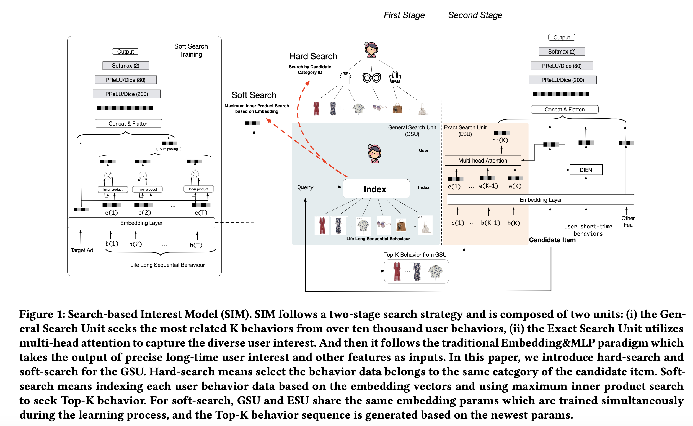

# Search-based User Interest Model (SIM)

Published at CIKM 2020 by researchers from Alibaba Group, the **Search-based Interest Model (SIM)** is an industrial CTR prediction framework designed to model **lifelong sequential user behavior data** (scaling up to **54,000 items**, a $54\times$ expansion over previous state-of-the-art). SIM overcomes the computational and memory bottlenecks of prior approaches by introducing a **cascaded two-stage search paradigm**: a coarse-grained **General Search Unit (GSU)** that fast-filters raw behaviors down to hundreds of relevant items, followed by a fine-grained **Exact Search Unit (ESU)** that performs multi-head target attention and temporal distance modeling.

> [!info] Core Thesis
> When user behavior history expands to tens of thousands of items over months and years, directly applying attention is computationally impossible online, while compressing everything into fixed-size static memory matrices (e.g., MIMN) suffers from catastrophic information loss and noise. SIM solves this by **search-based interest modeling**: using candidate item information as a search query to retrieve relevant historical behaviors in sub-linear time, then modeling nuanced target-behavior interactions on the filtered sub-sequence.

---

## 1. Motivation: Bottlenecks in Long Sequential User Modeling

Rich user behavior history carries critical signals for Click-Through Rate (CTR) prediction (e.g., $23\%$ of Taobao users clicked $>1,000$ products in a 5-month window). However, utilizing lifelong behavior sequences introduces severe computational and algorithmic dilemmas:

```
+----------------------------------------------------------------------------------------------------+
|                                    Lifelong User History (T up to 54,000)                          |
+----------------------------------------------------------------------------------------------------+
                                      |
         +----------------------------+----------------------------+
         |                                                         |
         v                                                         v
[Direct Attention (DIN / DIEN)]                           [Memory Networks (MIMN)]
- Length limited to hundreds                              - Compresses history into fixed memory matrix
- Attention complexity O(T) per candidate                 - Decouples user modeling from scoring
- Online latency violates SLA (>30ms at 1M+ QPS)          - FATAL FLAW: Query-unaware static compression
                                                            suffers severe capacity loss & noise at T > 10,000
```

1. **Direct Attention Models ([[DIN]], DIEN):**
   - High expressive power via candidate-to-history attention.
   - **Limitation:** Computation complexity scales linearly with sequence length $T$. In production environments scoring hundreds of candidates at $>1\text{ million QPS}$, they can only handle sequences of length $T \le 150$.
2. **Memory Network Models (MIMN):**
   - Incrementally compresses behaviors into a fixed-size user memory matrix offline/asynchronously.
   - Scaled sequence length up to $T \approx 1,000$.
   - **Limitation:** Fixed memory slots cannot retain distinct, candidate-specific interest details when sequence length scales by another $10\times\text{--}50\times$ ($T \ge 10,000$). The representation suffers from heavy noise and capacity degradation.

**The Solution in SIM:** Decouple modeling into two cascaded stages: **GSU (Coarse Search & Denoising)** $\rightarrow$ **ESU (Fine-grained Temporal Attention)**.

---

## 2. Model Architecture



### 2.1 General Search Unit (GSU) — Coarse Filtering

Given a raw behavior sequence $\mathbf{B} = [\mathbf{b}_1; \mathbf{b}_2; \dots; \mathbf{b}_T]$ of arbitrary length $T$ and a candidate item $a$, GSU calculates a relevance score $r_i$ for each behavior $\mathbf{b}_i$ and retrieves the **Top-$K$ relevant Sub-behavior Sequence (SBS)** $\mathbf{B}^*$ ($K \ll T$, typically $K \le 200$).

The paper introduces two GSU variants:

$$r_i = \begin{cases} \text{Sign}(C_i = C_a) & \text{Hard-Search} \\ (W_b \mathbf{e}_i) \odot (W_a \mathbf{e}_a)^T & \text{Soft-Search} \end{cases}$$

#### 1. Hard-Search (Non-Parametric)
- **Mechanism:** Selects historical items that share the **exact same category ID** as the candidate item ($C_i = C_a$).
- **Characteristics:** Non-parametric, requires no backpropagation ($\alpha=0$).
- **System Efficiency:** Can be queried in $O(1)$ time via a pre-built offline two-level index (**User Behavior Tree**), adding virtually zero runtime compute overhead.

#### 2. Soft-Search (Parametric & Embedding-Based)
- **Mechanism:** Projects candidate embedding $\mathbf{e}_a$ and behavior embedding $\mathbf{e}_i$ via matrices $W_a$ and $W_b$, taking their continuous inner product.
- **Fast Retrieval:** Conducts **Maximum Inner Product Search (MIPS)** using **ALSH (Asymmetric Locality Sensitive Hashing)** with sub-linear search time.
- **Handling Distribution Shift via Auxiliary Task:** Long-term and short-term behavior distributions differ fundamentally. Sharing short-term parameters directly misleads long-term interest learning. Therefore, Soft-Search is trained with an auxiliary CTR prediction task:
  $$\mathbf{U}_r = \sum_{i=1}^{T} r_i \mathbf{e}_i$$
  $\mathbf{U}_r$ and $\mathbf{e}_a$ are concatenated and passed through an auxiliary MLP to compute $\text{Loss}_{\text{GSU}}$. During training, random sub-sequences are sampled if sequences exceed memory limits.

---

### 2.2 Exact Search Unit (ESU) — Fine-grained Modeling

ESU takes the candidate item embedding $\mathbf{e}_a$ and the filtered Top-$K$ SBS $\mathbf{B}^*$ to construct the precise user long-term interest representation $U_{lt}$.

#### 1. Temporal Distance Embedding
Lifelong behaviors span months or years; a click from 3 days ago conveys different urgency than one from 120 days ago. ESU explicitly models this via time intervals:
- Compute time intervals $\mathbf{D} = [\Delta_1; \Delta_2; \dots; \Delta_K]$ between candidate request time and each selected behavior item.
- Map intervals $\mathbf{D}$ to dense continuous embeddings $\mathbf{E}_t = [\mathbf{e}_1^t; \mathbf{e}_2^t; \dots; \mathbf{e}_K^t]$.
- Concatenate item embedding with time embedding:
  $$\mathbf{z}_j = \text{concat}(\mathbf{e}_j^*, \mathbf{e}_j^t)$$

#### 2. Multi-Head Target Attention
Captures diverse user interest facets across the filtered behaviors $\mathbf{Z} = [\mathbf{z}_1, \dots, \mathbf{z}_K]$:

$$\mathbf{att}^i_{\text{score}} = \text{Softmax}(W_{bi}\mathbf{z}_b \odot W_{ai}\mathbf{e}_a)$$
$$\mathbf{head}_i = \mathbf{att}^i_{\text{score}} \mathbf{z}_b$$
$$U_{lt} = \text{concat}(\mathbf{head}_1; \mathbf{head}_2; \dots; \mathbf{head}_q)$$

Where $q$ is the number of attention heads, and $W_{bi}, W_{ai}$ are head-specific projection weights.

---

### 2.3 Joint Training Objective

GSU and ESU are optimized simultaneously under a multi-task cross-entropy loss:

$$\text{Loss} = \alpha \text{Loss}_{\text{GSU}} + \beta \text{Loss}_{\text{ESU}}$$

- **Soft-Search:** $\alpha = 1, \beta = 1$.
- **Hard-Search:** $\alpha = 0, \beta = 1$ (non-parametric GSU).

---

## 3. Industrial Online Serving & System Co-design

Deploying lifelong behavior modeling to Alibaba's real-time prediction (RTP) system ($>1\text{M QPS}$, $<30\text{ms}$ latency budget) required specialized hardware/software co-design.

```
Offline Pre-computation                  Online Real-Time Serving (RTP)
+------------------------+              +-----------------------------------------------+
| User Behavior Logs     |              | Candidate Items (Hundreds, ~20 Categories)   |
+------------------------+              +-----------------------------------------------+
            |                                                   |
            v                                                   v
+------------------------+    Query: (User_ID, Cate_ID)  +------------------------------+
| User Behavior Tree     | ----------------------------> | GSU (Hard Search via UBT)    |
| (UBT: Key-Key-Value)   |                               +------------------------------+
| Size: ~22 TB           |                                              |
| User -> Cate -> Items  |                                              v Filtered SBS (K <= 200)
+------------------------+                               +------------------------------+
                                                         | ESU (Multi-Head Attention)   |
                                                         | + Deep Kernel Fusion         |
                                                         +------------------------------+
                                                                        |
                                                                        v
                                                         +------------------------------+
                                                         | MLP -> Final pCTR (<= 30ms)  |
                                                         +------------------------------+
```

### 3.1 User Behavior Tree (UBT)
- **Data Structure:** A distributed 2-level `Key-Key-Value` index pre-built offline and refreshed daily (scale: $\sim 22\text{ TB}$):
  $$\text{User ID} \longrightarrow \text{Category ID} \longrightarrow [\text{Item IDs} + \text{Timestamps}]$$
- **$O(1)$ Serving Lookup:** Online retrieval requires no vector distance calculations; it executes simple hash lookups for the target candidate's category ID.
- **Category Deduplication:** Although hundreds of candidates are scored per request, they typically span fewer than 20 unique categories, keeping network and I/O traffic minimal.

### 3.2 Computational Optimization
- **Sequence Truncation:** Sub-sequence length $K$ is capped at 200 (mean length is $<150$).
- **Deep Kernel Fusion:** Fused memory bandwidth and matrix multiplication kernels on GPU nodes for multi-head attention.
- **Latency Impact:** Serving sequences up to 54,000 items with SIM added **only 5ms latency** compared to MIMN (which truncated sequences at 1,000).

---

## 4. Experimental Results

### 4.1 Public & Industrial Dataset Comparisons

#### Public Datasets (Taobao & Amazon)

| Model | Taobao AUC | Amazon AUC |
| :--- | :--- | :--- |
| [[DIN]] (Short-term only) | $0.9214 \pm 0.00017$ | $0.7276 \pm 0.00051$ |
| Avg-Pooling Long DIN | $0.9281 \pm 0.00025$ | $0.7280 \pm 0.00012$ |
| MIMN | $0.9278 \pm 0.00035$ | $0.7396 \pm 0.00037$ |
| **SIM (hard)** | **$0.9332 \pm 0.00008$** | **$0.7413 \pm 0.00016$** |
| **SIM (soft)** | **$0.9416 \pm 0.00049$** | **$0.7510 \pm 0.00052$** |
| **SIM (soft) + Timeinfo** | **$0.9501 \pm 0.00017$** | — |

#### Industrial Display Ads Dataset (Alibaba, Lengths up to 54,000)

| Model | AUC | Notes |
| :--- | :--- | :--- |
| DIEN | $0.6452$ | Short-term sequence (14 days) |
| MIMN | $0.6541$ | Long-term sequence truncated at 1,000 |
| **SIM (hard)** | **$0.6604$** | Full sequence up to 54,000 |
| **SIM (soft)** | **$0.6625$** | Full sequence up to 54,000 |
| **SIM (hard) + Timeinfo** | **$0.6624$** | **Deployed in Production** |

*Note: In industrial advertising, an AUC gain of $+0.001$ is considered significant; SIM's $+0.0083$ over MIMN represents a major algorithmic breakthrough.*

---

### 4.2 Ablation Study Insights

1. **Filtering is Essential:** Adding GSU filtering (either hard or soft) substantially outperformed naive average pooling ($0.9330$ vs $0.9281$ AUC on Taobao), demonstrating that raw long-term sequences contain massive noise that degrades interest learning.
2. **Two Stages > One Stage:** Adding ESU attention on top of GSU filtering further improved AUC from $0.9330 \rightarrow 0.9332$ (hard) and $0.9357 \rightarrow 0.9416$ (soft).
3. **Time Interval Encoding:** Adding temporal embeddings $\mathbf{D}$ produced a significant boost ($0.9416 \rightarrow 0.9501$ on Taobao), confirming that temporal decay is vital for multi-month histories.
4. **Hard vs. Soft Trade-off:** Offline statistics showed that Hard-Search items covered $\mathbf{75\%}$ of the behaviors retrieved by Soft-Search. Due to the extreme efficiency of the 22TB UBT index, Hard-Search was chosen for online deployment.

---

### 4.3 Rethinking Search Model ($d_{category}$ Analysis)

To prove that SIM's performance gains stemmed specifically from long-term interest modeling, the authors introduced the metric:
- **$d_{category}$ (Days till Last Same Category Behavior):** Number of days between the user's last interaction in the candidate's category and the current impression event ($-1$ if no prior interaction).

**Findings:**
- For $d_{category} \le 14$ days (short-term window), SIM and DIEN had identical click distributions.
- For $d_{category} > 14$ days (long-term window), SIM captured a significantly higher proportion of clicks.
- Average $d_{category}$ increased from **$11.2 \rightarrow 13.3$ days**, and $p(d_{category} > -1)$ increased from **$0.91 \rightarrow 0.94$**, proving SIM successfully re-activated dormant, high-intent historical interests.

---

### 4.4 Online A/B Testing
During a one-month online A/B test (Jan 7 – Feb 7, 2020) in Taobao App's *"Guess What You Like"* display advertising slot, SIM achieved:
- **$+7.1\%$ Click-Through Rate (CTR)**
- **$+4.4\%$ Revenue Per Mille (RPM)**

---

## 5. Key Takeaways

1. **Cascaded Search Solves the Long-Sequence Dilemma:** GSU denoises and shrinks $10^4$ behaviors down to $10^2$, allowing high-capacity attention (ESU) to operate within strict online SLA budgets ($<30\text{ms}$).
2. **System-Algorithm Co-Design:** Building the 2-level User Behavior Tree (UBT) offline turns real-time candidate search into an $O(1)$ category lookup.
3. **Temporal Distance Matters:** Modeling time intervals $\Delta t$ via embeddings prevents ancient behaviors from being weighted identically to recent actions.
4. **Distribution Shift Awareness:** Long-term behavior embeddings must be trained via separate auxiliary CTR objectives rather than naive parameter sharing with short-term models.

---

## Related Wiki Pages
* [[SIM]]: Dedicated entity specification of the Search-based Interest Model architecture.
* [[DIN Summary]]: Predecessor architecture introducing candidate-aware local activation for short sequences.
* [[DIN]]: Architectural entity page for Deep Interest Network.
* [[Douyin STCA Summary]]: ByteDance's alternative approach to long sequence modeling using linear-time target cross-attention.
* [[HSTU]]: Meta's Generative Recommenders architecture for sequential recommendation.
* [[NCF Summary]]: Foundational neural collaborative filtering concepts.
