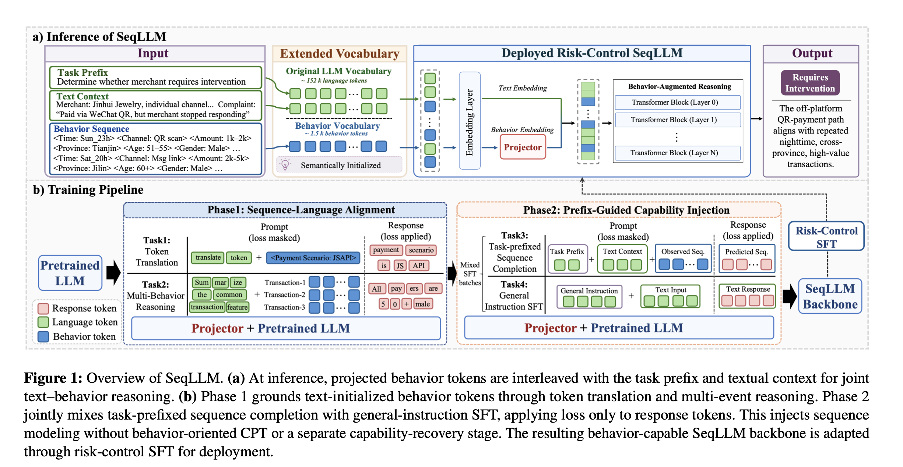

# Behavioral-Sequence Augmented LLM (SeqLLM)

Published in August 2026 by researchers from WeChat Pay (Tencent), Shanghai Jiao Tong University, and City University of Hong Kong, **SeqLLM** is a landmark sequence-language multi-modal framework. It successfully injects massive behavioral-sequence modeling into large language models (LLMs) while completely preserving their natural language, reasoning, and conversational capabilities, fully deployed in production at WeChat Pay.

## Core Motivation

Entities on modern payment and social platforms are described along two distinct axes: their textual content (who they claim to be) and their behavioral sequence (how they act). While LLMs excel at reasoning over textual semantics, integrating long transactional behavioral sequences into LLMs poses major bottlenecks:
1. **Catastrophic Forgetting / Language Erosion:** Traditional Continual Pre-training (CPT) applies the next-token prediction loss globally across the entire sequence. When training on millions of non-linguistic transactional sequences, this broad optimization washes out pre-trained semantic weights, driving the LLM's language competence to near-collapse (e.g., C-Eval score dropping from `0.78` to `0.27`).
2. **Representation Complexity:** Serializing transaction events as plain text bloats token length, while using whole-event IDs lacks compositional generalization and does not scale.

**SeqLLM** solves these problems using a **Field-Level Discrete Behavioral Vocabulary**, a **Two-Stage Alignment Curriculum**, and **Prefix-Guided Capability Injection**.

---

## Architectural Framework

SeqLLM converts transactional transaction rows into discrete tokens and project-aligns them into the LLM's latent manifold.

### 1. Field-Level Discrete Behavioral Vocabulary (Section 3.2)
To keep the sequence compact and structurally generalized:
*   Each event $s_t$ is split into discrete field values (e.g., time, amount, channel, status).
*   Each field value maps to its own dedicated token. For example, a transaction is represented as a compact block:
    `[<Time:Thu_00h>, <Scene:App pay>, <Channel:Scan QR>, <Amount:200-500 CNY>, <Status:Success>]`
*   **Semantic-Aware Rescaling (Section 3.3):** These readable tokens are initialized by mean-pooling the LLM's pre-trained embeddings of their text names and rescaled to match the backbone's native mean ($\boldsymbol{\mu}$) and standard deviation ($\boldsymbol{\sigma}$) statistics, ensuring they align geometrically from day one.

### 2. Behavior Projector & Two-Stage Alignment (Section 3.3)
Behavior tokens enter the LLM through a shared projector $g_\psi$—a 2-layer MLP (Linear–GELU–Linear) with a skip connection, where the final linear layer is zero-initialized:
$$g_\psi(\mathbf{e}) = \mathbf{e} + \text{MLP}_\psi(\mathbf{e})$$

Alignment is trained using a two-stage curriculum:
*   **Stage 1: Translation:** Instructs the LLM to translate behavioral tokens into literal, plain-text descriptions (e.g., translating `[<Time:Sun_14h>, <Channel:Msg link>]` to `"Sunday at 14:00 via QR message link"`). This grounds the vocabulary in language semantics.
*   **Stage 2: Reasoning:** Fine-tunes the model on multi-event reasoning queries, instructing the LLM to extract or compare transaction patterns across events (e.g., `"Both are Tuesday-afternoon QR payments."`).

---

## Prefix-Guided Capability Injection (Section 3.4)

To learn sequence dynamics (transition patterns, transaction transitions) without causing catastrophic forgetting, SeqLLM turns future-event prediction into an **instruction-conditioned capability** rather than an unconditional modeling task.

### The Target-Masking Difference:
1.  **Continual Pre-training (CPT):** Applies standard next-token loss on 100% of the behavioral stream:
    $$\mathcal{L}_{\mathrm{CPT}} = -\sum_{t=1}^{N}\log p_{\Theta}(b_t \mid b_{<t})$$
2.  **Prefix-Guided SFT:** Cuts the sequence at $70\%$. The first $70\%$ is treated as the input history context $c$ (the prompt). The remaining $30\%$ is the target response $y$. **Loss is computed strictly on this target response (the suffix):**
    $$\mathcal{L}_{\mathrm{Prefix}} = -\sum_{t=m+1}^{N}\log p_{\Theta,\psi}(b_t \mid \mathcal{I}, b_{<t})$$

### The Unified Optimization:
Both the projector $\psi$ and the LLM backbone $\Theta$ are jointly optimized using a unified SFT loss:
$$\mathcal{L}_{\text{inject}} = -\sum_{(\mathcal{I},c,y) \in \mathcal{D}_{\text{inj}}} \log p_{\Theta,\psi}(y \mid \mathcal{I}, c)$$

The training dataset $\mathcal{D}_{\text{inj}}$ contains a **hybrid mix** of both the sequence completion tasks (which run $\mathcal{L}_{\mathrm{Prefix}}$) and general-domain text instruction datasets (which act as a language regularizer to preserve reasoning and conversational skills).

---

## Production Impact & Public Benchmarks

1.  **Fully Deployed at WeChat Pay:**
    *   **Merchant Screening:** Improves risk screening precision from `92.0%` (production DeepSeek baseline) to `97.5%` during a three-month shadow evaluation, reducing post-launch merchant appeals from `12%` to `~2%` with zero false-positive exonerations.
    *   **Fraud Detection:** Pre-trained behavioral embeddings learned by SeqLLM boost Precision@Top-0.01% by `26.8 pp` in a production fraud detector serving billion-scale transaction traffic.
2.  **SOTA Recommendation Generalizability:**
    *   On MovieLens and Amazon, SeqLLM outperforms the strong *User-LLM* baseline by up to `32%` relative Recall@5.
    *   On RecIF, SeqLLM improves Pass@32 by `14.2%` over the full *OneRec-8B* pipeline while using `4.8x` fewer GPU-days during training.

---

## Related Concept Links
*   [[SeqLLM]]: Detailed architectural and entity specification of the SeqLLM model.
*   [[OneRec]]: The generative recommender baseline compared in RecIF evaluations.
*   [[Conversational Recommender Systems]]: Synthesis of the architectural evolution of LLMRec and recommendation paradigms.
