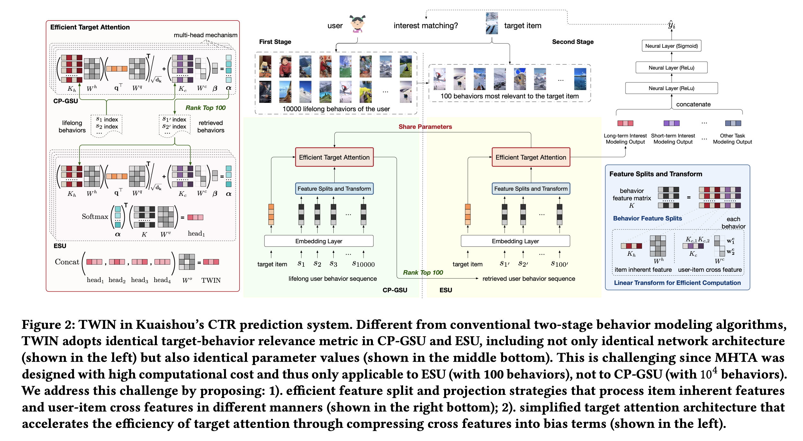

# TWo-stage Interest Network (TWIN)

Published at KDD 2023 by researchers from Kuaishou Technology (with Kun Gai, a common author across the [[DIN]]/[[SIM]]/TWIN lineage), **TWIN (TWo-stage Interest Network)** is an industrial lifelong user behavior modeling framework for CTR prediction that scales Target Attention (TA) from sequence length $10^2$ to $10^4$–$10^5$. TWIN's central contribution is solving the **GSU–ESU inconsistency problem** that plagues all prior two-stage cascaded architectures (SIM, ETA, SDIM): it makes the coarse retrieval stage (CP-GSU) use the **identical relevance metric — same network structure AND same parameters** — as the fine attention stage (ESU), turning the two stages into "twins." The key enabler is a novel **behavior feature splitting** scheme that makes Multi-Head Target Attention (MHTA) computationally feasible over tens of thousands of behaviors.

> [!info] Core Thesis
> Conventional two-stage lifelong behavior models suffer from a fatal inconsistency: the GSU's coarse relevance metric (category filter, inner product, LSH, hash collision) differs from the ESU's Target Attention, so the GSU retrieves behaviors the ESU considers irrelevant and misses ones it would value — SIM Hard's top-100 only hits ~40 of ESU's "real top-100." TWIN eliminates this gap by making the GSU use the *exact same* MHTA relevance function as the ESU. This becomes computationally tractable via **feature splitting**: item inherent features (shared across users) are pre-computed and cached, while user-item cross features are compressed into one-dimensional bias terms in the attention score.

---

## 1. The Problem: GSU–ESU Inconsistency

Industrial lifelong behavior modeling universally follows a two-stage cascade (introduced by [[SIM]]):

```
Lifelong Behavior Sequence (L = 10^4 – 10^5)
        |
        v
+------------------------------+
| GSU (General Search Unit)    |  Fast, coarse filter: L → 100
| e.g., category / inner prod  |
+------------------------------+
        |
        v  Top-100 behaviors
+------------------------------+
| ESU (Exact Search Unit)      |  Expensive Target Attention
| Multi-Head Target Attention  |  over the 100 finalists
+------------------------------+
        |
        v  User interest representation
```

**The flaw:** the GSU's target-behavior relevance metric is *both coarse and inconsistent* with the ESU's TA. Concretely:

| Method | GSU Strategy | End2End | Consistent? |
| :--- | :--- | :--- | :--- |
| UBR4CTR | BM25 | ✗ | ✗ |
| [[SIM]] Hard | Category filter | ✗ | ✗ |
| [[SIM]] Soft | Inner product (pre-trained emb) | ✗ | ✗ |
| ETA | LSH + Hamming distance | ✓ | ✗ |
| SDIM | Multi-round hash collision | ✓ | ✗ |
| **TWIN (ours)** | **Target Attention** | **✓** | **✓** |

**The consequence (Figure 1 in the paper):** define an "Oracle" that applies ESU's own relevance metric to all $10^4$ behaviors to find "the real top-100." Among the top-100 returned by SIM Hard's GSU, **only 40 hit the real top-100**. The remaining 60 slots are wasted on behaviors ESU will deem irrelevant, while genuinely important behaviors are discarded before ESU ever sees them. No matter how well ESU allocates attention, its input is corrupted — the TA deviates from real user interests and degrades CTR prediction.

> [!note] End-to-end ≠ Consistent
> ETA and SDIM share embeddings between stages (end-to-end training), but their *retrieval strategies* (LSH/Hamming, hash collision) still differ from TA in network structure and parameters. TWIN is the first to achieve **both** end-to-end training **and** metric consistency.

---

## 2. The Core Idea: Make the Two Stages Twins

TWIN's answer is the **Consistency-Preserved GSU (CP-GSU)**, which adopts the *identical* MHTA relevance metric as ESU's TA — not just the same architecture, but the **same parameter values**. The two stages are literally twins.

**The challenge:** MHTA was designed for ESU's ~100 behaviors. Its key computational bottleneck — the linear projection of all behavior features — makes it infeasible at CP-GSU's scale of $10^4$–$10^5$ behaviors under online latency constraints. Section 3 below describes how TWIN breaks this bottleneck.



*Figure 2 of the paper. Center: the two-stage cascade (10,000 lifelong behaviors → 100 most relevant). Middle: the "twins" — CP-GSU (green) and ESU (yellow) share the identical Embedding Layer → Feature Splits and Transform → Efficient Target Attention pipeline, joined by the red "Share Parameters" arrow. Left (red panel): the Efficient Target Attention math — CP-GSU computes $\boldsymbol{\alpha}$ and ranks top-100; ESU applies Softmax$(\boldsymbol{\alpha})$ over $KW^v$ per head, then Concat(head₁..head₄)$W^o$. Bottom-right (blue panel): the feature split — $K$ splits into $K_h$ (item inherent) and $K_c$ (user-item cross). Top-right: the upper mixer (Section 3.2.2) that concatenates long-term (TWIN), short-term, and other task modeling outputs through ReLU layers to a sigmoid producing $\hat{y}_i$.*

---

## 3. Key Innovation ①: Behavior Feature Splitting

This is the technical heart of TWIN — the trick that makes MHTA scale from $10^2$ to $10^4$–$10^5$.

### 3.1 The Split

The behavior sequence $[s_1, s_2, ..., s_L]$ has feature matrix $K \in \mathbb{R}^{L \times (H+C)}$, split **column-wise** into two blocks:

$$K \triangleq \left[\begin{array}{cc} K_h & K_c \end{array}\right]$$

| Block | Name | Examples | Key Property |
| :--- | :--- | :--- | :--- |
| $K_h \in \mathbb{R}^{L \times H}$ | **Inherent features** | video id, author, topic, duration | **Shared across users** — the same video's inherent features are identical in every user's sequence |
| $K_c \in \mathbb{R}^{L \times C}$ | **User-item cross features** | click timestamp, play time, page position, user-video interactions | **Not shared** — unique to each user×video interaction |

The split is by **cacheability**, and it dictates two completely different acceleration strategies.

### 3.2 Worked Example: One Behavior Becomes a Row of $K$

> *"At 11:14pm on a Wednesday, the user watched 42s of a 60s cooking video by author @chef-li, shown at feed position 3."*

After the embedding layer (dim 64 for ID features, dim 8 for others — see §6.1):

```
Inherent features (property of the VIDEO, same for every user)     →  K_h
├─ video_id      (64-dim)
├─ author_id     (64-dim)
├─ topic         ( 8-dim, multi-hot summed)
└─ duration      ( 8-dim, bucketed)          subtotal: H = 200 dims

Cross features (property of THIS USER × THIS VIDEO interaction)    →  K_c
├─ click_timestamp (8-dim)
├─ play_time       (8-dim)
└─ page_position   (8-dim)                   subtotal: C = 24 dims  (J = 3)

Full row: [──────── 200 dims ──────── | ──── 24 dims ────] ∈ ℝ^{200+24}
```

Stack $L = 10{,}000$ such rows and you get $K \in \mathbb{R}^{10^4 \times 224}$. Note the dimension asymmetry: $C = 24 \ll H = 200$ — this is exactly what the complexity win relies on.

### 3.3 Strategy A: Inherent Features → Pre-compute & Cache

Because $K_h$ is shared across all users, the projection $K_h W^h$ doesn't need recomputation per request. With caching, it's "calculated" by a **lookup and gather** procedure:

$$\text{Cost: } O(L) \text{ — independent of the dimension } H$$

This is where the 99.3% bottleneck reduction comes from (see §7 System Deployment).

### 3.4 Strategy B: Cross Features → Compress to 1-Dim Bias

Caching is inapplicable to $K_c$ (each user watches a video at most once, so there's no duplicated computation to exploit). Instead, TWIN **simplifies the projection itself**.

Given $J$ cross features, each with embedding dim 8 (so $C = 8J$):

$$K_c W^c \triangleq \left[\begin{array}{ccc} K_{c,1}\mathbf{w}_1^c, & ..., & K_{c,J}\mathbf{w}_J^c \end{array}\right]$$

where $K_{c,j} \in \mathbb{R}^{L \times 8}$ is the column-slice for feature $j$ and $\mathbf{w}_j^c \in \mathbb{R}^8$ is its own projection vector. Each cross feature is compressed to **one dimension**: $K_c W^c \in \mathbb{R}^{L \times J}$.

### 3.5 The Two Equivalent Views of the Cross-Feature Projection

This is a subtle but important point — the "diagonal block matrix" phrasing in the paper can be confusing. There are two ways to see the *same* operation:

**View 1: Per-feature small projections (what you implement).** Each $K_{c,j} \in \mathbb{R}^{L \times 8}$ gets its own little vector $\mathbf{w}_j^c \in \mathbb{R}^{8 \times 1}$:

$$K_{c,1}\mathbf{w}_1^c = \underbrace{\begin{bmatrix} \vdots \\ \text{play\_time row} \\ \vdots \end{bmatrix}}_{L \times 8} \underbrace{\begin{bmatrix} w_{1,1} \\ \vdots \\ w_{1,8} \end{bmatrix}}_{8 \times 1} = \underbrace{\begin{bmatrix} \vdots \\ b_1 \\ \vdots \end{bmatrix}}_{L \times 1}$$

Each product is a **weighted sum of the 8 embedding dims → one scalar per behavior**. You learn $J$ little vectors ($8J$ parameters total). You never build any big matrix.

**View 2: One big matrix with zeros forced in (what it's "equivalent to").** The full linear projection would use $W^c \in \mathbb{R}^{C \times J}$. Write the same computation as one matrix (with $J = 3$, $C = 24$):

$$W^c = \begin{bmatrix} \mathbf{w}_1^c & \mathbf{0} & \mathbf{0} \\ \mathbf{0} & \mathbf{w}_2^c & \mathbf{0} \\ \mathbf{0} & \mathbf{0} & \mathbf{w}_3^c \end{bmatrix} = \begin{bmatrix} w_{1,1} & 0 & 0 \\ \vdots & \vdots & \vdots \\ w_{1,8} & 0 & 0 \\ 0 & w_{2,1} & 0 \\ 0 & \vdots & 0 \\ 0 & w_{2,8} & 0 \\ 0 & 0 & w_{3,1} \\ 0 & 0 & \vdots \\ 0 & 0 & w_{3,8} \end{bmatrix}_{24 \times 3}$$

The off-diagonal zero blocks do exactly the slicing: output column 1 only sees rows 1–8 of $K_c$ (feature 1's embedding), column 2 only sees rows 9–16, etc. **The zeros forbid cross-feature interactions** — no parameter connects play_time's dims to page_position's output.

> [!note] Terminology
> Strictly, standard math calls this a **block diagonal** matrix (blocks on the diagonal, zeros off). The paper's phrase "diagonal block matrix" is loose wording for the same object. Each "block" $\mathbf{w}_j^c \in \mathbb{R}^{8 \times 1}$ is the degenerate $8 \times 1$ case of a block.

| | View 1 (per-feature vectors) | View 2 (big sparse matrix) |
| :--- | :--- | :--- |
| **Role** | Implementation | Analysis |
| **Params learned** | $J \times 8 = 8J$ | Same $8J$ (rest are frozen zeros) |
| **Compute** | $O(L \cdot 8)$ per feature → $O(L \cdot C)$ | Would be $O(L \cdot C \cdot J)$ if dense — the zeros are why it's not |
| **Insight** | "each cross feature → 1 bias dim" | "which interactions are forbidden" |

The equivalence makes the design principled: TWIN isn't adding a new mechanism, it's **restricting the parameter space of the standard projection** to a block-diagonal subspace cheap enough for $L = 10^4$.

### 3.6 Complexity Analysis

| | Conventional MHTA | TWIN's MHTA |
| :--- | :--- | :--- |
| Full projection | $O\big(L \cdot (H+C) \cdot d_{out}\big)$ | — |
| Inherent part $K_h W^h$ | (part of above) | $O(L)$ — cached gather |
| Cross part $K_c W^c$ | (part of above) | $O(L \cdot C)$ |

Since $C \ll H$ and $C \ll d_{out}$, the expensive part vanishes into the cache. **This theoretical acceleration is what allows the consistent implementation of MHTA in both CP-GSU and ESU.**

---

## 4. Key Innovation ②: Cross Features as Bias in the Attention Score

Based on the split projections, TWIN defines the **single target-behavior relevance metric used uniformly in both stages**.

Assume no prior interaction between user and target; the target item's inherent features are $\mathbf{q} \in \mathbb{R}^H$. With query projection $W^q$, the relevance score $\boldsymbol{\alpha} \in \mathbb{R}^L$ over all $L$ behaviors is:

$$\boxed{\boldsymbol{\alpha} = \underbrace{\frac{(K_h W^h)(\mathbf{q}^\top W^q)^\top}{\sqrt{d_k}}}_{\text{standard scaled dot-product attention on inherent features}} + \underbrace{(K_c W^c)\,\boldsymbol{\beta}}_{\text{cross features as additive bias terms}}}$$

Read this as:
- **First term:** standard scaled dot-product attention — inner product between the query (target's inherent features) and keys (behaviors' inherent features), scaled by $\sqrt{d_k}$ (see [[Why is Attention divided by Root d_k]]).
- **Second term:** the cross features, already compressed to $J$ dimensions (one per feature), enter as **additive bias terms** with learnable per-feature importance weights $\boldsymbol{\beta} \in \mathbb{R}^J$.

The compression from §3.4 is exactly what makes "cross features as biases" fall out naturally: because each cross feature was squeezed to a single scalar per behavior, it can only shift the attention score up or down — it can't participate in the dot product. This is a deliberate architectural choice, not an afterthought.

> [!tip] Why this works (ablation evidence, §4.7 of paper)
> **TWIN w/ Raw MHTA** (full unsplit projection $KW$, no bias compression) performs almost identically to TWIN but is far slower at inference (caching is impossible once cross features enter the full projection). **TWIN w/o Bias** (cross features removed entirely) is significantly *worse*. Conclusion: cross features matter, but they only need to *nudge* the attention score — they don't need to interact with each other or with inherent features inside it.

---

## 5. Key Innovation ③: The Shared ("Twin") Attention Score

The relevance score $\boldsymbol{\alpha}$ is the **one and only** relevance function in the entire lifelong module. Both stages read from it.

### 5.1 How Each Stage Uses $\boldsymbol{\alpha}$

**CP-GSU** ($L = 10^4$): uses raw $\boldsymbol{\alpha}$ as a ranking score, takes a hard top-100 cut. No softmax, no value projection — just ranking. With 4 heads, CP-GSU recursively traverses the four heads' ranked lists until it collects 100 unique behaviors.

**ESU** ($L = 100$): applies softmax and performs weighted pooling over the 100 finalists:

$$\text{Attention}(\mathbf{q}^\top W^q, K_h W^h, K_c W^c, KW^v) = \text{Softmax}(\boldsymbol{\alpha})^\top KW^v$$

Note the value projection $KW^v$ uses the **unsplit** $K$ — at length 100 there's no need for the split trick. The final TWIN output uses 4 heads:

$$\text{TWIN} = \text{Concat}(\text{head}_1, ..., \text{head}_4)W^o, \quad \text{head}_a = \text{Attention}(\mathbf{q}^\top W_a^q, K_h W_a^h, K_c W_a^c, KW_a^v)$$

### 5.2 Exactly What Is Shared and What Is Not

Every parameter appearing in the scoring formula is **one single set of values used by both stages**:

| Parameter | Role | Shared? |
| :--- | :--- | :--- |
| $W^q$ (per head $W_a^q$) | query projection of target | ✅ identical values |
| $W^h$ (per head $W_a^h$) | inherent-feature projection | ✅ identical values |
| $W^c$ (per head $W_a^c$) | cross-feature projection (block-diagonal) | ✅ identical values |
| $\boldsymbol{\beta}$ | cross-feature importance weights | ✅ identical values |
| Embedding dictionaries $E_A$ | feature embeddings | ✅ shared (end-to-end) |

**"Sharing" means:** there are not two copies of these weights. The model has one $W^h, W^q, W^c, \beta$; both stages read them; gradients from both stages update them during joint end-to-end training. There is no distillation and no periodic copying from ESU to GSU (contrast with the ablation variant below, which *does* copy).

The two stages differ only in things **outside** the scoring formula:

1. **Softmax.** CP-GSU uses raw $\boldsymbol{\alpha}$ for hard top-k; ESU applies Softmax$(\boldsymbol{\alpha})$ for weighted pooling. (Monotonicity note: softmax preserves ranking, so this doesn't break consistency.)
2. **Value projection $W^v$ and output projection $W^o$.** Only ESU has them — CP-GSU produces nothing but an index list.
3. **Unsplit $K$ in ESU.** The $K = [K_h | K_c]$ split is only needed to make CP-GSU's $10^4$-length scoring cheap.
4. **Head traversal.** CP-GSU merges the 4 heads' lists to 100 unique behaviors; ESU keeps heads separate and concatenates at the end.
5. **Freshness at serving time** (§7): ESU computes $K_h W^h$ in realtime with the newest parameters; CP-GSU reads the cached projection that can be up to 15 minutes stale. Same formula, slightly different parameter vintage — this is why measured consistency is 94/100 rather than the theoretical 100/100.

### 5.3 The Ablation That Proves Parameter Sharing Matters (RQ4)

The paper isolates exactly this question with **TWIN w/o Para-Cons**: same structure in both stages, but the GSU's parameters come from a *separately trained* auxiliary model (TWIN-aux) and are synced over — structure-consistent but parameter-inconsistent, while still realtime-updated (to rule out staleness as a confound).

**Result:**

$$\text{SIM Soft} \;<\; \text{TWIN w/o Para-Cons} \;<\; \text{TWIN}$$

- Structure consistency alone already beats the fully-inconsistent SIM Soft → **structure is the bigger contributor**.
- But full parameter sharing adds a further gain → **parameter consistency matters too**.

---

## 6. Training: A Single Loss, No Auxiliary Objectives

### 6.1 The Embedding Layer (Section 3.2.1 of paper)

All features are treated as categorical (one-hot/multi-hot) and mapped through an embedding dictionary $E_A \in \mathbb{R}^{d_A \times v_A}$:

$$\mathbf{x}_{\text{A,emb}} = E_A\,\mathbf{x}_{\text{A,hot}}$$

**Worked examples** (using Kuaishou's short-video context):

*One-hot (single-valued):* WeekDay, $v_A = 7$. A watch on Wednesday:

$$\text{WeekDay} = \text{Wed} \implies \mathbf{x}_{\text{WeekDay,hot}} = [0,0,1,0,0,0,0]^\top \in \{0,1\}^7$$

*Multi-hot (multi-valued):* Topic, $v_A = 1000$. A funny-cat video:

$$\text{Topic} = \{\text{Funny}, \text{Pet}\} \implies \mathbf{x}_{\text{Topic,hot}} = [..., 0, \underbrace{1}_{\text{Funny}}, 0, ..., 0, \underbrace{1}_{\text{Pet}}, 0, ...]^\top \in \{0,1\}^{1000}$$

*The embedding lookup:* multiplying $E_A$ by a one-hot vector **selects the column** for that category (implementations just index into the table — an "embedding lookup"). For multi-hot, it **sums** the selected columns into one vector.

*Why dim = 64 for IDs but 8 for everything else:* driven by vocabulary size. Video/author IDs (vocab ~$10^8$–$10^9$) need 64 dims to be distinguishable and carry collaborative signal; WeekDay ($v_A = 7$) and Topic ($v_A \approx 10^3$) need only 8. Storage cost is $v_A \times d_A$: for video IDs $\approx 25.6$ GB, for WeekDay just 56 parameters. This asymmetry is exactly why $H$ is large and $C$ is small in §3.

### 6.2 The Loss

The paper defines only **one loss** — standard CTR binary cross-entropy over the whole model (§3.1):

$$\ell(\mathcal{D}) = -\frac{1}{|\mathcal{D}|}\sum_{i=1}^{|\mathcal{D}|} y_i \log(\hat{y}_i) + (1-y_i)\log(1-\hat{y}_i)$$

where $\hat{y}_i = \sigma(f(\mathbf{x}_i))$ is the final sigmoid output of the entire network.

**What is notable is what is NOT there:**

- **No separate retrieval loss for CP-GSU.** No contrastive loss, no sampled softmax, no hit-rate objective.
- **No consistency loss.** Nothing explicitly penalizes GSU/ESU disagreement — consistency is a *structural property* (same parameters in the same formula), not an objective.
- **No distillation or two-stage training.** Unlike [[SIM]] Soft (pre-trained embeddings) or the ablation TWIN w/o Para-Cons (separately trained auxiliary model), real TWIN trains everything jointly.

**How gradients reach the GSU parameters:** CP-GSU's top-100 selection is a hard, non-differentiable argtop-k. The gradient path is:

$$\ell \to \hat{y} \to \text{mixer} \to \text{ESU attention output} \to \text{Softmax}(\boldsymbol{\alpha}), KW^v \to W^q, W^h, W^c, \boldsymbol{\beta}, \text{embeddings}$$

The ESU's computation of $\boldsymbol{\alpha}$ over the 100 finalists **is differentiable**, and since CP-GSU shares those exact parameters, the shared weights get updated — which in turn changes what CP-GSU retrieves on the next sample. **Retrieval quality improves implicitly:** parameters that make ESU's attention accurate also make CP-GSU's ranking accurate, because they're the same function. This is the deep reason parameter sharing works — the single loss trains both stages at once.

*Training config (§4.3):* AdaGrad (lr 0.05) for embeddings, Adam (lr 5.0e-06) for DNN params, batch size 8192, trained on 23 hours of logs / tested on the 24th, averaged over 5 days.

### 6.3 The Upper Mixer (Section 3.2.2 of paper)

The upper part of the CTR model — shown at the **top-right of Figure 2** — is a mixer (stacked neural networks + ReLU) that learns interactions between three intermediate modules:

1. **TWIN** (long-term interest modeling output) — the module this paper contributes.
2. **Short-term behavior modeling** — extracts interests from the **50 most recent behaviors** (last few days), a strong complement to TWIN. *The paper does not specify its architecture* — it is held fixed across all baselines in experiments, so its details don't affect the comparison.
3. **Other task modelings** — user demographics (gender, age, occupation, location), video attributes (duration, topic, popularity, quality), and context (played date, timestamp, page position). *Also unspecified* — only a feature list and the word "concatenate" are given.

The omission is intentional: these modules are context, not contribution. TWIN is a drop-in replacement for the long-term module specifically, which is why the ablations can cleanly attribute all gains to CP-GSU/ESU consistency.

---

## 7. System Deployment (Section 3.4 of paper)

The theory says "cache $K_h W^h$"; this is the infrastructure that makes it real. TWIN serves Kuaishou's main traffic of **346 million DAU** at a peak of **30 million videos/sec**.

### 7.1 Training System
- Distributed **nearline** learning: 46B logs/day, each preprocessed and fed to training **within 8 minutes** of the user action.
- A message queue syncs the latest parameters to inference/serving **every 5 minutes**.

### 7.2 Offline Inferring
A lookup service: given video ids, return concatenated projections $K_h W_a^h$ for all 4 heads.
- **Inherent feature projector:** cyclically recomputes projections for the whole candidate pool using the latest synced parameters. With frequency control (cutting off long-tail videos), the pool is capped at **8 billion videos**, fully refreshed **every 15 minutes** — bounding cache staleness.
- **Embedding server:** key-value store of those projections. The 8B keys cover **97% of online requests** (the tail-cut tradeoff).

### 7.3 Online Serving
Per request: look up cached $K_h W_a^h$ for the user's $10^4$ behaviors → compute the rest of $\boldsymbol{\alpha}$ in realtime (query projection + cross-feature biases) → top-100 → ESU. ESU at length 100 is light enough to run fully in realtime with the freshest parameters — so **ESU's $K_h W^h$ is slightly fresher than CP-GSU's cached version**, a small asymmetry the paper says further helps performance.

**Net effect:** the bottleneck — projecting $10^4$ behaviors' inherent features — is reduced by **99.3%**.

---

## 8. Experimental Results

### 8.1 Dataset (Table 3 of paper)

Industrial dataset from Kuaishou daily logs:

| Field | Size |
| :--- | :--- |
| Daily active users | 345.5 million |
| Daily videos posted | 45.1 million |
| Daily samples | 46.2 billion |
| Avg user actions / day | 133.7 |
| Avg user behaviors (6 months) | 14.5 thousand |
| Max user behaviors (cutoff) | 100 thousand |

### 8.2 Offline Comparison (RQ1, Table 4 of paper)

| Method | AUC ↑ | GAUC ↑ |
| :--- | :--- | :--- |
| Avg-Pooling | $0.7855 \pm 0.00023$ | $0.7168 \pm 0.00019$ |
| [[DIN]] | $0.7873 \pm 0.00014$ | $0.7191 \pm 0.00012$ |
| [[SIM]] Hard | $0.7901 \pm 0.00016$ | $0.7224 \pm 0.00021$ |
| ETA | $0.7910 \pm 0.00004$ | $0.7243 \pm 0.00011$ |
| SIM Cluster | $0.7915 \pm 0.00017$ | $0.7253 \pm 0.00018$ |
| SDIM | $0.7919 \pm 0.00009$ | $0.7267 \pm 0.00006$ |
| SIM Cluster+ | $0.7927 \pm 0.00009$ | $0.7275 \pm 0.00011$ |
| SIM Soft | $0.7939 \pm 0.00014$ | $0.7299 \pm 0.00013$ |
| **TWIN** | $\mathbf{0.7962 \pm 0.00008}$ | $\mathbf{0.7336 \pm 0.00011}$ |
| Improvement | +0.29% | +0.51% |

*Note: at this scale, an improvement of 0.05% in AUC/GAUC is already significant enough to bring online gains.*

Three observations from the paper:
1. **TWIN beats all baselines**, especially two-stage SOTAs with inconsistent GSU — validating the consistent TA in CP-GSU.
2. **End-to-end alone is not enough** — TWIN clearly outperforms ETA and SDIM (both end-to-end), showing a *precise* relevance metric is crucial to GSU.
3. **Finer granularity helps** — SIM Hard (37 categories) → SIM Cluster (1k/10k clusters) → SIM Soft (per-item) → TWIN (TA) shows consistent gains as retrieval granularity refines.

### 8.3 Consistency Analysis (RQ2, Figure 4 of paper)

For each well-trained two-stage model, reuse its ESU parameters as an Oracle to retrieve "the real top-100" from 10,000 behaviors, then measure how many of each GSU's outputs hit it:

- SIM Hard: **40 / 100** hits
- SIM Soft: improved, but still inconsistent
- **TWIN: 94 / 100 hits**

The shortfall from the theoretical 100 is due to the **15-minute cache refresh delay** (§7.2), not a design flaw.

### 8.4 Effects of Behavior Length (RQ3)

As GSU input sequence length grows, all models improve, but **the gap between TWIN and baselines widens** — TWIN is better at modeling extremely long sequences.

### 8.5 Ablation Study (RQ4)

| Variant | Finding |
| :--- | :--- |
| TWIN w/o Para-Cons (structure-consistent, param-inconsistent) | Beats SIM Soft, loses to full TWIN → both consistency levels help; structure contributes more |
| TWIN w/ Raw MHTA (full projection, no split) | Same accuracy as TWIN but far slower → bias compression is essentially free |
| TWIN w/o Bias (cross features removed) | Significantly worse than TWIN → cross features matter in the attention score |

### 8.6 Online A/B Test (RQ5, Table 5 of paper)

Relative Watch Time improvement (0.1% is considered significant at Kuaishou):

| Scenario | Featured-Video Tab | Discovery Tab | Slide Tab |
| :--- | :--- | :--- | :--- |
| vs. SIM Hard | +4.893% | +3.712% | +6.249% |
| vs. SIM Soft | +2.778% | +1.374% | +2.705% |

---

## 9. Key Takeaways

1. **Consistency is the contribution.** The retrieval stage and the ranking-attention stage should use the same relevance function. Prior work (end-to-end ETA/SDIM) shared embeddings but not metrics — TWIN is the first to share both structure and parameters, and the ablation shows both levels matter.
2. **Feature splitting makes it feasible.** The split is by *cacheability*: item inherent features (shared across users) are pre-computed and cached; user-item cross features (not shared) are compressed to one-dimensional bias terms via a block-diagonal projection.
3. **Cross features as bias, not as dot-product participants.** The ablation shows cross features matter (removing them hurts) but don't need full interaction (raw MHTA gains nothing over the bias form) — they only need to nudge the attention score.
4. **One loss trains both stages.** Plain binary cross-entropy on the final CTR prediction — parameter sharing lets it supervise the retrieval stage for free, with no auxiliary retrieval or consistency objectives.
5. **System co-design closes the loop.** The 15-minute cyclic refresh of an 8B-video projection cache (covering 97% of requests) is what turns the theoretical $O(L)$ gather into a production reality, reducing the computational bottleneck by 99.3%.

---

## Related Wiki Pages
* [[TWIN]]: Dedicated entity specification of the TWo-stage Interest Network architecture.
* [[SIM Summary]]: Predecessor two-stage architecture (GSU + ESU) that TWIN directly improves upon.
* [[SIM]]: Entity page for the Search-based Interest Model.
* [[DIN Summary]]: The origin of Target Attention for short behavior sequences.
* [[DIN]]: Entity page for Deep Interest Network.
* [[Douyin STCA Summary]]: ByteDance's alternative approach to long-sequence modeling via linear-time target cross-attention.
* [[Why is Attention divided by Root d_k]]: The scaling factor in the first term of TWIN's relevance score.
* [[OneRec Summary]]: Kuaishou's later unified generative recommender (same company, different paradigm).
